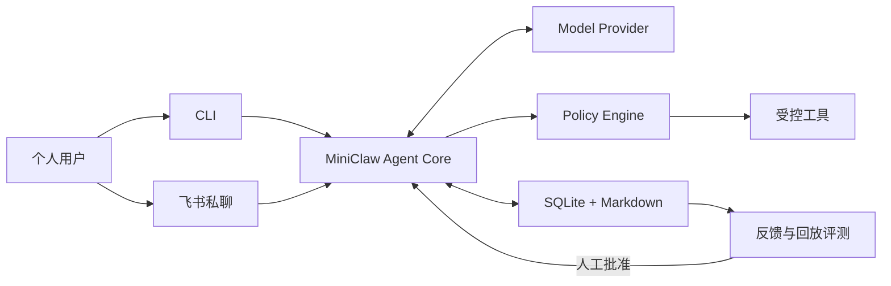

<h1 align="center">MiniClaw</h1>

<p align="center"><strong>A tiny self-hosted personal agent built with Python.</strong></p>

<p align="center">
  用一套可阅读、可调试、默认安全的 Python 代码，学习个人 Agent 从 CLI、飞书到工具、记忆和受控演进的完整链路。
</p>

<p align="center">
  
  
  
</p>

MiniClaw 是一个面向个人学习与日常使用的开源 personal agent。目标是在同一个 Agent Core 后接入本地
CLI 和飞书私聊，逐步实现工具调用、SQLite 会话、Markdown 记忆、Skills、安全审批和评测驱动的受控
改进闭环。

> [!IMPORTANT]
> 当前仓库已完成 Phase 2：生产 `chat` 注册 8 个 Tool——`system_info`、`read_file`、`glob`、`grep`、
> `write_file`、`edit_file`、`run_command`、`http_get`。写入、命令和公网 HTTPS 默认使用参数绑定 SQLite
> Approval；命令是 exact argv、无 Shell、最小环境和进程组超时；HTTPS 使用全 DNS 公网校验、固定 peer、
> 原 hostname TLS、redirect 重验和 2 MiB 响应预算。启动时会终止超过 5 分钟的遗留 running ToolRun，绝不
> 自动重放。
> 当前发布基线为 **245/245 tests + 20/20 offline Agent cases + DeepSeek V4 Pro live smoke + Ruff**。
> `doctor` 有 7 项只读检查；Policy 拒绝只留下脱敏 Audit，不创建 denied ToolRun。任意 Shell、删除/移动、
> Memory/Skills、自我迭代和飞书仍未完成。
> 已确认的产品范围与验收标准见 [PRD](docs/product/20260807_产品需求文档.md)。

## Planned MVP

| 能力 | v0.1 目标 |
| --- | --- |
| 交互入口 | 本地 CLI、飞书机器人私聊 |
| Agent Core | OpenAI-compatible 模型、原生 Tool Calling、最多 8 轮工具循环 |
| 工具 | Workspace 文件、HTTPS GET、受限 Shell |
| 数据 | SQLite 会话与审计、Markdown 长期记忆和 Skills |
| 安全 | 用户白名单、Workspace 边界、命令允许列表、危险操作审批 |
| 演进 | 反馈、回放评测、Prompt/Skill 提案、人工批准和回滚 |



## Quick Start

准备 Python 3.12+ 和 [uv](https://docs.astral.sh/uv/)，在仓库根目录运行：

```bash
uv venv
uv sync --extra dev
cp .env.example .env
chmod 600 .env
# 编辑 .env，填写 MINICLAW_MODEL_API_KEY；不要提交该文件
uv run miniclaw --version
uv run miniclaw init
uv run miniclaw doctor
uv run miniclaw chat --message "你好，请介绍你自己"
uv run miniclaw chat --message "帮我看看我的电脑是什么配置"
uv run miniclaw eval validate --root evals/scenarios
uv run miniclaw eval run --suite offline --root evals/scenarios
uv run miniclaw approvals list --status pending
uv run python -m unittest discover -s tests -v
```

当前可用入口：

```bash
uv run miniclaw
uv run miniclaw init [--home /absolute/path]
uv run miniclaw doctor [--home /absolute/path]
uv run miniclaw chat --message TEXT [--session ID] [--home /absolute/path]
uv run miniclaw chat [--session ID] [--home /absolute/path]
uv run miniclaw eval list [--root evals/scenarios]
uv run miniclaw eval validate [--root evals/scenarios]
uv run miniclaw eval run --suite offline [--root evals/scenarios]
uv run miniclaw approvals [--home /absolute/path] list [--status pending] [--json]
uv run miniclaw approvals [--home /absolute/path] show ID [--json]
uv run miniclaw approvals [--home /absolute/path] approve ID [--json]
uv run miniclaw approvals [--home /absolute/path] approve ID --always [--json]
uv run miniclaw approvals [--home /absolute/path] deny ID [--json]
uv run python -m miniclaw --version
```

`init` 只创建缺失的本地文件，重复运行不会覆盖 `USER.md`、`SOUL.md` 或 `MEMORY.md`；`doctor`
只执行离线检查，不连接模型或 IM 平台。`chat` 从当前目录的私密 `.env` 读取 Key；省略 `--message`
时进入 TTY 交互模式。模型需要真实本机数据时可调用只读、脱敏的 `system_info`，也可在配置的
Workspace 内调用 `read_file`、`glob`、`grep`；`write_file` / `edit_file` 会先生成参数绑定 Approval，只有
Owner 运行 `approvals approve ID` 后才执行。`run_command` 只接受 program + args 数组，默认同样审批；`http_get`
只允许无认证 HTTPS GET，并在每次连接和 redirect 前拒绝私网地址。`--always` 只为成功命令保存 exact argv，或为
成功 HTTP 保存 exact hostname + port；文件写入永远是 allow-once。模型仍不能运行任意 Shell 字符串。`eval` 完全离线，不读取
`.env`、不需要 `init` 或 API Key，并通过真实 Agent/Policy/Tool/SQLite 链路运行版本化场景。

写入请求可跨 CLI 进程恢复：`list/show` 不需要模型 Key；`approve/deny` 会创建没有假 User Message 的
child Turn，并让模型基于真实执行结果继续回答。Approval 绑定 Tool 名与完整规范参数，过期、篡改、Owner
不匹配和重复消费都会 fail closed。`list/show` 会惰性结算当前 Owner 的过期项；`doctor` 只读统计仍有效的 pending。

### Workspace 只读演示

初始化后的默认 Workspace 是 `~/.miniclaw/workspace/`。把演示文本放进去后，可让已配置的模型尝试调用当前
可用的读取 Tool：

```bash
printf 'MiniClaw workspace demo\n' > ~/.miniclaw/workspace/demo.txt
uv run miniclaw chat --message "请使用 read_file 读取 demo.txt。"
uv run miniclaw chat --message "请使用 glob 找出 Workspace 的 txt 文件。"
uv run miniclaw chat --message "请使用 grep 在 txt 文件中查找 MiniClaw。"
uv run miniclaw chat --message "请使用 run_command 运行 git status --short。"
uv run miniclaw chat --message "请使用 http_get 读取 https://example.com。"
```

这些命令给模型提示和 Tool Schema，模型是否调用取决于 Provider；Phase 2 release 已真实验证 system_info、写审批、
read_file 和命令审批。可以在 `config.toml` 的 `[workspace].path` 或绝对 `MINICLAW_WORKSPACE` 环境变量中设置其他 Workspace。
`.env`、`.git-credentials`、`.pypirc`、`.docker/config.json`、私钥、MiniClaw 数据库及 sidecar、
状态文件和 Workspace 外路径会被拒绝。`read_file` 按完整行跨 512 KiB 分页；单行超过该上限时返回
`line_too_large`，不会发布可能丢数据的 cursor。

## Repository Layout

```text
miniclaw/
├── AGENTS.md
├── evals/                  # 版本化场景与脱敏 baseline
├── docs/
│   ├── architecture/
│   ├── development/
│   ├── evals/
│   ├── getting-started/
│   ├── engineering/phase-1/
│   ├── engineering/phase-2/
│   ├── product/
│   ├── progress/
│   └── superpowers/
├── src/miniclaw/
│   ├── bootstrap.py
│   ├── config.py
│   ├── doctor.py
│   ├── env.py
│   ├── paths.py
│   ├── agent/
│   ├── evals/
│   ├── policy/
│   ├── providers/
│   ├── storage/
│   └── tools/
├── tests/
└── pyproject.toml
```

## Documentation

| 文档 | 内容 |
| --- | --- |
| [文档中心](docs/README.md) | 全部产品、架构、运行和开发文档入口 |
| [产品需求文档](docs/product/20260807_产品需求文档.md) | v0.1 范围、流程图、架构图、验收标准和里程碑 |
| [系统架构](docs/architecture/20260807_系统架构.md) | 核心边界、数据流和计划中的包布局 |
| [本地运行指南](docs/getting-started/20260807_本地运行指南.md) | 安装、凭据、初始化、CLI 对话、诊断和测试命令 |
| [工程文档索引](docs/engineering/README.md) | 已实现模块的工程说明入口 |
| [Phase 1 模块工程文档](docs/engineering/phase-1/cli-chat.md) | CLI、Provider、Runner、Storage 等逐模块实现说明 |
| [Phase 2.1A Tool 工程文档](docs/engineering/phase-2/tool-runtime-and-system-info.md) | Tool Contract、Policy、Executor、审计、消息轨迹与 system_info |
| [Phase 2.1B Workspace 读取 Tool 工程文档](docs/engineering/phase-2/workspace-read-tools.md) | read_file、glob、grep、Workspace Guard、边界与测试矩阵 |
| [Phase 2.1C Agent 回归工程文档](docs/engineering/phase-2/agent-regression-evals.md) | JSONL 场景、真实离线 runner、CLI 门禁、事故回归和 benchmark 分层 |
| [Phase 2.2A 文件写入工程文档](docs/engineering/phase-2/filesystem-tools.md) | 严格 Tools 配置、Workspace 写边界、write/edit 原子性、错误码和测试矩阵 |
| [Phase 2.2 Approval 生命周期](docs/engineering/phase-2/approval-lifecycle.md) | 参数 hash、waiting/child Turn、TTL、Owner、单次执行与审计 |
| [Phase 2.2 Approvals CLI](docs/engineering/phase-2/cli-approvals.md) | list/show/approve/deny、输出、退出码、恢复流程和测试矩阵 |
| [Phase 2.3 Exact-Argv 命令](docs/engineering/phase-2/command-execution.md) | 固定 PATH、硬禁止、环境隔离、进程组超时和 exact allow rule |
| [Phase 2.4 HTTPS 与 SSRF](docs/engineering/phase-2/http-and-ssrf.md) | HTTPS-only、DNS 公网校验、pinned peer、redirect、响应预算和 hostname rule |
| [Phase 2.5 测试与恢复](docs/engineering/phase-2/testing-and-debugging.md) | 245 tests、20 场景、crash recovery、Doctor、live smoke 和调试手册 |
| [Eval v0.1.0 发布记录](docs/evals/releases/v0.1.0.md) | 177 tests、10/10 场景、复现命令、限制与下一步 |
| [Eval v0.2.0 发布记录](docs/evals/releases/v0.2.0.md) | 245 tests、20/20 场景、DeepSeek live smoke 与已知边界 |
| [AGENTS.md](AGENTS.md) | 仓库开发规范和完成检查 |

## License

[MIT](LICENSE)
