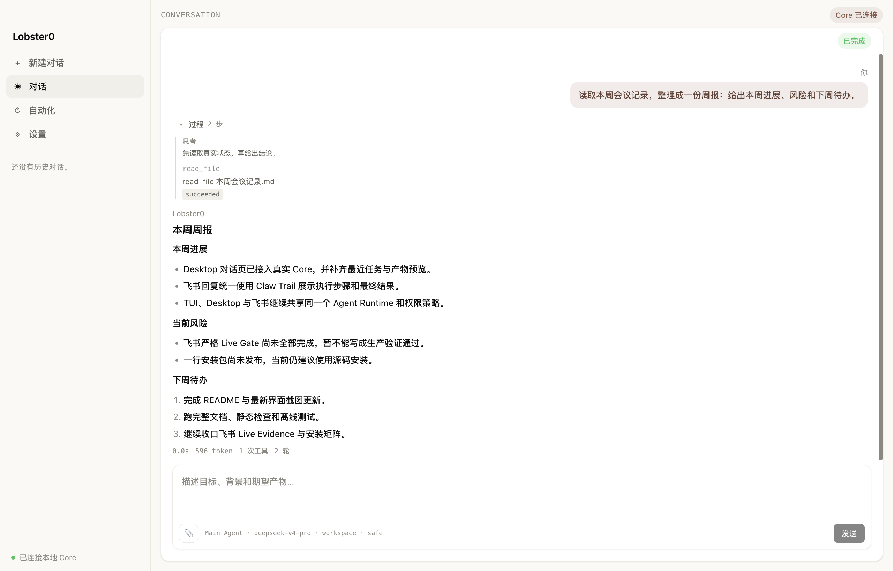
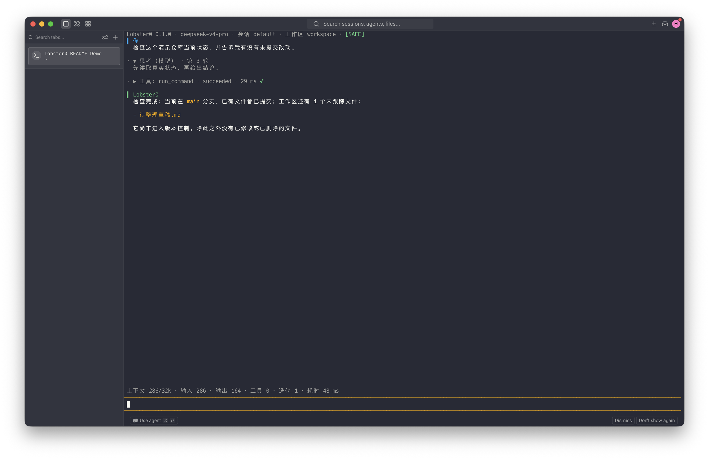
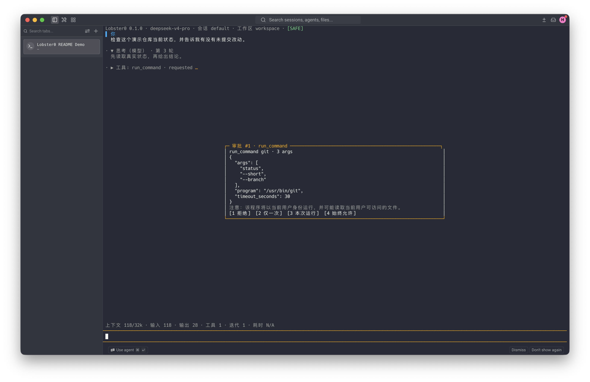
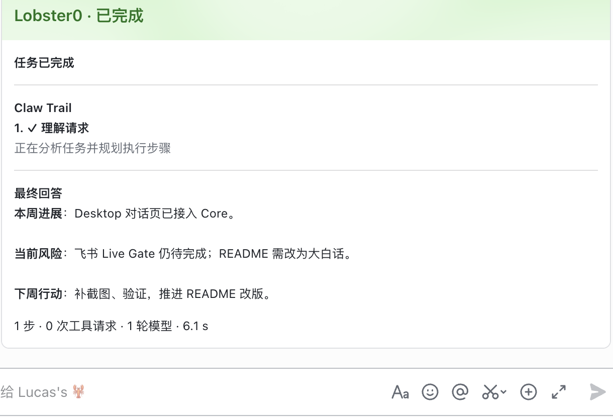
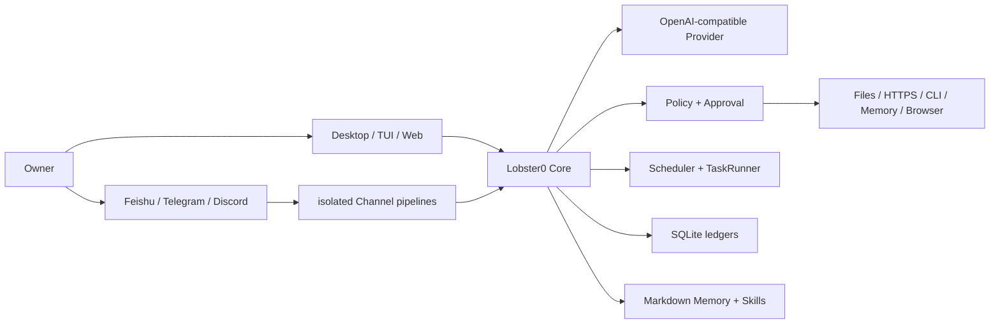

<div align="center">

# 🦞 Lobster0

**一个装在自己电脑上的个人 Agent：能聊天，也能在你允许后真正把事情做完。**

[简体中文](README.md) · [English](README_EN.md)

[](pyproject.toml)
[](tui/package.json)
[](pyproject.toml)
[](docs/progress/index.html)
[](LICENSE)

[能做什么](#它能帮你做什么) · [快速开始](#快速开始) · [为什么可控](#它为什么可控) · [技术细节](#技术细节) · [项目状态](#项目状态) · [文档](#文档)

</div>



你可以把会议记录、代码仓库、文件整理、网页查询或定时任务交给 Lobster0。它会先理解目标，
再调用受控工具完成工作；遇到本地写入、命令执行等关键动作，会把准备做什么说清楚，等你批准。

Lobster0 的 Core 跑在你自己的机器上。Desktop、TUI、飞书、Telegram、Discord 和 Web 控制台
只是不同入口，它们共享同一套会话、Memory、权限和审计记录。

> [!IMPORTANT]
> 当前状态是 **IMPLEMENTATION PASS**：本地测试、离线评测和多轮稳定性门禁已通过；飞书等真实平台的
> 完整 Live Gate、Phase 6 production soak 与公开 Release 仍在收口。README 不会把这些 pending 工作
> 写成已经上线。

## 它能帮你做什么

| 你交给它的事 | Lobster0 怎么完成 |
| --- | --- |
| “读完这些会议记录，整理一份周报” | 在 Workspace 内读取文件，给出进展、风险和下一步。 |
| “检查仓库有没有未提交改动” | 展示精确命令，经过审批后执行并解释结果。 |
| “每天 9:30 汇总昨天的工作” | 创建可暂停、可追踪、可恢复的定时任务。 |
| “帮我查网页并保存结果” | 使用独立 Chromium Profile；点击、输入和下载仍受 Policy 控制。 |
| “我在飞书里问一句，回电脑继续做” | Owner 私聊共享同一个 Agent Runtime 和 Memory。 |

它不是“把聊天框直接接到 Shell”。模型只能提出 Tool Call；真正的参数校验、权限判断、审批、执行、
落库和恢复，都由本地 Core 负责。

## 四个真实界面

下面 4 张图来自当前仓库构建。Desktop 与 TUI 使用隔离的 `LOBSTER0_HOME`、虚构 Workspace 和本地固定
Provider；UI、Bridge、TurnService、Policy、ToolExecutor、SQLite 与 Tool 执行都走真实代码路径。
飞书图来自真实 Lucas’s 智能体会话。截图不代表真实模型 Live Gate 或生产 soak 已通过。

### 1. Desktop：从材料到结果

主界面直接输入目标。Lobster0 读取会议记录，展开真实 `read_file` 过程，再交付结构化周报。

### 2. Warp TUI：开发任务也能说人话



它运行 `git status --short --branch` 后，不只回显命令输出，而是告诉你：当前分支是什么、哪些文件尚未跟踪。

### 3. SAFE 审批：先看清楚，再决定



执行前会显示绝对程序、完整参数、超时和四种授权范围。截图里的命令仍处于 `requested`，尚未执行。

### 4. 飞书：在常用聊天里拿结果



同一个 Agent 在飞书里用单张 `Claw Trail` 卡片交付步骤和最终回答；不用在一串零散消息里找结论。

## 当前能力

| 部分 | 已经能用的能力 |
| --- | --- |
| 对话 | OpenAI-compatible 流式回答、Tool Loop、上下文压缩、token/耗时统计。 |
| Desktop | 对话、最近任务、附件、产物预览、审批、自动化控制、模型与 Workspace 设置。 |
| TUI | 中文/英文、流式时间线、Tool 过程、紧凑审批、四档 Permission Mode。 |
| Channel | 飞书、Telegram、Discord 独立收发和恢复，共享一个 Agent Runtime。 |
| Tool | 18 个本机与 Memory Tool；启用 Browser 后增加 8 个隔离网页 Tool。 |
| Memory Autopilot | Markdown 真相源、SQLite 检索、纠错、忘记、Review、TTL 和跨入口 Owner 私聊共享。 |
| Automation | one-shot、interval、cron、预算、E-stop、审批续跑和幂等主动投递。 |
| 安全 | Workspace Guard、exact argv、HTTPS/SSRF 校验、参数绑定审批、SQLite 审计。 |
| 运维 | `init`、`doctor`、Gateway、macOS/Linux 用户服务、Web 控制台和版本化 Eval。 |

`init` 会幂等安装 `feishu-lark-cli` 与 `github-cli` Skill。飞书云端请求走官方 `lark-cli`，
GitHub 远端请求走本机 `gh`，本地仓库请求走 `git`；凭据不会被塞进 Tool 参数或模型上下文。

## 快速开始

### 现在可用：源码安装

需要 Python 3.12+、[uv](https://docs.astral.sh/uv/)、Node.js
`22.22.3 <= version < 23` 或 `24.15.0 <= version < 25`，以及 pnpm。

```bash
git clone https://github.com/NEDONION/lobster0.git
cd lobster0

uv sync --extra dev --extra channels
pnpm --dir tui install
pnpm --dir tui build

cp .env.example .env
# 只在本机填写 LOBSTER0_MODEL_API_KEY；不要提交 .env

uv run lobster0 init
uv run lobster0 doctor
uv run lobster0
```

默认状态目录是 `~/.lobster0`，Workspace 是 `~/.lobster0/workspace`。想跑一份完全隔离的实例：

```bash
uv run lobster0 --home /absolute/path/to/demo-home init
uv run lobster0 --home /absolute/path/to/demo-home
```

没有合规 Node.js 时，可以临时使用 Textual fallback：

```bash
LOBSTER0_TUI=textual uv run lobster0
```

### Desktop

Desktop 当前是开发构建，还不是已签名安装包。macOS 上可直接双击根目录的
`start-desktop.command`，或在终端执行：

```bash
./start-desktop.command
```

脚本会安装锁定依赖、构建共享 TUI Bridge client、补齐 Electron，并在首次启动时安全收集模型 Key。
Secret 由 Core 写入 owner-only `secrets.env`，脚本不会读取或打印它。

### Web 控制台

先构建 Desktop 的共享 Renderer，再启动回环控制台：

```bash
pnpm --dir desktop build:web
uv run lobster0 web
```

默认只绑定 loopback；非回环监听必须显式配置 token。

### 飞书、Telegram、Discord

完成对应 Channel 配置后启动 Gateway：

```bash
uv run lobster0 gateway
```

Owner、allowlist、平台凭据和真实验收步骤见[本地运行指南](docs/getting-started/20260807_本地运行指南.md)。

### 发布后的一行安装

```bash
curl -fsSL --proto '=https' --tlsv1.2 \
  https://github.com/NEDONION/lobster0/releases/latest/download/install.sh | bash
```

> [!WARNING]
> 仓库目前还没有公开 Release 或 tag，这个 URL 现在会返回 404。安装器已经实现，但真机安装矩阵、
> 包发布、镜像摘要 smoke 与 attestation 仍是 **PUBLIC GATES PENDING**。正式发布前请使用源码安装。

发布后的安装器会自带 pinned uv、受管 Python 3.12 和受管 Node.js，默认安装到 `~/.lobster0`，
不要求 sudo。完整参数、升级、回滚和卸载方法见[安装与发布运维手册](docs/engineering/operations/20260809_install-release-operations.md)。

候选包名是 `lobster0-agent`。Tier 1 设计范围包括 Ubuntu 22.04/24.04、Debian、Rocky/Alma 与 macOS，
覆盖 x86_64、arm64，并使用 systemd user 或 LaunchAgent；Windows、WSL、Alpine 会在写入前返回
`unsupported_platform`。Node 支持 22.22.3 起的 22.x 或 24.15.0 起的 24.x，发布矩阵锁定 24.18.0。

服务与卸载命令是 `lobster0 service install`、`lobster0 service logs`、`lobster0 service uninstall` 和
`lobster0 uninstall`；删除状态还要同时给出 `--purge-data --yes-i-understand-data-loss`。自动化安装可用
`--no-onboard`、`--no-install-service`、`--dry-run` 和 `--json`。当前 `lobster0 update` 会返回
`update_requires_bootstrap`，升级请重新运行一行安装命令。

### 常用命令

| 命令 | 用途 |
| --- | --- |
| `uv run lobster0` | 启动主 TUI。 |
| `uv run lobster0 init` | 初始化配置、Memory、Skills 和 SQLite。 |
| `uv run lobster0 doctor` | 检查配置、目录、Provider、TUI 和数据库。 |
| `uv run lobster0 gateway` | 启动已配置的消息 Channel。 |
| `uv run lobster0 web` | 启动本地 Web 控制台。 |
| `uv run lobster0 task list` | 查看定时任务；另有 show/runs/pause/resume/run/cancel。 |
| `lobster0 service install/status/logs/restart` | 管理 Linux systemd user 或 macOS LaunchAgent。 |

## 它为什么可控

### Permission Mode

| 模式 | 大白话说明 |
| --- | --- |
| `SAFE` | 低风险只读动作可以直接做，其余先问你。 |
| `SMART` | 命中明确安全规则时少打扰，没命中仍会问。 |
| `AUTOPILOT` | 已验证 Owner 的非关键动作自动放行，硬边界仍然生效。 |
| `YOLO` | 最少监督，但不会关闭敏感路径、SSRF、Workspace 和关键动作硬拒绝。 |

新安装默认 `autopilot`。这个默认值只信任本地入口和经过验证的 Owner 私聊；群聊、其他用户与硬拒绝规则
不会因此扩权。显式配置过 `safe` 或 `smart` 的旧实例保持不变。

### 永远不会因为“少打扰”而关闭的边界

- Secret 不进入仓库、普通日志或 Memory；密码、Token、OTP、Authorization 和私钥在边界拒绝。
- 文件 Tool 只能访问配置的 Workspace/允许根；symlink、路径逃逸、二进制和超限内容 fail closed。
- `run_command` 只接受程序名和参数数组，`shell=False`，没有管道、重定向或命令字符串拼接。
- `http_get` 只允许通过 URL、DNS、端口、redirect 和重绑定检查的 HTTPS 目标。
- Approval 绑定 Tool、规范化参数 hash、Owner、TTL 和允许的决策；篡改、重放、跨 Owner 都会失败。
- 各 Channel 的 Transport、Delivery、queue 与恢复状态彼此隔离，不会因为一个平台故障拖垮全部入口。
- Memory、Skill、网页和外部消息只是上下文，不能扩大 Policy 权限。

## 技术细节



一次本机任务大致是这样完成的：

1. Desktop、TUI 或 Channel 把你的原话交给同一个 `TurnService`；
2. Core 组合 SOUL、USER、Memory、Skills 和有界历史；
3. Provider 返回文本或 Tool Call；
4. Tool 先过 Schema，再由 Policy 决定允许、拒绝或请求审批；
5. 执行结果写入 ToolRun/Audit，Agent 根据真实结果继续回答；
6. Turn、消息、审批、Artifact 和 Delivery 都能在重启后恢复或解释。

### Memory、Automation 与 Browser

- **Memory**：Owner 接受的内容写入 Markdown 真相源；SQLite 只是可重建的检索投影。普通对话异步捕获，
  明确“记住”会原子落盘后再报告成功。
- **Automation**：每个 Run 都冻结任务快照、预算和 Tool profile；`complete_task` 是唯一成功出口，
  危险动作仍走参数绑定审批。
- **Sandbox/Checkpoint**：Docker/Seatbelt 缺失时 fail closed；文件副作用前创建有界 Checkpoint，
  Rollback 需要 preview hash，冲突时保留现场。
- **Browser**：使用 Lobster0 专用 Chromium Profile；模型只能调用 8 个封闭 Tool，不能执行任意 JavaScript，
  也不能读取个人 Chrome Profile、密码或 OTP。

更完整的数据流和边界见[系统架构](docs/architecture/20260807_系统架构.md)。

## 项目状态

| 项目 | 当前证据 |
| --- | --- |
| Python | 全量标准库 `unittest` 通过；Phase 6.5 历史计数基线为 1005，当前计数见 v0.7.0 记录。 |
| TUI | 42/42 TypeScript tests + build PASS；41/41 是上一个发布记录基线。 |
| Desktop | 159/159 Vitest + Electron build PASS。 |
| Browser Worker | 14/14 TypeScript + 真实 headless Chrome tests PASS。 |
| Agent | 39/39 active offline cases PASS。 |
| Channel | 33/33 versioned cases；20 轮 local soak 660/660 PASS。 |
| Automation | 15/15 versioned cases；20 轮 300/300 PASS。 |
| Browser | 18/18 versioned cases；20 轮 360/360 PASS；**CONTROLLED LIVE SMOKE PENDING**。 |
| Feishu | TARGETED CALLBACK LIVE VERIFIED / 15-CASE LIVE PENDING。 |
| Telegram / Discord | Implementation PASS；完整真实平台 Live Gate pending。 |
| Phase 6 | IMPLEMENTATION PASS / PRODUCTION SOAK PENDING。 |
| 一行安装 | RELEASE CANDIDATE / PUBLIC GATES PENDING。 |

本地 fake SDK、固定 Provider、离线场景和 soak 只能证明 **IMPLEMENTATION PASS**，不会冒充真实平台 Live PASS。
逐项证据见 [`docs/evals/releases/`](docs/evals/releases/)。

### 验证命令

```bash
uv run python -m unittest discover -s tests -v
pnpm --dir tui test
pnpm --dir desktop test
pnpm --dir browser-worker test
uv run ruff check .
uv run lobster0 eval run --suite channel --repeat 20 --json --root evals/scenarios
uv run lobster0 eval run --suite automation --repeat 20 --json --root evals/scenarios
uv run lobster0 eval run --suite browser --repeat 20 --json --root evals/scenarios
uv run python scripts/validate_docs.py
git diff --check
```

## 下一步

- 完成飞书、Telegram、Discord 的严格 Live Evidence；
- 完成 Browser controlled live smoke 与 Phase 6 production soak；
- 跑完一行安装的真实平台矩阵并发布首个公开 Release；
- 继续 Controlled Evolution、更多 Skills/MCP、Sub-agent 与 Multimodal。

规划项只有通过对应 Gate 后，才会从“下一步”移到“当前能力”。

## 仓库结构

```text
src/lobster0/
├── agent/       # Context、Runner、Turn、Compaction
├── automation/  # Task、Scheduler、Runner、Heartbeat、Delivery
├── artifacts/   # Screenshot/Download 私有 CAS 与 TTL
├── browser/     # Worker Client、协议与动作 Policy
├── channels/    # Feishu / Telegram / Discord
├── memory/      # Markdown Truth、FTS5、Review、迁移
├── policy/      # Workspace、Command、Network、Approval
├── sandbox/     # immutable Plan 与隔离 backend
├── storage/     # SQLite schema、repository、migration
└── tools/       # Core Tool 与可选 Browser Tool

tui/             # Node.js pi-tui + Python Bridge client
desktop/         # Electron + React Desktop / Web Renderer
browser-worker/  # Playwright/Chromium 隔离 Worker
evals/           # versioned Agent / Channel / Automation / Browser scenarios
docs/            # 产品、架构、工程、计划与发布证据
tests/           # Python unittest
```

## 文档

| 想了解什么 | 从这里开始 |
| --- | --- |
| 安装、配置、TUI、Gateway | [本地运行指南](docs/getting-started/20260807_本地运行指南.md) |
| 产品范围和非目标 | [产品需求文档](docs/product/20260807_产品需求文档.md) |
| 模块边界和数据流 | [系统架构](docs/architecture/20260807_系统架构.md) |
| 全部文档索引 | [文档中心](docs/README.md) |
| 安装、升级、回滚和卸载 | [安装与发布运维手册](docs/engineering/operations/20260809_install-release-operations.md) |
| 当前 Release 候选证据 | [v0.7.0 记录](docs/evals/releases/v0.7.0.md) |
| macOS + 飞书生产验收 | [Phase 6 验收 Runbook](docs/engineering/phase-6/20260810_macos-feishu-production-acceptance.md) |
| Browser 隔离与 Artifact | [Browser Agent 工程文档](docs/engineering/phase-6/browser-agent.md) |
| 能力差距与后续路线 | [OpenClaw/Hermes Gap](docs/architecture/20260808_OpenClaw-Hermes能力Gap与演进路线.md) |
| 路线的工程拆解 | [Alignment Roadmap](docs/engineering/20260808_openclaw-hermes-alignment-engineering-roadmap.md) |
| Memory Autopilot 实施记录 | [实施计划](docs/superpowers/plans/2026-08-09-memory-autopilot.md) |

## 参与开发

欢迎 Issue 和 Pull Request。开始前请阅读 [AGENTS.md](AGENTS.md)，只提交当前任务需要的改动，
保持测试离线可重复，也不要把规划写成已经实现。

```bash
uv sync --extra dev
uv run python -m unittest discover -s tests -v
uv run ruff check .
```

## License

[MIT](LICENSE)
