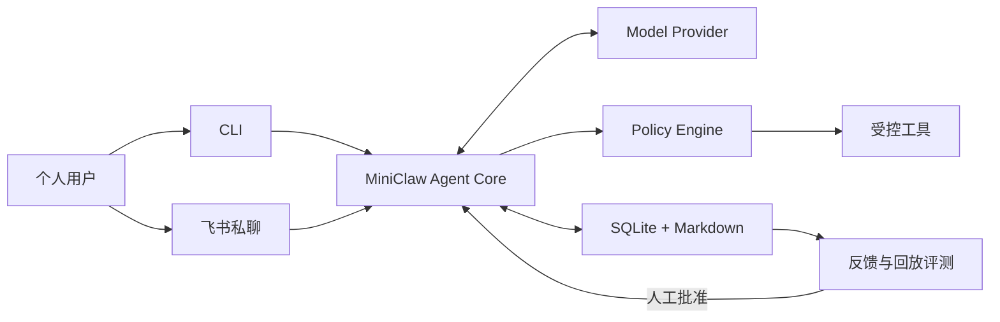

<h1 align="center">MiniClaw</h1>

<p align="center"><strong>A tiny self-hosted personal agent built with Python.</strong></p>

<p align="center">
  用一套可阅读、可调试、默认安全的 Python 代码，学习个人 Agent 从 CLI、飞书到工具、记忆和受控演进的完整链路。
</p>

<p align="center">
  
  
  
</p>

MiniClaw 是一个面向个人学习与日常使用的开源 personal agent。目标是在同一个 Agent Core 后接入本地
CLI 和飞书私聊，逐步实现工具调用、SQLite 会话、Markdown 记忆、Skills、安全审批和评测驱动的受控
改进闭环。

> [!IMPORTANT]
> 当前仓库已完成 Phase 2.4：裸 `miniclaw` 进入唯一的 Textual 全屏 TUI；同一个 `AgentRuntime`
> 连接 DeepSeek、TurnService、SQLite、八个系统/文件/命令/HTTPS Tool 与参数绑定 Approval。TUI 支持流式回答、
> Provider reasoning、可逐项展开的 Tool 参数/执行/结果 Trace、Enter 发送、Shift+Enter 换行、Esc 取消、
> Ctrl+O 全展开/收起、Slash Command，以及只允许一次的 Allow once / Deny
> 审批弹窗。旧 `miniclaw chat`、`miniclaw tui`、one-shot REPL 和 `miniclaw approvals` 已移除。
> P2.3A 已接入不经过 Shell 的 exact-argv `run_command`；P2.4 已接入只读 `http_get`，包含 HTTPS-only、
> 全 DNS 公网校验、固定 IP/TLS hostname、每跳重验、响应预算和不可信内容标记。两类动作未命中精确规则时
> 都在同一 TUI 只允许一次。真实 `lark-cli`/Node 路径闭环、DeepSeek live eval 和飞书 Channel 尚未完成。
> 当前回归基线为 **253 tests + 20/20 Agent cases**。Policy 拒绝只写脱敏审计，不创建 ToolRun。
> v0.2.0 曾在 TUI 迁移前完成 DeepSeek V4 Pro 的 system/write/read/command 脱敏 live smoke；历史证据
> 保存在 [v0.2.0 release record](docs/evals/releases/v0.2.0.md)，不冒充当前 TUI 版本的新 live 结果。
> 已确认的产品范围与验收标准见 [PRD](docs/product/20260807_产品需求文档.md)。

## Planned MVP

| 能力 | v0.1 目标 |
| --- | --- |
| 交互入口 | 本地 CLI、飞书机器人私聊 |
| Agent Core | OpenAI-compatible 模型、原生 Tool Calling、最多 8 轮工具循环 |
| 工具 | Workspace 文件、HTTPS GET、受限 Shell |
| 数据 | SQLite 会话与审计、Markdown 长期记忆和 Skills |
| 安全 | 用户白名单、Workspace 边界、命令允许列表、危险操作审批 |
| 演进 | 反馈、回放评测、Prompt/Skill 提案、人工批准和回滚 |



## Quick Start

准备 Python 3.12+ 和 [uv](https://docs.astral.sh/uv/)，在仓库根目录运行：

```bash
uv venv
uv sync --extra dev
cp .env.example .env
chmod 600 .env
# 编辑 .env，填写 MINICLAW_MODEL_API_KEY；不要提交该文件
uv run miniclaw --version
uv run miniclaw init
uv run miniclaw doctor
uv run miniclaw
# 在 TUI 中输入：你好，请介绍你自己
# 在 TUI 中输入：帮我看看我的电脑是什么配置
uv run miniclaw eval validate --root evals/scenarios
uv run miniclaw eval run --suite offline --root evals/scenarios
uv run python -m unittest discover -s tests -v
```

当前可用入口：

```bash
uv run miniclaw [--home /absolute/path]      # 唯一的人类对话入口
uv run miniclaw init [--home /absolute/path]
uv run miniclaw doctor [--home /absolute/path]
uv run miniclaw eval list [--root evals/scenarios]
uv run miniclaw eval validate [--root evals/scenarios]
uv run miniclaw eval run --suite offline [--root evals/scenarios]
uv run python -m miniclaw --version
```

`init` 只创建缺失的本地文件，重复运行不会覆盖 `USER.md`、`SOUL.md` 或 `MEMORY.md`；`doctor`
只执行离线检查，不连接模型或 IM 平台。裸 `miniclaw` 从当前目录的私密 `.env` 读取 Key，并要求真实
TTY；pipe、CI 或 `TERM=dumb` 会明确失败。模型需要真实本机数据时可调用只读、脱敏的 `system_info`，也可在配置的
Workspace 内调用 `read_file`、`glob`、`grep`；`write_file` / `edit_file` 会先生成参数绑定 Approval，只有
Owner 在 TUI 中查看完整归一化参数并选择 **Allow once** 后才执行；Esc 和 **Deny** 都不会写入。模型仍不能运行
任意 Shell 字符串；`run_command` 只接收 `program + args[]`，安全命令未命中 exact rule 时也走同一审批弹窗。
`eval` 完全离线，不读取
`.env`、不需要 `init` 或 API Key，并通过真实 Agent/Policy/Tool/SQLite 链路运行版本化场景。

审批续跑会创建没有假 User Message 的 child Turn，并让模型基于真实执行结果继续回答。Approval 绑定 Tool
名与完整规范参数；过期、篡改、Owner 不匹配和重复消费都会 fail closed。

### Workspace 只读演示

初始化后的默认 Workspace 是 `~/.miniclaw/workspace/`。把演示文本放进去后，可让已配置的模型尝试调用当前
可用的读取 Tool：

```bash
printf 'MiniClaw workspace demo\n' > ~/.miniclaw/workspace/demo.txt
uv run miniclaw
# 依次在 TUI 输入：
# 请使用 read_file 读取 demo.txt。
# 请使用 glob 找出 Workspace 的 txt 文件。
# 请使用 grep 在 txt 文件中查找 MiniClaw。
# 请使用 run_command 运行 git status --short。
# 请使用 http_get 读取 https://example.com/ 的公开文本。
```

这三条命令只给模型提示和 Tool Schema，模型是否调用取决于 Provider；它们不是已完成的真实 DeepSeek 文件
smoke。可以在 `config.toml` 的 `[workspace].path` 或绝对 `MINICLAW_WORKSPACE` 环境变量中设置其他 Workspace。
`.env`、`.git-credentials`、`.pypirc`、`.docker/config.json`、私钥、MiniClaw 数据库及 sidecar、
状态文件和 Workspace 外路径会被拒绝。`read_file` 按完整行跨 512 KiB 分页；单行超过该上限时返回
`line_too_large`，不会发布可能丢数据的 cursor。

## Repository Layout

```text
miniclaw/
├── AGENTS.md
├── evals/                  # 版本化场景与脱敏 baseline
├── docs/
│   ├── architecture/
│   ├── development/
│   ├── evals/
│   ├── getting-started/
│   ├── engineering/phase-1/
│   ├── engineering/phase-2/
│   ├── product/
│   ├── progress/
│   └── superpowers/
├── src/miniclaw/
│   ├── bootstrap.py
│   ├── config.py
│   ├── doctor.py
│   ├── env.py
│   ├── paths.py
│   ├── runtime.py
│   ├── agent/
│   ├── evals/
│   ├── policy/
│   ├── providers/
│   ├── storage/
│   ├── tui/
│   └── tools/
├── tests/
└── pyproject.toml
```

## Documentation

| 文档 | 内容 |
| --- | --- |
| [文档中心](docs/README.md) | 全部产品、架构、运行和开发文档入口 |
| [产品需求文档](docs/product/20260807_产品需求文档.md) | v0.1 范围、流程图、架构图、验收标准和里程碑 |
| [系统架构](docs/architecture/20260807_系统架构.md) | 核心边界、数据流和计划中的包布局 |
| [本地运行指南](docs/getting-started/20260807_本地运行指南.md) | 安装、凭据、初始化、CLI 对话、诊断和测试命令 |
| [工程文档索引](docs/engineering/README.md) | 已实现模块的工程说明入口 |
| [Phase 1 模块工程文档](docs/engineering/phase-1/cli-chat.md) | CLI、Provider、Runner、Storage 等逐模块实现说明 |
| [Phase 2.1A Tool 工程文档](docs/engineering/phase-2/tool-runtime-and-system-info.md) | Tool Contract、Policy、Executor、审计、消息轨迹与 system_info |
| [Phase 2.1B Workspace 读取 Tool 工程文档](docs/engineering/phase-2/workspace-read-tools.md) | read_file、glob、grep、Workspace Guard、边界与测试矩阵 |
| [Phase 2.1C Agent 回归工程文档](docs/engineering/phase-2/agent-regression-evals.md) | JSONL 场景、真实离线 runner、CLI 门禁、事故回归和 benchmark 分层 |
| [Phase 2.2A 文件写入工程文档](docs/engineering/phase-2/filesystem-tools.md) | 严格 Tools 配置、Workspace 写边界、write/edit 原子性、错误码和测试矩阵 |
| [Phase 2.2 Approval 生命周期](docs/engineering/phase-2/approval-lifecycle.md) | 参数 hash、waiting/child Turn、TTL、Owner、单次执行与审计 |
| [Phase 2.2B 单入口 Textual TUI](docs/engineering/phase-2/single-entry-tui.md) | 技术选型、Runtime、RunEvent、Worker、Tool 卡、审批弹窗、入口迁移和测试矩阵 |
| [TUI 回归测试规范](docs/engineering/phase-2/tui-regression-testing.md) | Trace 可观测契约、18 个稳定用例、Textual 无头测试、PTY smoke 与版本门禁 |
| [Phase 2.3A exact-argv 命令执行](docs/engineering/phase-2/command-execution.md) | `run_command`、固定 PATH、硬禁止、精确规则、最小环境、超时和 TUI 审批 |
| [Phase 2.4 Pinned HTTPS 与 SSRF 防护](docs/engineering/phase-2/https-get-and-ssrf.md) | `http_get`、URL/DNS 校验、固定 IP、TLS、重定向、响应预算与审批 |
| [Phase 2 回归、恢复与调试](docs/engineering/phase-2/testing-and-debugging.md) | 253 tests、20 场景、crash recovery、Doctor、历史 live smoke 与发布手册 |
| [旧 Approvals CLI 迁移说明](docs/engineering/phase-2/cli-approvals.md) | 已移除入口与 TUI 替代关系 |
| [Eval v0.1.0 发布记录](docs/evals/releases/v0.1.0.md) | 177 tests、10/10 场景、复现命令、限制与下一步 |
| [Eval v0.2.0 发布记录](docs/evals/releases/v0.2.0.md) | 历史 245 tests、20/20 场景、DeepSeek live smoke 与已知边界 |
| [AGENTS.md](AGENTS.md) | 仓库开发规范和完成检查 |

## License

[MIT](LICENSE)
