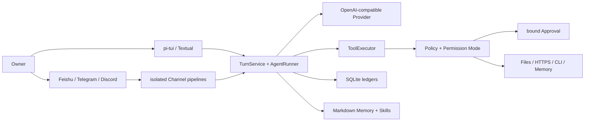

<div align="center">

# MiniClaw

**一个小而完整、私有自托管、默认受控的个人 Agent。**

[简体中文](README.md) · [English](README_EN.md)

[](pyproject.toml)
[](tui/package.json)
[](pyproject.toml)
[](docs/progress/index.html)
[](LICENSE)

[为什么是 MiniClaw](#为什么是-miniclaw) · [当前能力](#当前能力) · [快速开始](#快速开始) · [产品预览](#产品预览) · [架构](#工作原理) · [路线图](#路线图) · [文档](#文档)

</div>


MiniClaw 把模型、Tool、权限、审批、持久化和多个消息渠道收进同一个本地 Core。你可以从 TUI、飞书、Telegram 或 Discord 与同一个 Agent 交互；所有本机动作仍要经过统一的 Policy、Workspace 边界和可审计执行链。

> [!IMPORTANT]
> 当前代码已完成 Phase 5 的本地实现门禁；Feishu/Telegram/Discord 的完整真实 Live Gate 仍按各自证据单独标记。
> v0.5.3 Core 已加入 SDK 日志脱敏、Gateway lease/provenance、受管 Live Runner 与异常 Tool 历史恢复；
> Feishu/Discord 严格 15/15 仍为 Live Pending。
> 飞书正常回答由一张 `Claw Trail` Agent Card 承载，展示脱敏步骤、Tool、安全目标、状态、耗时、过程摘要和最终回答；最终回答统一渲染为 bullet points，Markdown 表格会转换为条目。
> 缺少 `tools.mode` 的配置默认使用 `autopilot`，但只对本地入口和经过验证的 Owner 私聊生效；硬安全边界不变。
> Memory 当前是手工/审批式 v1；Memory Autopilot 已完成设计和 A～E 实施计划，**尚未开发**。本文严格区分“已经实现”和“规划中”。

## 为什么是 MiniClaw

| 目标 | MiniClaw 的选择 |
| --- | --- |
| 私有与可控 | 状态、会话、审批和审计保存在本机；Secret 不进入 Prompt、日志或 Memory。 |
| 小而完整 | 一个 Python Core、一个主 TUI、一个 OpenAI-compatible Provider，不提前堆叠服务。 |
| 真正能行动 | 10 个内置 Tool 覆盖系统信息、文件、搜索、HTTPS、exact-argv CLI 和 Memory。 |
| 默认可追溯 | Turn、ToolRun、Approval、Delivery 与 Channel Inbox/Outbox 都有 SQLite 状态。 |
| 多入口同一 Core | TUI、Feishu、Telegram、Discord 复用同一个 `AgentRuntime`；Transport 和故障域隔离。 |
| 先验证再扩张 | `unittest`、TypeScript test、Agent/Channel JSONL、20 轮 soak 和文档校验共同守门。 |

MiniClaw 不是“把聊天框接到 Shell”——模型只提出 Tool Call，Core 负责参数校验、风险判定、审批绑定、执行、审计和恢复。

## 当前能力

| 层 | 已实现能力 |
| --- | --- |
| Agent Loop | OpenAI-compatible 流式响应、Tool Loop、token/latency telemetry、错误归一化、Context compaction。 |
| TUI | 默认 pi-tui、中文/英文、流式对话、Tool 状态、紧凑审批卡、四档 Permission Mode、Textual fallback。 |
| Tool | `system_info`、`read_file`、`write_file`、`edit_file`、`glob`、`grep`、`http_get`、`run_command`、`read_memory`、`propose_memory`。 |
| 安全 | Workspace Guard、敏感路径硬拒绝、exact argv、最小子进程环境、HTTPS/DNS/SSRF 校验、参数绑定 Approval。 |
| Channel | Feishu 用单张 `Claw Trail` Agent Card 展示脱敏步骤和最终回答；三平台各自独立 Transport/Delivery/Manager/queue/recovery，共享 Agent Runtime。 |
| 数据 | SQLite Session/Message/Turn/ToolRun/Approval/Channel ledger；owner-only Markdown Memory 与 Skills。 |
| 运维 | `init`、`doctor`、`gateway`、结构化脱敏日志、幂等恢复、离线 Eval 与版本化 Channel gate。 |

### Permission Mode

- `SAFE`：只读低风险动作自动执行，其余动作按 Policy 请求审批或拒绝。
- `SMART`：精确规则和安全 HTTPS 可以少打扰，未命中仍受监督。
- `AUTOPILOT`：已验证 Owner 的非关键动作可自动执行，硬边界、参数校验与审计仍然存在。
- `YOLO`：最少监督模式；不会关闭敏感路径、SSRF、Workspace 和关键动作硬边界。

新安装和缺少 `tools.mode` 的旧配置默认使用 `autopilot`；显式 `safe`/`smart` 保持不变。该默认值只信任本地入口和经过验证的 Owner 私聊，群聊、其他用户与硬拒绝规则不会扩权。

## 快速开始

### 环境要求

- Python 3.12+
- [uv](https://docs.astral.sh/uv/)
- Node.js 22.19+ 与 pnpm（默认 pi-tui）
- 一个 OpenAI-compatible 模型端点；默认配置为 `deepseek-v4-pro`

### 安装与启动

```bash
git clone https://github.com/NEDONION/miniclaw.git
cd miniclaw

uv sync --extra dev --extra channels
pnpm --dir tui install
pnpm --dir tui build

cp .env.example .env
# 只在本机填写 MINICLAW_MODEL_API_KEY；不要提交 .env

uv run miniclaw init
uv run miniclaw doctor
uv run miniclaw
```

默认状态目录是 `~/.miniclaw`，Workspace 是 `~/.miniclaw/workspace`。使用隔离实例：

```bash
uv run miniclaw --home /absolute/path/to/demo-home init
uv run miniclaw --home /absolute/path/to/demo-home
```

如果暂时没有满足版本要求的 Node.js，可以显式使用迁移期 fallback：

```bash
MINICLAW_TUI=textual uv run miniclaw
```

### 常用入口

| 命令 | 用途 |
| --- | --- |
| `uv run miniclaw` | 启动唯一主 TUI。 |
| `uv run miniclaw init` | 幂等初始化 owner-only 状态、配置、Memory、Skills 和 SQLite。 |
| `uv run miniclaw doctor` | 检查配置、目录权限、Provider、TUI 和数据库状态。 |
| `uv run miniclaw gateway` | 启动已配置的 Feishu/Telegram/Discord Gateway。 |
| `uv run miniclaw eval validate --root evals/scenarios` | 校验版本化 JSONL 场景。 |
| `uv run miniclaw eval run --suite offline --root evals/scenarios` | 跑真实 Core/Policy/Tool/SQLite 离线回归。 |
| `uv run miniclaw eval run --suite channel --repeat 20 --json --root evals/scenarios` | 跑三平台 Channel gate 与 20 轮本地 soak。 |

Channel 的 allowlist、Owner 身份与平台凭据配置见[本地运行指南](docs/getting-started/20260807_本地运行指南.md)。

## 产品预览

下面 3 个典型 Case 均在 Warp 中使用全新隔离 `MINICLAW_HOME` 运行。为了不消耗真实模型额度，Provider 响应来自本地固定端点；MiniClaw 的 TUI、Bridge、TurnService、Policy、ToolExecutor、SQLite、Approval 和 Tool 执行均走真实代码路径。

### 1. TUI 对话完整跑通


中文输入、回答、32K 应用侧 Context budget、token、迭代和耗时在同一界面可见。

### 2. SAFE 模式请求权限


`run_command` 在执行前展示规范化后的绝对程序、精确 argv、超时和四种审批选择；截图时命令仍处于 `requested`，没有执行。

### 3. 调用外部 Git CLI 完成任务


MiniClaw 用 `run_command` 的 exact argv 调用隔离仓库中的 `git status --short --branch`，再根据真实 Tool 结果完成总结；没有 Shell 字符串拼接。

## 工作原理



一次典型本机动作的链路是：

1. TUI 或 Channel 把用户消息交给同一个 `TurnService`；
2. `ContextBuilder` 组合 SOUL、USER、当前 Memory、Skills 和有界历史；
3. Provider 返回文本或 Tool Call；
4. Tool 先做 Schema 校验，再由 Policy 决定 allow / deny / approval；
5. 执行结果写入 ToolRun/Audit，返回 Agent 继续完成回答；
6. Turn、消息、审批与 Channel Delivery 都能在重启后恢复或解释。

## Memory：当前与规划

| 能力 | 当前 Memory v1 | Memory Autopilot（规划） |
| --- | --- | --- |
| 真相源 | `MEMORY.md` + 今日/昨日 daily Markdown | 已接受 Unit 仍以 Markdown 为真相源 |
| 写入 | Owner 明确请求后 `propose_memory` + Approval | 普通事实自动进入短期；明确“记住”直接持久化 |
| 检索 | 固定 long-term/today/recent 注入 | owner-scoped FTS5/CJK、来源下钻、严格预算 |
| 治理 | Secret 拒绝、大小/路径/权限保护 | Promotion、Review、冲突、纠错、forget、expiry |
| 跨渠道 | Session 历史隔离，不能跨 Session 自动回忆 | 四入口共享同一 Owner Memory Space |
| 隐私 | Tool/Channel 安全边界已存在 | 群聊、非 Owner、身份不明默认禁止私人召回 |

设计和施工入口：

- [Memory Autopilot 能力 Gap 与重构架构](docs/architecture/20260808_Memory-Autopilot能力Gap与重构架构.md)
- [正式设计 Spec](docs/superpowers/specs/2026-08-08-memory-autopilot-design.md)
- [最佳实践与技术选型](docs/engineering/20260808_memory-autopilot-best-practices-and-technology-selection.md)
- [Memory A～E TDD 实施计划](docs/superpowers/plans/2026-08-09-memory-autopilot.md)

## 安全边界

- Secret 永不进入仓库、普通日志或 Memory；常见 Token、密码、OTP、Authorization 和私钥在边界拒绝。
- 文件 Tool 只能访问配置的 Workspace/允许根；symlink、路径逃逸、二进制和超限内容 fail closed。
- `run_command` 只接受程序与参数数组，`shell=False`，使用最小环境、固定 cwd、超时和输出上限。
- `http_get` 只允许经过 URL、DNS、端口和重绑定检查的 HTTPS 目标。
- Approval 绑定 Tool 名、规范化参数 hash、Owner、TTL 和可用决策；篡改、重放和跨 Owner 使用都会拒绝。
- Channel allowlist、Owner 映射、Inbox/Outbox 幂等、独立 queue 和恢复状态不会交给模型决定。
- Memory、Skill 和外部内容只能提供上下文，不能扩大 Policy 权限。

完整威胁模型与契约见[系统架构](docs/architecture/20260807_系统架构.md)和[Phase 2 安全设计](docs/superpowers/specs/2026-08-07-phase-2-tools-security-design.md)。

## 项目状态

| 项目 | 当前证据 |
| --- | --- |
| Python | 562/562 `unittest` PASS |
| TUI | 30/30 TypeScript tests + build PASS |
| Agent | 29/29 active offline cases PASS |
| Channel | 32/32 versioned cases PASS |
| 稳定性 | 20 轮 local Channel soak，640/640 PASS |
| Feishu | OWNER-DM DELIVERY VERIFIED / 15-CASE LIVE PENDING |
| Telegram / Discord | Implementation PASS；真实平台 Live Gate 仍 pending |
| Memory Autopilot | APPROVED DESIGN + A～E PLAN；NOT IMPLEMENTED |

本地 fake SDK、离线场景和 640/640 soak 只代表 **IMPLEMENTATION PASS**，不会冒充真实平台 Live PASS。历史发布证据见 [`docs/evals/releases/`](docs/evals/releases/)。

### 验证命令

```bash
uv run python -m unittest discover -s tests -v
pnpm --dir tui test
pnpm --dir tui build
uv run ruff check .
uv run miniclaw eval run --suite channel --repeat 20 --json --root evals/scenarios
uv run python scripts/validate_docs.py
git diff --check
```

## 路线图


Owner `AUTOPILOT` 默认值、飞书 `Claw Trail` Agent Card 与 v0.5.3 Core hardening 已完成。当前需要收口
Feishu/Discord 严格 Live Evidence；下一条功能实现主线是 Memory A～E，完成后再进入自治任务。路线图不代表
相应代码已经存在。

## 仓库结构

```text
src/miniclaw/
├── agent/       # Context、Runner、Turn、Compaction
├── channels/    # Feishu / Telegram / Discord adapters and pipelines
├── memory/      # 当前 owner-only Markdown Memory v1
├── policy/      # Workspace、Command、Network、Permission、Approval
├── providers/   # OpenAI-compatible Provider
├── storage/     # SQLite schema, repositories and migrations
├── tools/       # 10 个内置 Tool
└── tui/         # Textual fallback；默认 pi-tui 在仓库 tui/

tui/             # Node.js pi-tui + Python Bridge client
evals/           # versioned Agent / Channel scenarios
docs/            # PRD、架构、工程、计划、发布证据与进度页
tests/           # Python unittest
```

## 文档

| 入口 | 适合读者 |
| --- | --- |
| [文档中心](docs/README.md) | 完整索引与推荐阅读顺序 |
| [产品需求文档](docs/product/20260807_产品需求文档.md) | 产品范围、非目标和验收标准 |
| [系统架构](docs/architecture/20260807_系统架构.md) | 模块边界、数据流与安全原则 |
| [本地运行指南](docs/getting-started/20260807_本地运行指南.md) | 安装、配置、TUI、Gateway 与排障 |
| [工程文档索引](docs/engineering/README.md) | 已实现模块与规划文档的边界 |
| [开发与交付时间线](docs/engineering/20260809_development-timeline.md) | 架构 Phase、真实版本顺序与证据状态的对应关系 |
| [开发进度页](docs/progress/index.html) | 当前 Phase、证据和下一步 |
| [OpenClaw / Hermes Gap](docs/architecture/20260808_OpenClaw-Hermes能力Gap与演进路线.md) | 竞品能力映射与 v0.5.3 Evidence→Memory A～E→Phase 6～9 路线 |
| [能力对齐工程落地总方案](docs/engineering/20260808_openclaw-hermes-alignment-engineering-roadmap.md) | 后续交付的模块、数据和测试边界 |
| [Memory A～E 实施计划](docs/superpowers/plans/2026-08-09-memory-autopilot.md) | 可直接执行的 RED→GREEN 施工计划 |

## 参与开发

欢迎 Issue 和 Pull Request。开始前请阅读 [AGENTS.md](AGENTS.md) 与[文档中心](docs/README.md)，保持变更范围小、测试离线可重复，并且不要把规划写成已实现。

```bash
uv sync --extra dev
uv run python -m unittest discover -s tests -v
uv run ruff check .
```

## License

[MIT](LICENSE)
