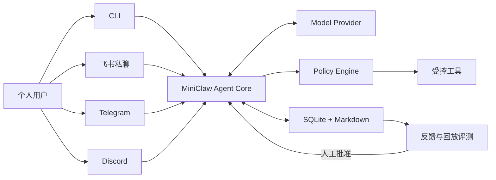

<h1 align="center">MiniClaw</h1>

<p align="center"><strong>A tiny self-hosted personal agent with a Python Core and TypeScript pi-tui.</strong></p>

<p align="center">
  用一套可阅读、可调试、默认安全的 Python 代码，学习个人 Agent 从 CLI、飞书、Telegram、Discord 到工具、记忆和受控演进的完整链路。
</p>

<p align="center">
  
  
  
</p>

MiniClaw 是一个面向个人学习与日常使用的开源 personal agent。它在同一个 Agent Core 后接入本地
CLI、飞书、Telegram 和 Discord，并实现工具调用、SQLite 会话、Markdown 记忆、Skills、安全审批和评测驱动的受控
改进闭环。

> [!IMPORTANT]
> 当前仓库已完成 **Phase 5 IMPLEMENTATION PASS**：裸 `miniclaw` 默认进入 pi-tui，Textual 作为 onboarding/fallback；
> `miniclaw gateway` 可在一个 Python 进程内同时装配飞书 WebSocket、Telegram long polling 与 Discord Gateway，
> 三个平台和 TUI 复用同一个 `AgentRuntime`、Provider、Memory、Skills、Policy、Approval 与 SQLite。
> 消息先进入 SQLite Inbox，再由有界 Worker 处理；回复经 durable Outbox 分片、重试并使用稳定 UUID。Typing、
> 安全进度卡、Owner 审批卡片/文本 fallback、重启恢复、断线映射、脱敏 JSON 日志、durable Channel Audit
> 和 22 项 Doctor 均已接线。每个平台拥有独立 Transport、DeliveryWorker、ChannelManager、queue 和故障状态；
> 一个平台运行期 degraded 不会关闭其余平台。
> 同一个 `AgentRuntime`
> 连接 DeepSeek、TurnService、SQLite、十个系统/文件/命令/HTTPS/Memory Tool 与参数绑定 Approval。TUI 支持流式回答、
> Provider reasoning、可逐项展开的 Tool 参数/执行/结果 Trace、Enter 发送、Shift+Enter 换行、Esc 取消、
> Ctrl+O 全展开/收起、Slash Command、默认中文/可切英文、失败草稿恢复，以及上下文/Token/Tool/迭代/耗时
> 审计栏。权限支持 `safe / smart / autopilot / yolo` 四档；推荐的 `autopilot` 只对本地 TUI 和经过验证的
> Owner 私聊自动执行，群聊与其他白名单成员会自动降级。仍需审批时，弹窗最多 84 列、18 行，参数区可滚动且
> Deny/Once/Session/Always 按钮常驻；文件写入的持久授权范围仍只允许单次。
> 旧 `miniclaw chat`、`miniclaw tui`、one-shot REPL 和 `miniclaw approvals` 已移除。
> P2.3A 已接入不经过 Shell 的 exact-argv `run_command`；P2.4 已接入只读 `http_get`，包含 HTTPS-only、
> 全 DNS 公网校验、固定 IP/TLS hostname、每跳重验、响应预算和不可信内容标记。两类动作未命中精确规则时
> 都在同一 TUI 接受参数绑定审批。Session 规则只活在当前 Runtime；Always 只在成功后为安全 exact argv 或
> exact hostname 写入脱敏规则，inline AppleScript 和文件写入不能持久放行。
> Phase 3 已增加安全 Markdown Memory、经审批的 daily memory 写入、惰性 `SKILL.md` 激活，以及保留原始消息的
> persistent compaction。Personal Profile 已接通 Home 普通文件只读、受控外部写入、NVM/uv/pnpm 等用户 CLI 的
> 确定性发现和 `lark-cli --version` 离线纵切；`ACTION-OPEN-APP-001` 已完成三次不执行 Tool 的 DeepSeek planning
> probe。当前回归基线为
> **520 Python tests + 30 TypeScript tests + 28/28 Agent cases + 32/32 Channel cases + 640/640 local soak**。
> Feishu 的 15 条版本化真实场景、有界 Gateway Runner、只读 SQLite evidence、人工客户端 evidence 和 Secret scan
> 已实现并通过本地契约门禁。专用企业应用、机器人、Scope、Owner allowlist 与 WebSocket 已完成真实配置；两条 Owner
> 私聊已穿过 Inbox、Agent 和 Outbox，并各自一次 Delivery `sent`。当前准确状态是
> **FEISHU OWNER-DM DELIVERY VERIFIED / 15-CASE LIVE PENDING**；完整 15/15、群聊、审批、重连和常驻 soak 仍是显式
> live gate。Telegram 与 Discord 当前也都为 **LIVE PENDING**。离线 fake SDK
> 通过不冒充 production verified。
> Policy 拒绝只写脱敏审计，不创建 ToolRun。
> v0.2.0 曾在 TUI 迁移前完成 DeepSeek V4 Pro 的 system/write/read/command 脱敏 live smoke；历史证据
> 保存在 [v0.2.0 release record](docs/evals/releases/v0.2.0.md)，不冒充当前 TUI 版本的新 live 结果。
> 已确认的产品范围与验收标准见 [PRD](docs/product/20260807_产品需求文档.md)。

## Current MVP

| 能力 | v0.1 目标 |
| --- | --- |
| 交互入口 | 本地 TUI、飞书、Telegram、Discord |
| Agent Core | OpenAI-compatible 模型、原生 Tool Calling、最多 8 轮工具循环 |
| 工具 | Workspace/Personal 文件、HTTPS GET、受控本机 CLI |
| 数据 | SQLite 会话与审计、Markdown 长期记忆和 Skills |
| 安全 | 用户白名单、四档权限、Owner 私聊信任、Profile 多根边界、硬拒绝、危险操作审批 |
| 演进 | 反馈、回放评测、Prompt/Skill 提案、人工批准和回滚 |



## Quick Start

准备 Python 3.12+、Node.js 22.19+、[uv](https://docs.astral.sh/uv/) 和 pnpm，在仓库根目录运行：

```bash
uv venv
uv sync --extra dev --extra channels
corepack enable
pnpm --dir tui install --frozen-lockfile
pnpm --dir tui build
cp .env.example .env
chmod 600 .env
# 编辑 .env，填写 MINICLAW_MODEL_API_KEY；不要提交该文件
uv run miniclaw --version
uv run miniclaw init
uv run miniclaw doctor
uv run miniclaw
# 在 TUI 中输入：你好，请介绍你自己
# 在 TUI 中输入：帮我看看我的电脑是什么配置
# 在 TUI 中输入：/permissions（查看当前权限模式）
uv run miniclaw eval validate --root evals/scenarios
uv run miniclaw eval run --suite offline --root evals/scenarios
uv run miniclaw eval run --suite channel --root evals/scenarios
uv run miniclaw eval run --suite channel --repeat 20 --root evals/scenarios
uv run python -m unittest discover -s tests -v
pnpm --dir tui test
```

当前可用入口：

```bash
uv run miniclaw [--home /absolute/path]      # 唯一的人类对话入口
uv run miniclaw init [--home /absolute/path]
uv run miniclaw doctor [--home /absolute/path]
uv run miniclaw gateway [--home /absolute/path]
uv run miniclaw eval list [--root evals/scenarios]
uv run miniclaw eval validate [--root evals/scenarios]
uv run miniclaw eval run --suite offline|channel|all [--repeat 1..1000] [--root evals/scenarios]
uv run python -m miniclaw --version
```

单个平台可只安装 `--extra feishu`、`--extra telegram` 或 `--extra discord`；`--extra channels` 一次安装三个 official SDK。
`init` 只创建缺失的本地文件，重复运行不会覆盖 `USER.md`、`SOUL.md`、`MEMORY.md` 或已有 Skill；它会为新环境
创建一个 `skills/summarize/SKILL.md` 示例。`doctor`
只执行离线检查，不连接模型或 IM 平台；Node/pi-tui 检查同样只读。裸 `miniclaw` 从当前目录的私密 `.env` 读取 Key，并要求真实
TTY；pipe、CI 或 `TERM=dumb` 会明确失败。模型需要真实本机数据时可调用只读、脱敏的 `system_info`。新安装默认
使用 `personal` Profile：`read_file`、`glob`、`grep` 可读取 Home 下普通文件以及存在的 Homebrew/Application 根，
但 Keychain、浏览器登录库、私钥和应用凭据目录始终硬拒绝；旧配置缺少 `[permissions]` 时保持 Workspace-only。
`write_file` / `edit_file` 只可写 Workspace 与 Documents/Desktop/Downloads/IDE 项目根。新初始化明确使用
`[tools] mode = "autopilot"`；旧配置缺少 `mode` 时保持 `safe`，不会升级后静默扩权。可信 Owner 可在 TUI 或
三个 IM 私聊中用 `/permissions safe|smart|autopilot|yolo` 动态切换；群聊和其他白名单成员不能切换，也不会继承
Personal 额外读写根。`safe`/`smart` 下写入会先生成参数绑定 Approval，Esc 和 **Deny** 都不会写入，文件写入只提供
**Allow once**；安全 exact argv / exact hostname 可由 Core 提供 **Allow this session** 或 **Always allow**。`autopilot`
只在完整硬校验通过后为可信 Owner 自动执行。模型仍不能运行
任意 Shell 字符串；`run_command` 只接收 `program + args[]`，安全命令未命中 exact rule 时也走同一审批弹窗。
macOS 应用名不确定时，模型可显式调用 `system_info` 的 `applications` 分区；该分区默认不读取，只返回固定
`/Applications` 中有界、去路径的真实 `.app` 名称，再由 `run_command(open, [-a, Exact Name])` 请求审批。
Personal Profile 会在启动时确定性构造 PATH，发现系统目录、显式 executable roots、NVM、uv、pnpm、
`~/.local/bin`、Cargo 与 Bun；不 source shell rc，也不继承 API Key、Cookie、Proxy 等环境变量。
`eval` 完全离线，不读取 `.env`、不需要 `init` 或 API Key；`offline` 通过真实 Agent/Policy/Tool/SQLite 链路，
`channel` 通过真实三平台 Adapter/Inbox/Worker/Approval/Outbox 运行版本化场景；`--repeat` 可形成有界的本地 endurance
gate，不能代替真实平台验收。`doctor` 会安全读取当前目录的私密
`.env` 以检查 enabled IM 的变量存在性，但不会联网或显示变量值。

### Memory、Skills 与长对话

```text
~/.miniclaw/
├── MEMORY.md                  # Owner 手工维护的稳定长期记忆
├── memory/YYYY-MM-DD.md       # propose_memory 经审批追加的 daily memory
└── skills/<name>/SKILL.md     # 按当前 Query 惰性激活的做事说明书
```

每次请求按固定顺序注入长期记忆、今天/昨天的 daily memory、最多 3 个命中 Skill、最新 compaction summary
与未压缩消息。`read_memory` 只读；`propose_memory` 必须经过参数绑定 Approval，而且只追加当天 daily 文件，
不会静默改写 `MEMORY.md`。常见 Key、Token、Password、Secret、验证码和私钥片段会在校验与写盘边界被拒绝。
上下文达到预算的 80% 时，当前 Provider 会生成可持久化摘要；SQLite 原消息永不删除，摘要失败也不会留下半成品。
完整边界与图解见 [Phase 3 工程文档](docs/engineering/phase-3/memory-skills-compaction.md)。

审批续跑会创建没有假 User Message 的 child Turn，并让模型基于真实执行结果继续回答。Approval 绑定 Tool
名与完整规范参数；过期、篡改、Owner 不匹配和重复消费都会 fail closed。

TUI 默认使用中文，可在当前界面输入 `/lang en` 切换英文、`/lang zh` 切回中文。中文提问会使用中文 System Prompt
约束 Provider reasoning；英文提问使用英文 Prompt。终端无法真正缩小局部字体，因此 reasoning 默认展开，但使用弱色、
无厚边框和更少留白实现紧凑“小字感”。底部审计栏只显示 Provider 真实上报的用量，缺失值明确为 `N/A`，不会估算。长文本在模型失败
或用户取消后会逐字恢复到 Composer。

pi-tui 运行要求和迁移期回退：

```bash
MINICLAW_TUI=pi uv run miniclaw       # 强制新 TUI；缺依赖时明确失败
MINICLAW_TUI=textual uv run miniclaw  # 显式使用 fallback
```

完整协议、目录、调试和跨进程测试见
[Python Core + pi-tui Bridge 工程文档](docs/engineering/phase-2/python-core-pi-tui-bridge.md)。

### Workspace 只读演示

初始化后的默认 Workspace 是 `~/.miniclaw/workspace/`。把演示文本放进去后，可让已配置的模型尝试调用当前
可用的读取 Tool：

```bash
printf 'MiniClaw workspace demo\n' > ~/.miniclaw/workspace/demo.txt
uv run miniclaw
# 依次在 TUI 输入：
# 请使用 read_file 读取 demo.txt。
# 请使用 glob 找出 Workspace 的 txt 文件。
# 请使用 grep 在 txt 文件中查找 MiniClaw。
# 请使用 run_command 运行 git status --short。
# 请帮我打开飞书。  # macOS: direct open -a；是否审批由权限模式决定
# 请使用 http_get 读取 https://example.com/ 的公开文本。
```

这三条命令只给模型提示和 Tool Schema，模型是否调用取决于 Provider；它们不是已完成的真实 DeepSeek 文件
smoke。可以在 `config.toml` 的 `[workspace].path` 或绝对 `MINICLAW_WORKSPACE` 环境变量中设置其他 Workspace。
`.env`、`.git-credentials`、`.pypirc`、`.docker/config.json`、私钥、MiniClaw 数据库及 sidecar 和状态文件
始终拒绝；Workspace Profile 额外拒绝 Workspace 外路径，Personal Profile 则按已解析的读取根放行普通文件。
`read_file` 按完整行跨 512 KiB 分页；单行超过该上限时返回
`line_too_large`，不会发布可能丢数据的 cursor。

## Repository Layout

```text
miniclaw/
├── AGENTS.md
├── evals/                  # 版本化场景与脱敏 baseline
├── docs/
│   ├── architecture/
│   ├── development/
│   ├── evals/
│   ├── getting-started/
│   ├── engineering/phase-1/
│   ├── engineering/phase-2/
│   ├── engineering/phase-3/
│   ├── engineering/phase-4/
│   ├── product/
│   ├── progress/
│   └── superpowers/
├── src/miniclaw/
│   ├── bootstrap.py
│   ├── config.py
│   ├── doctor.py
│   ├── env.py
│   ├── paths.py
│   ├── runtime.py
│   ├── agent/
│   ├── evals/
│   ├── channels/
│   ├── memory/
│   ├── policy/
│   ├── providers/
│   ├── storage/
│   ├── skills/
│   ├── tui/
│   └── tools/
├── tests/
└── pyproject.toml
```

## Documentation

| 文档 | 内容 |
| --- | --- |
| [文档中心](docs/README.md) | 全部产品、架构、运行和开发文档入口 |
| [产品需求文档](docs/product/20260807_产品需求文档.md) | v0.1 范围、流程图、架构图、验收标准和里程碑 |
| [系统架构](docs/architecture/20260807_系统架构.md) | 核心边界、数据流和计划中的包布局 |
| [OpenClaw / Hermes 能力 Gap](docs/architecture/20260808_OpenClaw-Hermes能力Gap与演进路线.md) | 已有能力、仍缺能力、开源参考、优先级和 Phase 5.2→9 演进路线 |
| [能力对齐工程落地总方案](docs/engineering/openclaw-hermes-alignment-engineering-roadmap.md) | 自治任务、Sandbox、Browser、受控进化、MCP、Provider、Sub-agent 与多模态施工图 |
| [本地运行指南](docs/getting-started/20260807_本地运行指南.md) | 安装、凭据、初始化、CLI 对话、诊断和测试命令 |
| [工程文档索引](docs/engineering/README.md) | 已实现模块的工程说明入口 |
| [Phase 1 模块工程文档](docs/engineering/phase-1/cli-chat.md) | CLI、Provider、Runner、Storage 等逐模块实现说明 |
| [Phase 2.1A Tool 工程文档](docs/engineering/phase-2/tool-runtime-and-system-info.md) | Tool Contract、Policy、Executor、审计、消息轨迹与 system_info |
| [Phase 2.1B Workspace 读取 Tool 工程文档](docs/engineering/phase-2/workspace-read-tools.md) | read_file、glob、grep、Workspace Guard、边界与测试矩阵 |
| [Phase 2.1C Agent 回归工程文档](docs/engineering/phase-2/agent-regression-evals.md) | JSONL 场景、真实离线 runner、CLI 门禁、事故回归和 benchmark 分层 |
| [Phase 2.2A 文件写入工程文档](docs/engineering/phase-2/filesystem-tools.md) | 严格 Tools 配置、Workspace 写边界、write/edit 原子性、错误码和测试矩阵 |
| [Phase 2.2 Approval 生命周期](docs/engineering/phase-2/approval-lifecycle.md) | 参数 hash、waiting/child Turn、TTL、Owner、单次执行与审计 |
| [Phase 2 单入口 TUI](docs/engineering/phase-2/single-entry-tui.md) | 历史 Textual 实现、当前 pi-tui 默认入口、Runtime、RunEvent 与审批链路 |
| [Python Core + pi-tui Bridge](docs/engineering/phase-2/python-core-pi-tui-bridge.md) | 版本化 NDJSON、TypeScript 展示层、安装调试、长文本/选择/审批与跨进程测试 |
| [TUI 回归测试规范](docs/engineering/phase-2/tui-regression-testing.md) | Trace、长文本、权限状态、紧凑审批、跨进程与 Textual fallback 回归 |
| [TUI 可观测与分级审批加固](docs/engineering/phase-2/tui-observability-and-scoped-approvals.md) | 真实 Token 遥测、Session/Always exact scope、双语消息层级与草稿恢复 |
| [Autopilot 权限与紧凑审批 UI](docs/engineering/phase-2/autopilot-permissions-and-approval-ui.md) | 四档权限、Owner 私聊信任、动态切换、审计、滚动审批框与回滚 |
| [Phase 2.3A exact-argv 命令执行](docs/engineering/phase-2/command-execution.md) | `run_command`、硬禁止、精确规则、最小环境、超时和 TUI 审批 |
| [Phase 2.3B Personal Machine 权限与 CLI 发现](docs/engineering/phase-2/personal-machine-permissions.md) | Workspace/Personal Profile、多根读写、敏感路径、NVM/uv/pnpm CLI 发现、最小环境、Doctor 与回归场景 |
| [Phase 2.4 Pinned HTTPS 与 SSRF 防护](docs/engineering/phase-2/https-get-and-ssrf.md) | `http_get`、URL/DNS 校验、固定 IP、TLS、重定向、响应预算与审批 |
| [Phase 2 回归、恢复与调试](docs/engineering/phase-2/testing-and-debugging.md) | Python + TypeScript tests、28+12 场景、crash recovery、Doctor 与发布手册 |
| [Phase 3 Memory、Skills 与 Compaction](docs/engineering/phase-3/memory-skills-compaction.md) | Markdown 记忆、审批写入、Skill 惰性激活、持久化摘要、恢复和测试矩阵 |
| [Phase 4 飞书生产 Channel](docs/engineering/phase-4/feishu-channel.md) | WebSocket、白名单、durable Inbox/Outbox、Worker、进度卡与跨 Channel 审批 |
| [Phase 4 Channel/Gateway 概览](docs/engineering/phase-4/feishu-channel-core.md) | 模块地图、Admission、状态机、恢复和真实 E2E 边界 |
| [Phase 4 运行、测试与排障](docs/engineering/phase-4/testing-and-operations.md) | 配置、Gateway、12 条 Channel 回归、live smoke、故障恢复和发布门禁 |
| [Phase 4 完成性审计](docs/engineering/phase-4/completion-audit.md) | 逐项 requirement → code → test → live evidence 矩阵与剩余外部验收门 |
| [Phase 5 Telegram/Discord 工程落地](docs/engineering/phase-5/telegram-discord-channels.md) | 单 Runtime/多 Pipeline、两个 official Transport、身份、审批、恢复与故障隔离 |
| [Phase 5.1 真实飞书 Bot 与 Live E2E](docs/engineering/phase-5/feishu-live-e2e.md) | 机器人创建、最小 Scope、同应用 Owner discovery、15 条真实用例、Evidence 与排障 |
| [飞书 Gateway 运行时与 macOS 常驻](docs/engineering/phase-5/feishu-gateway-runtime-and-macos-service.md) | SDK event loop、富文本入站、处理中表情、真实 Owner DM 证据与 launchd/VPS 运行方式 |
| [Phase 5 测试与真实验收](docs/engineering/phase-5/testing-and-live-acceptance.md) | 32-case、640-check、15 项 live harness 与证据口径 |
| [Phase 5 故障排查](docs/engineering/phase-5/troubleshooting.md) | SDK/Token、Telegram 409、Discord intents/403、限流、恢复与 Secret scan |
| [Phase 5 完成性审计](docs/engineering/phase-5/completion-audit.md) | requirement → code → automated/live evidence 矩阵 |
| [旧 Approvals CLI 迁移说明](docs/engineering/phase-2/cli-approvals.md) | 已移除入口与 TUI 替代关系 |
| [Eval v0.1.0 发布记录](docs/evals/releases/v0.1.0.md) | 177 tests、10/10 场景、复现命令、限制与下一步 |
| [Eval v0.2.0 发布记录](docs/evals/releases/v0.2.0.md) | 历史 245 tests、20/20 场景、DeepSeek live smoke 与已知边界 |
| [Eval v0.3.0 发布记录](docs/evals/releases/v0.3.0.md) | Phase 3 的 296 tests、24/24 场景与已知边界 |
| [Eval v0.4.0 发布记录](docs/evals/releases/v0.4.0.md) | Phase 4 的 391+25 tests、24+12 回归与真实飞书待验收项 |
| [Eval v0.4.1 发布记录](docs/evals/releases/v0.4.1.md) | Personal Machine 权限、412+27 tests、28+12 回归与本机 lark-cli 只读纵切 |
| [Eval v0.5.0 发布记录](docs/evals/releases/v0.5.0.md) | Phase 5 合并基线的 483+27 tests、28+32 回归、640 soak 与双平台 LIVE PENDING |
| [Eval v0.5.1 发布记录](docs/evals/releases/v0.5.1.md) | Feishu Live Runner、508-test gate 与当时 REAL BOT PENDING 的历史证据口径 |
| [AGENTS.md](AGENTS.md) | 仓库开发规范和完成检查 |

## License

[MIT](LICENSE)
