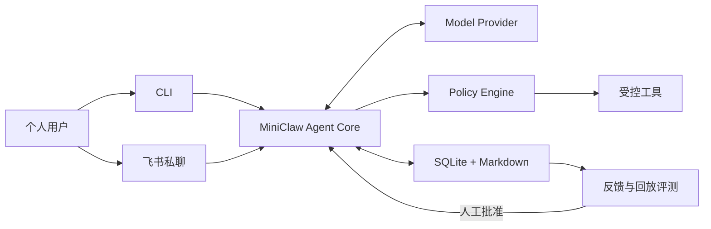

<h1 align="center">MiniClaw</h1>

<p align="center"><strong>A tiny self-hosted personal agent built with Python.</strong></p>

<p align="center">
  用一套可阅读、可调试、默认安全的 Python 代码，学习个人 Agent 从 CLI、飞书到工具、记忆和受控演进的完整链路。
</p>

<p align="center">
  
  
  
</p>

MiniClaw 是一个面向个人学习与日常使用的开源 personal agent。目标是在同一个 Agent Core 后接入本地
CLI 和飞书私聊，逐步实现工具调用、SQLite 会话、Markdown 记忆、Skills、安全审批和评测驱动的受控
改进闭环。

> [!IMPORTANT]
> 当前仓库只完成项目初始化与最小 CLI，尚未实现 Agent Loop、模型调用、飞书接入和持久化。
> 已确认的产品范围与验收标准见 [PRD](docs/product/20260807_产品需求文档.md)。

## Planned MVP

| 能力 | v0.1 目标 |
| --- | --- |
| 交互入口 | 本地 CLI、飞书机器人私聊 |
| Agent Core | OpenAI-compatible 模型、原生 Tool Calling、最多 8 轮工具循环 |
| 工具 | Workspace 文件、HTTPS GET、受限 Shell |
| 数据 | SQLite 会话与审计、Markdown 长期记忆和 Skills |
| 安全 | 用户白名单、Workspace 边界、命令允许列表、危险操作审批 |
| 演进 | 反馈、回放评测、Prompt/Skill 提案、人工批准和回滚 |



## Quick Start

准备 Python 3.12+ 和 [uv](https://docs.astral.sh/uv/)，在仓库根目录运行：

```bash
uv venv
uv sync --extra dev
uv run miniclaw --version
uv run python -m unittest discover -s tests -v
```

当前可用入口：

```bash
uv run miniclaw
uv run python -m miniclaw --version
```

## Repository Layout

```text
miniclaw/
├── AGENTS.md
├── docs/
│   ├── architecture/
│   ├── development/
│   ├── getting-started/
│   ├── product/
│   └── superpowers/plans/
├── src/miniclaw/
├── tests/
└── pyproject.toml
```

## Documentation

| 文档 | 内容 |
| --- | --- |
| [文档中心](docs/README.md) | 全部产品、架构、运行和开发文档入口 |
| [产品需求文档](docs/product/20260807_产品需求文档.md) | v0.1 范围、流程图、架构图、验收标准和里程碑 |
| [系统架构](docs/architecture/20260807_系统架构.md) | 核心边界、数据流和计划中的包布局 |
| [本地运行指南](docs/getting-started/20260807_本地运行指南.md) | 当前脚手架的安装、测试和 CLI 命令 |
| [AGENTS.md](AGENTS.md) | 仓库开发规范和完成检查 |

## License

[MIT](LICENSE)
