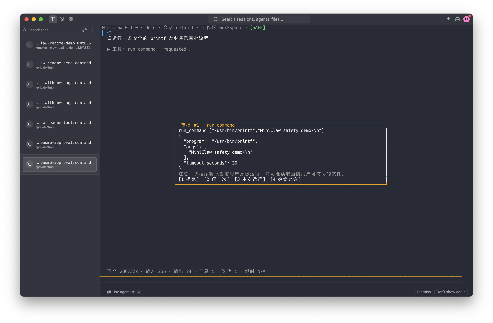
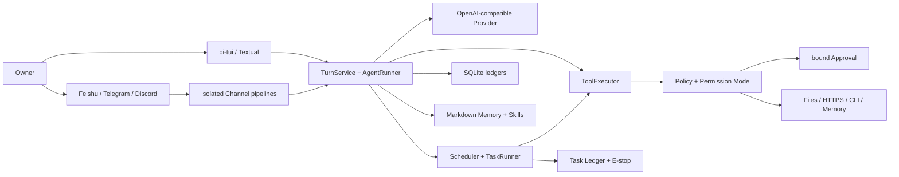
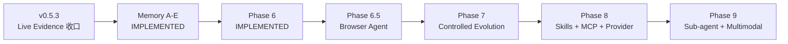

<div align="center">

# MiniClaw

**一个小而完整、私有自托管、默认受控的个人 Agent。**

[简体中文](README.md) · [English](README_EN.md)

[](pyproject.toml)
[](tui/package.json)
[](pyproject.toml)
[](docs/progress/index.html)
[](LICENSE)

[为什么是 MiniClaw](#为什么是-miniclaw) · [当前能力](#当前能力) · [快速开始](#快速开始) · [产品预览](#产品预览) · [架构](#工作原理) · [路线图](#路线图) · [文档](#文档)

</div>


MiniClaw 把模型、Tool、权限、审批、持久化和多个消息渠道收进同一个本地 Core。你可以从 TUI、飞书、Telegram 或 Discord 与同一个 Agent 交互；所有本机动作仍要经过统一的 Policy、Workspace 边界和可审计执行链。

> [!IMPORTANT]
> 当前代码已完成 Phase 5 的本地实现门禁；Feishu/Telegram/Discord 的完整真实 Live Gate 仍按各自证据单独标记。
> v0.5.3 Core 已加入 SDK 日志脱敏、Gateway lease/provenance、受管 Live Runner 与异常 Tool 历史恢复；
> Feishu/Discord 严格 15/15 仍为 Live Pending。
> 飞书 Card callback 现在绑定唯一 sent receipt、账号与 Approval ID；真实“仅本次”已完成 Tool、child Turn
> 与结果 Delivery，状态为 **TARGETED CALLBACK LIVE VERIFIED / 15-CASE LIVE PENDING**。
> 飞书消息到达后立即创建一张蓝色 `Claw Trail` Agent Card，执行中持续原地更新，成功后同一卡片变为绿色并展示脱敏步骤、Tool、安全目标、状态、耗时、过程摘要和最终回答；最终回答保留标题、段落、列表、引用、链接和代码等 CommonMark 结构，只有真实 Markdown 表格会降级为可读条目。
> Agent 默认采用 32 轮软预算、64 轮硬预算和连续 3 轮无进展保护：仍有新的成功 Tool 结果时可越过软预算；语义重复的 Tool 不会重复执行；到达收口轮时会移除 Tool schema，只根据已有证据给出最终答案。
> 缺少 `tools.mode` 的配置默认使用 `autopilot`，但只对本地入口和经过验证的 Owner 私聊生效；硬安全边界不变。
> Memory Autopilot A～E 已完成本地实现：四入口共享一个 Owner Memory Space，Markdown 保存语义真相，SQLite
> 保存 durable buffer、来源、治理和可重建 FTS5 Projection；真实 IM 平台能力仍只按各自 Live evidence 标记。
> Phase 6 自治运行与安全链路已完成本地实现：durable Task/Scheduler/Runner、E-stop、预算、Approval continuation、
> 主动 Delivery、Docker/Seatbelt ExecutionPlan、Checkpoint/Rollback 和 15 条 Automation gate 已接通；Automation
> 默认关闭；Docker 真实 containment 已验证，Seatbelt 因 Python Framework launcher 尚未进入 Plan 而保持 Live Pending。

## 为什么是 MiniClaw

| 目标 | MiniClaw 的选择 |
| --- | --- |
| 私有与可控 | 状态、会话、审批和审计保存在本机；Secret 不进入 Prompt、日志或 Memory。 |
| 小而完整 | 一个 Python Core、一个主 TUI、一个 OpenAI-compatible Provider，不提前堆叠服务。 |
| 真正能行动 | 18 个内置 Tool 覆盖系统信息、文件、搜索、HTTPS、exact-argv CLI 和 Memory。 |
| 默认可追溯 | Turn、ToolRun、Approval、Delivery 与 Channel Inbox/Outbox 都有 SQLite 状态。 |
| 多入口同一 Core | TUI、Feishu、Telegram、Discord 复用同一个 `AgentRuntime`；Transport 和故障域隔离。 |
| 先验证再扩张 | `unittest`、TypeScript test、Agent/Channel JSONL、20 轮 soak 和文档校验共同守门。 |

MiniClaw 不是“把聊天框接到 Shell”——模型只提出 Tool Call，Core 负责参数校验、风险判定、审批绑定、执行、审计和恢复。

## 当前能力

| 层 | 已实现能力 |
| --- | --- |
| Agent Loop | OpenAI-compatible 流式响应、Tool Loop、token/latency telemetry、错误归一化、Context compaction。 |
| TUI | 默认 pi-tui、中文/英文、流式对话、Tool 状态、紧凑审批卡、四档 Permission Mode、Textual fallback。 |
| Tool | 系统、文件、搜索、HTTPS、exact-argv CLI，以及 remember/search/get/list/flush/forget/correct/review Memory surface。 |
| 安全 | Workspace Guard、敏感路径硬拒绝、exact argv、最小子进程环境、HTTPS/DNS/SSRF 校验、参数绑定 Approval。 |
| Channel | Feishu 用单张 `Claw Trail` Agent Card 展示脱敏步骤和最终回答；审批点击在原卡先显示处理中，再以成功、拒绝或失败终态收口；三平台各自独立 Transport/Delivery/Manager/queue/recovery，共享 Agent Runtime。 |
| 数据 | SQLite Session/Message/Turn/ToolRun/Approval/Channel/Memory control plane；owner-only Markdown Truth 与 Skills。 |
| Automation | one-shot/interval/cron、durable TaskRun、E-stop、预算、Heartbeat、Approval continuation 与幂等主动投递。 |
| Desktop | W0/W1 development build：浅色四界面、真实单 Agent 任务流、审批/取消、最近任务、只读 Automation、权限和 Workspace 切换。 |
| Sandbox | immutable ExecutionPlan、Docker/Seatbelt fail-closed backend、Checkpoint CAS 与冲突感知 Rollback。 |
| 运维 | `init`、`doctor`、`gateway`、`task` 控制面、Memory rebuild、结构化脱敏日志、幂等恢复与版本化 Eval。 |

`init` 会幂等安装 `feishu-lark-cli` 与 `github-cli` Skill：飞书业务请求走官方 `lark-cli`，GitHub 远端请求走本机 `gh`，本地仓库请求走 `git`；凭据不进入 Tool 参数或模型上下文。

### Permission Mode

- `SAFE`：只读低风险动作自动执行，其余动作按 Policy 请求审批或拒绝。
- `SMART`：精确规则和安全 HTTPS 可以少打扰，未命中仍受监督。
- `AUTOPILOT`：已验证 Owner 的非关键动作可自动执行，硬边界、参数校验与审计仍然存在。
- `YOLO`：最少监督模式；不会关闭敏感路径、SSRF、Workspace 和关键动作硬边界。

新安装和缺少 `tools.mode` 的旧配置默认使用 `autopilot`；显式 `safe`/`smart` 保持不变。该默认值只信任本地入口和经过验证的 Owner 私聊，群聊、其他用户与硬拒绝规则不会扩权。

如果当前个人实例明确要求最少监督，可在私有 `~/.miniclaw/config.toml` 中设置 `mode = "yolo"` 并重启 Gateway；这只减少硬校验通过后的审批，不会开放凭据、敏感路径、SSRF、提权或 Shell 字符串执行。

## 快速开始

### 环境要求

- Python 3.12+
- [uv](https://docs.astral.sh/uv/)
- Node.js 22.19+ 与 pnpm（默认 pi-tui）
- 一个 OpenAI-compatible 模型端点；默认配置为 `deepseek-v4-pro`

### 安装与启动

```bash
git clone https://github.com/NEDONION/miniclaw.git
cd miniclaw

uv sync --extra dev --extra channels
pnpm --dir tui install
pnpm --dir tui build

cp .env.example .env
# 只在本机填写 MINICLAW_MODEL_API_KEY；不要提交 .env

uv run miniclaw init
uv run miniclaw doctor
uv run miniclaw
```

默认状态目录是 `~/.miniclaw`，Workspace 是 `~/.miniclaw/workspace`。使用隔离实例：

```bash
uv run miniclaw --home /absolute/path/to/demo-home init
uv run miniclaw --home /absolute/path/to/demo-home
```

如果暂时没有满足版本要求的 Node.js，可以显式使用迁移期 fallback：

```bash
MINICLAW_TUI=textual uv run miniclaw
```

### 常用入口

| 命令 | 用途 |
| --- | --- |
| `uv run miniclaw` | 启动唯一主 TUI。 |
| `uv run miniclaw init` | 幂等初始化 owner-only 状态、配置、Memory、Skills 和 SQLite。 |
| `uv run miniclaw doctor` | 检查配置、目录权限、Provider、TUI 和数据库状态。 |
| `uv run miniclaw gateway` | 启动已配置的 Feishu/Telegram/Discord Gateway。 |
| `uv run miniclaw task list` | 查看 durable ScheduledTask；`show/runs/pause/resume/run/cancel/halt/unhalt` 提供完整控制面。 |
| `uv run miniclaw eval validate --root evals/scenarios` | 校验版本化 JSONL 场景。 |
| `uv run miniclaw eval run --suite offline --root evals/scenarios` | 跑真实 Core/Policy/Tool/SQLite 离线回归。 |
| `uv run miniclaw eval run --suite channel --repeat 20 --json --root evals/scenarios` | 跑三平台 Channel gate 与 20 轮本地 soak。 |
| `uv run miniclaw eval run --suite automation --repeat 20 --json --root evals/scenarios` | 跑 Phase 6 的 15 条 Automation gate 与 20 轮 soak。 |

Channel 的 allowlist、Owner 身份与平台凭据配置见[本地运行指南](docs/getting-started/20260807_本地运行指南.md)。

### Desktop W0/W1 开发版

Desktop 当前是开发构建，不是已签名安装包。它复用同一 Python Core、Policy、SQLite 与 Automation，不在
Renderer 中复制 Agent 逻辑或直接访问本机能力。

```bash
uv sync --extra dev
pnpm --dir tui install
pnpm --dir tui build
pnpm --dir desktop install
uv run miniclaw --home /absolute/path/to/miniclaw-home init

# 先在当前 shell 安全设置 MINICLAW_MODEL_API_KEY
MINICLAW_PYTHON="$(pwd)/.venv/bin/python" \
MINICLAW_HOME=/absolute/path/to/miniclaw-home \
pnpm --dir desktop dev
```

当前包含首页、任务工作台、自动化只读列表和设置；没有 installer/signing、Artifact 预览、Sub-agent、
外部 Agent adapter、Office 编辑器或深色主题。自动化跨进程测试和隔离 Electron 进程 smoke 已通过；鼠标/键盘
视觉验收与真实模型 LIVE smoke 仍为 pending。

## 产品预览

下面 3 个典型 Case 均在 Warp 中使用全新隔离 `MINICLAW_HOME` 运行。为了不消耗真实模型额度，Provider 响应来自本地固定端点；MiniClaw 的 TUI、Bridge、TurnService、Policy、ToolExecutor、SQLite、Approval 和 Tool 执行均走真实代码路径。

### 1. TUI 对话完整跑通


中文输入、回答、32K 应用侧 Context budget、token、迭代和耗时在同一界面可见。

### 2. SAFE 模式请求权限



`run_command` 在执行前展示规范化后的绝对程序、精确 argv、超时和四种审批选择；截图时命令仍处于 `requested`，没有执行。

### 3. 调用外部 Git CLI 完成任务


MiniClaw 用 `run_command` 的 exact argv 调用隔离仓库中的 `git status --short --branch`，再根据真实 Tool 结果完成总结；没有 Shell 字符串拼接。

## 工作原理



一次典型本机动作的链路是：

1. TUI 或 Channel 把用户消息交给同一个 `TurnService`；
2. `ContextBuilder` 组合 SOUL、USER、当前 Memory、Skills 和有界历史；
3. Provider 返回文本或 Tool Call；
4. Tool 先做 Schema 校验，再由 Policy 决定 allow / deny / approval；
5. 执行结果写入 ToolRun/Audit，返回 Agent 继续完成回答；
6. Turn、消息、审批与 Channel Delivery 都能在重启后恢复或解释。

## Memory Autopilot：已实现的混合方案

| 能力 | 当前实现 |
| --- | --- |
| 真相源 | 已接受 Unit 写入 `memory/owners/<owner>/memory.md`；SQLite Projection 可重建 |
| 写入 | 普通 Turn 非阻塞 capture/flush；明确“记住”原子落盘后才报告成功 |
| 检索 | owner-scoped FTS5/CJK、完整来源链、有效期过滤与固定 Recall 预算 |
| 治理 | short-term、重复晋升、Review、冲突、纠错、forget、TTL 与 weekly review |
| 跨渠道 | TUI、Feishu、Telegram、Discord 的已验证 Owner 私聊共享一个 Memory Space |
| 隐私 | 群聊、非 Owner、未知/冲突身份 fail closed；Secret 在 Candidate 前拒绝 |
| 维护 | Markdown direct edit 对账、`/memory rebuild`、legacy 只读 hash 迁移、Doctor drift 检查 |

架构、实现和证据入口：

- [Memory Autopilot 能力 Gap 与重构架构](docs/architecture/20260808_Memory-Autopilot能力Gap与重构架构.md)
- [正式设计 Spec](docs/superpowers/specs/2026-08-08-memory-autopilot-design.md)
- [最佳实践与技术选型](docs/engineering/20260808_memory-autopilot-best-practices-and-technology-selection.md)
- [Memory A～E TDD 实施计划](docs/superpowers/plans/2026-08-09-memory-autopilot.md)
- [Memory Autopilot 工程实现](docs/engineering/phase-5/20260809_memory-autopilot.md)
- [v0.6.0 发布证据](docs/evals/releases/v0.6.0.md)

## Phase 6：自治运行与安全

Phase 6 让 MiniClaw 在 Gateway 常驻时执行受控后台任务，但不把控制权交给模型：

- SQLite Task Ledger 冻结 Task/Run snapshot，Scheduler 幂等生成 due Run；
- 每个 Run 使用独立 Automation Session、固定 Tool profile 和 wall-clock/turn/tool/token/cost 预算；
- `manage_task` 只存在于普通 Agent，Automation Agent 不能递归创建 Task；
- `complete_task` 是唯一成功出口，危险 Tool 继续走参数与 ExecutionPlan 绑定的人工 Approval；
- durable E-stop、lease recovery、幂等 Channel Delivery 和 Heartbeat 复用现有 Runtime；
- Docker/Seatbelt 缺失时 fail closed，不回退 Host；文件副作用前创建有界 Checkpoint，Rollback 需要 preview hash。

默认 `automation.enabled = false`、`heartbeat.enabled = false`。当前 Heartbeat 没有 Owner IM route；Checkpoint
只覆盖主 Workspace；Rollback 还没有 CLI/TUI。详细边界见
[Autonomy Runtime](docs/engineering/phase-6/20260809_autonomy-runtime.md)、
[Sandbox 与 Checkpoint](docs/engineering/phase-6/20260809_sandbox-and-checkpoint.md)和
[v0.7.0 发布证据](docs/evals/releases/v0.7.0.md)。

## 安全边界

- Secret 永不进入仓库、普通日志或 Memory；常见 Token、密码、OTP、Authorization 和私钥在边界拒绝。
- 文件 Tool 只能访问配置的 Workspace/允许根；symlink、路径逃逸、二进制和超限内容 fail closed。
- `run_command` 只接受程序与参数数组，`shell=False`，使用最小环境、固定 cwd、超时和输出上限。
- `http_get` 只允许经过 URL、DNS、端口和重绑定检查的 HTTPS 目标。
- Approval 绑定 Tool 名、规范化参数 hash、Owner、TTL 和可用决策；篡改、重放和跨 Owner 使用都会拒绝。
- Channel allowlist、Owner 映射、Inbox/Outbox 幂等、独立 queue 和恢复状态不会交给模型决定。
- Memory、Skill 和外部内容只能提供上下文，不能扩大 Policy 权限。

完整威胁模型与契约见[系统架构](docs/architecture/20260807_系统架构.md)和[Phase 2 安全设计](docs/superpowers/specs/2026-08-07-phase-2-tools-security-design.md)。

## 项目状态

| 项目 | 当前证据 |
| --- | --- |
| Python | 798/798 `unittest` PASS |
| TUI | 35/35 TypeScript tests + build PASS |
| Agent | 39/39 active offline cases PASS（含 `MEM-AUTO-001..010`） |
| Channel | 33/33 versioned cases PASS |
| 稳定性 | 20 轮 local Channel soak，660/660 PASS |
| Automation | 15/15 versioned cases；20 轮 300/300 PASS |
| Feishu | TARGETED CALLBACK LIVE VERIFIED / 15-CASE LIVE PENDING |
| Telegram / Discord | Implementation PASS；真实平台 Live Gate 仍 pending |
| Memory Autopilot | A～E IMPLEMENTATION PASS；真实 IM Live 结论沿用各平台 gate |
| Phase 6 | **IMPLEMENTATION PASS**；Docker LIVE VERIFIED / Seatbelt LIVE PENDING |

本地 fake SDK、离线场景和 660/660 soak 只代表 **IMPLEMENTATION PASS**，不会冒充真实平台 Live PASS。历史发布证据见 [`docs/evals/releases/`](docs/evals/releases/)。
Memory 上线前的 Phase 5 历史基线为 562 Python、30 TypeScript、29/29 Agent；Memory v0.6.0 的历史基线为
666 Python、35 TypeScript、39/39 Agent；当前发布数字以上表和 v0.7.0 为准。

### 验证命令

```bash
uv run python -m unittest discover -s tests -v
pnpm --dir tui test
pnpm --dir tui build
uv run ruff check .
uv run miniclaw eval run --suite channel --repeat 20 --json --root evals/scenarios
uv run miniclaw eval run --suite automation --repeat 20 --json --root evals/scenarios
uv run python scripts/validate_docs.py
git diff --check
```

## 路线图



Owner `AUTOPILOT` 默认值、飞书 `Claw Trail` Agent Card、v0.5.3 Core hardening、Memory A～E 与 Phase 6
Autonomy/Sandbox 已实现。下一条功能主线是 **Phase 6.5 Browser Agent**；Feishu/Discord 严格 Live Evidence
仍作为独立验收并行收口。路线图中 Phase 6.5 之后节点不代表相应代码已经存在。

## 仓库结构

```text
src/miniclaw/
├── agent/       # Context、Runner、Turn、Compaction
├── automation/  # Task Ledger、Scheduler、Runner、Heartbeat、Delivery
├── checkpoints/ # bounded CAS 与 conflict-aware Rollback
├── channels/    # Feishu / Telegram / Discord adapters and pipelines
├── memory/      # Markdown Truth、buffer/flush、FTS5、治理、对账与迁移
├── policy/      # Workspace、Command、Network、Permission、Approval
├── providers/   # OpenAI-compatible Provider
├── sandbox/     # immutable Plan 与 Host/Docker/Seatbelt backend
├── storage/     # SQLite schema, repositories and migrations
├── tools/       # 18 个内置 Tool
└── tui/         # Textual fallback；默认 pi-tui 在仓库 tui/

tui/             # Node.js pi-tui + Python Bridge client
desktop/         # Electron + React 的 W0/W1 development build
evals/           # versioned Agent / Channel scenarios
docs/            # PRD、架构、工程、计划、发布证据与进度页
tests/           # Python unittest
```

## 文档

| 入口 | 适合读者 |
| --- | --- |
| [文档中心](docs/README.md) | 完整索引与推荐阅读顺序 |
| [产品需求文档](docs/product/20260807_产品需求文档.md) | 产品范围、非目标和验收标准 |
| [系统架构](docs/architecture/20260807_系统架构.md) | 模块边界、数据流与安全原则 |
| [本地运行指南](docs/getting-started/20260807_本地运行指南.md) | 安装、配置、TUI、Gateway 与排障 |
| [工程文档索引](docs/engineering/README.md) | 已实现模块与规划文档的边界 |
| [开发与交付时间线](docs/engineering/20260809_development-timeline.md) | 架构 Phase、真实版本顺序与证据状态的对应关系 |
| [开发进度页](docs/progress/index.html) | 当前 Phase、证据和下一步 |
| [OpenClaw / Hermes Gap](docs/architecture/20260808_OpenClaw-Hermes能力Gap与演进路线.md) | 竞品能力映射与 v0.5.3 Evidence→Memory A～E→Phase 6～9 路线 |
| [能力对齐工程落地总方案](docs/engineering/20260808_openclaw-hermes-alignment-engineering-roadmap.md) | 后续交付的模块、数据和测试边界 |
| [Memory A～E 实施计划](docs/superpowers/plans/2026-08-09-memory-autopilot.md) | 可直接执行的 RED→GREEN 施工计划 |
| [Memory Autopilot 工程实现](docs/engineering/phase-5/20260809_memory-autopilot.md) | 当前数据流、安全边界、恢复和运维入口 |
| [Phase 6 Autonomy Runtime](docs/engineering/phase-6/20260809_autonomy-runtime.md) | Task/Scheduler/Runner/Heartbeat、预算、恢复与运维入口 |
| [Phase 6 Sandbox 与 Checkpoint](docs/engineering/phase-6/20260809_sandbox-and-checkpoint.md) | Plan/Approval 绑定、隔离后端、Checkpoint 与 Rollback |

## 参与开发

欢迎 Issue 和 Pull Request。开始前请阅读 [AGENTS.md](AGENTS.md) 与[文档中心](docs/README.md)，保持变更范围小、测试离线可重复，并且不要把规划写成已实现。

```bash
uv sync --extra dev
uv run python -m unittest discover -s tests -v
uv run ruff check .
```

## License

[MIT](LICENSE)
