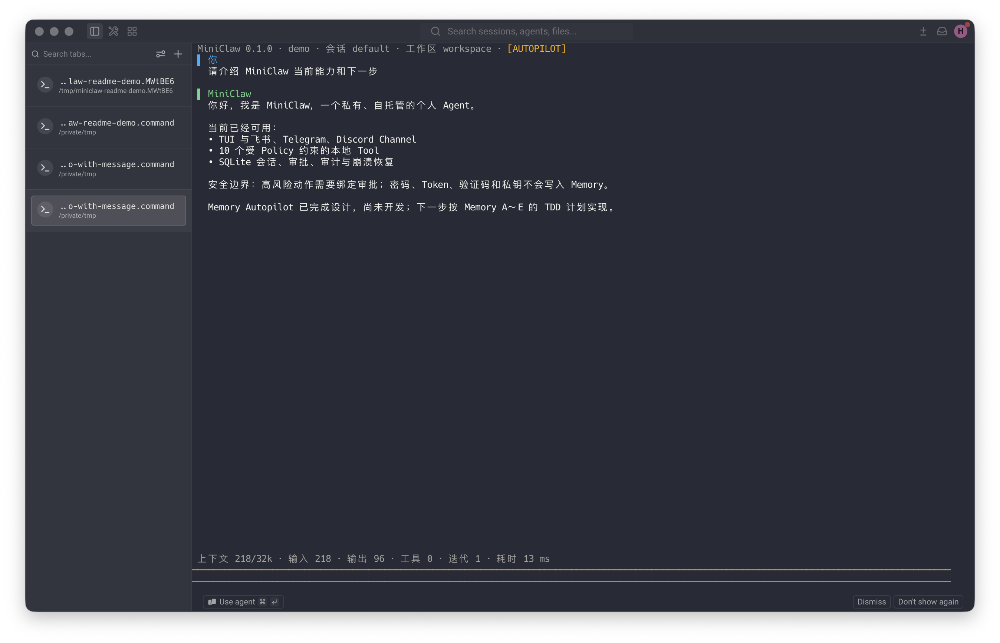
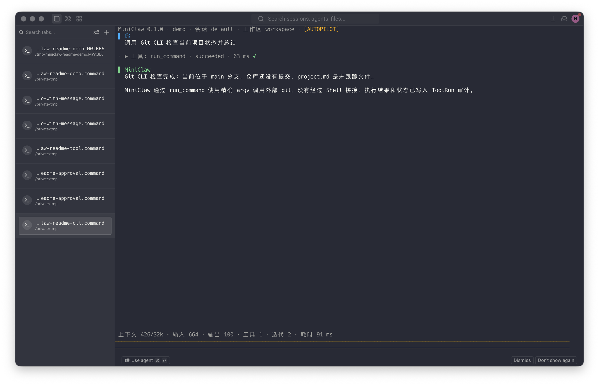
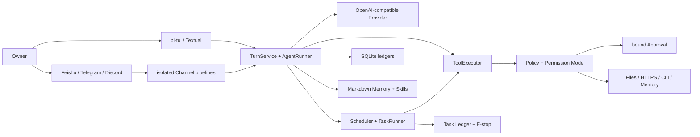
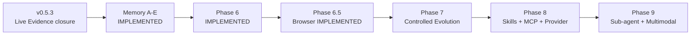

<div align="center">

# 🦞 Lobster0

**A small, complete, private-by-default personal agent you can self-host.**

[简体中文](README.md) · [English](README_EN.md)

[](pyproject.toml)
[](tui/package.json)
[](pyproject.toml)
[](docs/progress/index.html)
[](LICENSE)

[Website](https://lobster0.jchu.tech) · [Why Lobster0](#why-lobster0) · [Capabilities](#current-capabilities) · [Quick start](#quick-start) · [Gallery](#product-gallery) · [Architecture](#how-it-works) · [Roadmap](#roadmap) · [Docs](#documentation)

</div>



Lobster0 brings the model, tools, permissions, approvals, persistence, and multiple messaging channels into one local Core. The same agent is available through its TUI, Feishu, Telegram, and Discord, while every local action still passes through a shared Policy, workspace boundary, and auditable execution path.

> [!IMPORTANT]
> Everything below is **IMPLEMENTATION PASS**: local gates and offline suites are green, but the real
> Feishu / Telegram / Discord Live Gates and the Phase 6 production soak are still in progress.
> See [Project status](#project-status) for the per-item evidence.

## Why Lobster0

| Goal | Lobster0's choice |
| --- | --- |
| Private and controlled | State, conversations, approvals, and audit stay local; secrets do not enter prompts, logs, or Memory. |
| Small but complete | One Python Core, one primary TUI, and one OpenAI-compatible Provider before adding services. |
| Able to act | Eighteen Core tools cover the machine and Memory; enabling Browser adds eight isolated web tools. |
| Explainable by default | Turn, ToolRun, Approval, Delivery, and Channel Inbox/Outbox state is persisted in SQLite. |
| One Core, many entry points | TUI, Feishu, Telegram, and Discord reuse one `AgentRuntime`; transports and failure domains stay isolated. |
| Evidence before expansion | Python and TypeScript tests, versioned Agent/Channel cases, 20-round soak, and docs validation gate changes. |

Lobster0 is not a chat box wired directly to a shell. The model proposes a Tool Call; the Core validates its schema, decides risk, binds approvals, executes, audits, and recovers.

## Current capabilities

| Layer | Implemented today |
| --- | --- |
| Agent Loop | OpenAI-compatible streaming, Tool Loop, token/latency telemetry, normalized errors, and context compaction. |
| TUI | pi-tui by default, Chinese/English UI, streaming turns, Tool status, compact approval cards, four permission modes, Textual fallback. |
| Tools | System, files, search, HTTPS, exact-argv CLI, plus remember/search/get/list/flush/forget/correct/review Memory surfaces. |
| Safety | Workspace Guard, hard-denied sensitive paths, exact argv, minimal child environment, HTTPS/DNS/SSRF validation, parameter-bound approvals. |
| Channels | Feishu uses one `Claw Trail` Agent Card for redacted progress, Tool state, and the final answer; all three platforms keep isolated Transport/Delivery/Manager/queue/recovery pipelines while sharing one Agent Runtime. |
| Data | SQLite Session/Message/Turn/ToolRun/Approval/Channel/Memory control plane; owner-only Markdown Truth and Skills. |
| Automation | One-shot/interval/cron, durable TaskRuns, E-stop, budgets, Heartbeat, Approval continuation, and idempotent proactive Delivery. |
| Sandbox | Immutable ExecutionPlans, fail-closed Docker/Seatbelt backends, Checkpoint CAS, and conflict-aware Rollback. |
| Browser | Dedicated Chromium Profile, bounded snapshots/opaque refs, action approvals, and private screenshot/download Artifacts. |
| Operations | `init`, `doctor`, `gateway`, the `task` control plane, Memory rebuild, redacted logs, idempotent recovery, and versioned Eval gates. |

### Permission modes

- `SAFE`: read-only low-risk actions run automatically; other actions are approved or denied by Policy.
- `SMART`: exact rules and safe HTTPS targets reduce interruptions; misses remain supervised.
- `AUTOPILOT`: non-critical actions from a verified Owner may run automatically; hard boundaries, validation, and audit remain active.
- `YOLO`: least supervision; it still cannot disable sensitive-path, SSRF, workspace, or critical-action hard boundaries.

New installations and older configurations without `tools.mode` default to `autopilot`; explicit `safe` and `smart` settings remain unchanged. This default trusts only the local entry point and verified Owner direct messages. Groups and other users are automatically downgraded.

## Quick start

### Install

`v0.7.0` is out as a **prerelease** and its wheel can be installed directly. All you need is
[uv](https://docs.astral.sh/uv/) — no preinstalled Node.js or pnpm:

```bash
W=lobster0_agent-0.7.0-py3-none-any.whl
curl -fL --proto '=https' --tlsv1.2 -o /tmp/${W} \
  https://github.com/NEDONION/lobster0/releases/download/v0.7.0/${W} \
  && uv tool install --python 3.12 "/tmp/${W}[feishu]"
```

> Keep the filename exactly as published — `uv` reads the version out of it and fails with
> `Must have a version` when it is renamed. The braces in `${W}` matter too: a bare `$W[feishu]`
> is array subscripting in zsh, the default shell on macOS.

`lobster0` is then a global command:

```bash
lobster0 --version
lobster0 setup         # prompts for the model API key, Feishu app credentials, and owner
lobster0 gateway       # starts the Feishu gateway over WebSocket — no public port needed
```

`lobster0 setup` is interactive, so run it separately rather than pasting it with the installer.
Use `lobster0 secret set LOBSTER0_MODEL_API_KEY` to fix or rotate one credential — do **not**
`rm -rf ~/.lobster0`, which would delete memory, history, scheduled tasks and audit records too.

`v0.7.0` is **RELEASE CANDIDATE / PUBLIC GATES PENDING**: the Tier 1 real-machine matrix, the PyPI
publish and the image digest smokes have not been executed, so it is usable for self-hosting but is
not a fully verified stable build.

### One-line install (not available yet)

```bash
curl -fsSL --proto '=https' --tlsv1.2 \
  https://github.com/NEDONION/lobster0/releases/latest/download/install.sh | bash
```

> [!WARNING]
> **This URL returns 404 today, for two independent reasons.** First, `install.sh` is produced by the
> release pipeline's `assemble` stage, which does not pass yet, so no Release carries the file.
> Second, `releases/latest/` only resolves to a **stable** release, and `v0.7.0` is marked as a
> prerelease — so this repository has no latest release at all, and the URL would keep returning 404
> even once `install.sh` exists, until a stable version ships. Use the wheel install above for now.
> Per-item evidence lives in the
> [v0.7.0 one-line install candidate record](docs/evals/releases/v0.7.0-install.md).

The installer ships its own pinned uv, managed Python 3.12, managed Node.js and platform pi-tui
bundle, so **no preinstalled Python, Node.js or pnpm is required**. It installs into `~/.lobster0`
with the command entry at `~/.local/bin/lobster0`, and a default install never asks for sudo;
system packages, linger and a system prefix each print an exact plan and ask again. The Python
distribution name is `lobster0-agent`; the CLI, the import package and the state home stay
`lobster0`.

Print the plan with zero writes and zero component downloads:

```bash
curl -fsSL --proto '=https' --tlsv1.2 \
  https://github.com/NEDONION/lobster0/releases/latest/download/install.sh | bash -s -- --dry-run
```

Fully non-interactive install (prepare the config template and the owner-only Secret file first):

```bash
curl -fsSL --proto '=https' --tlsv1.2 \
  https://github.com/NEDONION/lobster0/releases/latest/download/install.sh \
  | bash -s -- --no-onboard --no-install-service --json \
      --config /absolute/path/to/config.toml \
      --secrets-file /absolute/path/to/secrets.env
```

Remaining flags: `--version <semver>`, `--channel stable|dev`, `--prefix <absolute-path>`,
`--system-prefix`, `--install-service`, `--allow-system-packages`, `--verbose`. A non-TTY stdin with
incomplete arguments fails closed; secrets are only read from hidden `/dev/tty` input, an owner-only
Secret file or the existing process environment — never from the command line.

### Supported platforms

| Platform | Versions | Architectures | Managed service |
| --- | --- | --- | --- |
| Ubuntu | 22.04, 24.04 | x86_64, arm64 | systemd user |
| Debian | 12, 13 | x86_64, arm64 | systemd user |
| RHEL / Rocky / Alma | 9, 10 | x86_64, arm64 | systemd user |
| macOS | 13 and newer | Intel (x86_64), Apple Silicon (arm64) | LaunchAgent |

Explicitly unsupported, rejected with `unsupported_platform` before any write: native Windows and
WSL, Alpine/musl, declarative NixOS installs, Android/Termux, 32-bit architectures, and Linux hosts
without systemd as a resident service host.

That table is the designed Tier 1 scope, not a verified result — none of those combinations has run
the real-machine install matrix yet.

### Node policy

The managed Node.js version is 24.18.0. Only `22.22.3 <= version < 23.0.0` and
`24.15.0 <= version < 25.0.0` are accepted; Node 20/23/25/26 are rejected. The one-line installer
downloads and verifies its own managed Node and neither uses nor requires a machine-wide Node.

### Service, upgrade and uninstall

| Command | Purpose |
| --- | --- |
| `lobster0 service install` | Install and enable the managed Gateway user service |
| `lobster0 service status` | Inspect the managed service |
| `lobster0 service logs` | Read managed service logs |
| `lobster0 service restart` | Restart the managed service |
| `lobster0 service uninstall` | Remove only the service, keeping the install and all data |
| `lobster0 uninstall` | Remove the managed Runtime, launcher and receipt, **keeping every user file under `~/.lobster0`** |
| `lobster0 uninstall --purge-data --yes-i-understand-data-loss` | Also delete the enumerated state; `workspace/` is still kept |

**Upgrading means re-running the one-line install command above.** `lobster0 update` on an installed
CLI currently prints `update_requires_bootstrap` and exits with code 2: the update pipeline needs the
trust root established by bootstrap (a pinned uv and a managed Python), and the managed Runtime
deletes `.inputs` on activation by design, so it fails closed instead of degrading to an untrusted
`PATH` uv. A failed upgrade rolls back automatically; if external writes happened after the
migration it returns `rollback_conflict` and preserves the scene — manual recovery is documented in
the [install and release operations runbook](docs/engineering/operations/20260809_install-release-operations.md).

### Source development install

Contributors use the source path and provide their own Python 3.12+,
[uv](https://docs.astral.sh/uv/), Node.js 22.22.3–<23 or 24.15.0–<25 and pnpm for the default pi-tui
(managed default: 24.18.0), plus Chrome/Chromium and Playwright when Browser Agent is enabled, plus
an OpenAI-compatible model endpoint (default `deepseek-v4-pro`).

```bash
git clone https://github.com/NEDONION/lobster0.git
cd lobster0

uv sync --extra dev --extra channels
pnpm --dir tui install
pnpm --dir tui build
pnpm --dir browser-worker install
pnpm --dir browser-worker build

cp .env.example .env
# Set LOBSTER0_MODEL_API_KEY locally. Never commit .env.

uv run lobster0 init
uv run lobster0 doctor
uv run lobster0
```

The default state home is `~/.lobster0`; the default workspace is `~/.lobster0/workspace`. To create an isolated instance:

```bash
uv run lobster0 --home /absolute/path/to/demo-home init
uv run lobster0 --home /absolute/path/to/demo-home
```

If a suitable Node.js runtime is not available, select the migration fallback explicitly:

```bash
LOBSTER0_TUI=textual uv run lobster0
```

### Main commands

| Command | Purpose |
| --- | --- |
| `uv run lobster0` | Start the single primary TUI. |
| `uv run lobster0 init` | Idempotently initialize private state, config, Memory, Skills, and SQLite. |
| `uv run lobster0 doctor` | Diagnose config, directory permissions, Provider, TUI, and database state. |
| `uv run lobster0 gateway` | Start configured Feishu/Telegram/Discord gateways. |
| `uv run lobster0 task list` | Inspect durable tasks; `show/runs/pause/resume/run/cancel/halt/unhalt` provide the control plane. |
| `uv run lobster0 eval validate --root evals/scenarios` | Validate versioned JSONL scenarios. |
| `uv run lobster0 eval run --suite offline --root evals/scenarios` | Run offline cases through the real Core/Policy/Tool/SQLite path. |
| `uv run lobster0 eval run --suite channel --repeat 20 --json --root evals/scenarios` | Run all Channel cases and the 20-round local soak. |
| `uv run lobster0 eval run --suite automation --repeat 20 --json --root evals/scenarios` | Run the 15 Phase 6 Automation cases and 20-round soak. |
| `uv run lobster0 eval run --suite browser --repeat 20 --json --root evals/scenarios` | Run the 18 Phase 6.5 Browser cases and 20-round soak. |

See the [local setup guide](docs/getting-started/20260807_本地运行指南.md) for Channel allowlists, Owner identities, and credentials.

## Product gallery

These three representative cases ran in Warp with a fresh isolated `LOBSTER0_HOME`. A deterministic local endpoint supplied Provider responses so no real model quota was consumed. Lobster0's TUI, Bridge, TurnService, Policy, ToolExecutor, SQLite, Approval, and Tool execution all used the real code path.

### 1. A complete TUI conversation


Chinese input and output, the application-side 32K context budget, tokens, iterations, and latency are visible in one view.

### 2. A permission request in SAFE mode


Before `run_command` executes, the approval card shows the normalized executable, exact argv, timeout, and four decisions. The command is still `requested` in this image and has not executed.

### 3. Completing a task with an external Git CLI



Lobster0 invokes `git status --short --branch` against an isolated repository using exact argv, then summarizes the real Tool result without shell-string interpolation.

## How it works



A typical local action follows this path:

1. The TUI or a Channel submits a message to the same `TurnService`.
2. `ContextBuilder` combines SOUL, USER, current Memory, Skills, and bounded history.
3. The Provider returns text or a Tool Call.
4. Tool schema validation runs before Policy decides allow, deny, or approval.
5. The Tool result is persisted as ToolRun/Audit and returned to the Agent Loop.
6. Turns, messages, approvals, and Channel deliveries remain recoverable and explainable after restart.

## Memory Autopilot: implemented hybrid architecture

| Capability | Current implementation |
| --- | --- |
| Source of truth | Accepted Units live in `memory/owners/<owner>/memory.md`; SQLite projections are rebuildable |
| Writes | Normal turns capture asynchronously; explicit “remember” succeeds only after atomic persistence |
| Retrieval | Owner-scoped FTS5/CJK, complete source chains, validity filters, fixed Recall budget |
| Governance | Short-term, repeat promotion, review, conflict, correction, forget, TTL, weekly review |
| Cross-channel | Verified Owner DMs across TUI, Feishu, Telegram, and Discord share one Memory Space |
| Privacy | Groups, non-Owners, and uncertain/conflicting identities fail closed; secrets are rejected before Candidate persistence |
| Maintenance | Direct-edit reconciliation, `/memory rebuild`, read-only hash-based legacy import, Doctor drift checks |

Architecture, implementation, and evidence references:

- [Memory Autopilot capability gap and architecture](docs/architecture/20260808_Memory-Autopilot能力Gap与重构架构.md)
- [Approved design spec](docs/superpowers/specs/2026-08-08-memory-autopilot-design.md)
- [Best practices and technology selection](docs/engineering/20260808_memory-autopilot-best-practices-and-technology-selection.md)
- [Memory A–E TDD implementation plan](docs/superpowers/plans/2026-08-09-memory-autopilot.md)
- [Memory Autopilot engineering implementation](docs/engineering/phase-5/20260809_memory-autopilot.md)
- [v0.6.0 release evidence](docs/evals/releases/v0.6.0.md)

## Phase 6: autonomy with hard controls

Phase 6 lets a long-running Gateway execute bounded background work without handing control to the model:

- the SQLite Task Ledger freezes Task/Run snapshots and the Scheduler enqueues due slots idempotently;
- each Run gets a fresh Automation Session, fixed Tool profile, and wall-clock/turn/tool/token/cost budgets;
- Automation cannot expose `manage_task`; only the `complete_task` terminal Tool can declare success;
- dangerous Tools still require a human Approval bound to canonical arguments and ExecutionPlan hash;
- durable E-stop, lease recovery, idempotent Channel Delivery, and Heartbeat reuse the existing Runtime;
- Docker/Seatbelt fail closed instead of falling back to Host; bounded Checkpoints precede file side effects, and Rollback requires a preview hash.

Both `automation.enabled` and `heartbeat.enabled` default to false. Heartbeat currently has no Owner IM route, Checkpoints cover
only the primary Workspace, and Rollback has no CLI/TUI yet. See the
[Autonomy Runtime](docs/engineering/phase-6/20260809_autonomy-runtime.md),
[Sandbox and Checkpoint](docs/engineering/phase-6/20260809_sandbox-and-checkpoint.md), and
[v0.7.0 release evidence](docs/evals/releases/v0.7.0.md).

## Phase 6.5: isolated Browser Agent

Browser is disabled by default. When enabled, one Runtime owns one TypeScript Worker and one dedicated Lobster0 Chromium
Profile. The model can only request eight closed actions: open, snapshot, click, type, press, scroll, screenshot, and close.
It cannot execute arbitrary JavaScript, read a personal Chrome Profile, export cookies, or type passwords and OTPs.

Page content keeps `untrusted_web_content` provenance. Click and Enter/Space use parameter-bound Approval; public HTTPS and
redirects reuse the SSRF Policy; screenshots and downloads return only private Artifact IDs. The exact status is
**IMPLEMENTATION PASS / CONTROLLED LIVE SMOKE PENDING**. See the
[Browser engineering guide](docs/engineering/phase-6/browser-agent.md) and
[v0.6.5 evidence](docs/evals/releases/v0.6.5.md).

## Security boundaries

- Secrets never belong in the repository, ordinary logs, or Memory; common tokens, passwords, OTPs, Authorization values, and private keys are rejected at boundaries.
- File Tools can only access configured workspace/allowed roots; symlinks, path escapes, binary data, and oversized content fail closed.
- `run_command` accepts a program and argument array, uses `shell=False`, a minimal environment, fixed cwd, timeout, and output limits.
- `http_get` only reaches HTTPS targets that pass URL, DNS, port, and rebinding checks.
- Approvals bind Tool name, normalized argument hash, Owner, TTL, and available decisions; mutation, replay, and cross-Owner use are rejected.
- Channel allowlists, Owner mappings, idempotent Inbox/Outbox, isolated queues, and recovery states are controlled by Core rather than the model.
- Memory, Skills, and external content can provide context but cannot expand Policy authority.

Read the [system architecture](docs/architecture/20260807_系统架构.md) and [Phase 2 security design](docs/superpowers/specs/2026-08-07-phase-2-tools-security-design.md) for the complete threat model.

## Project status

| Gate | Current evidence |
| --- | --- |
| Python | 1005/1005 `unittest` PASS |
| TUI | 41/41 TypeScript tests and build PASS |
| Browser Worker | 14/14 TypeScript + real headless Chrome tests PASS |
| Agent | 39/39 active offline cases PASS, including `MEM-AUTO-001..010` |
| Channel | 33/33 versioned cases PASS |
| Stability | 20 local Channel rounds, 660/660 PASS |
| Automation | 15/15 versioned cases; 20 rounds, 300/300 PASS |
| Browser | 18/18 versioned cases; 20 rounds, 360/360 PASS; controlled live smoke pending |
| Feishu | TARGETED CALLBACK LIVE VERIFIED / 15-CASE LIVE PENDING |
| Telegram / Discord | Implementation PASS; real-platform Live Gates pending |
| Memory Autopilot | A–E IMPLEMENTATION PASS; live conclusions remain platform-specific |
| Phase 6 | **IMPLEMENTATION PASS / PRODUCTION SOAK PENDING**; production tooling is complete, strict 25-case and 24h evidence are pending |
| One-line install and release | **RELEASE CANDIDATE / PUBLIC GATES PENDING**; the real-machine install matrix, package publish, image digest smokes and attestation verification have never run, and the repository has no Release or tag |

Fake SDKs, offline scenarios, and the 660/660 local soak only establish **IMPLEMENTATION PASS**. They never masquerade as a live-platform PASS. Historical evidence lives under [`docs/evals/releases/`](docs/evals/releases/).
The pre-Memory Phase 5 historical baseline was 562 Python, 30 TypeScript, and 29/29 Agent. Memory v0.6.0 recorded 666 Python tests and Phase 6 recorded 798; current figures are in the table above and v0.6.5.
The 1005 figure is the Phase 6.5 Python baseline; the install/release tests are not folded into it yet, and a full local `unittest discover` currently runs 1547 tests — per-item results are in the
[v0.7.0 one-line install candidate record](docs/evals/releases/v0.7.0-install.md).

### Verification

```bash
uv run python -m unittest discover -s tests -v
pnpm --dir tui test
pnpm --dir tui build
pnpm --dir browser-worker test
pnpm --dir browser-worker build
uv run ruff check .
uv run lobster0 eval run --suite channel --repeat 20 --json --root evals/scenarios
uv run lobster0 eval run --suite automation --repeat 20 --json --root evals/scenarios
uv run lobster0 eval run --suite browser --repeat 20 --json --root evals/scenarios
uv run python scripts/validate_docs.py
git diff --check
```

## Roadmap



Owner-scoped `AUTOPILOT`, the Feishu `Claw Trail` Agent Card, v0.5.3 Core hardening, Memory A–E, Phase 6 Autonomy/Sandbox, and Phase 6.5 Browser Agent are implemented. The next capability is **Phase 7 Controlled Evolution**; Browser live smoke and strict Feishu/Discord Live Evidence remain independent parallel gates.

## Repository layout

```text
src/lobster0/
├── agent/       # Context, Runner, Turn, Compaction
├── automation/  # Task Ledger, Scheduler, Runner, Heartbeat, Delivery
├── artifacts/   # private Browser screenshot/download CAS and TTL
├── browser/     # Worker Client, protocol models, discovery, action Policy
├── checkpoints/ # bounded CAS and conflict-aware Rollback
├── channels/    # Feishu / Telegram / Discord adapters and pipelines
├── memory/      # Markdown Truth, buffer/flush, FTS5, governance, reconcile, migration
├── policy/      # Workspace, Command, Network, Permission, Approval
├── providers/   # OpenAI-compatible Provider
├── sandbox/     # immutable Plans and Host/Docker/Seatbelt backends
├── storage/     # SQLite schema, repositories, migrations
├── tools/       # eighteen Core Tools plus eight optional Browser Tools
└── tui/         # Textual fallback; default pi-tui lives in repository tui/

tui/             # Node.js pi-tui and Python Bridge client
browser-worker/  # TypeScript Playwright/Chromium isolation Worker
evals/           # versioned Agent / Channel / Automation / Browser scenarios
docs/            # product, architecture, engineering, plans, evidence, progress
tests/           # Python unittest suite
```

## Documentation

| Entry point | Read this for |
| --- | --- |
| [Documentation center](docs/README.md) | Complete index and recommended reading order |
| [Product requirements](docs/product/20260807_产品需求文档.md) | Scope, non-goals, and acceptance criteria |
| [System architecture](docs/architecture/20260807_系统架构.md) | Module boundaries, data flow, and safety principles |
| [Local setup guide](docs/getting-started/20260807_本地运行指南.md) | Installation, config, TUI, Gateway, troubleshooting |
| [Install and release operations](docs/engineering/operations/20260809_install-release-operations.md) | Draft Release promotion, PyPI/GHCR verification, `rollback_conflict` recovery, revocation |
| [v0.7.0 one-line install candidate](docs/evals/releases/v0.7.0-install.md) | Real gate status of the install path and the external evidence required for a final verdict (currently PENDING) |
| [Engineering index](docs/engineering/README.md) | Implemented modules versus planned designs |
| [Development timeline](docs/engineering/20260809_development-timeline.md) | Mapping between architecture phases, delivery versions, and evidence states |
| [Progress page](docs/progress/index.html) | Current phase, evidence, and next work |
| [OpenClaw / Hermes gap](docs/architecture/20260808_OpenClaw-Hermes能力Gap与演进路线.md) | The v0.5.3 evidence → Memory A–E → Phase 6–9 roadmap |
| [Capability-alignment engineering roadmap](docs/engineering/20260808_openclaw-hermes-alignment-engineering-roadmap.md) | Module, data, and test boundaries for future deliveries |
| [Memory A–E plan](docs/superpowers/plans/2026-08-09-memory-autopilot.md) | Executable RED→GREEN delivery plan |
| [Memory Autopilot implementation](docs/engineering/phase-5/20260809_memory-autopilot.md) | Current data flow, safety boundaries, recovery, and operations |
| [Phase 6 Autonomy Runtime](docs/engineering/phase-6/20260809_autonomy-runtime.md) | Tasks, Scheduler/Runner, Heartbeat, budgets, recovery, and operations |
| [Phase 6 Sandbox and Checkpoint](docs/engineering/phase-6/20260809_sandbox-and-checkpoint.md) | Plan/Approval binding, isolation backends, Checkpoints, and Rollback |
| [Phase 6.5 Browser Agent](docs/engineering/phase-6/browser-agent.md) | Dedicated Profile, snapshot/ref, Policy, Artifacts, recovery, and 18-case gate |
| [Phase 6 macOS + Feishu production acceptance](docs/engineering/phase-6/20260810_macos-feishu-production-acceptance.md) | Managed LaunchAgent, 25 live cases, recovery, exact 24h soak, and Evidence runbook |

## Contributing

Issues and pull requests are welcome. Read [AGENTS.md](AGENTS.md) and the [documentation center](docs/README.md) first. Keep changes focused, tests offline and repeatable, and never describe planned behavior as implemented.

```bash
uv sync --extra dev
uv run python -m unittest discover -s tests -v
uv run ruff check .
```

## License

[MIT](LICENSE)
