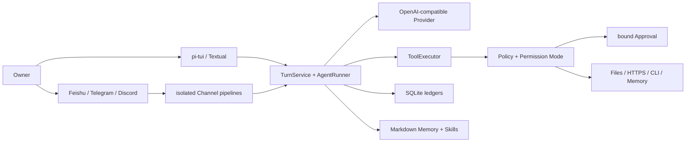

<div align="center">

# MiniClaw

**A small, complete, private-by-default personal agent you can self-host.**

[简体中文](README.md) · [English](README_EN.md)

[](pyproject.toml)
[](tui/package.json)
[](pyproject.toml)
[](docs/progress/index.html)
[](LICENSE)

[Why MiniClaw](#why-miniclaw) · [Capabilities](#current-capabilities) · [Quick start](#quick-start) · [Gallery](#product-gallery) · [Architecture](#how-it-works) · [Roadmap](#roadmap) · [Docs](#documentation)

</div>


MiniClaw brings the model, tools, permissions, approvals, persistence, and multiple messaging channels into one local Core. The same agent is available through its TUI, Feishu, Telegram, and Discord, while every local action still passes through a shared Policy, workspace boundary, and auditable execution path.

> [!IMPORTANT]
> The repository has passed the Phase 5 local implementation gates. Feishu now carries a normal answer in one `Claw Trail` Agent Card, while configurations without `tools.mode` default to Owner-scoped `AUTOPILOT` without weakening hard safety boundaries. Full live acceptance remains evidence-specific for each messaging platform. Memory is currently the manual, approval-based v1; Memory Autopilot has an approved design and an A–E implementation plan, but **has not been implemented**. This README keeps current behavior separate from planned work.
> The v0.5.3 Core also includes SDK log redaction, Gateway lease/provenance, managed Live Runners, and recovery from orphaned Tool history. Strict Feishu/Discord 15/15 evidence is still pending.

## Why MiniClaw

| Goal | MiniClaw's choice |
| --- | --- |
| Private and controlled | State, conversations, approvals, and audit stay local; secrets do not enter prompts, logs, or Memory. |
| Small but complete | One Python Core, one primary TUI, and one OpenAI-compatible Provider before adding services. |
| Able to act | Ten built-in tools cover system information, files, search, HTTPS, exact-argv CLIs, and Memory. |
| Explainable by default | Turn, ToolRun, Approval, Delivery, and Channel Inbox/Outbox state is persisted in SQLite. |
| One Core, many entry points | TUI, Feishu, Telegram, and Discord reuse one `AgentRuntime`; transports and failure domains stay isolated. |
| Evidence before expansion | Python and TypeScript tests, versioned Agent/Channel cases, 20-round soak, and docs validation gate changes. |

MiniClaw is not a chat box wired directly to a shell. The model proposes a Tool Call; the Core validates its schema, decides risk, binds approvals, executes, audits, and recovers.

## Current capabilities

| Layer | Implemented today |
| --- | --- |
| Agent Loop | OpenAI-compatible streaming, Tool Loop, token/latency telemetry, normalized errors, and context compaction. |
| TUI | pi-tui by default, Chinese/English UI, streaming turns, Tool status, compact approval cards, four permission modes, Textual fallback. |
| Tools | `system_info`, `read_file`, `write_file`, `edit_file`, `glob`, `grep`, `http_get`, `run_command`, `read_memory`, `propose_memory`. |
| Safety | Workspace Guard, hard-denied sensitive paths, exact argv, minimal child environment, HTTPS/DNS/SSRF validation, parameter-bound approvals. |
| Channels | Feishu uses one `Claw Trail` Agent Card for redacted progress, Tool state, and the final answer; all three platforms keep isolated Transport/Delivery/Manager/queue/recovery pipelines while sharing one Agent Runtime. |
| Data | SQLite Session/Message/Turn/ToolRun/Approval/Channel ledgers; owner-only Markdown Memory and Skills. |
| Operations | `init`, `doctor`, `gateway`, redacted structured logs, idempotent recovery, offline Eval, and versioned Channel gates. |

### Permission modes

- `SAFE`: read-only low-risk actions run automatically; other actions are approved or denied by Policy.
- `SMART`: exact rules and safe HTTPS targets reduce interruptions; misses remain supervised.
- `AUTOPILOT`: non-critical actions from a verified Owner may run automatically; hard boundaries, validation, and audit remain active.
- `YOLO`: least supervision; it still cannot disable sensitive-path, SSRF, workspace, or critical-action hard boundaries.

New installations and older configurations without `tools.mode` default to `autopilot`; explicit `safe` and `smart` settings remain unchanged. This default trusts only the local entry point and verified Owner direct messages. Groups and other users are automatically downgraded.

## Quick start

### Requirements

- Python 3.12+
- [uv](https://docs.astral.sh/uv/)
- Node.js 22.19+ and pnpm for the default pi-tui
- An OpenAI-compatible model endpoint; the default model is `deepseek-v4-pro`

### Install and run

```bash
git clone https://github.com/NEDONION/miniclaw.git
cd miniclaw

uv sync --extra dev --extra channels
pnpm --dir tui install
pnpm --dir tui build

cp .env.example .env
# Set MINICLAW_MODEL_API_KEY locally. Never commit .env.

uv run miniclaw init
uv run miniclaw doctor
uv run miniclaw
```

The default state home is `~/.miniclaw`; the default workspace is `~/.miniclaw/workspace`. To create an isolated instance:

```bash
uv run miniclaw --home /absolute/path/to/demo-home init
uv run miniclaw --home /absolute/path/to/demo-home
```

If a suitable Node.js runtime is not available, select the migration fallback explicitly:

```bash
MINICLAW_TUI=textual uv run miniclaw
```

### Main commands

| Command | Purpose |
| --- | --- |
| `uv run miniclaw` | Start the single primary TUI. |
| `uv run miniclaw init` | Idempotently initialize private state, config, Memory, Skills, and SQLite. |
| `uv run miniclaw doctor` | Diagnose config, directory permissions, Provider, TUI, and database state. |
| `uv run miniclaw gateway` | Start configured Feishu/Telegram/Discord gateways. |
| `uv run miniclaw eval validate --root evals/scenarios` | Validate versioned JSONL scenarios. |
| `uv run miniclaw eval run --suite offline --root evals/scenarios` | Run offline cases through the real Core/Policy/Tool/SQLite path. |
| `uv run miniclaw eval run --suite channel --repeat 20 --json --root evals/scenarios` | Run all Channel cases and the 20-round local soak. |

See the [local setup guide](docs/getting-started/20260807_本地运行指南.md) for Channel allowlists, Owner identities, and credentials.

## Product gallery

These three representative cases ran in Warp with a fresh isolated `MINICLAW_HOME`. A deterministic local endpoint supplied Provider responses so no real model quota was consumed. MiniClaw's TUI, Bridge, TurnService, Policy, ToolExecutor, SQLite, Approval, and Tool execution all used the real code path.

### 1. A complete TUI conversation


Chinese input and output, the application-side 32K context budget, tokens, iterations, and latency are visible in one view.

### 2. A permission request in SAFE mode


Before `run_command` executes, the approval card shows the normalized executable, exact argv, timeout, and four decisions. The command is still `requested` in this image and has not executed.

### 3. Completing a task with an external Git CLI


MiniClaw invokes `git status --short --branch` against an isolated repository using exact argv, then summarizes the real Tool result without shell-string interpolation.

## How it works



A typical local action follows this path:

1. The TUI or a Channel submits a message to the same `TurnService`.
2. `ContextBuilder` combines SOUL, USER, current Memory, Skills, and bounded history.
3. The Provider returns text or a Tool Call.
4. Tool schema validation runs before Policy decides allow, deny, or approval.
5. The Tool result is persisted as ToolRun/Audit and returned to the Agent Loop.
6. Turns, messages, approvals, and Channel deliveries remain recoverable and explainable after restart.

## Memory: current and planned

| Capability | Current Memory v1 | Memory Autopilot (planned) |
| --- | --- | --- |
| Source of truth | `MEMORY.md` plus today/yesterday daily Markdown | Accepted semantic Units remain Markdown truth |
| Writes | Explicit Owner request through `propose_memory` and Approval | Low-risk facts enter short-term automatically; explicit “remember” persists directly |
| Retrieval | Fixed long-term/today/recent context | Owner-scoped FTS5/CJK, evidence drill-down, strict budgets |
| Governance | Secret rejection plus size/path/permission protection | Promotion, review, conflict, correction, forget, expiry |
| Cross-channel | Session history is isolated and cannot recall across sessions | All four entry points share one Owner Memory Space |
| Privacy | Tool and Channel safety boundaries exist | Groups, non-Owners, and uncertain identities cannot access private recall |

Design and delivery references:

- [Memory Autopilot capability gap and architecture](docs/architecture/20260808_Memory-Autopilot能力Gap与重构架构.md)
- [Approved design spec](docs/superpowers/specs/2026-08-08-memory-autopilot-design.md)
- [Best practices and technology selection](docs/engineering/20260808_memory-autopilot-best-practices-and-technology-selection.md)
- [Memory A–E TDD implementation plan](docs/superpowers/plans/2026-08-09-memory-autopilot.md)

## Security boundaries

- Secrets never belong in the repository, ordinary logs, or Memory; common tokens, passwords, OTPs, Authorization values, and private keys are rejected at boundaries.
- File Tools can only access configured workspace/allowed roots; symlinks, path escapes, binary data, and oversized content fail closed.
- `run_command` accepts a program and argument array, uses `shell=False`, a minimal environment, fixed cwd, timeout, and output limits.
- `http_get` only reaches HTTPS targets that pass URL, DNS, port, and rebinding checks.
- Approvals bind Tool name, normalized argument hash, Owner, TTL, and available decisions; mutation, replay, and cross-Owner use are rejected.
- Channel allowlists, Owner mappings, idempotent Inbox/Outbox, isolated queues, and recovery states are controlled by Core rather than the model.
- Memory, Skills, and external content can provide context but cannot expand Policy authority.

Read the [system architecture](docs/architecture/20260807_系统架构.md) and [Phase 2 security design](docs/superpowers/specs/2026-08-07-phase-2-tools-security-design.md) for the complete threat model.

## Project status

| Gate | Current evidence |
| --- | --- |
| Python | 562/562 `unittest` PASS |
| TUI | 30/30 TypeScript tests and build PASS |
| Agent | 29/29 active offline cases PASS |
| Channel | 32/32 versioned cases PASS |
| Stability | 20 local Channel rounds, 640/640 PASS |
| Feishu | OWNER-DM DELIVERY VERIFIED / 15-CASE LIVE PENDING |
| Telegram / Discord | Implementation PASS; real-platform Live Gates pending |
| Memory Autopilot | APPROVED DESIGN + A–E PLAN; NOT IMPLEMENTED |

Fake SDKs, offline scenarios, and the 640/640 local soak only establish **IMPLEMENTATION PASS**. They never masquerade as a live-platform PASS. Historical evidence lives under [`docs/evals/releases/`](docs/evals/releases/).

### Verification

```bash
uv run python -m unittest discover -s tests -v
pnpm --dir tui test
pnpm --dir tui build
uv run ruff check .
uv run miniclaw eval run --suite channel --repeat 20 --json --root evals/scenarios
uv run python scripts/validate_docs.py
git diff --check
```

## Roadmap


Owner-scoped `AUTOPILOT`, the Feishu `Claw Trail` Agent Card, and v0.5.3 Core hardening are now implemented. The immediate evidence work is to close the strict Feishu/Discord Live Gate; the next feature implementation is Memory A–E, followed by autonomous tasks. Roadmap nodes do not imply that their code already exists.

## Repository layout

```text
src/miniclaw/
├── agent/       # Context, Runner, Turn, Compaction
├── channels/    # Feishu / Telegram / Discord adapters and pipelines
├── memory/      # current owner-only Markdown Memory v1
├── policy/      # Workspace, Command, Network, Permission, Approval
├── providers/   # OpenAI-compatible Provider
├── storage/     # SQLite schema, repositories, migrations
├── tools/       # ten built-in Tools
└── tui/         # Textual fallback; default pi-tui lives in repository tui/

tui/             # Node.js pi-tui and Python Bridge client
evals/           # versioned Agent / Channel scenarios
docs/            # product, architecture, engineering, plans, evidence, progress
tests/           # Python unittest suite
```

## Documentation

| Entry point | Read this for |
| --- | --- |
| [Documentation center](docs/README.md) | Complete index and recommended reading order |
| [Product requirements](docs/product/20260807_产品需求文档.md) | Scope, non-goals, and acceptance criteria |
| [System architecture](docs/architecture/20260807_系统架构.md) | Module boundaries, data flow, and safety principles |
| [Local setup guide](docs/getting-started/20260807_本地运行指南.md) | Installation, config, TUI, Gateway, troubleshooting |
| [Engineering index](docs/engineering/README.md) | Implemented modules versus planned designs |
| [Development timeline](docs/engineering/20260809_development-timeline.md) | Mapping between architecture phases, delivery versions, and evidence states |
| [Progress page](docs/progress/index.html) | Current phase, evidence, and next work |
| [OpenClaw / Hermes gap](docs/architecture/20260808_OpenClaw-Hermes能力Gap与演进路线.md) | The v0.5.3 evidence → Memory A–E → Phase 6–9 roadmap |
| [Capability-alignment engineering roadmap](docs/engineering/20260808_openclaw-hermes-alignment-engineering-roadmap.md) | Module, data, and test boundaries for future deliveries |
| [Memory A–E plan](docs/superpowers/plans/2026-08-09-memory-autopilot.md) | Executable RED→GREEN delivery plan |

## Contributing

Issues and pull requests are welcome. Read [AGENTS.md](AGENTS.md) and the [documentation center](docs/README.md) first. Keep changes focused, tests offline and repeatable, and never describe planned behavior as implemented.

```bash
uv sync --extra dev
uv run python -m unittest discover -s tests -v
uv run ruff check .
```

## License

[MIT](LICENSE)
