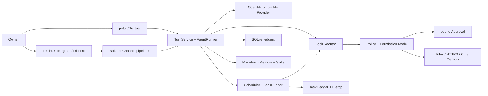

<div align="center">

# MiniClaw

**A small, complete, private-by-default personal agent you can self-host.**

[简体中文](README.md) · [English](README_EN.md)

[](pyproject.toml)
[](tui/package.json)
[](pyproject.toml)
[](docs/progress/index.html)
[](LICENSE)

[Why MiniClaw](#why-miniclaw) · [Capabilities](#current-capabilities) · [Quick start](#quick-start) · [Gallery](#product-gallery) · [Architecture](#how-it-works) · [Roadmap](#roadmap) · [Docs](#documentation)

</div>


MiniClaw brings the model, tools, permissions, approvals, persistence, and multiple messaging channels into one local Core. The same agent is available through its TUI, Feishu, Telegram, and Discord, while every local action still passes through a shared Policy, workspace boundary, and auditable execution path.

> [!IMPORTANT]
> The repository has passed the Phase 6.5 local implementation gates. Feishu now carries a normal answer in one `Claw Trail` Agent Card, while configurations without `tools.mode` default to Owner-scoped `AUTOPILOT` without weakening hard safety boundaries. The v0.5.3 Core also includes SDK log redaction, Gateway lease/provenance, managed Live Runners, and recovery from orphaned Tool history. Card callbacks are bound to the unique sent receipt, account, and Approval ID; a real one-time approval completed its Tool, child Turn, and result Delivery. The exact status is **TARGETED CALLBACK LIVE VERIFIED / 15-CASE LIVE PENDING**. Memory Autopilot A–E is implemented locally. Phase 6 adds durable Tasks, Scheduler/Runner, E-stop, budgets, Approval continuation, proactive Delivery, immutable Docker/Seatbelt plans, Checkpoints, Rollback, and a 15-case Automation gate. The macOS + Feishu production orchestrator and exact-duration checkpoint are implemented, but the status remains **IMPLEMENTATION PASS / PRODUCTION SOAK PENDING** until the same clean commit passes Seatbelt 2/2, Feishu 15/15, Automation 10/10, managed recovery, and 24 continuous hours. Phase 6.5 adds a dedicated Chromium Profile, bounded snapshots/refs, eight policy-gated Browser Tools, and private screenshot/download Artifacts. Browser automation remains disabled by default and its controlled public live smoke is pending.

## Why MiniClaw

| Goal | MiniClaw's choice |
| --- | --- |
| Private and controlled | State, conversations, approvals, and audit stay local; secrets do not enter prompts, logs, or Memory. |
| Small but complete | One Python Core, one primary TUI, and one OpenAI-compatible Provider before adding services. |
| Able to act | Eighteen Core tools cover the machine and Memory; enabling Browser adds eight isolated web tools. |
| Explainable by default | Turn, ToolRun, Approval, Delivery, and Channel Inbox/Outbox state is persisted in SQLite. |
| One Core, many entry points | TUI, Feishu, Telegram, and Discord reuse one `AgentRuntime`; transports and failure domains stay isolated. |
| Evidence before expansion | Python and TypeScript tests, versioned Agent/Channel cases, 20-round soak, and docs validation gate changes. |

MiniClaw is not a chat box wired directly to a shell. The model proposes a Tool Call; the Core validates its schema, decides risk, binds approvals, executes, audits, and recovers.

## Current capabilities

| Layer | Implemented today |
| --- | --- |
| Agent Loop | OpenAI-compatible streaming, Tool Loop, token/latency telemetry, normalized errors, and context compaction. |
| TUI | pi-tui by default, Chinese/English UI, streaming turns, Tool status, compact approval cards, four permission modes, Textual fallback. |
| Tools | System, files, search, HTTPS, exact-argv CLI, plus remember/search/get/list/flush/forget/correct/review Memory surfaces. |
| Safety | Workspace Guard, hard-denied sensitive paths, exact argv, minimal child environment, HTTPS/DNS/SSRF validation, parameter-bound approvals. |
| Channels | Feishu uses one `Claw Trail` Agent Card for redacted progress, Tool state, and the final answer; all three platforms keep isolated Transport/Delivery/Manager/queue/recovery pipelines while sharing one Agent Runtime. |
| Data | SQLite Session/Message/Turn/ToolRun/Approval/Channel/Memory control plane; owner-only Markdown Truth and Skills. |
| Automation | One-shot/interval/cron, durable TaskRuns, E-stop, budgets, Heartbeat, Approval continuation, and idempotent proactive Delivery. |
| Sandbox | Immutable ExecutionPlans, fail-closed Docker/Seatbelt backends, Checkpoint CAS, and conflict-aware Rollback. |
| Browser | Dedicated Chromium Profile, bounded snapshots/opaque refs, action approvals, and private screenshot/download Artifacts. |
| Operations | `init`, `doctor`, `gateway`, the `task` control plane, Memory rebuild, redacted logs, idempotent recovery, and versioned Eval gates. |

### Permission modes

- `SAFE`: read-only low-risk actions run automatically; other actions are approved or denied by Policy.
- `SMART`: exact rules and safe HTTPS targets reduce interruptions; misses remain supervised.
- `AUTOPILOT`: non-critical actions from a verified Owner may run automatically; hard boundaries, validation, and audit remain active.
- `YOLO`: least supervision; it still cannot disable sensitive-path, SSRF, workspace, or critical-action hard boundaries.

New installations and older configurations without `tools.mode` default to `autopilot`; explicit `safe` and `smart` settings remain unchanged. This default trusts only the local entry point and verified Owner direct messages. Groups and other users are automatically downgraded.

## Quick start

### Requirements

- Python 3.12+
- [uv](https://docs.astral.sh/uv/)
- Node.js 22.19+ and pnpm for the default pi-tui
- Chrome/Chromium and Playwright when Browser Agent is enabled
- An OpenAI-compatible model endpoint; the default model is `deepseek-v4-pro`

### Install and run

```bash
git clone https://github.com/NEDONION/miniclaw.git
cd miniclaw

uv sync --extra dev --extra channels
pnpm --dir tui install
pnpm --dir tui build
pnpm --dir browser-worker install
pnpm --dir browser-worker build

cp .env.example .env
# Set MINICLAW_MODEL_API_KEY locally. Never commit .env.

uv run miniclaw init
uv run miniclaw doctor
uv run miniclaw
```

The default state home is `~/.miniclaw`; the default workspace is `~/.miniclaw/workspace`. To create an isolated instance:

```bash
uv run miniclaw --home /absolute/path/to/demo-home init
uv run miniclaw --home /absolute/path/to/demo-home
```

If a suitable Node.js runtime is not available, select the migration fallback explicitly:

```bash
MINICLAW_TUI=textual uv run miniclaw
```

### Main commands

| Command | Purpose |
| --- | --- |
| `uv run miniclaw` | Start the single primary TUI. |
| `uv run miniclaw init` | Idempotently initialize private state, config, Memory, Skills, and SQLite. |
| `uv run miniclaw doctor` | Diagnose config, directory permissions, Provider, TUI, and database state. |
| `uv run miniclaw gateway` | Start configured Feishu/Telegram/Discord gateways. |
| `uv run miniclaw task list` | Inspect durable tasks; `show/runs/pause/resume/run/cancel/halt/unhalt` provide the control plane. |
| `uv run miniclaw eval validate --root evals/scenarios` | Validate versioned JSONL scenarios. |
| `uv run miniclaw eval run --suite offline --root evals/scenarios` | Run offline cases through the real Core/Policy/Tool/SQLite path. |
| `uv run miniclaw eval run --suite channel --repeat 20 --json --root evals/scenarios` | Run all Channel cases and the 20-round local soak. |
| `uv run miniclaw eval run --suite automation --repeat 20 --json --root evals/scenarios` | Run the 15 Phase 6 Automation cases and 20-round soak. |
| `uv run miniclaw eval run --suite browser --repeat 20 --json --root evals/scenarios` | Run the 18 Phase 6.5 Browser cases and 20-round soak. |

See the [local setup guide](docs/getting-started/20260807_本地运行指南.md) for Channel allowlists, Owner identities, and credentials.

## Product gallery

These three representative cases ran in Warp with a fresh isolated `MINICLAW_HOME`. A deterministic local endpoint supplied Provider responses so no real model quota was consumed. MiniClaw's TUI, Bridge, TurnService, Policy, ToolExecutor, SQLite, Approval, and Tool execution all used the real code path.

### 1. A complete TUI conversation


Chinese input and output, the application-side 32K context budget, tokens, iterations, and latency are visible in one view.

### 2. A permission request in SAFE mode


Before `run_command` executes, the approval card shows the normalized executable, exact argv, timeout, and four decisions. The command is still `requested` in this image and has not executed.

### 3. Completing a task with an external Git CLI


MiniClaw invokes `git status --short --branch` against an isolated repository using exact argv, then summarizes the real Tool result without shell-string interpolation.

## How it works



A typical local action follows this path:

1. The TUI or a Channel submits a message to the same `TurnService`.
2. `ContextBuilder` combines SOUL, USER, current Memory, Skills, and bounded history.
3. The Provider returns text or a Tool Call.
4. Tool schema validation runs before Policy decides allow, deny, or approval.
5. The Tool result is persisted as ToolRun/Audit and returned to the Agent Loop.
6. Turns, messages, approvals, and Channel deliveries remain recoverable and explainable after restart.

## Memory Autopilot: implemented hybrid architecture

| Capability | Current implementation |
| --- | --- |
| Source of truth | Accepted Units live in `memory/owners/<owner>/memory.md`; SQLite projections are rebuildable |
| Writes | Normal turns capture asynchronously; explicit “remember” succeeds only after atomic persistence |
| Retrieval | Owner-scoped FTS5/CJK, complete source chains, validity filters, fixed Recall budget |
| Governance | Short-term, repeat promotion, review, conflict, correction, forget, TTL, weekly review |
| Cross-channel | Verified Owner DMs across TUI, Feishu, Telegram, and Discord share one Memory Space |
| Privacy | Groups, non-Owners, and uncertain/conflicting identities fail closed; secrets are rejected before Candidate persistence |
| Maintenance | Direct-edit reconciliation, `/memory rebuild`, read-only hash-based legacy import, Doctor drift checks |

Architecture, implementation, and evidence references:

- [Memory Autopilot capability gap and architecture](docs/architecture/20260808_Memory-Autopilot能力Gap与重构架构.md)
- [Approved design spec](docs/superpowers/specs/2026-08-08-memory-autopilot-design.md)
- [Best practices and technology selection](docs/engineering/20260808_memory-autopilot-best-practices-and-technology-selection.md)
- [Memory A–E TDD implementation plan](docs/superpowers/plans/2026-08-09-memory-autopilot.md)
- [Memory Autopilot engineering implementation](docs/engineering/phase-5/20260809_memory-autopilot.md)
- [v0.6.0 release evidence](docs/evals/releases/v0.6.0.md)

## Phase 6: autonomy with hard controls

Phase 6 lets a long-running Gateway execute bounded background work without handing control to the model:

- the SQLite Task Ledger freezes Task/Run snapshots and the Scheduler enqueues due slots idempotently;
- each Run gets a fresh Automation Session, fixed Tool profile, and wall-clock/turn/tool/token/cost budgets;
- Automation cannot expose `manage_task`; only the `complete_task` terminal Tool can declare success;
- dangerous Tools still require a human Approval bound to canonical arguments and ExecutionPlan hash;
- durable E-stop, lease recovery, idempotent Channel Delivery, and Heartbeat reuse the existing Runtime;
- Docker/Seatbelt fail closed instead of falling back to Host; bounded Checkpoints precede file side effects, and Rollback requires a preview hash.

Both `automation.enabled` and `heartbeat.enabled` default to false. Heartbeat currently has no Owner IM route, Checkpoints cover
only the primary Workspace, and Rollback has no CLI/TUI yet. See the
[Autonomy Runtime](docs/engineering/phase-6/20260809_autonomy-runtime.md),
[Sandbox and Checkpoint](docs/engineering/phase-6/20260809_sandbox-and-checkpoint.md), and
[v0.7.0 release evidence](docs/evals/releases/v0.7.0.md).

## Phase 6.5: isolated Browser Agent

Browser is disabled by default. When enabled, one Runtime owns one TypeScript Worker and one dedicated MiniClaw Chromium
Profile. The model can only request eight closed actions: open, snapshot, click, type, press, scroll, screenshot, and close.
It cannot execute arbitrary JavaScript, read a personal Chrome Profile, export cookies, or type passwords and OTPs.

Page content keeps `untrusted_web_content` provenance. Click and Enter/Space use parameter-bound Approval; public HTTPS and
redirects reuse the SSRF Policy; screenshots and downloads return only private Artifact IDs. The exact status is
**IMPLEMENTATION PASS / CONTROLLED LIVE SMOKE PENDING**. See the
[Browser engineering guide](docs/engineering/phase-6/browser-agent.md) and
[v0.6.5 evidence](docs/evals/releases/v0.6.5.md).

## Security boundaries

- Secrets never belong in the repository, ordinary logs, or Memory; common tokens, passwords, OTPs, Authorization values, and private keys are rejected at boundaries.
- File Tools can only access configured workspace/allowed roots; symlinks, path escapes, binary data, and oversized content fail closed.
- `run_command` accepts a program and argument array, uses `shell=False`, a minimal environment, fixed cwd, timeout, and output limits.
- `http_get` only reaches HTTPS targets that pass URL, DNS, port, and rebinding checks.
- Approvals bind Tool name, normalized argument hash, Owner, TTL, and available decisions; mutation, replay, and cross-Owner use are rejected.
- Channel allowlists, Owner mappings, idempotent Inbox/Outbox, isolated queues, and recovery states are controlled by Core rather than the model.
- Memory, Skills, and external content can provide context but cannot expand Policy authority.

Read the [system architecture](docs/architecture/20260807_系统架构.md) and [Phase 2 security design](docs/superpowers/specs/2026-08-07-phase-2-tools-security-design.md) for the complete threat model.

## Project status

| Gate | Current evidence |
| --- | --- |
| Python | 1005/1005 `unittest` PASS |
| TUI | 36/36 TypeScript tests and build PASS |
| Browser Worker | 14/14 TypeScript + real headless Chrome tests PASS |
| Agent | 39/39 active offline cases PASS, including `MEM-AUTO-001..010` |
| Channel | 33/33 versioned cases PASS |
| Stability | 20 local Channel rounds, 660/660 PASS |
| Automation | 15/15 versioned cases; 20 rounds, 300/300 PASS |
| Browser | 18/18 versioned cases; 20 rounds, 360/360 PASS; controlled live smoke pending |
| Feishu | TARGETED CALLBACK LIVE VERIFIED / 15-CASE LIVE PENDING |
| Telegram / Discord | Implementation PASS; real-platform Live Gates pending |
| Memory Autopilot | A–E IMPLEMENTATION PASS; live conclusions remain platform-specific |
| Phase 6 | **IMPLEMENTATION PASS / PRODUCTION SOAK PENDING**; production tooling is complete, strict 25-case and 24h evidence are pending |

Fake SDKs, offline scenarios, and the 660/660 local soak only establish **IMPLEMENTATION PASS**. They never masquerade as a live-platform PASS. Historical evidence lives under [`docs/evals/releases/`](docs/evals/releases/).
The pre-Memory Phase 5 historical baseline was 562 Python, 30 TypeScript, and 29/29 Agent. Memory v0.6.0 recorded 666 Python tests and Phase 6 recorded 798; current figures are in the table above and v0.6.5.

### Verification

```bash
uv run python -m unittest discover -s tests -v
pnpm --dir tui test
pnpm --dir tui build
pnpm --dir browser-worker test
pnpm --dir browser-worker build
uv run ruff check .
uv run miniclaw eval run --suite channel --repeat 20 --json --root evals/scenarios
uv run miniclaw eval run --suite automation --repeat 20 --json --root evals/scenarios
uv run miniclaw eval run --suite browser --repeat 20 --json --root evals/scenarios
uv run python scripts/validate_docs.py
git diff --check
```

## Roadmap


Owner-scoped `AUTOPILOT`, the Feishu `Claw Trail` Agent Card, v0.5.3 Core hardening, Memory A–E, Phase 6 Autonomy/Sandbox, and Phase 6.5 Browser Agent are implemented. The next capability is **Phase 7 Controlled Evolution**; Browser live smoke and strict Feishu/Discord Live Evidence remain independent parallel gates.

## Repository layout

```text
src/miniclaw/
├── agent/       # Context, Runner, Turn, Compaction
├── automation/  # Task Ledger, Scheduler, Runner, Heartbeat, Delivery
├── artifacts/   # private Browser screenshot/download CAS and TTL
├── browser/     # Worker Client, protocol models, discovery, action Policy
├── checkpoints/ # bounded CAS and conflict-aware Rollback
├── channels/    # Feishu / Telegram / Discord adapters and pipelines
├── memory/      # Markdown Truth, buffer/flush, FTS5, governance, reconcile, migration
├── policy/      # Workspace, Command, Network, Permission, Approval
├── providers/   # OpenAI-compatible Provider
├── sandbox/     # immutable Plans and Host/Docker/Seatbelt backends
├── storage/     # SQLite schema, repositories, migrations
├── tools/       # eighteen Core Tools plus eight optional Browser Tools
└── tui/         # Textual fallback; default pi-tui lives in repository tui/

tui/             # Node.js pi-tui and Python Bridge client
browser-worker/  # TypeScript Playwright/Chromium isolation Worker
evals/           # versioned Agent / Channel / Automation / Browser scenarios
docs/            # product, architecture, engineering, plans, evidence, progress
tests/           # Python unittest suite
```

## Documentation

| Entry point | Read this for |
| --- | --- |
| [Documentation center](docs/README.md) | Complete index and recommended reading order |
| [Product requirements](docs/product/20260807_产品需求文档.md) | Scope, non-goals, and acceptance criteria |
| [System architecture](docs/architecture/20260807_系统架构.md) | Module boundaries, data flow, and safety principles |
| [Local setup guide](docs/getting-started/20260807_本地运行指南.md) | Installation, config, TUI, Gateway, troubleshooting |
| [Engineering index](docs/engineering/README.md) | Implemented modules versus planned designs |
| [Development timeline](docs/engineering/20260809_development-timeline.md) | Mapping between architecture phases, delivery versions, and evidence states |
| [Progress page](docs/progress/index.html) | Current phase, evidence, and next work |
| [OpenClaw / Hermes gap](docs/architecture/20260808_OpenClaw-Hermes能力Gap与演进路线.md) | The v0.5.3 evidence → Memory A–E → Phase 6–9 roadmap |
| [Capability-alignment engineering roadmap](docs/engineering/20260808_openclaw-hermes-alignment-engineering-roadmap.md) | Module, data, and test boundaries for future deliveries |
| [Memory A–E plan](docs/superpowers/plans/2026-08-09-memory-autopilot.md) | Executable RED→GREEN delivery plan |
| [Memory Autopilot implementation](docs/engineering/phase-5/20260809_memory-autopilot.md) | Current data flow, safety boundaries, recovery, and operations |
| [Phase 6 Autonomy Runtime](docs/engineering/phase-6/20260809_autonomy-runtime.md) | Tasks, Scheduler/Runner, Heartbeat, budgets, recovery, and operations |
| [Phase 6 Sandbox and Checkpoint](docs/engineering/phase-6/20260809_sandbox-and-checkpoint.md) | Plan/Approval binding, isolation backends, Checkpoints, and Rollback |
| [Phase 6.5 Browser Agent](docs/engineering/phase-6/browser-agent.md) | Dedicated Profile, snapshot/ref, Policy, Artifacts, recovery, and 18-case gate |
| [Phase 6 macOS + Feishu production acceptance](docs/engineering/phase-6/20260810_macos-feishu-production-acceptance.md) | Managed LaunchAgent, 25 live cases, recovery, exact 24h soak, and Evidence runbook |

## Contributing

Issues and pull requests are welcome. Read [AGENTS.md](AGENTS.md) and the [documentation center](docs/README.md) first. Keep changes focused, tests offline and repeatable, and never describe planned behavior as implemented.

```bash
uv sync --extra dev
uv run python -m unittest discover -s tests -v
uv run ruff check .
```

## License

[MIT](LICENSE)
