# MiniClaw 系统架构

## 当前状态

当前代码完成 Phase 5 implementation，并以版本化 NDJSON 接入默认 TypeScript pi-tui；Textual 保留为
onboarding/fallback。当前是单用户、单 Provider、单 SQLite 的 Python Agent Core，已实现十个
系统/文件/命令/HTTPS/Memory Tool、参数绑定 Approval、waiting/child Turn 续跑、Markdown Memory、Skills
惰性激活、persistent compaction、离线 Agent 回归，以及飞书 WebSocket、durable Inbox/Outbox、Channel Worker、
Typing/安全进度卡、审批 fallback、脱敏结构化日志/Audit、四档权限与 Owner 私聊信任，以及飞书/Telegram/Discord
共享 Runtime 的 Gateway。Phase 5.1 已增加 15 条 Feishu Live 场景、
有界 production Gateway Runner、只读 SQLite evidence 与严格脱敏报告；任意 Shell、向量检索和自动演进尚未实现。
飞书专用企业应用、机器人、Scope、Owner allowlist 和 WebSocket 已真实配置；两条 Owner 私聊已完成真实
Inbox → Agent → Outbox → Delivery 闭环。完整 15-case、群聊、审批、断网恢复和常驻 soak 仍待执行。

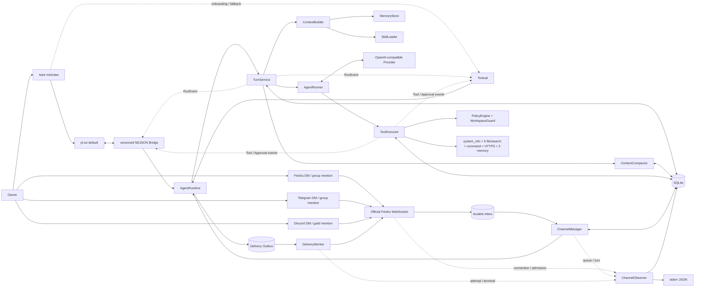

## 入口边界

人类对话入口只有一个：

```bash
uv run miniclaw
```

保留的 `init`、`doctor`、`eval` 是维护和质量门禁；`gateway` 是同一 Core 的长期 Channel 宿主，不实现另一套
Agent Loop。旧 `chat`、`tui`、
`chat --message`、`approvals` 命令已删除。

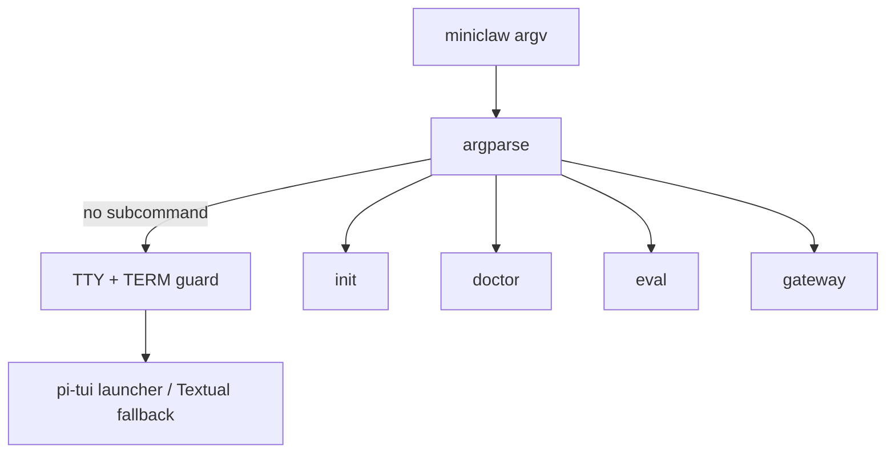

## AgentRuntime

`src/miniclaw/runtime.py` 是生产 Agent 的唯一装配点。它创建并拥有：

- 当前 Owner ID；
- 一个 `OpenAICompatibleProvider`；
- 一个 `TurnService`；
- 一个带 ApprovalRepository 的 `ToolExecutor`；
- 一个 `MemoryStore`、`SkillLoader` 和 `ContextCompactor`；
- 一个进程级 `PermissionState`，供 TUI 与三个 Channel 共享；
- 配置允许且已实现的 Tool；
- TUI `/tools` 使用的稳定 ToolDefinition 列表。

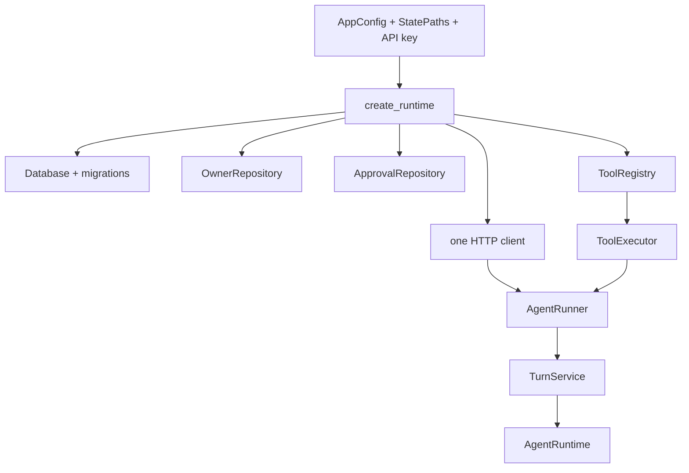

当前 Registry 稳定暴露：`edit_file`、`glob`、`grep`、`http_get`、`propose_memory`、`read_file`、
`read_memory`、`run_command`、`system_info`、`write_file`。

## 一条普通消息

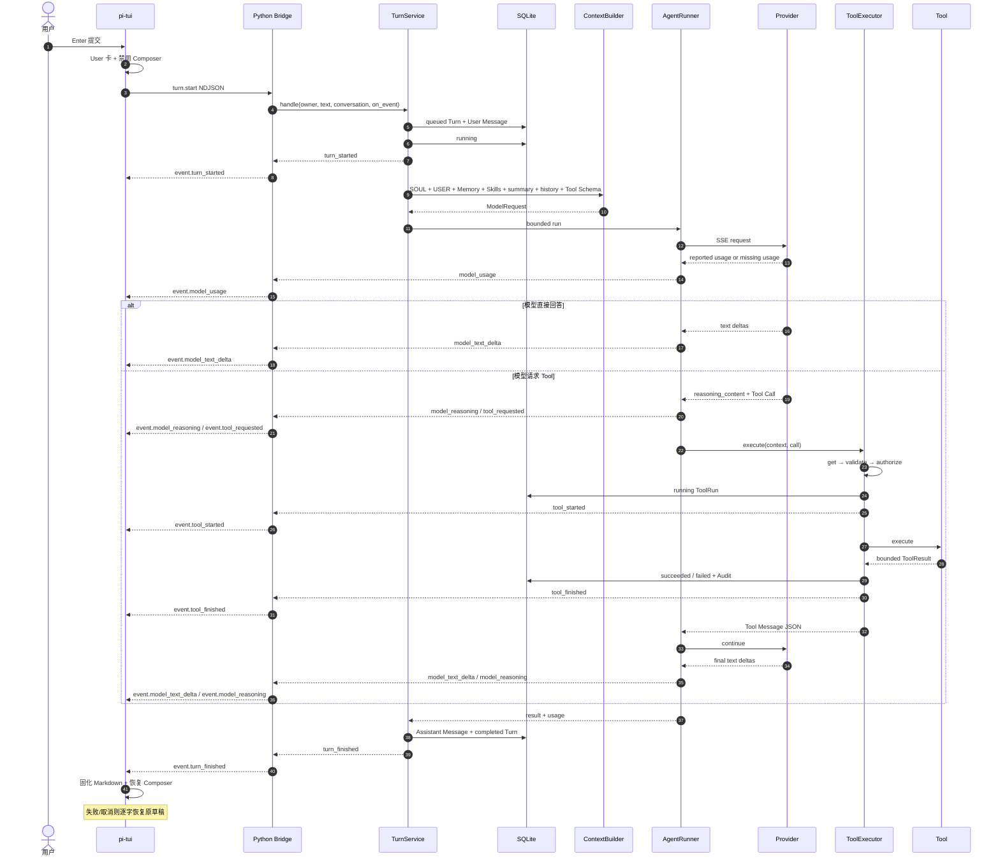

所有 Tool 都经过 Registry → validate → Policy → ToolRun → execute → terminal Audit。Policy DENY 不创建
ToolRun，但必须先写入不含原始参数的脱敏拒绝审计。

## Autopilot 权限与入口信任

Python Core 持有唯一 `PermissionState`，值为 `safe / smart / autopilot / yolo`。模式不是 Policy 的替代品：
WorkspaceGuard、敏感路径、exact argv、命令硬禁止、HTTPS/DNS/SSRF 和资源预算始终先执行，模式只决定通过硬校验后
是自动执行还是创建 Approval。

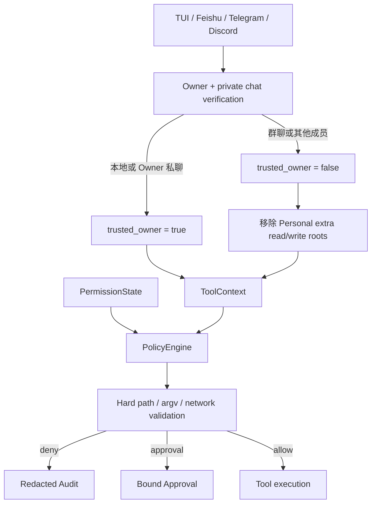

本地 Bridge 绑定 SQLite Owner。Channel 只有配置的 Owner 外部 ID 且 `chat_type=p2p` 时才传播 trusted 标记；
Owner 在群聊中也会降级。`/permissions` 在 TUI 通过 NDJSON `permissions.set` 切换，在 IM 中只由 Owner 私聊控制，
不会进入模型。活动 Turn 或 pending Approval 存在时切换失败关闭。

新 Personal 配置显式从 `autopilot` 启动；旧配置没有 `tools.mode` 时按 `safe` 加载。模式变化写入
`policy.mode_changed` 脱敏审计，只保存 old/new/source。完整状态表、操作和回滚见
[Autopilot 权限与紧凑审批 UI](../engineering/phase-2/autopilot-permissions-and-approval-ui.md)。

## 写入审批与续跑

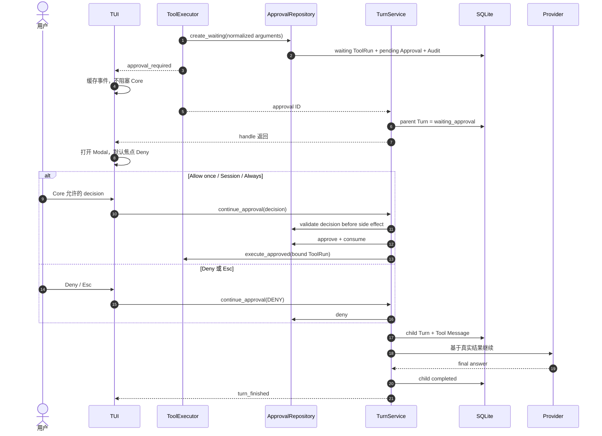

Approval 绑定 Tool 名、canonical JSON 参数与 SHA-256；Owner、TTL、状态和单次 consume 都由 SQLite 条件更新
校验。TUI 不是安全边界，它只展示 Core 的 `grant_modes`。Session/Always 规则只在 Tool 成功后应用；Session
留在当前 PolicyEngine，Always 只保存 exact argv 或 exact hostname + port。文件写入与 inline AppleScript
不能持久授权。pi-tui ApprovalDialog 最大 84 列、18 行，固定标题、风险提示和决策区，只滚动参数详情；外层
Overlay 不再用裁剪隐藏底部按钮。

## Memory、Skills 与 Compaction

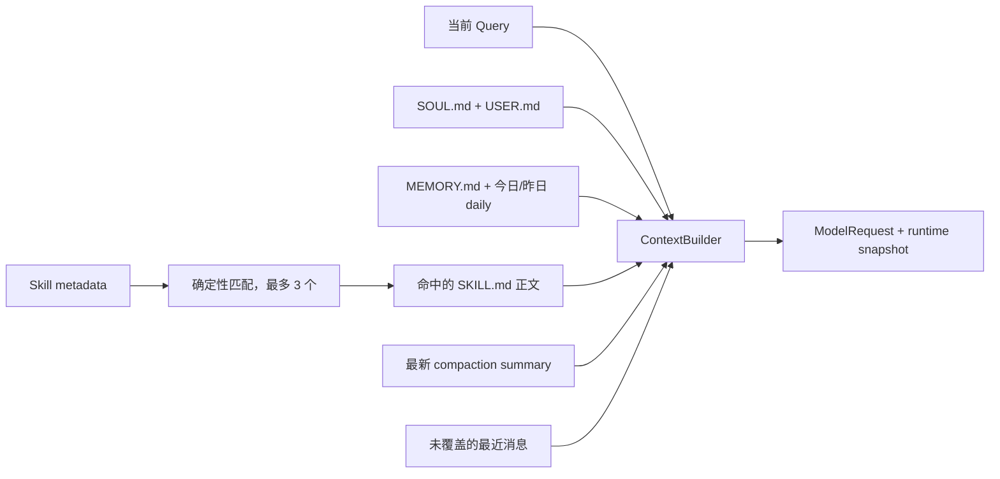

- `MEMORY.md` 是 Owner 可审阅的长期真相源；`propose_memory` 经审批后只追加当日 daily memory。
- Memory 读取限制 64 KiB，拒绝符号链接、非法 UTF-8 和常见凭据模式。
- Skill 启动时只扫描 metadata；当前 Query 命中后才加载正文，最多 3 个，且不执行 Skill 代码。
- Memory、Skill 与 compaction 的版本/内容哈希进入 Turn runtime snapshot，便于回放。
- 估算上下文达到配置预算 80% 时，`ContextCompactor` 用当前 Provider 总结最旧连续 Turn，保留最近两轮和
  waiting approval；summary 写入现有 `messages` 表，原消息不删除。
- 摘要失败时不写半成品，当前请求退化为有界最近历史继续运行。

## RunEvent 投影

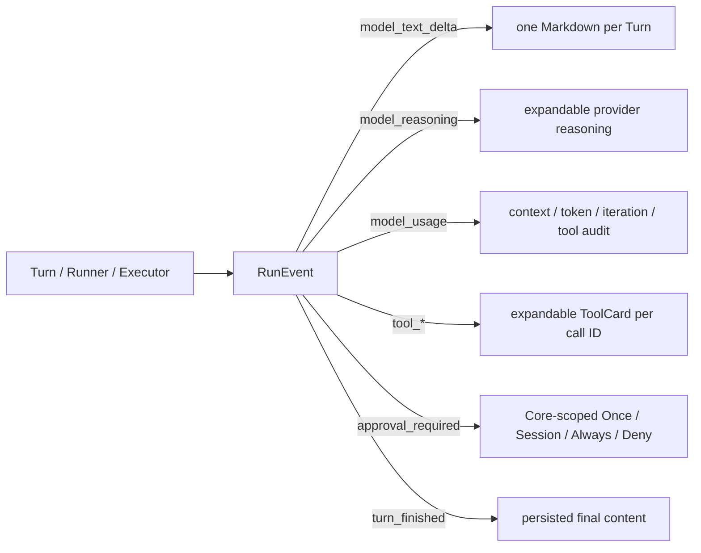

事件只在对应数据库迁移完成后发送。普通 UI handler 异常被隔离且日志不含 payload；取消异常继续传播。模型
和 Tool 输出先移除 ANSI、C0/C1 控制字符，Tool 结果预览限制 2,000 字符，折叠详情
限制 8,000 字符，Markdown 不自动打开链接。`model_reasoning` 只投影 Provider 明确返回的
`reasoning_content`，不生成或猜测隐藏思维链。Token 缺失显示 `N/A`，不估算。

## Turn 与 Approval 状态

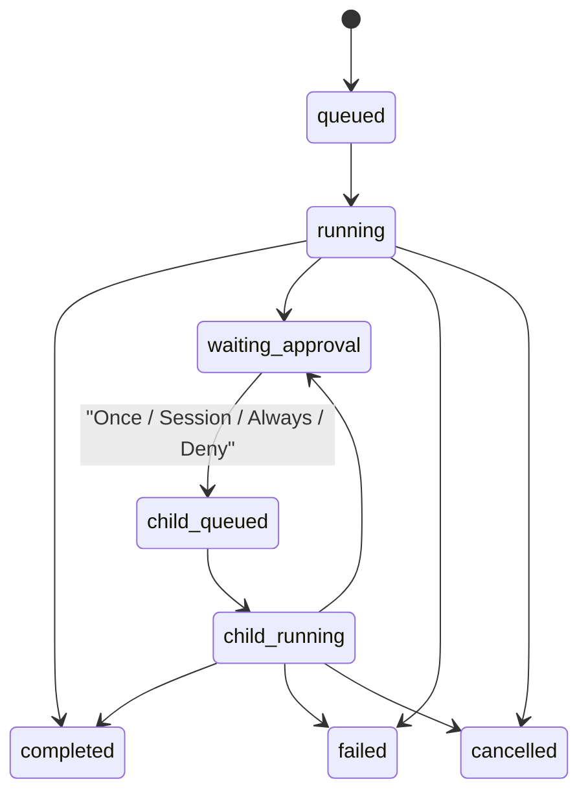

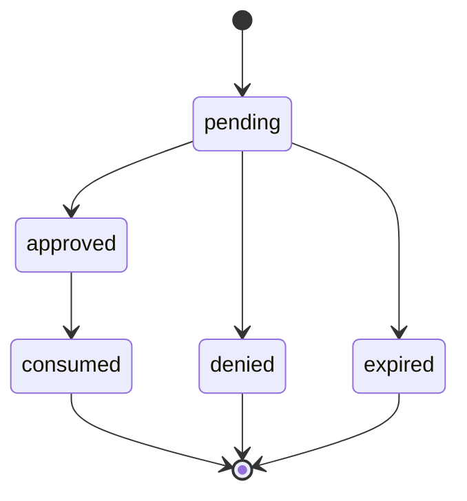

## 离线回归链路

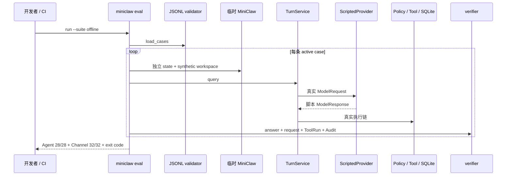

## 当前包布局

```text
src/miniclaw/
├── cli.py             # 裸 TUI 与 init/doctor/gateway/eval
├── tui_launcher.py    # Node 检测、默认 pi-tui 与 Textual fallback
├── bridge/            # NDJSON codec、Server 与内部 stdio 入口
├── gateway.py         # 三平台 single-runtime Supervisor 装配与信号生命周期
├── runtime.py         # 唯一生产装配
├── bootstrap.py       # 幂等初始化
├── config.py          # 严格 TOML / 环境覆盖
├── env.py             # 非执行 .env 解析
├── doctor.py          # 只读诊断
├── agent/
│   ├── context.py
│   ├── compaction.py
│   ├── events.py      # RunEvent
│   ├── runner.py
│   └── turn.py
├── tui/
│   └── app.py         # Textual fallback
├── channels/          # 三平台 Adapter/Transport、Supervisor、Worker、Delivery、Approval、Observer
├── providers/         # OpenAI-compatible HTTP/SSE
├── memory/            # Markdown Memory、安全追加与凭据过滤
├── policy/            # Profile 多根、敏感路径、CLI 发现、风险、Approval hash
├── skills/            # SKILL.md metadata 扫描与惰性激活
├── tools/             # 十个 Tool、Registry、Executor
├── storage/           # SQLite、Repository、ToolRun、Approval、Audit、Inbox/Outbox
└── evals/             # Agent/Channel JSONL、ScriptedProvider、verifier

tui/
├── src/               # TypeScript pi-tui、BridgeClient、State、Components
└── test/              # 协议、虚拟终端、长文本、选择、审批、跨进程回归
```

## 当前约束与下一阶段

- 单用户、一个 SQLite、一个活动 TUI Turn；默认终端链路是 Python launcher → Node UI → Python Core Bridge；
- TUI 要求真实 TTY，非交互 one-shot 已移除；
- TUI 默认中文，`/lang zh|en` 原地切换；按最新 User 消息选择中英文 System Prompt，约束 reasoning 语言；
- Provider usage 只做真实投影，失败/取消恢复当前内存草稿；
- Key 只存在于进程内存与认证 Header；
- 文件读取由 Workspace/Personal Profile 决定：Personal 可读 Home 普通文件与显式系统根，但 Keychain、浏览器
  登录库、私钥和应用凭据目录始终 fail closed；写入只进入 Workspace 与有限个人写根；是否审批由可信入口和
  `safe/smart/autopilot/yolo` 模式决定；
- `run_command` 已进入 Registry；只接受 exact argv，不解释 Shell 字符串；
- Personal 启动时确定性发现系统、NVM、uv、pnpm、local、Cargo 与 Bun executable roots；Policy 与执行器共享
  同一解析结果，不 source shell rc，不继承 API Key/Cookie/Proxy；
- `http_get` 已进入 Registry，并执行 HTTPS-only、全部 DNS 公网校验、固定 IP/TLS hostname 和有界文本读取；
- `read_memory` 与 `propose_memory` 已进入 Registry，后者只在参数绑定审批后追加 daily memory；
- `SKILL.md` 只按需加载 Markdown 指令，不能执行代码或绕过 Tool Policy；
- compaction summary 持久化在 SQLite，原始消息始终保留；
- 飞书、Telegram、Discord Channel 代码、脱敏 JSON/Audit 与 32 条离线回归已完成；Feishu 的 15 条真实场景与
  Runner 已实现，真实 Bot、凭据、权限、WebSocket ready 和 Owner DM Delivery 已验证；15/15 Evidence 尚未完成；
- 自我改进仍只具备离线回归地基，不能自动改 Prompt/Skill。

当前架构状态是 Phase 5 **IMPLEMENTATION PASS**：519 Python tests、30 TypeScript、28/28 Agent、32/32 Channel 与
640/640 local soak；Feishu 是 **FEISHU OWNER-DM DELIVERY VERIFIED / 15-CASE LIVE PENDING**，Telegram/Discord 均为
**LIVE PENDING**。Phase 2.3B 的 Personal 权限、NVM/Node
路径与 `lark-cli --version` 离线纵切也已完成；`lark-cli auth status`、飞书 Scope 与企业权限仍是需要真实账号的
独立 live gate。下一条产品主线是 Phase 6 受控自我迭代，但任何 production verified 声明仍要先完成对应平台
live exit gate。飞书运行时与常驻边界见
[飞书 Gateway 运行时与 macOS 常驻](../engineering/phase-5/feishu-gateway-runtime-and-macos-service.md)。权限实现见
[Personal Machine 权限与 CLI 发现](../engineering/phase-2/personal-machine-permissions.md)。飞书实现见
[Phase 4 飞书工程文档](../engineering/phase-4/feishu-channel.md)、
[Channel/Gateway 概览](../engineering/phase-4/feishu-channel-core.md)与
[真实飞书 Bot 与 Live E2E](../engineering/phase-5/feishu-live-e2e.md)、
[完成性审计](../engineering/phase-4/completion-audit.md)、
[运行、测试和故障排查](../engineering/phase-4/testing-and-operations.md)。更细的 Phase 3 约束见
[Memory、Skills 与上下文压缩工程文档](../engineering/phase-3/memory-skills-compaction.md)；Tool/TUI 约束见
[Python Core + pi-tui Bridge](../engineering/phase-2/python-core-pi-tui-bridge.md)、
[Phase 2.2B TUI 工程文档](../engineering/phase-2/single-entry-tui.md)与
[Phase 2.3A 命令执行工程文档](../engineering/phase-2/command-execution.md)。P2.4 网络安全见
[Pinned HTTPS 与 SSRF 工程文档](../engineering/phase-2/https-get-and-ssrf.md)。
TUI 加固细节见
[TUI 可观测、长文本与分级审批](../engineering/phase-2/tui-observability-and-scoped-approvals.md)与
[Autopilot 权限和紧凑审批](../engineering/phase-2/autopilot-permissions-and-approval-ui.md)。

## Phase 5 当前多 Channel 架构

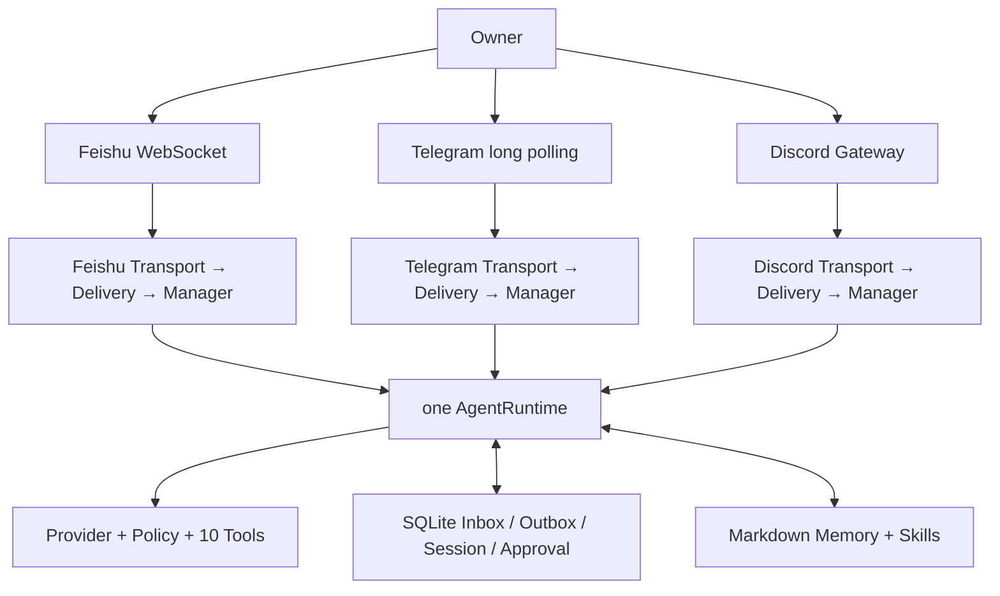

静态 preflight 是 all-or-none：任一 enabled Channel 缺 SDK、Token 或 Owner relationship 时，在创建 Provider、SDK
Client 和网络连接前失败。运行期则局部隔离：每个平台有独立 Transport、DeliveryWorker、ChannelManager、queue 和
Experience activity；断线只把当前 pipeline 标为 degraded。关停先关闭全部 admission，再以反向平台/反向组件顺序
清理，最后只关闭一次共享 AgentRuntime。

Approval durable payload 使用平台中立 v2 envelope；飞书旧 v1 Card 只读兼容。Telegram/Discord 当前用纯文本
fallback，所有决定仍由 Core SQLite 条件更新校验 Owner、TTL、scope 和单次 consume。

Feishu Live Runner 位于生产链旁边，不在生产链内部复制 Agent：

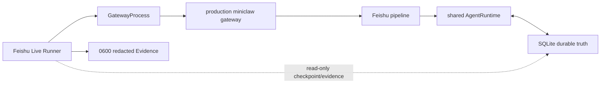

Runner 在 `--confirm-live` 前不读 config/state/secret，也不联网；确认后要求只有 Feishu enabled、clean commit、
Doctor 无 FAIL、0 旧 pending Approval。自动 evidence 失败时人工不能覆盖。它最多发送两次 SIGTERM，不发送
SIGKILL，不写假业务事实。

实现与测试细节见 [Phase 5 工程说明](../engineering/phase-5/telegram-discord-channels.md)、
[真实飞书 Bot 与 Live E2E](../engineering/phase-5/feishu-live-e2e.md)、
[测试与真实验收](../engineering/phase-5/testing-and-live-acceptance.md)、
[排障手册](../engineering/phase-5/troubleshooting.md)和
[完成性审计](../engineering/phase-5/completion-audit.md)。
