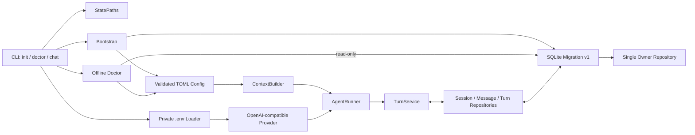
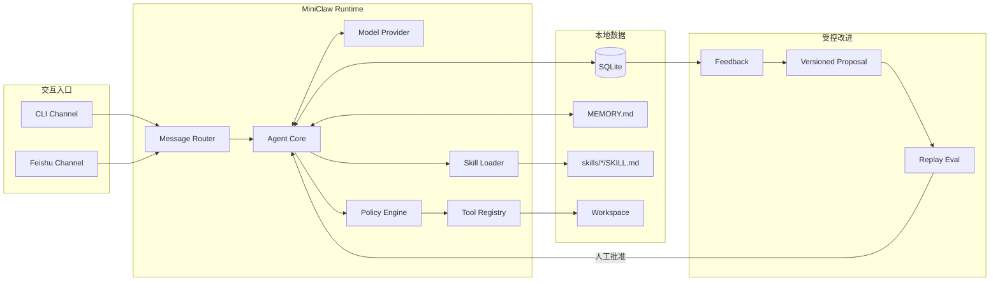
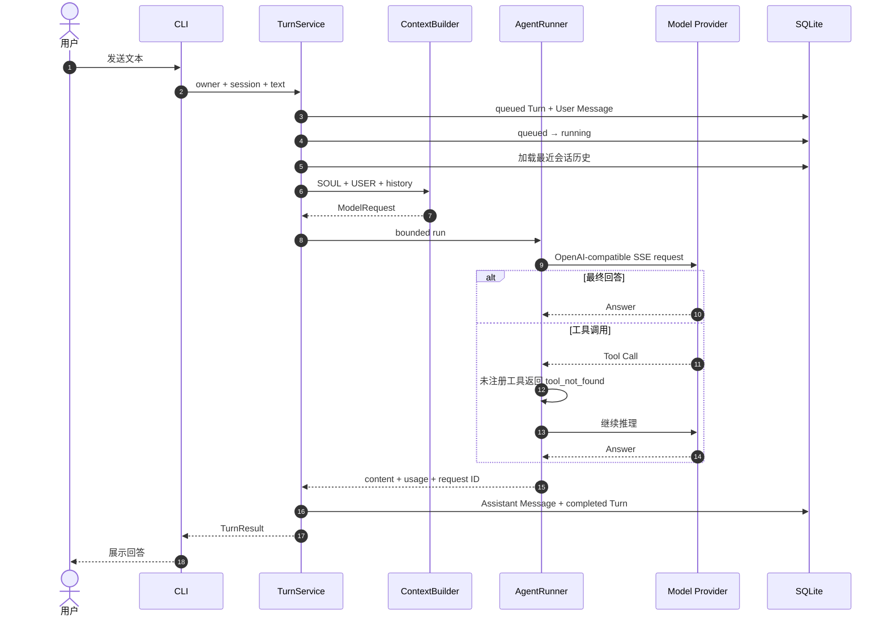
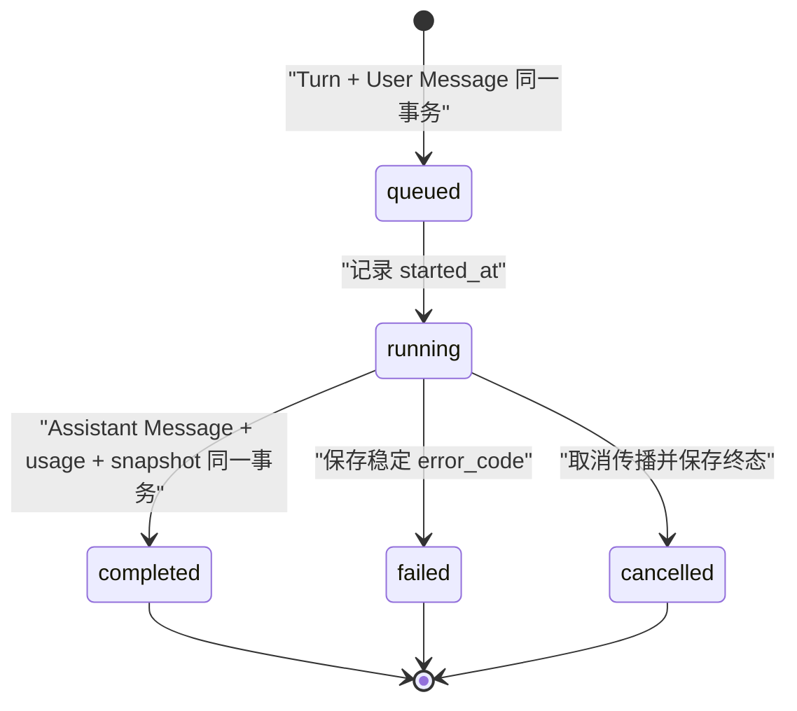

# MiniClaw 系统架构

## 当前状态

仓库已实现 Phase 1 的 CLI Agent 纵向闭环。飞书、真实工具、长期记忆和演进能力尚未实现：



实现边界：

- `paths.py` 只派生绝对状态路径；
- `env.py` 只解析私密 `.env`，不执行 shell；
- `config.py` 解析和校验 TOML/环境覆盖，但不保存 Key；
- `providers/` 负责 HTTP、SSE、协议收窄和有限重试；
- `agent/context.py` 组合身份与历史；
- `agent/runner.py` 执行最多 8 次模型/工具循环；
- `agent/turn.py` 编排一次 Turn 的持久化终态；
- `storage/` 管理 SQLite 连接、migration 与窄 Repository；
- `bootstrap.py` 组合初始化；`doctor.py` 只读诊断，不执行修复；
- `cli.py` 只解析、装配、输出和映射退出码。

## 目标总体架构



## 当前已实现的一条消息链路



Provider 支持 Tool Call 协议和 reasoning 回传，但 Phase 1 没有注册真实工具。Policy/Tool Registry 从 Phase 2
接入，不能把 `tool_not_found` 后备误解为工具能力已经完成。

## 运行期与数据一致性



CLI 是单进程顺序运行。SQLite 每次 Repository 操作使用短连接、外键、WAL 和 busy timeout；复合状态变更在一个
事务中完成。Provider 使用一个 `httpx.AsyncClient` 连接池，并在 CLI 结束时于 `finally` 关闭。

## 包布局

Phase 1 已创建的文件标为“已实现”；其余目录只在对应阶段创建：

```text
src/miniclaw/
├── bootstrap.py # 已实现：幂等初始化
├── config.py    # 已实现：TOML 与环境变量配置
├── doctor.py    # 已实现：离线本地诊断
├── env.py       # 已实现：私密 .env 非执行解析
├── paths.py     # 已实现：状态路径边界
├── cli.py       # 已实现：init、doctor、one-shot/交互 chat
├── storage/     # 已实现：SQLite、migration、Owner、会话与 Turn
├── agent/       # 已实现：Context、有限 Runner、TurnService
├── providers/   # 已实现：稳定契约与 OpenAI-compatible HTTP/SSE
├── channels/    # 目标：CLI、飞书与统一消息
├── evolution/   # 目标：反馈、评测、提案和回滚
├── policy/      # 目标：路径、命令、风险与审批
└── tools/       # 目标：文件、HTTP、受限 Shell
```

## 核心约束

- 单用户、单进程、一个 SQLite、一个 Workspace。
- Channel 只转换消息，Agent Core 不依赖飞书 SDK。
- 所有工具在执行前统一经过 Policy Engine。
- 文件路径解析后必须仍位于 Workspace，Shell 不接受拼接字符串。
- 自我改进只修改版本化 Prompt 或 Skill，并经过回放评测和人工批准。
- Telegram 与 Discord 复用 Channel 边界，但不进入 v0.1。
- `doctor` 使用 SQLite `mode=ro`，诊断缺失数据库时不得创建空文件。
- `.env` 必须为 `0600` 普通文件，Key 只存在于进程内存和认证 Header。
- CLI one-shot 只在模型、Agent 和 SQLite 全部成功后输出最终回答。

详细数据模型、安全策略、部署图与演进流程见 [PRD](../product/20260807_产品需求文档.md)。
Phase 1 的逐模块实现、错误契约与测试见 [工程文档](../engineering/phase-1/cli-chat.md)。
