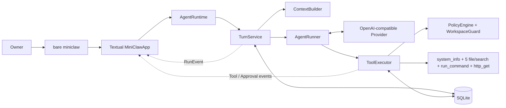
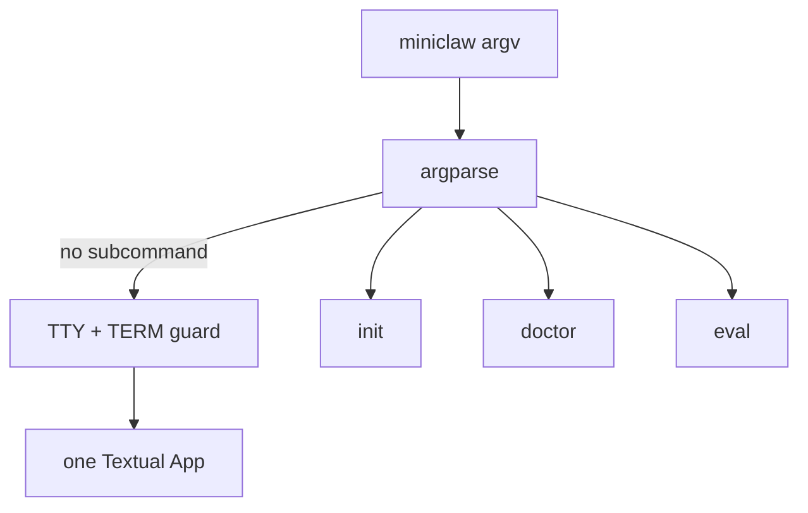
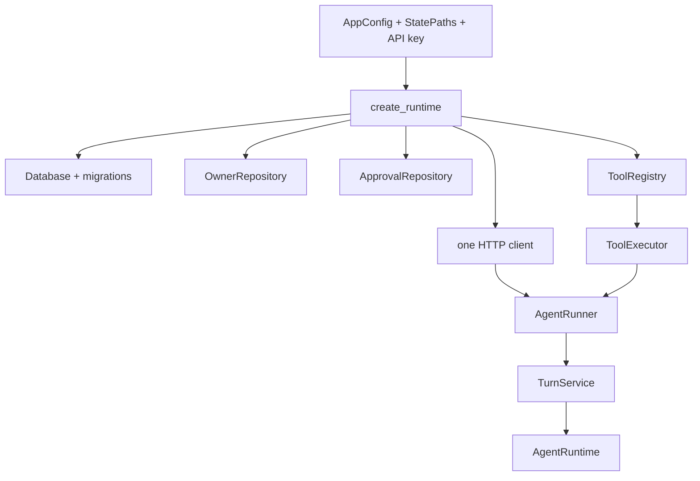
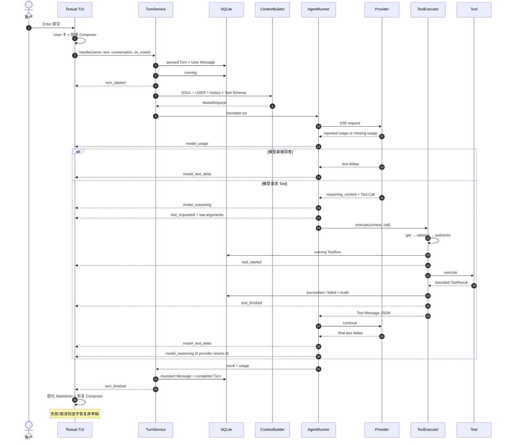
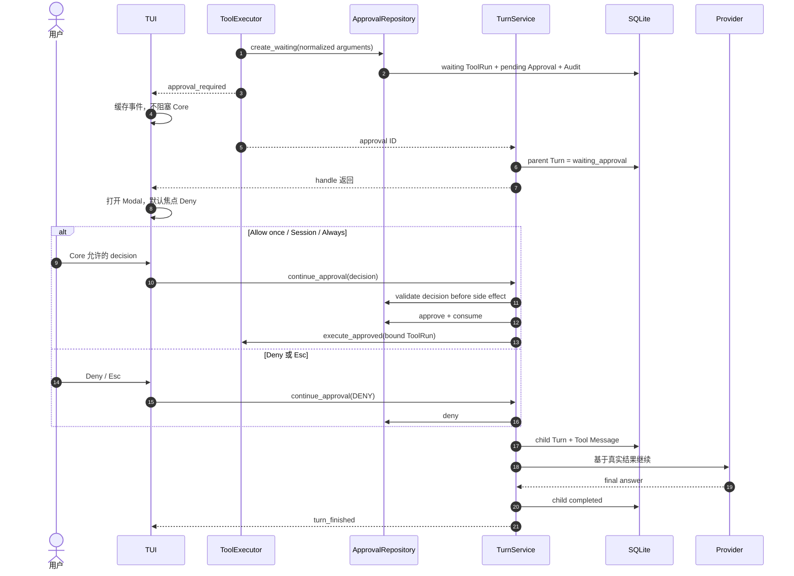
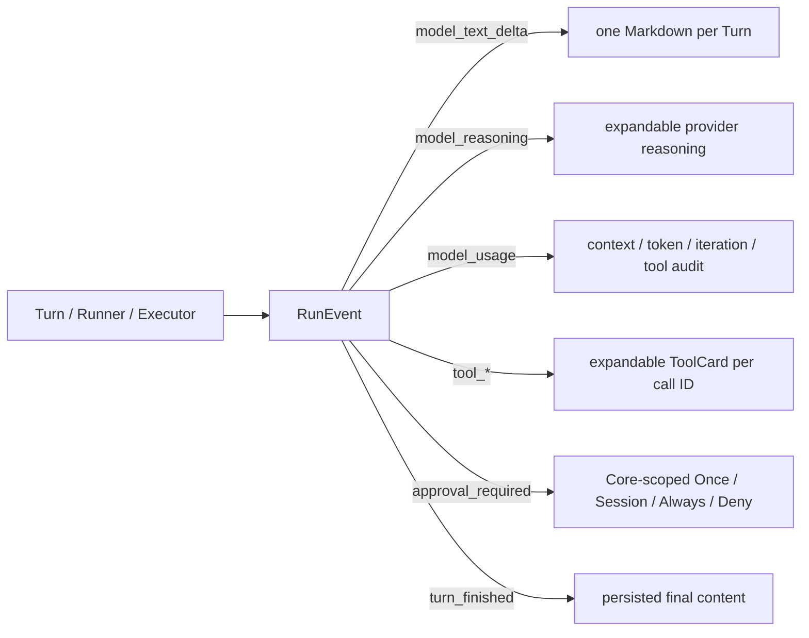
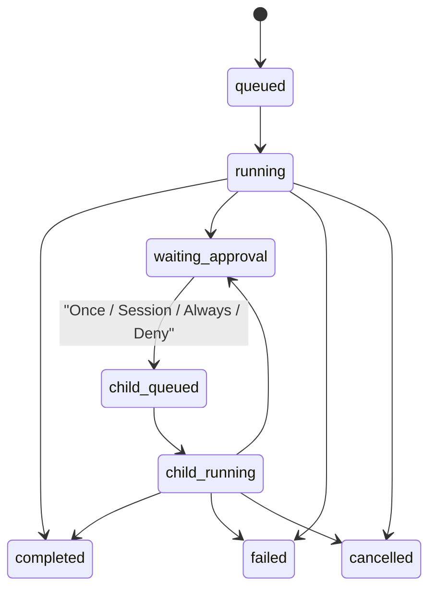
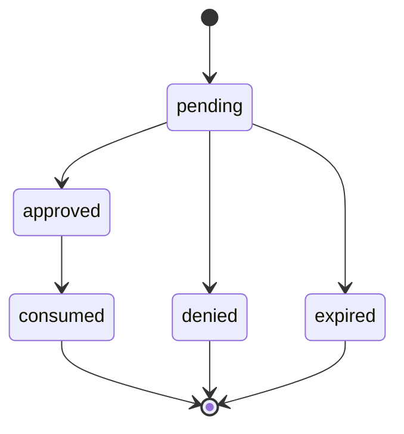
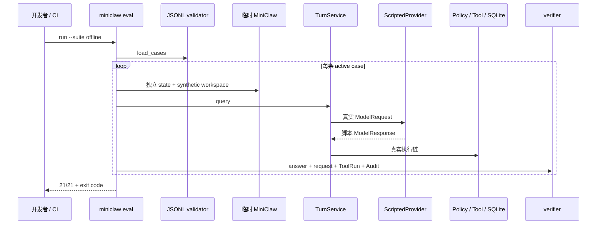

# MiniClaw 系统架构

## 当前状态

当前代码完成 Phase 2.4：单用户、单进程、单 Provider、单 SQLite 的 Textual TUI Agent。已实现八个
系统/文件/命令/HTTPS Tool、参数绑定 Approval、waiting/child Turn 续跑和离线 Agent 回归。任意 Shell、
飞书 Channel、长期 Memory/Skill Loader、当前 TUI 版本 live eval 和自动演进尚未实现。TUI 已完成默认中文/
可切英文、对话角色层级、长文本恢复、真实 usage 审计栏与 Session/Always exact scope。



## 入口边界

人类对话入口只有一个：

```bash
uv run miniclaw
```

保留的 `init`、`doctor`、`eval` 是维护和质量门禁，不执行另一套对话逻辑。旧 `chat`、`tui`、
`chat --message`、`approvals` 命令已删除。



## AgentRuntime

`src/miniclaw/runtime.py` 是生产 Agent 的唯一装配点。它创建并拥有：

- 当前 Owner ID；
- 一个 `OpenAICompatibleProvider`；
- 一个 `TurnService`；
- 一个带 ApprovalRepository 的 `ToolExecutor`；
- 配置允许且已实现的 Tool；
- TUI `/tools` 使用的稳定 ToolDefinition 列表。



当前 Registry 稳定暴露：`edit_file`、`glob`、`grep`、`http_get`、`read_file`、`run_command`、`system_info`、
`write_file`。

## 一条普通消息



所有 Tool 都经过 Registry → validate → Policy → ToolRun → execute → terminal Audit。Policy DENY 不创建
ToolRun，但必须先写入不含原始参数的脱敏拒绝审计。

## 写入审批与续跑



Approval 绑定 Tool 名、canonical JSON 参数与 SHA-256；Owner、TTL、状态和单次 consume 都由 SQLite 条件更新
校验。TUI 不是安全边界，它只展示 Core 的 `grant_modes`。Session/Always 规则只在 Tool 成功后应用；Session
留在当前 PolicyEngine，Always 只保存 exact argv 或 exact hostname + port。文件写入与 inline AppleScript
不能持久授权。

## RunEvent 投影



事件只在对应数据库迁移完成后发送。普通 UI handler 异常被隔离且日志不含 payload；取消异常继续传播。模型
和 Tool 输出先移除 ANSI、C0/C1 控制字符，Tool 结果预览限制 2,000 字符，折叠详情
限制 8,000 字符，Markdown 不自动打开链接。`model_reasoning` 只投影 Provider 明确返回的
`reasoning_content`，不生成或猜测隐藏思维链。Token 缺失显示 `N/A`，不估算。

## Turn 与 Approval 状态





## 离线回归链路



## 当前包布局

```text
src/miniclaw/
├── cli.py             # 裸 TUI 与 init/doctor/eval
├── runtime.py         # 唯一生产装配
├── bootstrap.py       # 幂等初始化
├── config.py          # 严格 TOML / 环境覆盖
├── env.py             # 非执行 .env 解析
├── doctor.py          # 只读诊断
├── agent/
│   ├── context.py
│   ├── events.py      # RunEvent
│   ├── runner.py
│   └── turn.py
├── tui/
│   └── app.py         # App、Composer、ToolCard、ApprovalModal
├── providers/         # OpenAI-compatible HTTP/SSE
├── policy/            # Workspace、风险、Approval hash
├── tools/             # 八个 Tool、Registry、Executor
├── storage/           # SQLite、Repository、ToolRun、Approval、Audit
└── evals/             # JSONL、ScriptedProvider、verifier
```

## 当前约束与下一阶段

- 单用户、单进程、一个 SQLite、一个活动 TUI Turn；
- TUI 要求真实 TTY，非交互 one-shot 已移除；
- TUI 默认中文，`/lang zh|en` 原地切换；reasoning 跟随用户提问语言；
- Provider usage 只做真实投影，失败/取消恢复当前内存草稿；
- Key 只存在于进程内存与认证 Header；
- 文件只能进入 Workspace 写边界，敏感路径 fail closed；
- `run_command` 已进入 Registry；只接受 exact argv，不解释 Shell 字符串；
- `http_get` 已进入 Registry，并执行 HTTPS-only、全部 DNS 公网校验、固定 IP/TLS hostname 和有界文本读取；
- 飞书 Channel 尚未实现；
- 自我改进仍只具备离线回归地基，不能自动改 Prompt/Skill。

Phase 2.3B 将处理本机 NVM/Node 路径、doctor 检查，并以 `lark-cli auth status` 完成第一条真实受控命令
smoke。更细的约束见 [Phase 2.2B TUI 工程文档](../engineering/phase-2/single-entry-tui.md)与
[Phase 2.3A 命令执行工程文档](../engineering/phase-2/command-execution.md)。P2.4 网络安全见
[Pinned HTTPS 与 SSRF 工程文档](../engineering/phase-2/https-get-and-ssrf.md)。
TUI 加固细节见
[TUI 可观测、长文本与分级审批](../engineering/phase-2/tui-observability-and-scoped-approvals.md)。
