# MiniClaw 系统架构

## 当前状态

当前代码完成 Phase 6.5 implementation，并以版本化 NDJSON 接入默认 TypeScript pi-tui；Textual 保留为
onboarding/fallback。当前是单用户、单 Provider、单 SQLite 的 Python Agent Core，已实现十八个 Core Tool 和
八个默认关闭的 Browser Tool、
系统/文件/命令/HTTPS/Memory Tool、参数绑定 Approval、waiting/child Turn 续跑、Markdown Memory、Skills
惰性激活、persistent compaction、离线 Agent 回归，以及飞书 WebSocket、durable Inbox/Outbox、Channel Worker、
Typing/单卡片最终回复、审批 fallback、脱敏结构化日志/Audit、四档权限与 Owner 私聊信任，以及
飞书/Telegram/Discord 共享 Runtime 的 Gateway。Phase 5.2 已增加 15 条 Feishu Live 场景、
有界 production Gateway Runner、只读 SQLite evidence 与严格脱敏报告。Memory Autopilot A～E 已实现 Owner
Disclosure、durable Flush、Markdown Truth、FTS5/CJK、治理、对账与 legacy 迁移；Phase 6 已实现 Autonomy、
Sandbox 和 Checkpoint；Phase 6.5 已实现独立 Browser Worker、专用 Chromium Profile、snapshot/ref、网页 Policy 和
Artifact。Phase 6 production tooling 已实现只读 invariant snapshot、exact-duration owner-only checkpoint、同 commit
Evidence aggregate、受管 restart 与 exactly-one Delivery recovery；真实 24 小时仍待执行。任意 Shell、向量数据库和
自动演进尚未实现。
飞书专用企业应用、机器人、Scope、Owner allowlist 和 WebSocket 已真实配置；两条 Owner 私聊已完成真实
Inbox → Agent → Outbox → Delivery 闭环。Card callback 现在必须绑定已发送 Approval receipt、账号与审批 ID；
Channel notice 不再进入 Provider Context，真实“仅本次”已完成 Tool 与结果 Delivery。完整 15-case、群聊、
非 Owner、断网恢复和常驻 soak 仍待执行。

飞书消息 Channel 与飞书业务 API 是两层能力：Channel 负责收到问题和送回回答；文档、日历、任务等业务 Query
命中 `feishu-lark-cli` Skill 后，通过既有 `run_command` 调用 official `lark-cli`，继续接受同一 Policy、Approval、
超时和 ToolRun/Audit 约束，不增加重复的飞书 API Tool。

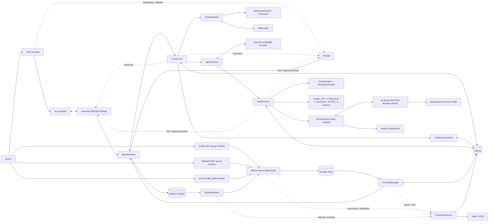

## 入口边界

人类对话入口只有一个：

```bash
uv run miniclaw
```

保留的 `init`、`doctor`、`eval` 是维护和质量门禁；`gateway` 是同一 Core 的长期 Channel 宿主，不实现另一套
Agent Loop。旧 `chat`、`tui`、
`chat --message`、`approvals` 命令已删除。

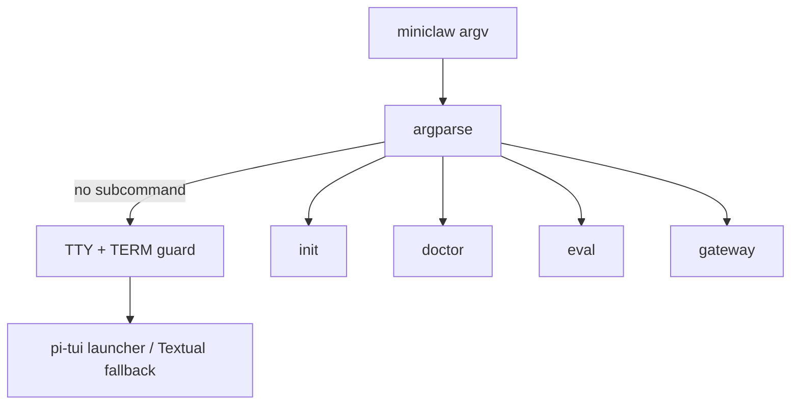

## AgentRuntime

`src/miniclaw/runtime.py` 是生产 Agent 的唯一装配点。它创建并拥有：

- 当前 Owner ID；
- 一个 `OpenAICompatibleProvider`；
- 一个 `TurnService`；
- 一个带 ApprovalRepository 的 `ToolExecutor`；
- 一个 `MemoryStore`、`SkillLoader` 和 `ContextCompactor`；
- 一个进程级 `PermissionState`，供 TUI 与三个 Channel 共享；
- 配置允许且已实现的 Tool；
- TUI `/tools` 使用的稳定 ToolDefinition 列表。

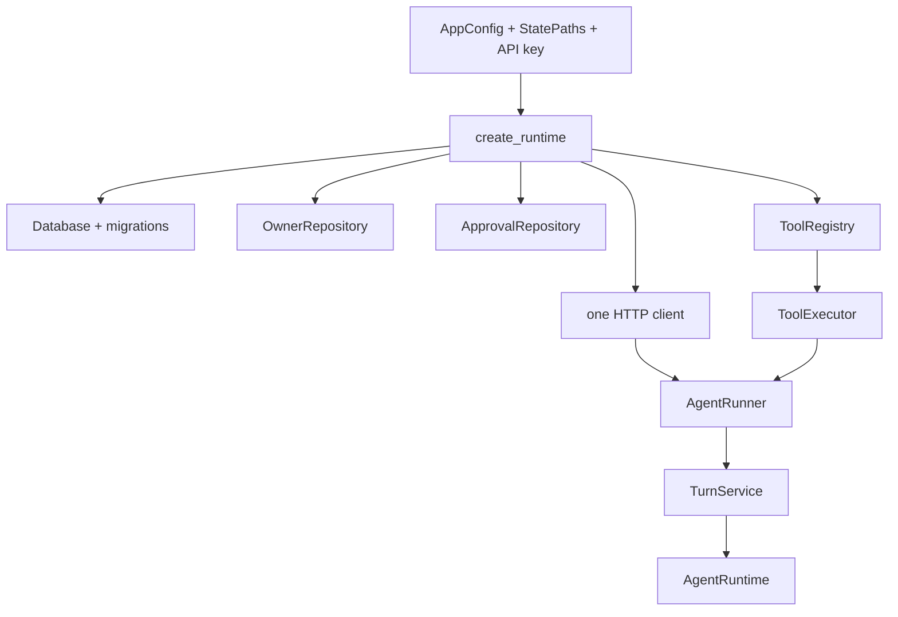

当前 Registry 的 Core Tool 稳定暴露文件、搜索、HTTPS、exact-argv、系统与 Memory surface。`browser.enabled=true`
时，同一 Registry 额外暴露 `browser_open`、`browser_snapshot`、`browser_click`、`browser_type`、
`browser_press`、`browser_scroll`、`browser_screenshot`、`browser_close`；这些 Tool 仍只经同一个
`PolicyEngine → ToolExecutor → ToolRun/Audit` 执行。

## 一条普通消息

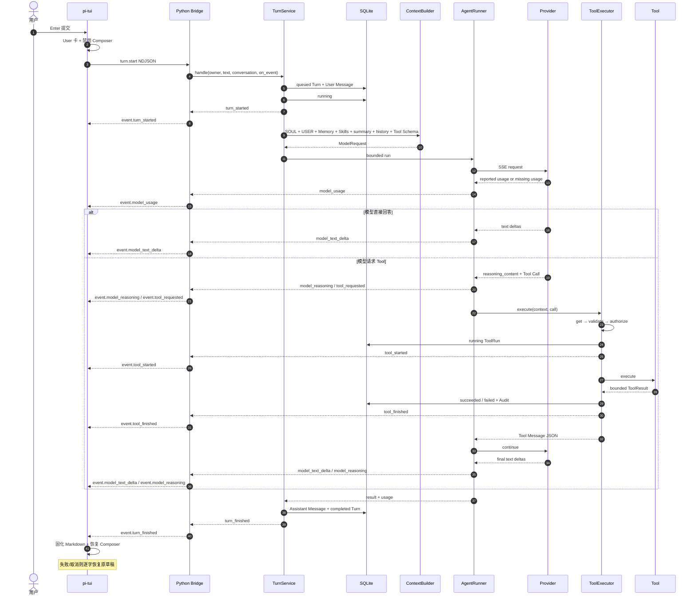

Provider 对尚未产生可见文本的网络、5xx、限流、超时，以及 2xx 响应中的协议解析失败最多重试一次。后一类覆盖模型
生成的截断 Tool arguments；Core 不修补、不猜测也不执行残缺 JSON。已经回调任一可见文本后禁止协议/网络重试，避免
重复前缀。两次仍失败时 Channel 按异常类型在原进度卡显示脱敏、可行动提示，例如 Tool 参数格式错误、认证失败、限流、
超时或服务暂不可用。

所有 Agent/Provider/Gateway 中断终态都复用原进度卡，并以 bullet points 展示失败阶段、稳定错误码、Turn/Event
调试编号、ToolRun 数量与副作用提示以及下一步建议。取消路径不得用空正文完成红卡；异常正文、请求内容、凭据和
完整 Tool 参数不得进入公开诊断。

所有 Tool 都经过 Registry → validate → Policy → ToolRun → execute → terminal Audit。Policy DENY 不创建
ToolRun，但必须先写入不含原始参数的脱敏拒绝审计。

## Autopilot 权限与入口信任

Python Core 持有唯一 `PermissionState`，值为 `safe / smart / autopilot / yolo`。模式不是 Policy 的替代品：
WorkspaceGuard、敏感路径、exact argv、命令硬禁止、HTTPS/DNS/SSRF 和资源预算始终先执行，模式只决定通过硬校验后
是自动执行还是创建 Approval。

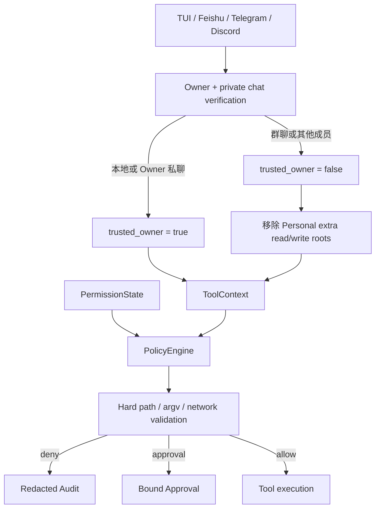

本地 Bridge 绑定 SQLite Owner。Channel 只有配置的 Owner 外部 ID 且 `chat_type=p2p` 时才传播 trusted 标记；
Owner 在群聊中也会降级。`/permissions` 在 TUI 通过 NDJSON `permissions.set` 切换，在 IM 中只由 Owner 私聊控制，
不会进入模型。活动 Turn 或 pending Approval 存在时切换失败关闭。

新 Personal 配置显式从 `autopilot` 启动；旧配置没有 `tools.mode` 时同样按 `autopilot` 加载，显式
`safe`/`smart` 不变。模式变化写入
`policy.mode_changed` 脱敏审计，只保存 old/new/source。完整状态表、操作和回滚见
[Autopilot 权限与紧凑审批 UI](../engineering/phase-2/20260808_autopilot-permissions-and-approval-ui.md)。

## Channel Agent progress 投影

`RunEvent` 不直接进入平台渲染器。`ProgressProjector` 先生成有界 `AgentProgress`：最多 16 步、每个展示字段最多
240 字符、持久 trace 最多 16 KiB。投影器按精确 Tool 名称只提取允许公开的目标字段；`model_reasoning`、原始 Tool
参数、Tool preview、凭据值和文件内容全部丢弃。这里的“过程摘要”来自公开 model preamble 与确定性状态文案，不是
隐藏思维链，也不会新增模型调用。

飞书把快照渲染为不超过 20 KiB 的 Card 2.0 `Claw Trail`；Tool 开始时创建第一帧，完成时在同一卡片加入最终回答。
卡片返回实际承载的答案字符数，Manager 只把超限后缀回复到该卡片。最终脱敏 trace 合并到 Assistant Message 的
`metadata_json.experience_trace`，重启恢复时与完整 Assistant 正文重新组合。Telegram/Discord 使用同一快照的紧凑文本，
最终 durable text 投递语义不变。Approval 在首个 Tool 前发生时不创建 progress 卡；显式安全模式下的 Approval
基础设施仍保留。

## 写入审批与续跑

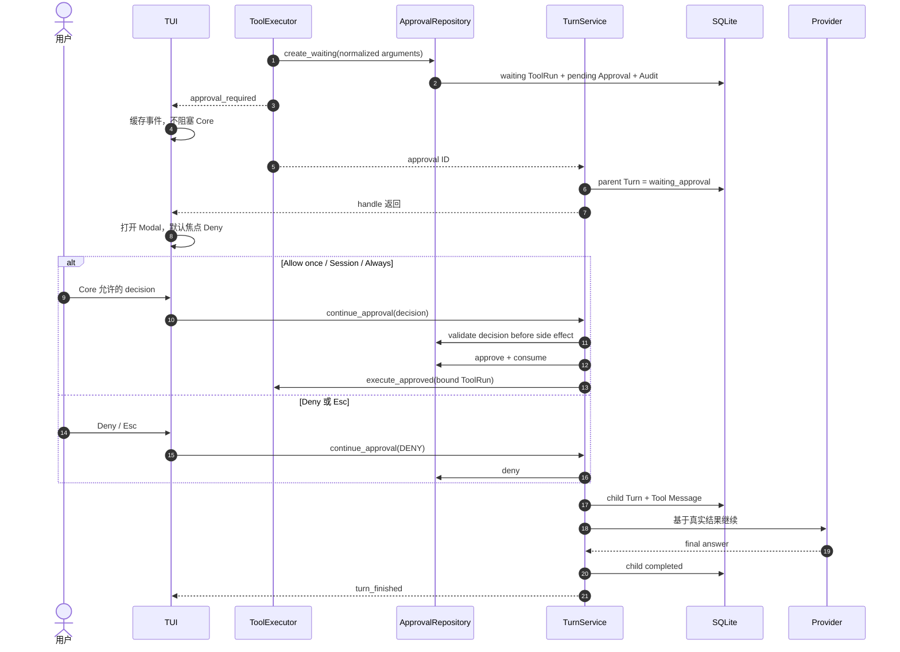

Approval 绑定 Tool 名、canonical JSON 参数与 SHA-256；Owner、TTL、状态和单次 consume 都由 SQLite 条件更新
校验。TUI 不是安全边界，它只展示 Core 的 `grant_modes`。Session/Always 规则只在 Tool 成功后应用；Session
留在当前 PolicyEngine，Always 只保存 exact argv 或 exact hostname + port。文件写入与 inline AppleScript
不能持久授权。pi-tui ApprovalDialog 最大 84 列、18 行，固定标题、风险提示和决策区，只滚动参数详情；外层
Overlay 不再用裁剪隐藏底部按钮。

飞书按钮回调由 `FeishuApprovalActionHandler` 独立编排。按钮到达后先把原审批卡更新为橙色“处理中”，再调用唯一
`ChannelApprovalController`；最终消息写入 durable Outbox，续跑再次产生 Approval 时创建下一条平台中立 v2
Delivery。原卡随后变为绿色完成、红色拒绝或红色失败，并移除所有按钮。重复、过期、非 Owner、坏 payload 和内部
异常都只显示稳定提示，不重复执行，也不向飞书回显内部异常。非 Owner 和畸形 callback 不更新原卡，避免移除 Owner
仍可使用的按钮；Gateway 取消、Core 拒绝和 Outbox 失败都显示稳定 bullet diagnostics。`run_command` 的卡片摘要只显示
程序 basename 和参数数量；完整 argv 仍只保存在参数 hash 绑定的本地 Core 记录中。

## Memory Autopilot、Skills 与 Compaction

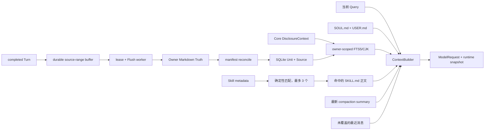

- `memory/owners/<owner_id>/memory.md` 是已接受语义 Unit 的 Owner 可审阅真相源；旧 `MEMORY.md` 与 daily
  文件在兼容期只读、按 hash 幂等迁移，原件不改不删。
- 普通完成 Turn 只写 durable source-range buffer，不等待 extractor；Worker 用 lease 恢复，先提交 Markdown，
  再更新 Candidate/Unit/Source 与 disposable FTS5 Projection。
- 明确“记住”绑定当前 Owner User Message，只有 Markdown 原子 replace/fsync 成功后才报告成功。
- 首次低风险事实进入 `short_term`，独立重复晋升 `active`；敏感、行为/权限规则和冲突只能进入 hash-bound
  Owner Review。模型不能 approve/reject。
- TUI 与已验证 Owner 私聊可召回私人 Unit；群聊、非 Owner、未知/冲突身份在 SQL 前 fail closed。
- Recall 只返回 private 且 `active/short_term`、有效期内的完整 Unit，默认 top 5，并保留内部 SourceRef。
- Forget 归档、纠错新建 Unit 后 supersede、TTL 到期、weekly review、direct edit 和 `/memory rebuild` 都经过
  Markdown-first 与脱敏审计；坏 Markdown 保留文件和最后有效 Projection。
- API Key、Token、OTP、Authorization、密码、私钥和 fabricated source 在 Candidate Repository 前拒绝。
- Skill 启动时只扫描 metadata；当前 Query 命中后才加载正文，最多 3 个，且不执行 Skill 代码。
- Memory、Skill 与 compaction 的版本/内容哈希进入 Turn runtime snapshot，便于回放；Memory 不能扩大 Tool Policy。
- 估算上下文达到配置预算 80% 时，`ContextCompactor` 用当前 Provider 总结最旧连续 Turn，保留最近两轮和
  waiting approval；summary 写入现有 `messages` 表，原消息不删除。
- 摘要失败时不写半成品，当前请求退化为有界最近历史继续运行。

实现、恢复矩阵和运维入口见
[Memory Autopilot 工程实现](../engineering/phase-5/20260809_memory-autopilot.md)；设计取舍见
[Memory Autopilot 技术选型](../engineering/20260808_memory-autopilot-best-practices-and-technology-selection.md)。

## RunEvent 投影

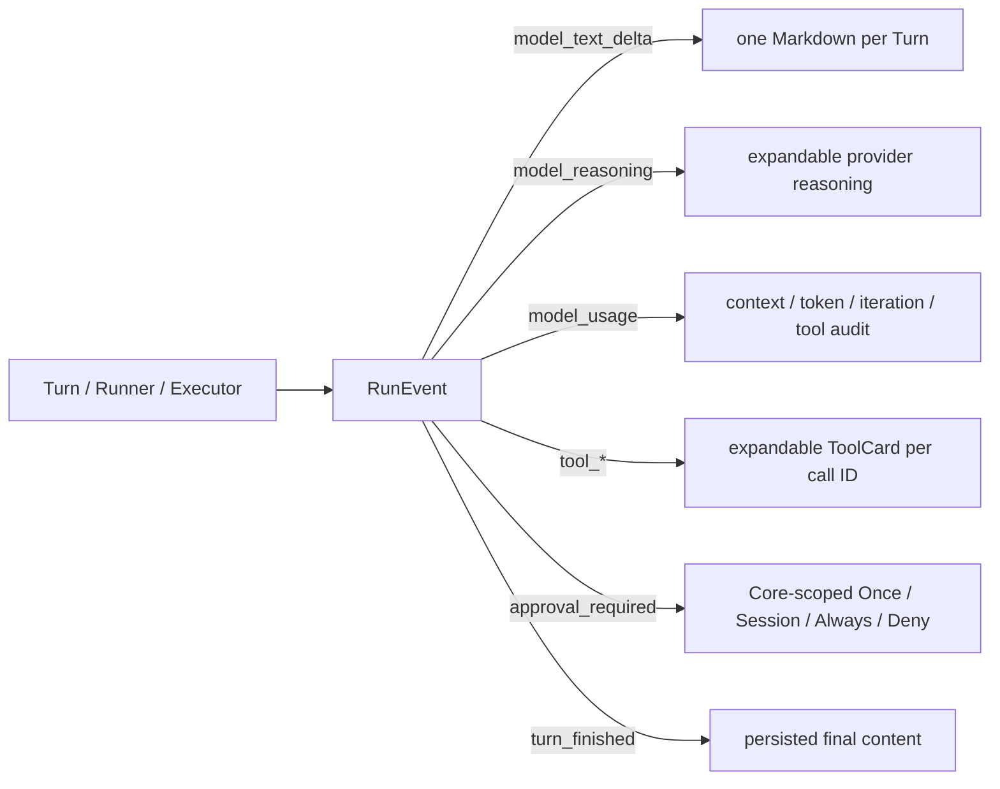

事件只在对应数据库迁移完成后发送。普通 UI handler 异常被隔离且日志不含 payload；取消异常继续传播。模型
和 Tool 输出先移除 ANSI、C0/C1 控制字符，Tool 结果预览限制 2,000 字符，折叠详情
限制 8,000 字符，Markdown 不自动打开链接。`model_reasoning` 只投影 Provider 明确返回的
`reasoning_content`，不生成或猜测隐藏思维链。Token 缺失显示 `N/A`，不估算。

## Turn 与 Approval 状态

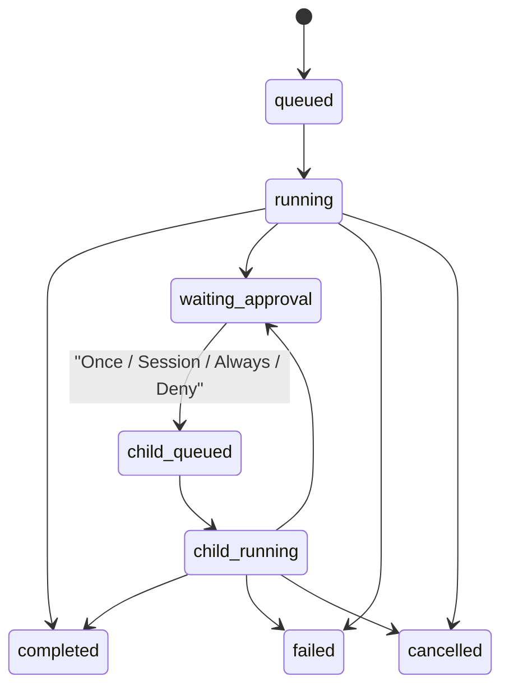

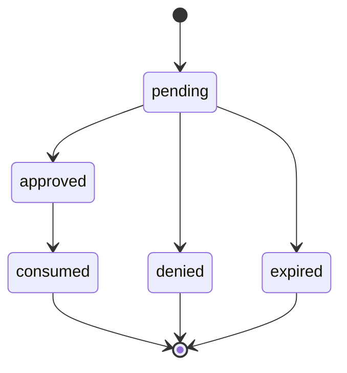

## 离线回归链路

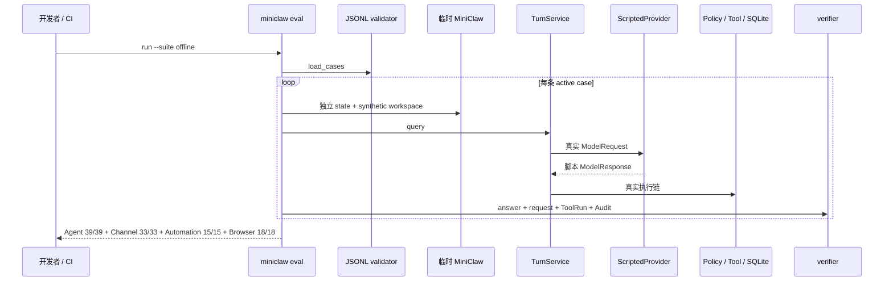

## Phase 6.5 Browser Agent

Browser 使用“Core 决策、Worker 执行”的单向授权边界。Python Core 校验 Tool 参数、HTTPS/SSRF、动态风险和
Approval；TypeScript Worker 只解析 `miniclaw.browser.v1` 的封闭 NDJSON action，并控制 MiniClaw 专用 Chromium
Profile。Worker 不读取 Config、Provider Key、Memory 或 SQLite。

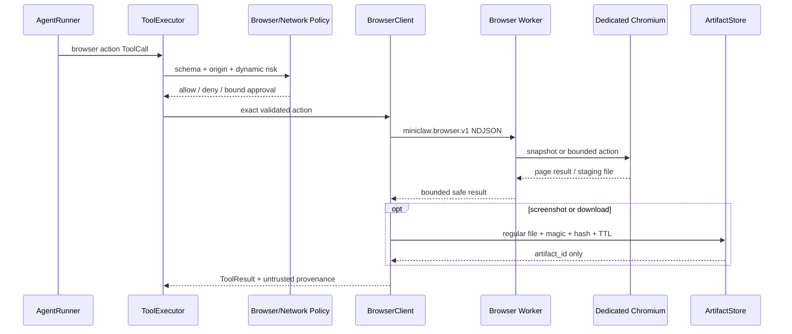

Snapshot 是有界 accessibility projection，只包含 role、accessible name、state 与 opaque `@eN`；DOM 或导航改变
generation 后旧 ref fail closed。页面正文始终标记为 `untrusted_web_content`。password/OTP 永久拒绝；普通输入正文
不进入 TUI、Approval、Audit 或 ToolResult；click 和 Enter/Space 为高风险。Screenshot/Download 只进入私有
content-addressed Artifact Store，模型看不到 base64 或绝对路径。

一个 `AgentRuntime` 最多拥有一个 BrowserClient。取消、超时、Runtime/Gateway 关闭与 Worker crash 都会终止子进程组；
Profile 使用排他锁，页面副作用不在重启后自动重放。详细边界见
[Browser Agent 工程文档](../engineering/phase-6/browser-agent.md)。

## 当前包布局

```text
src/miniclaw/
├── cli.py             # 裸 TUI 与 init/doctor/gateway/eval
├── tui_launcher.py    # Node 检测、默认 pi-tui 与 Textual fallback
├── bridge/            # NDJSON codec、Server 与内部 stdio 入口
├── gateway.py         # 三平台 single-runtime Supervisor 装配与信号生命周期
├── runtime.py         # 唯一生产装配
├── bootstrap.py       # 幂等初始化
├── config.py          # 严格 TOML / 环境覆盖
├── env.py             # 非执行 .env 解析
├── doctor.py          # 只读诊断
├── agent/
│   ├── context.py
│   ├── compaction.py
│   ├── events.py      # RunEvent
│   ├── runner.py
│   └── turn.py
├── automation/       # Task/Run Ledger、Scheduler、Runner、Heartbeat、Delivery
├── artifacts/        # Browser Screenshot/Download 私有 CAS、metadata 与 TTL
├── browser/          # Worker Client、协议模型、发现与动作风险
├── checkpoints/      # bounded CAS 与 conflict-aware Rollback
├── tui/
│   └── app.py         # Textual fallback
├── channels/          # 三平台 Adapter/Transport、Supervisor、Worker、Delivery、Approval、Observer
├── providers/         # OpenAI-compatible HTTP/SSE
├── sandbox/           # immutable Plan 与 Host/Docker/Seatbelt backend
├── memory/            # Markdown Memory、安全追加与凭据过滤
├── policy/            # Profile 多根、敏感路径、CLI 发现、风险、Approval hash
├── skills/            # SKILL.md metadata 扫描与惰性激活
├── tools/             # Core + 可选 Browser Tool、Registry、Executor
├── storage/           # SQLite、Repository、ToolRun、Approval、Audit、Inbox/Outbox
└── evals/             # Agent/Channel/Automation/Browser runner 与 verifier

tui/
├── src/               # TypeScript pi-tui、BridgeClient、State、Components
└── test/              # 协议、虚拟终端、长文本、选择、审批、跨进程回归

browser-worker/
├── src/               # protocol、profile/session、snapshot、action、server
└── test/              # 14 条协议与真实 headless Chromium 回归
```

## 当前约束与下一阶段

- 单用户、一个 SQLite、一个活动 TUI Turn；默认终端链路是 Python launcher → Node UI → Python Core Bridge；
- TUI 要求真实 TTY，非交互 one-shot 已移除；
- TUI 默认中文，`/lang zh|en` 原地切换；按最新 User 消息选择中英文 System Prompt，约束 reasoning 语言；
- Provider usage 只做真实投影，失败/取消恢复当前内存草稿；
- Key 只存在于进程内存与认证 Header；
- 文件读取由 Workspace/Personal Profile 决定：Personal 可读 Home 普通文件与显式系统根，但 Keychain、浏览器
  登录库、私钥和应用凭据目录始终 fail closed；写入只进入 Workspace 与有限个人写根；是否审批由可信入口和
  `safe/smart/autopilot/yolo` 模式决定；
- `run_command` 已进入 Registry；只接受 exact argv，不解释 Shell 字符串；
- Personal 启动时确定性发现系统、NVM、uv、pnpm、local、Cargo 与 Bun executable roots；Policy 与执行器共享
  同一解析结果，不 source shell rc，不继承 API Key/Cookie/Proxy；
- `http_get` 已进入 Registry，并执行 HTTPS-only、全部 DNS 公网校验、固定 IP/TLS hostname 和有界文本读取；
- `memory_remember/search/get/list/flush/forget/correct/review_list` 已进入 Registry；旧 `read_memory` 与
  `propose_memory` 在兼容期保留；
- `SKILL.md` 只按需加载 Markdown 指令，不能执行代码或绕过 Tool Policy；
- compaction summary 持久化在 SQLite，原始消息始终保留；
- 飞书、Telegram、Discord Channel 代码、脱敏 JSON/Audit 与 32 条离线回归已完成；Feishu 的 15 条真实场景与
  Runner 已实现，真实 Bot、凭据、权限、WebSocket ready 和 Owner DM Delivery 已验证；15/15 Evidence 尚未完成；
- Automation/Heartbeat 默认关闭；开启后 TaskRun 使用独立 Session、受限 Tool profile、硬预算和 durable E-stop；
- Docker/Seatbelt 缺失时 fail closed，Checkpoint 只覆盖主 Workspace；Rollback 暂无 CLI/TUI；
- Browser 默认关闭；开启后只使用专用 Profile，受控公网 live smoke 尚未执行；
- 自我改进仍只具备离线回归地基，不能自动改 Prompt/Skill。
- 通用 Desktop Workbench W0/W1 development build 已实现浅色四界面、真实单 Agent 任务闭环、历史恢复、
  Automation 只读列表、权限与 Workspace 切换；Electron Main 只监督 Python Bridge，Renderer 不直读 SQLite、
  Secret、Workspace 或执行 Tool。新的 D1～D5 目标把 LobsterAI Cowork 式 Composer 提升为默认首屏，增加附件、
  模型、Workspace、Agent、Artifact 和 depth-1 Sub-agent；这些仍是规划，不是当前能力。边界见
  [LobsterAI-first 桌面多 Agent 设计](20260810_LobsterAI-first桌面多Agent设计.md)。

当前架构状态是 Phase 6.5 **IMPLEMENTATION PASS**：1005/1005 Python、41/41 TUI TypeScript、
14/14 Browser Worker、39/39 Agent、33/33 Channel、660/660 local Channel soak、15/15 Automation、
18/18 Browser 与 360/360 Browser soak；Browser 是 **CONTROLLED LIVE SMOKE PENDING**；Feishu 是
**TARGETED CALLBACK LIVE VERIFIED / 15-CASE LIVE PENDING**，Telegram/Discord 均为 **LIVE PENDING**，
Docker 为 **LIVE VERIFIED**，Seatbelt 为 **LIVE PENDING**。Phase 2.3B 的 Personal 权限、NVM/Node
路径与 `lark-cli --version` 离线纵切也已完成；当前用户身份的 `lark-cli auth status --verify` 与一次 direct
read-only Drive search 已验证。真实 DeepSeek Tool Loop 尚未执行，因为文档标题和 URL 会离开本机进入模型 Provider，
必须由 Owner 单独授权。v0.5.3 的 SDK 日志脱敏、Gateway lease/provenance、受管 Live Runner 和异常 Tool
历史恢复、Card callback sent-receipt 绑定与 Approval continuation 已进入 `main`；Memory Autopilot A～E、Phase 6
Task/Scheduler/Runner/Sandbox/Checkpoint 和 Phase 6.5 Browser Agent 也已通过本地 versioned gate。
Feishu/Discord 严格 15/15 与 Browser controlled live smoke 仍是独立 Live Evidence 收口项；下一条功能主线是
**Phase 7 Controlled Evolution**。
Phase 6 当前生产口径是 **IMPLEMENTATION PASS / PRODUCTION SOAK PENDING**：只有同一 clean commit 的 Seatbelt
2/2、Feishu 15/15、Automation 10/10、受管 recovery 和连续 86,400 健康秒全部成立，才能升级为生产验证通过；
当前文档没有该声明。
任何 production verified 声明仍要先完成对应平台 live exit gate。真实开发顺序见
[开发与交付时间线](../engineering/20260809_development-timeline.md)。飞书运行时与常驻边界见
[飞书 Gateway 运行时与 macOS 常驻](../engineering/phase-5/20260808_feishu-gateway-runtime-and-macos-service.md)。权限实现见
[Personal Machine 权限与 CLI 发现](../engineering/phase-2/20260808_personal-machine-permissions.md)。飞书实现见
[Phase 4 飞书工程文档](../engineering/phase-4/20260808_feishu-channel.md)、
[Channel/Gateway 概览](../engineering/phase-4/20260808_feishu-channel-core.md)与
[真实飞书 Bot 与 Live E2E](../engineering/phase-5/20260808_feishu-live-e2e.md)、
[飞书单卡片与 lark-cli Skill](../engineering/phase-5/20260809_feishu-single-card-and-lark-cli.md)、
[完成性审计](../engineering/phase-4/20260808_completion-audit.md)、
[运行、测试和故障排查](../engineering/phase-4/20260808_testing-and-operations.md)。更细的 Phase 3 约束见
[Memory、Skills 与上下文压缩工程文档](../engineering/phase-3/20260808_memory-skills-compaction.md)；当前记忆实现见
[Memory Autopilot 工程实现](../engineering/phase-5/20260809_memory-autopilot.md)，设计来源见
[Memory Autopilot 能力 Gap](20260808_Memory-Autopilot能力Gap与重构架构.md)与
[技术选型](../engineering/20260808_memory-autopilot-best-practices-and-technology-selection.md)；Phase 6 运行与安全边界见
[Phase 6 Autonomy Runtime](../engineering/phase-6/20260809_autonomy-runtime.md)和
[Phase 6 Sandbox 与 Checkpoint](../engineering/phase-6/20260809_sandbox-and-checkpoint.md)；生产收口见
[macOS + 飞书生产级验收](../engineering/phase-6/20260810_macos-feishu-production-acceptance.md)；Browser 边界见
[Phase 6.5 Browser Agent](../engineering/phase-6/browser-agent.md)；Tool/TUI 约束见
[Python Core + pi-tui Bridge](../engineering/phase-2/20260808_python-core-pi-tui-bridge.md)、
[Phase 2.2B TUI 工程文档](../engineering/phase-2/20260808_single-entry-tui.md)与
[Phase 2.3A 命令执行工程文档](../engineering/phase-2/20260808_command-execution.md)。P2.4 网络安全见
[Pinned HTTPS 与 SSRF 工程文档](../engineering/phase-2/20260808_https-get-and-ssrf.md)。
TUI 加固细节见
[TUI 可观测、长文本与分级审批](../engineering/phase-2/20260808_tui-observability-and-scoped-approvals.md)与
[Autopilot 权限和紧凑审批](../engineering/phase-2/20260808_autopilot-permissions-and-approval-ui.md)。

## Phase 5 当前多 Channel 架构

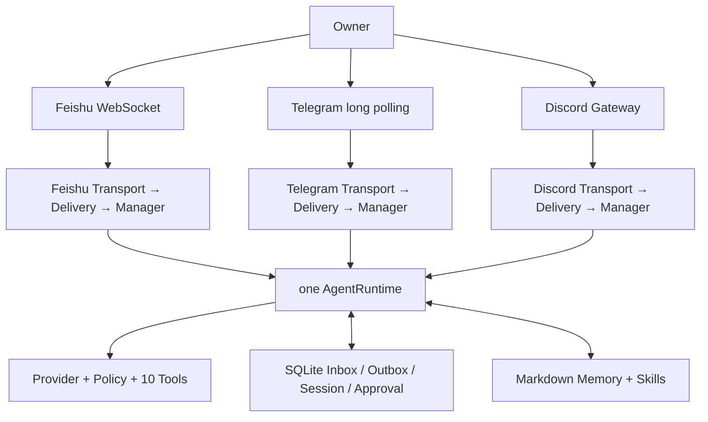

静态 preflight 是 all-or-none：任一 enabled Channel 缺 SDK、Token 或 Owner relationship 时，在创建 Provider、SDK
Client 和网络连接前失败。运行期则局部隔离：每个平台有独立 Transport、DeliveryWorker、ChannelManager、queue 和
Experience activity；断线只把当前 pipeline 标为 degraded。关停先关闭全部 admission，再以反向平台/反向组件顺序
清理，最后只关闭一次共享 AgentRuntime。

Approval durable payload 使用平台中立 v2 envelope；飞书旧 v1 Card 只读兼容。Telegram/Discord 当前用纯文本
fallback，所有决定仍由 Core SQLite 条件更新校验 Owner、TTL、scope 和单次 consume。

飞书 `cardAction` 使用同一个长期 WebSocket 连接。生产 Gateway 必须由外部 supervisor 持续保活；若进程在按钮点击时
不存在，平台没有本地回调接收者。macOS 用户级 LaunchAgent 因此使用 `KeepAlive=true`，让正常退出和异常退出都重新
拉起；Gateway lease 继续阻止两个实例同时处理同一套 Inbox/Outbox。

飞书 `progress_is_final` 路径使用 12px Markdown：短回答只完成一张卡片；超出 `message_max_chars` 时 Outcome 把
已展示字符偏移和 card message ID 交给 Manager，Outbox 只保存后缀并回复该卡片。启动恢复读取 SQLite 中的完整
Assistant Message，以稳定 progress UUID 再次取得并完成同一卡片。公开 model delta 会先限长缓冲，只有确定 Turn
completed 后才创建终态卡；因此即使 tool-call 轮次同时返回文本，waiting approval 也只发布 durable Approval card。

Feishu Live Runner 位于生产链旁边，不在生产链内部复制 Agent：

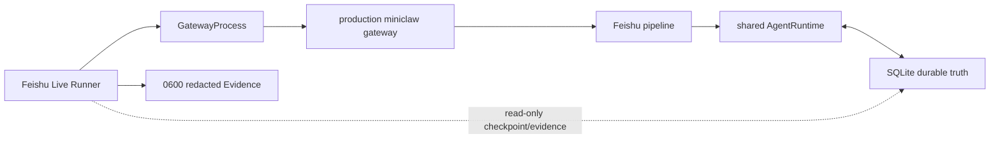

Runner 在 `--confirm-live` 前不读 config/state/secret，也不联网；确认后要求只有 Feishu enabled、clean commit、
Doctor 无 FAIL、0 旧 pending Approval。自动 evidence 失败时人工不能覆盖。它最多发送两次 SIGTERM，不发送
SIGKILL，不写假业务事实。

实现与测试细节见 [Phase 5 工程说明](../engineering/phase-5/20260808_telegram-discord-channels.md)、
[真实飞书 Bot 与 Live E2E](../engineering/phase-5/20260808_feishu-live-e2e.md)、
[测试与真实验收](../engineering/phase-5/20260808_testing-and-live-acceptance.md)、
[排障手册](../engineering/phase-5/20260808_troubleshooting.md)和
[完成性审计](../engineering/phase-5/20260808_completion-audit.md)。
