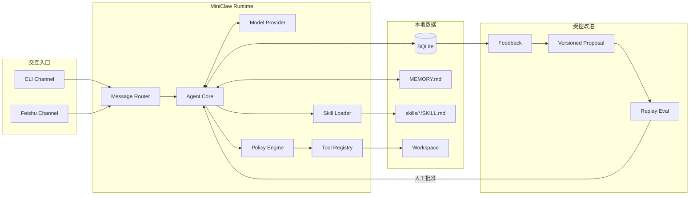
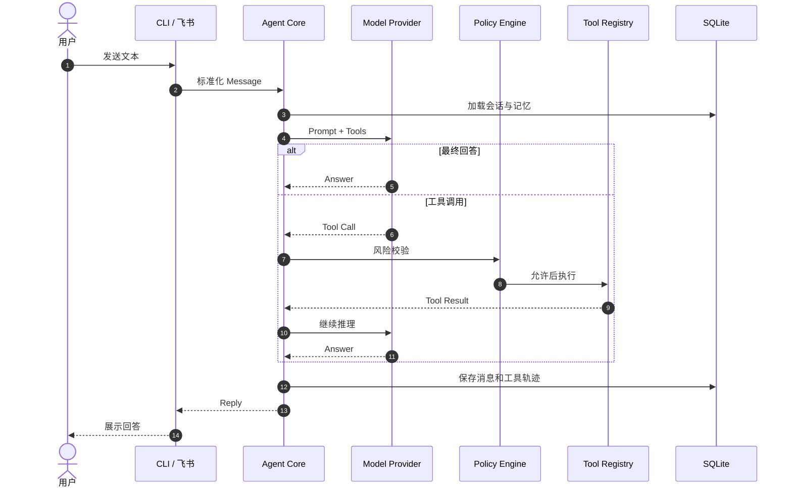

# MiniClaw 系统架构

## 当前状态

仓库当前只实现可安装的 Python 包和最小 CLI。下述模块是 PRD v0.1 的目标边界，会按里程碑逐步
实现，不代表当前代码已经具备模型调用、飞书、工具、数据库或演进能力。

## 总体架构



## 一条消息的目标链路



## 计划包布局

目录只在相应功能实现时创建，避免空接口和占位模块：

```text
src/miniclaw/
├── agent/       # 模型与工具循环
├── channels/    # CLI、飞书与统一消息
├── evolution/   # 反馈、评测、提案和回滚
├── policy/      # 路径、命令、风险与审批
├── providers/   # OpenAI-compatible 模型边界
├── storage/     # SQLite、记忆和版本记录
└── tools/       # 文件、HTTP、受限 Shell
```

## 核心约束

- 单用户、单进程、一个 SQLite、一个 Workspace。
- Channel 只转换消息，Agent Core 不依赖飞书 SDK。
- 所有工具在执行前统一经过 Policy Engine。
- 文件路径解析后必须仍位于 Workspace，Shell 不接受拼接字符串。
- 自我改进只修改版本化 Prompt 或 Skill，并经过回放评测和人工批准。
- Telegram 与 Discord 复用 Channel 边界，但不进入 v0.1。

详细数据模型、安全策略、部署图与演进流程见 [PRD](../product/20260807_产品需求文档.md)。
