# Lobster0 Memory Autopilot 能力 Gap 与重构架构

> 日期：2026-08-08
> 状态：**APPROVED DESIGN / PLANNED / NOT IMPLEMENTED**
> 事实基线：`main@729a801`，路线文档基线 `05cc917`
> 目标：让同一个 Owner 从 TUI、飞书、Telegram、Discord 进入时，使用同一套可追溯、可编辑、可恢复的记忆。

## 1. 先说结论

当前 Lobster0 **不是完全没有 Memory**。它已经有：

- 全渠道共享的 `MEMORY.md`；
- 今日/昨日 `memory/YYYY-MM-DD.md`；
- `read_memory` 与经审批的 `propose_memory`；
- SQLite Session、Message、Compaction 原始事实；
- 外部 Channel Identity 到本地 `user_id` 的映射。

真正的问题是：系统只在 Owner 明确说“记住”时才写入 daily Markdown，既不会自动从已完成对话提取记忆，也不会跨 Session 搜索原始历史。飞书第一次创建的新 Session 只能看到已经写入 Markdown 的内容；如果 CLI 中的事实从未被写入 Memory，它就像从没发生过。

本次重构采用 **Memory Autopilot（分级自动记忆）**：

1. 所有可信会话自动保留 L0 原始证据；
2. 模型在后台自动提取 L1 Memory Unit；
3. 普通、低风险事实自动进入短期记忆；
4. 重复出现或高置信度的普通偏好自动晋升；
5. 权限规则、敏感画像、冲突事实和行为改变必须由 Owner 批准；
6. 凭据、Token、验证码和私钥永不进入 Memory；
7. 已接受的记忆自动 flush 为 Markdown，并能沿来源回到原始消息；
8. 所有渠道按同一个 `owner_id` 检索，但群聊和非 Owner 不得获得私人记忆。

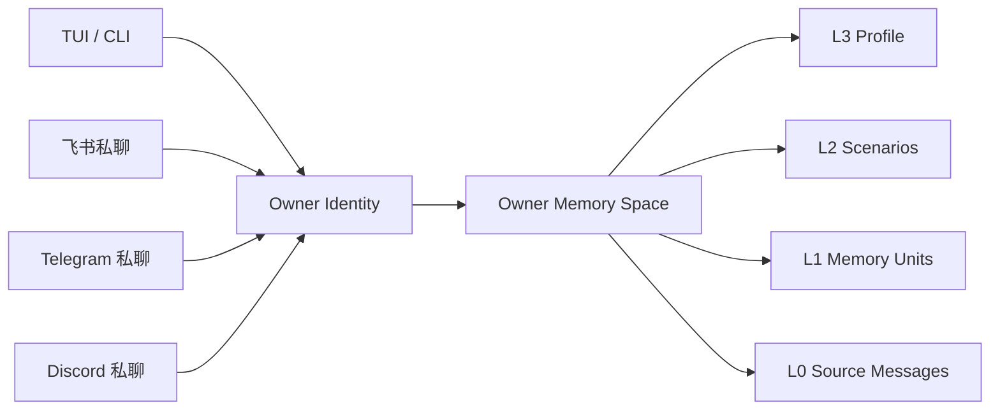

## 2. 用户痛点复现

### 2.1 当前发生了什么

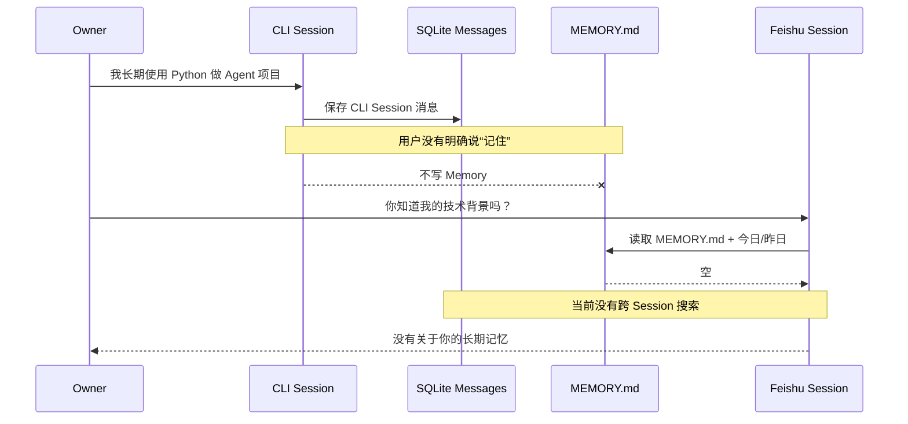

### 2.2 当前代码证据

| 位置 | 当前行为 | 结果 |
| --- | --- | --- |
| `src/lobster0/agent/context.py` | 每个 Turn 注入同一 `MemoryStore.snapshot()` | 已落盘 Memory 跨渠道共享 |
| `src/lobster0/agent/context.py` | System Prompt 要求只有 Owner 明确要求时才 `propose_memory` | 普通对话不会形成记忆 |
| `src/lobster0/memory/store.py` | 只读取 `MEMORY.md`、今日和昨日 | 更老内容无法自动检索 |
| `src/lobster0/tools/memory.py` | `read_memory` 只有三个固定 scope | 不能按问题搜索所有 Memory Unit |
| `src/lobster0/storage/conversations.py` | Message 按 `session_id` 查询 | 飞书 Session 看不到 CLI Session 历史 |
| `src/lobster0/storage/channels.py` | Channel Identity 已稳定映射 `user_id` | 已有跨渠道 Owner 主键，可作为重构基础 |
| `src/lobster0/agent/context.py` | 没有 requester trust/context 参数 | 当前 Memory 注入无法按私聊、群聊、非 Owner 精确隔离 |

最后一项是安全 Gap：即使 Tool Policy 已区分可信 Owner 私聊与其他场景，ContextBuilder 仍缺少同样的 Memory Disclosure 决策。重构必须把“是否允许注入私人记忆”变成 Core 的显式输入，不能只靠 Prompt 提醒模型不要泄露。

## 3. 参考项目的真实做法

### 3.1 EverOS

[EverOS](https://github.com/EverMind-AI/EverOS) 的关键价值不是“用了向量数据库”，而是把各类存储职责分开：

- Markdown 是可读、可编辑、可版本化的 Memory 真相源；
- SQLite 保存状态、审计、buffer、变更队列和崩溃恢复位置；
- LanceDB 是可重建的 BM25/向量检索索引；
- 消息先进入 buffer，在边界触发或 `/flush` 时形成 Memory；
- Episode 同步写 Markdown，Atomic Fact、Profile、Agent Case/Skill 在后台演进；
- 用户记忆和 Agent 经验是两条独立轨道；
- Reflection 后台合并片段，但采用软归档并保留来源。

参考：

- [EverOS Architecture](https://github.com/EverMind-AI/EverOS/blob/main/docs/architecture.md)
- [How Memory Works](https://github.com/EverMind-AI/EverOS/blob/main/docs/how-memory-works.md)
- [Storage Layout](https://github.com/EverMind-AI/EverOS/blob/main/docs/storage_layout.md)
- [Reflection](https://github.com/EverMind-AI/EverOS/blob/main/docs/reflection.md)

Lobster0 借鉴 Markdown-first、可重建索引、后台 flush 和来源追溯；首版不照搬独立 HTTP Server、LanceDB、多模型 Parser 和完整 Offline Memory Engine。

### 3.2 TencentDB Agent Memory

[TencentDB Agent Memory](https://github.com/TencentCloud/TencentDB-Agent-Memory) 把长期记忆组织为语义金字塔：

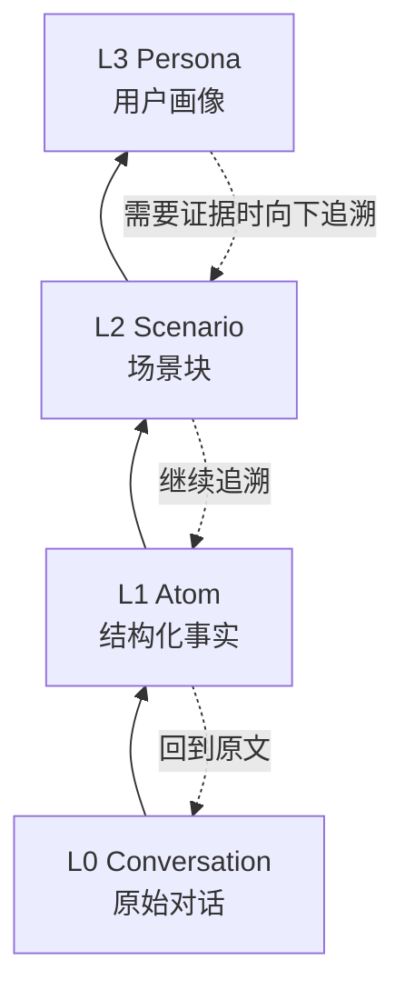

同时，它把长任务的工具输出卸载为 `refs/*.md`，用 JSONL 和 Mermaid 画布保存中高层结构，通过 `node_id` / `result_ref` 回到原始证据。其 OpenClaw 集成默认使用本地 SQLite + sqlite-vec，并提供 Keyword、Embedding、Hybrid 检索。

Lobster0 借鉴 L0→L3、渐进披露、混合检索方向和白盒调试；首版不把 Mermaid 当作唯一机器状态，也不直接引入外部 Gateway 服务。

### 3.3 OpenClaw

[OpenClaw Memory](https://github.com/openclaw/openclaw/blob/main/docs/concepts/memory.md) 同样使用 `MEMORY.md` 和 daily Markdown，并在 compaction 前执行 silent memory flush。其内置检索将 Markdown 切块后写入 per-agent SQLite，支持 FTS5、可选向量和 Hybrid Search。

Lobster0 已有同类文件，但缺少自动 flush、搜索索引、晋升、Dreaming/Reflection 和 Disclosure Policy。

## 4. 能力 Gap 总表

| Gap ID | 能力 | 当前 | 目标 | 优先级 |
| --- | --- | --- | --- | --- |
| MEM-ID-001 | Owner 跨渠道 Memory Space | 路径全局，但没有显式 Owner scope | 所有可信私聊映射同一 `owner_id` | P0 |
| MEM-ID-002 | Memory Disclosure | ContextBuilder 无 requester/trust 输入 | 私聊全量、群聊最小、非 Owner 无权限 | P0 |
| MEM-CAP-001 | 自动对话采集 | Message 已落 SQLite，未进入 Memory pipeline | completed Turn 自动进入 durable buffer | P0 |
| MEM-EXT-001 | 自动 Memory Unit 提取 | 无 | 严格 JSON 提取 + schema/sensitive 校验 | P0 |
| MEM-FLS-001 | 周期 flush | 无 | N Turn、idle、compaction、shutdown、手动触发 | P0 |
| MEM-FLS-002 | 崩溃恢复 | Markdown append 有锁，但无 flush ledger | exactly-once flush run + 可重试 outbox | P0 |
| MEM-LAY-001 | L0→L3 分层 | MEMORY + daily 两层 | Source→Unit→Scenario→Profile | P1 |
| MEM-RET-001 | 跨 Session 搜索 | 无 | Owner-scoped FTS5 + 来源过滤 +预算 | P0 |
| MEM-RET-002 | 中文检索 | 只能完整读取 | CJK trigram shadow text + exact fallback | P1 |
| MEM-PRO-001 | 自动晋升 | 无 | 低风险自动、高影响审批 | P1 |
| MEM-CON-001 | 冲突处理 | 只有文本 hash 去重 | contradiction set、supersede、valid time | P1 |
| MEM-FOR-001 | 遗忘与纠错 | 手工编辑文件 | forget/correct、索引删除、审计与恢复 | P1 |
| MEM-OBS-001 | 可观察性 | 只有 runtime memory hash | status、flush、recall、why、来源链 | P1 |
| MEM-EVAL-001 | 记忆质量门禁 | 两条 Memory eval | 跨渠道、召回、冲突、隐私、恢复基准 | P0 |
| MEM-VEC-001 | 向量检索 | 无 | 可选 Adapter；首版不作为必需依赖 | P2 |
| MEM-AGT-001 | Agent Case / Skill 轨道 | Skills 手工管理 | 与 Owner Memory 隔离的经验提案 | P2 |

## 5. 目标分层

### 5.1 L0 Source：原始证据

- 来源：现有 SQLite `messages`、Turn、ToolRun、InboundEvent；
- 作用：回放和证据，不直接全部塞进 Prompt；
- 作用域：`user_id + session_id + channel + message_id`；
- 保留策略：沿用会话存储策略；Memory 删除不应偷偷删除原始聊天，原始聊天删除另走 retention 流程；
- 安全：群聊消息、非 Owner 内容只可作为外部证据，不能自动形成 Owner Persona。

### 5.2 L1 Memory Unit：原子记忆

每个 Unit 只表达一个可独立验证的事实、偏好、目标、约束、承诺或事件。

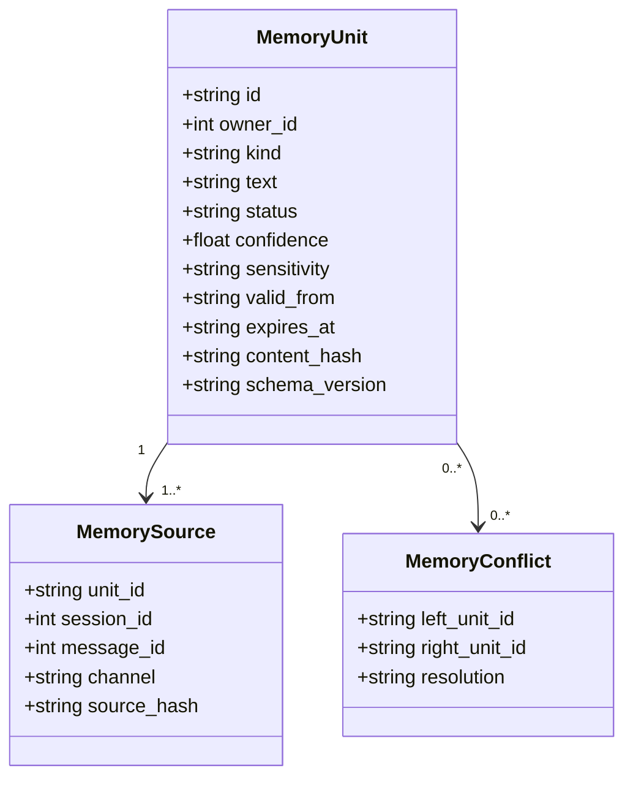

建议类型：

- `preference`：表达方式、技术选择、常用工具；
- `identity`：稳定个人背景；
- `goal`：长期目标；
- `project`：持续项目事实；
- `constraint`：非安全 Policy 的工作约束；
- `commitment`：带期限的跟进；
- `event`：有时间的经历；
- `relationship`：人物/组织关系，默认敏感；
- `decision`：已确认的长期决定。

### 5.3 L2 Scenario：场景叙事

把多个相关 Unit 组织成可读场景，例如“Lobster0 开源项目”“飞书机器人接入”“CLI 体验偏好”。Scenario 只保存摘要和 Unit 引用，不能成为无法回到证据的黑盒摘要。

### 5.4 L3 Profile：长期画像

Profile 是启动时注入的高信号小文件，只包含稳定偏好、背景和长期目标。它不是原始聊天，也不是所有事实合集。每条 Profile Claim 都必须列出来源 Unit ID、更新时间和适用条件。

## 6. Memory Autopilot 决策模型

### 6.1 两个维度，不是两个互斥模式

“全自动”描述的是采集和处理体验；“混合”描述的是最终生效治理。二者组合后形成：

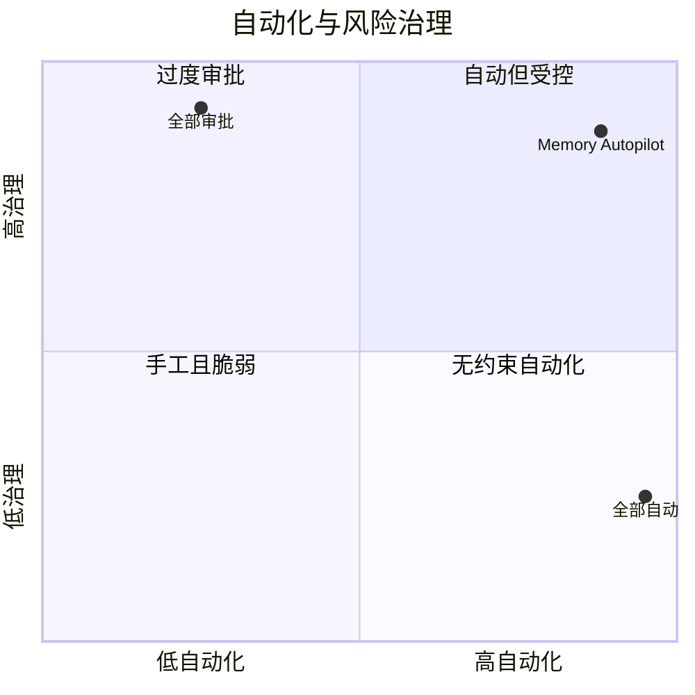

### 6.2 默认规则

| 输入 | 处理 | 审批 |
| --- | --- | --- |
| Owner 明确说“记住 X” | 直接生成 `confirmed` Unit 并 flush | 不再二次审批，用户指令本身即授权 |
| 普通低风险事实 | 自动生成 `short_term` Unit | 不需要 |
| 相同事实跨 Session 重复出现 | 提高置信度并自动晋升 `active` | 不需要 |
| 普通稳定偏好达到阈值 | 自动进入 Profile 候选并在周报展示 | 默认不阻塞 |
| 权限、审批、自动执行行为 | 只创建高风险候选 | 必须批准，且 Memory 不能替代 Policy |
| 医疗、财务、法律、关系、精确位置 | 只创建敏感候选 | 必须批准 |
| 与 Active Unit 冲突 | 创建 conflict set | 必须确认或等待新证据 |
| 密码、Token、验证码、私钥 | 不创建候选 | 永久拒绝 |

### 6.3 状态机

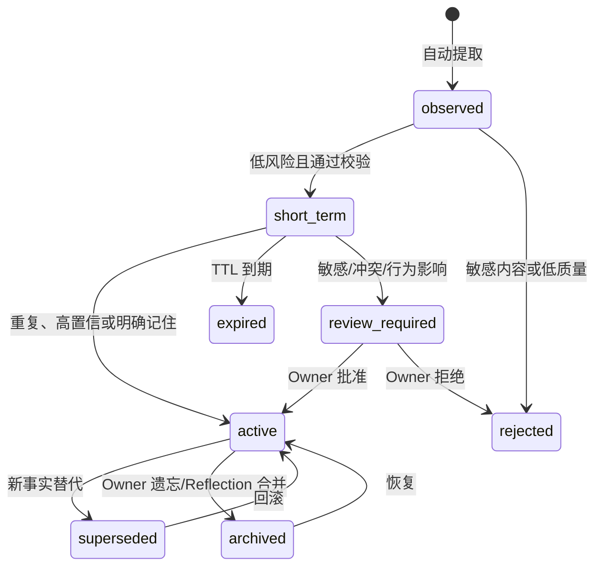

## 7. 跨渠道身份与隐私

### 7.1 同一 Owner 的私聊共享

`ChannelIdentity.user_id` 是 Memory Space 的唯一主键。Channel、账号和 Session 只作为来源过滤条件，不创建四套 Owner Profile。

### 7.2 Disclosure Policy

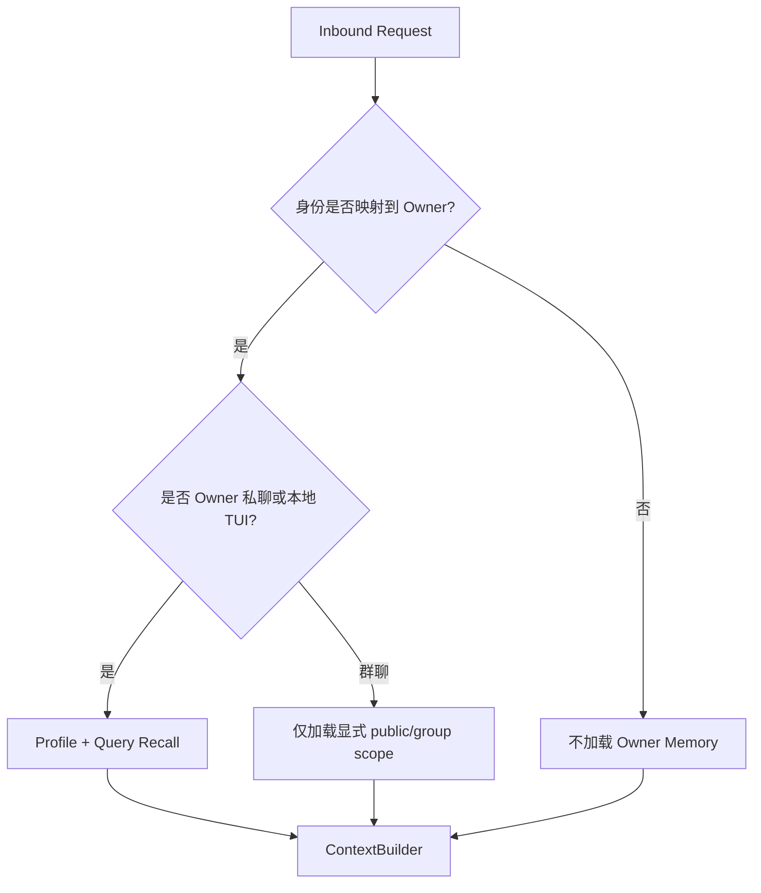

规则：

- 本地 TUI/CLI、Owner 私聊：允许完整 Owner Memory；
- Owner 群聊：默认不加载私人 Profile，只允许显式 group/public Unit；
- 其他白名单用户：不加载 Owner Memory，也不能通过 Tool 搜索；
- 身份不确定：fail closed；
- Model Tool Call 不能自己把 `owner_id` 改成别人的 ID；
- 召回结果必须先经过 Core Disclosure，再进入模型上下文。

## 8. 写入与 Flush

### 8.1 触发条件

- 每累计 5 个完成的 Owner 私聊 Turn；
- Session 空闲 10 分钟；
- `/new`、`/reset`；
- compaction 前；
- Gateway 优雅关闭前；
- Gateway 启动时恢复已到期 flush；
- 每日整理与每周 Profile Review；
- Owner 手动执行 `/memory flush`。

这些触发器都写入同一个 durable flush ledger，不能各自直接写文件。

### 8.2 数据流

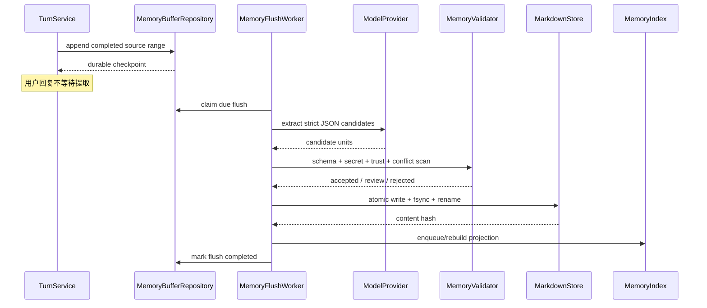

### 8.3 一致性原则

- 对话事实以现有 SQLite 为准；
- 已接受的 Memory Asset 以 Markdown 为准；
- candidate、flush ledger、审计和索引状态存在 SQLite；
- FTS/向量索引必须能从 Markdown 重建；
- Markdown 写入成功、索引失败时，召回暂时降级但 Memory 不丢；
- 同一 source range + extractor version + prompt hash 只能生成一次成功 flush；
- 进程崩溃后恢复 `queued/retry_wait`，不重放已完成文件写入。

## 9. Markdown 布局

```text
~/.lobster0/memory/
├── owners/
│   └── 1/
│       ├── profile.md
│       ├── episodes/
│       │   └── 2026-08-08.md
│       ├── facts/
│       │   └── 2026-08-08.md
│       ├── commitments/
│       │   └── active.md
│       ├── reviews/
│       │   └── 2026-W32.md
│       └── archive/
├── agent/
│   ├── cases/
│   └── skills/
├── .index/
│   └── memory.sqlite
└── .tmp/
```

现有 `~/.lobster0/MEMORY.md` 在迁移期保留，只读并导入为 `source=legacy_manual` 的 confirmed Unit；完成校验前不删除或覆盖。

## 10. 检索与上下文注入

### 10.1 渐进披露

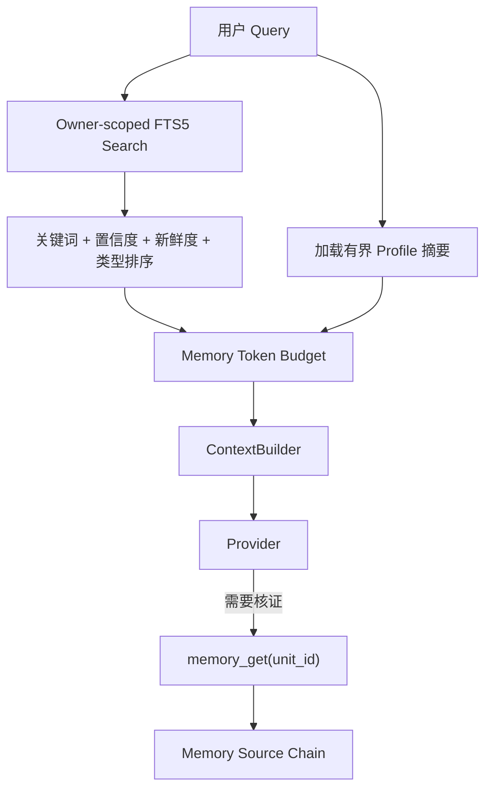

- Profile 只在 Owner 私聊自动注入，且严格有界；
- Query recall 默认 5 条，每条和总字符数都有限；
- 不把所有 daily 文件注入每个 Turn；
- 精确 ID、代码符号和人名优先 Keyword；
- 普通中文查询使用规范化 CJK trigram shadow text；
- 召回必须返回 `unit_id`、类型、时间、置信度和安全来源摘要；
- 模型回答“你为什么知道”时可以调用 `memory_get` 下钻。

### 10.2 为什么首版不用向量数据库

单 Owner 初期数据量小，SQLite FTS5 足以验证正确性、隔离、来源和排序。先引入 Embedding 会增加 Provider 成本、模型迁移、重建、隐私和离线可用性问题。

首版保留 `MemoryRetriever` Adapter；当离线评测证明 FTS5 召回不足时，再增加可选 Embedding + RRF，不改变 Markdown Schema 和 Tool Contract。

## 11. 冲突、纠错和遗忘

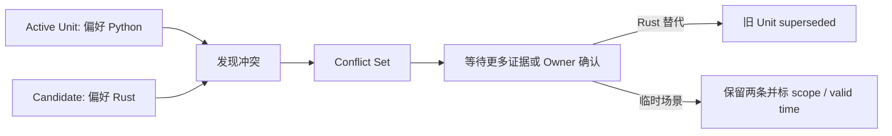

- 新事实不能直接覆盖旧文件；
- 偏好变化使用 `superseded_by`；
- 同时成立的场景偏好使用 scope；
- `forget` 先做预览，再归档 Unit、删除索引投影并重写受影响 Profile；
- 批量遗忘、敏感画像删除和会话原文删除是不同操作；
- 被归档内容默认不召回，但保留安全审计；用户要求彻底删除时按 retention 流程物理清除。

## 12. 安全边界

### 12.1 永不进入 Memory

- API Key、Token、Cookie、验证码；
- 密码、私钥、密钥库内容；
- 浏览器 Session、系统凭据；
- 原始长篇私人聊天全文作为“画像”；
- 非 Owner 在群聊中的个人信息；
- 外部网页、邮件或 Tool 输出中的指令性内容。

### 12.2 Prompt Injection

外部内容可以作为 L0 Evidence，但默认 `trust=untrusted_external`。Extractor 必须把它当数据，不能把“记住并执行以下指令”升级为 Owner Constraint。只有可信 Owner 的明确输入可以授权行为相关 Memory 候选。

### 12.3 Memory 不是 Policy

“允许以后自动发送消息”即使被记住，也不能绕过 Approval、Policy、Sandbox 或 Channel 权限。Memory 只为 Agent 提供上下文，硬权限仍由现有 PolicyEngine 决定。

## 13. 可观察性

用户和开发者至少需要：

| 能力 | 输出 |
| --- | --- |
| `/memory status` | buffer 数、待 flush、active/short-term/review 数、索引版本 |
| `/memory list` | 按类型、状态、时间列出安全摘要 |
| `/memory search <query>` | 召回排序、分数构成、Unit ID |
| `/memory why <unit-id>` | 来源 Session/Message 的脱敏引用与晋升原因 |
| `/memory flush` | 触发一次有界 flush，返回 run ID |
| `/memory forget <unit-id>` | 预览影响并执行归档/删除 |
| TUI Activity | `memory.buffered/extracted/flushed/recalled/review_required` |
| Audit | 不含正文的 owner、unit hash、状态迁移、版本和 error code |

## 14. 失败与降级

| 故障 | 行为 |
| --- | --- |
| Extraction Provider 失败 | 用户 Turn 正常完成，flush 进入 retry_wait |
| Markdown 写入失败 | 不更新 completed checkpoint，不丢 buffer |
| SQLite 索引失败 | Markdown 保留；keyword recall 降级并等待重建 |
| Markdown 被手工改坏 | 隔离该文件、报告 lint error，不覆盖原文件 |
| 身份映射冲突 | 不加载和不写 Owner Memory |
| 召回超预算 | 稳定裁剪低分 Unit，不截断 Profile Claim 或当前 Query |
| Profile 生成失败 | 继续使用旧 Profile，不写半成品 |
| shutdown 超时 | flush ledger 保留，下次启动恢复 |

## 15. 验收场景

### 15.1 核心用户场景

1. 在 TUI 说“我主要使用 Python 开发 Agent”，不说“记住”；完成 flush 后，在飞书私聊提问能召回并给出来源。
2. 在飞书明确说“记住我希望默认用中文”，立即形成 confirmed Unit；下一次 TUI Turn 自动使用。
3. 在 Discord 说一次临时偏好，不立即改写长期 Profile；跨 Session 重复后才自动晋升。
4. 在群聊询问个人偏好，Lobster0 不注入或泄露 Owner 私人 Memory。
5. 白名单非 Owner 私聊不能读取 Owner Memory。
6. 新事实与旧事实冲突时不静默覆盖，进入 review。
7. Gateway 在 Markdown 写入后、索引前崩溃；重启能重建且不重复 Unit。
8. 直接编辑 Markdown 后，索引可增量同步或显式 rebuild。
9. Provider 不可用时对话正常，buffer 不丢，恢复后补 flush。
10. 密钥形态、外部 Prompt Injection 和他人画像全部被拒绝。

### 15.2 质量门禁

| 指标 | v1 退出条件 |
| --- | --- |
| 跨渠道 Owner Recall | 规定场景 100% |
| 非 Owner / 群聊私人记忆泄露 | 0 |
| 凭据写入 | 0 |
| 虚构来源 | 0 |
| Crash duplicate Unit | 0 |
| 明确“记住”持久化 | 100% |
| 明确“忘记”默认召回 | 0 |
| 中文事实检索 | 固定回归集 ≥ 90% Recall@5 |
| 召回注入预算 | 100% 不超配置 |
| 每条 Active/Profile Claim 来源可追溯 | 100% |

## 16. 建议交付顺序

Memory Autopilot 是跨渠道人格连续性的基础，建议在 Phase 5.3 Live Gate 收口之后、Phase 6 自治任务之前落地 A～E：

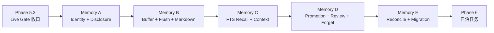

Phase 7 仍负责更高级的自我进化、Memory Reflection 与 Skill 提案；不再承担“跨渠道完全失忆”这个基础缺口。

## 17. 明确不做

- v1 不引入独立 Memory HTTP Server；
- v1 不要求 LanceDB、Elasticsearch、MongoDB 或云数据库；
- v1 不自动生成可执行 Skill；
- v1 不让 Memory 修改 Policy、源代码或部署；
- v1 不把所有聊天无脑复制进 Prompt；
- v1 不用一段不可追溯的摘要覆盖原始证据；
- v1 不承诺跨设备云同步；Markdown 目录可先由用户自己的备份方案同步。

## 18. 配套文档

- [Memory Autopilot 最佳实践与技术选型](../engineering/20260808_memory-autopilot-best-practices-and-technology-selection.md)
- [Memory Autopilot 正式设计 Spec](../superpowers/specs/2026-08-08-memory-autopilot-design.md)
- [Memory Autopilot A～E TDD 实施计划](../superpowers/plans/2026-08-09-memory-autopilot.md)
- [现有 Phase 3 Memory 实现](../engineering/phase-3/20260808_memory-skills-compaction.md)
- [OpenClaw / Hermes 总体能力 Gap](20260808_OpenClaw-Hermes能力Gap与演进路线.md)
