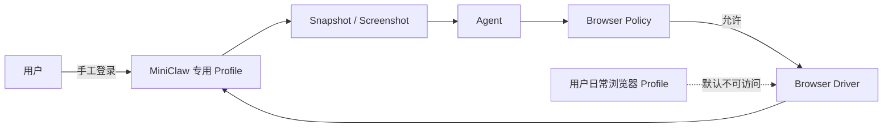
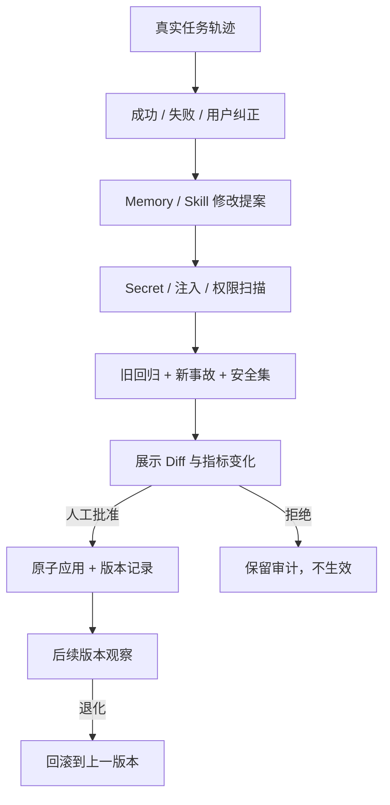
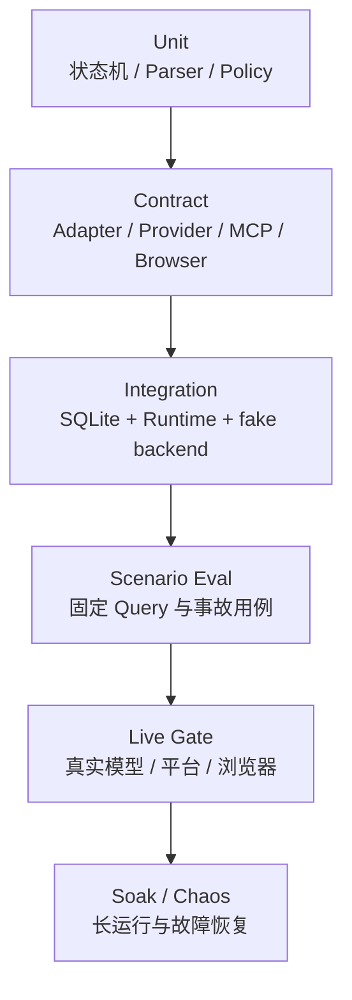

# MiniClaw 与 OpenClaw / Hermes 的能力 Gap 与演进路线

> 日期：2026-08-08
> 文档类型：产品与工程 Gap 分析
> 当前事实基线：`main@729a801`
> 当前状态：Phase 5 **IMPLEMENTATION PASS**；Feishu **OWNER-DM DELIVERY VERIFIED / 15-CASE LIVE PENDING**；Telegram / Discord **LIVE PENDING**
> 目的：回答“MiniClaw 下一步究竟该学什么”，并把开源参考转成可测试、可回滚的工程边界。

## 1. 先用大白话说明

MiniClaw 现在已经像一个“你叫它，它就能干活的新员工”：

- 可以从 TUI、飞书、Telegram、Discord 接收消息；
- 可以调用模型、文件、命令、HTTPS 和 Memory Tool；
- 会记录会话、工具调用、审批和消息投递；
- 有 `safe / smart / autopilot / yolo` 四档权限；
- 有 Markdown Memory、按需 Skills 和上下文压缩；
- 有离线回归、Channel 回归、真实飞书验收 Runner。

但 OpenClaw 和 Hermes 更像“长期在线、会主动跟进、会整理经验的私人管家”。MiniClaw 当前主要还缺五种能力：

1. **长期自治**：定时任务、Heartbeat、后台任务、主动通知；
2. **现实世界操作**：浏览器点击、输入、截图和视觉验证；
3. **受控学习**：从反馈和失败中提出 Memory/Skill 修改，经评测和人工批准后生效；
4. **更强安全与恢复**：OS Sandbox、资源预算、文件快照、回滚和 24×7 运维；
5. **扩展与韧性**：MCP、标准 Skills、Provider fallback、Sub-agent 和多模态。

这份路线不追求把 OpenClaw 和 Hermes 的功能数量全部复制过来。MiniClaw 的差异化目标是：

> 用更小、更容易读懂的 Python Core，证明一个个人 Agent 的每次行动和每次“进化”都可以被审计、评测、批准和回滚。

## 2. 当前能力基线

以下只计算已经进入 `main` 且有测试证据的能力，不把本地未提交内容、假 SDK 或规划文档当成完成。

| 能力域 | MiniClaw 当前状态 | 代码或证据入口 |
| --- | --- | --- |
| Agent Core | OpenAI-compatible Provider、原生 Tool Calling、最多 8 轮工具循环 | `src/miniclaw/agent/`、`src/miniclaw/providers/` |
| TUI | Python Core + TypeScript pi-tui、NDJSON v1、流式回答、Trace、审批、真实遥测 | `src/miniclaw/bridge/`、`tui/` |
| Tool | 系统信息、文件读写、搜索、HTTPS GET、exact-argv 命令、Memory | `src/miniclaw/tools/` |
| 安全 | Workspace/Personal Guard、敏感路径硬拒绝、四档权限、参数绑定审批 | `src/miniclaw/policy/` |
| Memory | `MEMORY.md`、daily memory、审批写入、凭据过滤 | `src/miniclaw/memory/` |
| Skills | `SKILL.md` metadata 扫描、确定性匹配、最多加载 3 个正文 | `src/miniclaw/skills/` |
| 长上下文 | 80% 阈值压缩、保留原消息、最近 Turn 和 Approval 保护 | `src/miniclaw/agent/compaction.py` |
| Channel | 飞书、Telegram、Discord 独立 Transport，共享 Agent Runtime | `src/miniclaw/channels/` |
| 消息可靠性 | SQLite Inbox/Outbox、幂等、重试、恢复、Delivery 状态 | `src/miniclaw/storage/channels.py` |
| 评测 | 520 Python、30 TypeScript、28 Agent、32 Channel、640 soak | `evals/`、`tests/` |
| 真实平台 | 飞书 App/Bot/WebSocket 和两条 Owner DM Delivery 已验证 | `docs/engineering/phase-5/feishu-gateway-runtime-and-macos-service.md` |

## 3. 参考项目分别值得学什么

### 3.1 OpenClaw：学习“长期运行的操作系统”

OpenClaw 最值得学习的不是某个按钮，而是它把个人 Agent 拆成清晰的运行机制：

| OpenClaw 能力 | MiniClaw 应吸收的工程思想 | 不直接照搬的部分 |
| --- | --- | --- |
| [Automation](https://docs.openclaw.ai/automation) | Cron、Heartbeat、Background Task、Hooks 使用不同语义，不用一个万能定时器 | 不一次实现所有 Task Flow 语法 |
| [Browser](https://docs.openclaw.ai/browser) | Agent 专用浏览器 Profile、稳定 snapshot/ref、可见截图和人工登录 | 不控制用户日常浏览器 Profile |
| [Memory](https://docs.openclaw.ai/concepts/memory) | USER/MEMORY/daily 分层、搜索、晋升、衰减和来源 | 不先引入复杂知识图谱 |
| [Skills](https://docs.openclaw.ai/tools/skills) | 标准目录、按需加载、安装验证、权限和 Secret 边界 | 不先建设公开 Skill 市场 |
| [Plugins](https://docs.openclaw.ai/plugins) | Channel/Provider/Tool/Hook 有稳定扩展契约 | 不让第三方插件直接无审计地进程内执行 |
| [Model failover](https://docs.openclaw.ai/model-failover) | 认证轮换、错误分类、Fallback chain、Session stickiness | 不做不可解释的自动模型切换 |
| [Sub-agents](https://docs.openclaw.ai/subagents) | 独立 Session、受限 Tool、后台完成回传、成本预算 | 不在单 Agent 未稳定前做多层嵌套 |
| [Nodes](https://docs.openclaw.ai/nodes) | Gateway 和执行设备分离、设备配对和能力声明 | v1 不做手机、摄像头和地理位置 |

### 3.2 Hermes：学习“受控学习和个人连续性”

Hermes 最值得学习的是把记忆、历史检索和 Skills 连成一个学习闭环：

| Hermes 能力 | MiniClaw 应吸收的工程思想 | 不直接照搬的部分 |
| --- | --- | --- |
| [Persistent Memory](https://hermes-agent.nousresearch.com/docs/user-guide/features/memory/) | 小而稳定的核心记忆 + 大而按需的 Session Search | 不把所有历史都塞进 Prompt |
| [Skills System](https://hermes-agent.nousresearch.com/docs/user-guide/features/skills) | 复杂任务、纠错和成功路径可形成 Skill 提案 | Agent 不能直接无审批改生产 Skill |
| [Scheduled Tasks](https://hermes-agent.nousresearch.com/docs/user-guide/features/cron) | 新 Session 执行、Skill 绑定、投递目标、无模型脚本任务 | 不允许定时任务递归创建无限任务 |
| [Browser](https://hermes-agent.nousresearch.com/docs/user-guide/features/browser) | 可访问性树、截图/视觉兜底、Cloud/Local backend 抽象 | 首版只实现本地 Chromium |
| [Security](https://hermes-agent.nousresearch.com/docs/user-guide/security/) | 用户授权、命令审批、写入保护、容器、跨 Session 隔离 | 不把 `yolo` 当成安全边界 |
| [Sessions](https://hermes-agent.nousresearch.com/docs/user-guide/sessions/) | SQLite 历史、FTS5 搜索、Token/来源/父 Session 元数据 | 不引入第二套事实存储 |
| Checkpoint / rollback | 修改工作区前创建可恢复快照 | 不默认对整个 Home 做快照 |

### 3.3 其他 Claw-like 项目：辅助参考

| 项目 | 重点参考 | MiniClaw 的取舍 |
| --- | --- | --- |
| [nanobot](https://github.com/HKUDS/nanobot) | 小 Agent Loop、Python 可读性、轻量 Memory/MCP/部署 | 保持 Python Core 小而清楚 |
| [ZeroClaw](https://github.com/zeroclaw-labs/zeroclaw) | OS Sandbox、风险档位、Tool receipt、单二进制部署 | 学安全分层，不为追求单二进制重写 Rust |
| [RayClaw](https://github.com/rayclaw/rayclaw) | Channel Adapter、定时任务、MCP、跨 Channel identity | 保持现有 durable Inbox/Outbox 为权威链路 |

## 4. Gap 总表

状态定义：

- `DONE`：已经进入 main 且有确定性测试；
- `PARTIAL`：存在基础能力，但还没有形成用户闭环；
- `GAP`：尚无生产实现；
- `LIVE PENDING`：代码已有，但缺少真实外部证据。

| ID | 能力 | 当前 | 目标 | 优先级 | 计划 Phase |
| --- | --- | --- | --- | --- | --- |
| GAP-OPS-001 | 飞书完整真实验收 | 两条 Owner DM | 15/15、重连、审批、群聊、长消息 | P0 | 5.2 |
| GAP-OPS-002 | 常驻服务 | 有手工 launchd/VPS 文档 | 一键安装、状态、日志、升级、卸载 | P0 | 5.2 |
| GAP-OPS-003 | 长期稳定性 | 本地 640-check | 24h/7d soak、故障注入、SLO | P0 | 5.2 |
| GAP-AUTO-001 | 定时任务 | GAP | one-shot、interval、cron、时区 | P0 | 6 |
| GAP-AUTO-002 | Heartbeat | GAP | 合并检查、静默 ACK、活跃时段 | P1 | 6 |
| GAP-AUTO-003 | 后台任务账本 | GAP | durable state、取消、重试、恢复、投递 | P0 | 6 |
| GAP-AUTO-004 | Event Hooks | GAP | 生命周期事件触发受限动作 | P2 | 6 |
| GAP-SAFE-001 | OS Sandbox | 应用级 Policy | Docker/Seatbelt backend、非 root、资源硬限制 | P0 | 6 |
| GAP-SAFE-002 | Checkpoint/rollback | 文件工具原子写 | 有界工作区快照和显式回滚 | P1 | 6 |
| GAP-WEB-001 | 浏览器操作 | 只读 `http_get` | snapshot/click/type/scroll/screenshot | P1 | 6.5 |
| GAP-WEB-002 | 浏览器登录隔离 | GAP | Agent Profile、手工登录、权限提示 | P1 | 6.5 |
| GAP-WEB-003 | 视觉验证 | GAP | screenshot + vision model 可选兜底 | P2 | 9 |
| GAP-EVO-001 | 反馈采集 | Schema 已存在，未接线 | `/good`、`/bad`、原因和轨迹引用 | P1 | 7 |
| GAP-EVO-002 | 修改提案 | Schema 已存在，未接线 | Memory/Skill diff、来源、版本和风险 | P1 | 7 |
| GAP-EVO-003 | 评测门禁 | 有通用 eval | Proposal 自动跑旧集+事故集+安全集 | P1 | 7 |
| GAP-EVO-004 | 应用与回滚 | GAP | 人工批准、原子应用、一键回滚 | P1 | 7 |
| GAP-MEM-001 | 跨会话搜索 | GAP | Owner-scoped FTS5、分页、来源和时间 | P0 | Memory Autopilot |
| GAP-MEM-002 | 记忆治理 | PARTIAL | short-term/active/superseded、晋升、衰减、冲突 | P0 | Memory Autopilot |
| GAP-MEM-003 | 跨渠道身份与披露 | PARTIAL | 同 Owner 私聊共享；群聊/非 Owner fail closed | P0 | Memory Autopilot |
| GAP-MEM-004 | 自动 Flush 与 Markdown 投影 | GAP | durable buffer、崩溃恢复、周期落盘、可重建索引 | P0 | Memory Autopilot |
| GAP-SKILL-001 | 标准 Skill | 本地最小格式 | AgentSkills 兼容、依赖/权限声明 | P2 | 8 |
| GAP-SKILL-002 | Skill 安装信任 | GAP | staging、hash、scan、approve、version | P1 | 8 |
| GAP-MCP-001 | MCP Client | GAP | stdio/HTTP、Tool allowlist、凭据过滤 | P1 | 8 |
| GAP-PROV-001 | Provider fallback | 单 Provider | 错误分类、候选链、冷却、Session stickiness | P1 | 8 |
| GAP-PROV-002 | 成本预算 | 只显示 usage | per-turn/task/day 预算和熔断 | P1 | 8 |
| GAP-SUB-001 | Sub-agent | GAP | 独立 Session、受限 Tool、完成回传 | P2 | 9 |
| GAP-MEDIA-001 | 图片消息 | GAP | TUI/IM attachment、vision request | P2 | 9 |
| GAP-MEDIA-002 | 语音 | GAP | transcription/TTS，按 Channel 能力降级 | P3 | 9 |
| GAP-MULTI-001 | Multi-agent persona | 单 Agent | 独立 workspace/state/binding | P3 | v2 |
| GAP-NODE-001 | 远程设备 Node | GAP | 配对、能力声明、远程执行审批 | P3 | v2 |

## 5. 优先级为什么这样排

### 5.1 先把 Phase 5 做实，不急着堆新功能

飞书已经证明真实 DM 可以穿过 Inbox、Agent 和 Outbox，但完整 15-case、长期运行和异常恢复还没有真实证据。如果在这里直接加入 Cron、Browser 和自我改进，故障面会同时扩大，定位会更难。

Phase 5.2 的退出条件不是“代码能启动”，而是：

- 飞书 15/15 全部通过；
- Gateway 由系统服务常驻；
- 崩溃、断网、限流和重启都有明确恢复结果；
- 至少完成一次 24 小时 soak；
- 日志、SQLite、Evidence 中无 Secret；
- 本地 TUI 和飞书同时使用时不互相破坏。

### 5.2 自治和安全必须一起做

定时任务会在用户不盯着屏幕时运行，因此不能先做 Cron、以后再补安全。Phase 6 必须同时交付：

- Scheduler；
- Durable Task Ledger；
- per-task Policy/Tool/Token/时间预算；
- Sandbox backend；
- checkpoint/rollback；
- 主动投递和静默语义；
- 重启恢复和幂等。

### 5.3 浏览器必须使用独立 Profile

浏览器包含登录态、Cookie、下载文件和现实世界副作用。首版只允许 MiniClaw 管理自己的 Chromium Profile：

### 5.4 自我改进必须经过固定闸门

MiniClaw 不能把“模型说自己变好了”当作进化成功。唯一允许的生产路径是：

## 6. 分阶段路线

### Phase 5.2：生产稳定化

**用户能感受到的结果**：MiniClaw 在 Mac 后台一直运行，飞书消息稳定有回复，断网和重启后不会重复执行。

**范围**：

- 飞书 15/15 live gate；
- `miniclaw service install|status|logs|restart|uninstall`；
- launchd 与 Docker Compose；
- `/healthz` 只绑定 loopback，或使用本地 status socket；
- 24h soak 和故障注入；
- 发布证据与 Secret scan。

### Memory Autopilot：跨渠道连续性基础

**用户能感受到的结果**：在 TUI 说过的稳定偏好，完成后台 Flush 后能在飞书、Telegram 和 Discord 的
Owner 私聊中召回；群聊和其他用户看不到私人记忆。

**范围**：

- Owner Identity 与 Memory Disclosure；
- durable buffer、自动提取与原子 Markdown Flush；
- FTS5/CJK 检索与有界 Context 注入；
- 明确“记住”立即保存，普通事实分级自动晋升；
- 敏感/冲突/行为影响 Review；
- forget、来源下钻、direct-edit reconcile 与 legacy migration。

完整设计见 [Memory Autopilot 能力 Gap](20260808_Memory-Autopilot能力Gap与重构架构.md)和
[工程技术选型](../engineering/memory-autopilot-best-practices-and-technology-selection.md)。高级 Reflection、
Agent Case 与 Skill 进化仍留在 Phase 7。

### Phase 6：自治运行与安全边界

**用户能感受到的结果**：可以说“每天 9 点整理飞书文档并发给我”，任务在重启后仍存在。

**范围**：

- one-shot / interval / cron；
- Heartbeat；
- durable background task；
- 任务取消、暂停、恢复、重试；
- Channel 主动投递；
- Docker/Seatbelt Sandbox backend；
- 任务级 Token、Tool、时间和费用预算；
- checkpoint/rollback。

### Phase 6.5：Browser Agent

**用户能感受到的结果**：MiniClaw 能打开专用浏览器，查页面、点击、填写、截图并验证结果。

**范围**：

- 本地 Chromium/CDP；
- 独立 Profile；
- snapshot/ref；
- navigate/click/type/press/scroll/screenshot；
- 下载有界落盘；
- 登录、提交和上传审批；
- Prompt Injection 标记；
- 虚拟站点和 live smoke。

### Phase 7：受控学习与 Memory Reflection

**用户能感受到的结果**：当你纠正 MiniClaw 后，它可以提出改进方案；只有测试通过并经你批准才会生效。

**范围**：

- `/good`、`/bad` 和原因；
- Memory Reflection、Episode/Scenario 合并与来源保持；
- Agent Case、Skill proposal 与 Memory/Skill 联动；
- eval gate；
- diff review；
- apply/rollback；
- 版本发布记录。

### Phase 8：生态与 Provider 韧性

**用户能感受到的结果**：可以安全接入 MCP 和标准 Skill；模型服务异常时有可解释的备用路线。

**范围**：

- AgentSkills 兼容；
- Skill staging、扫描、安装、升级和撤销；
- MCP stdio/HTTP Client；
- MCP Tool allowlist 和 Secret scope；
- Provider chain、auth pool、cooldown；
- Token/费用预算；
- 可观测的 fallback 事件。

### Phase 9：Sub-agent 与多模态

**用户能感受到的结果**：复杂任务可以拆成受限后台子任务；可以理解图片，语音作为可选能力。

**范围**：

- depth-1 Sub-agent；
- isolated/fork context；
- 子任务独立 Tool allowlist 和预算；
- 完成回传与审计；
- 图片附件、Vision；
- 可选 STT/TTS；
- Channel capability 降级。

## 7. 横向工程原则

所有 Phase 都必须遵守：

1. **SQLite 是运行事实源**：状态不能只放内存或日志；
2. **模型不能扩大权限**：Prompt、Skill、网页和历史消息都不改变 Core Policy；
3. **副作用必须幂等**：重启或重试不能重复发消息、写文件或提交表单；
4. **不可信输入有标记**：网页、IM、Skill、MCP 和历史内容都带 provenance；
5. **所有输出有预算**：文本、文件、截图、Tool Result、Token、时间和并发都有上限；
6. **先保存、再执行**：Task、Approval、Delivery、Proposal 都先持久化；
7. **状态机单向迁移**：不使用模糊布尔值拼状态；
8. **真实平台不进普通 CI**：fake/contract/live 分层；
9. **每个事故形成回归**：没有 case ID 的修复不算完整；
10. **文档不冒充实现**：`PLANNED`、`IMPLEMENTATION PASS`、`LIVE VERIFIED` 分开写。

## 8. 每个 Phase 的通用测试金字塔

门禁要求：

- Unit/Contract/Integration 每次提交执行；
- Scenario Eval 每次合并执行；
- Live Gate 发布候选执行；
- Soak 在大版本或运行时变更执行；
- 安全不变量任何一项失败都不能被平均分掩盖。

## 9. 明确不做或延后

以下能力不是当前学习主线：

- 不先增加几十个 Channel；
- 不先做公开 Skill 市场；
- 不先做多人 SaaS 和 RBAC；
- 不先做多层递归 Agent 群；
- 不让 Agent 自动修改、提交和部署 Core 源码；
- 不允许浏览器自动输入密码或读取用户日常 Profile；
- 不把 `yolo` 当作绕过敏感路径、SSRF 或 Sandbox 的开关；
- 不为了“像 OpenClaw”而重写 Python Core；
- 不在没有使用数据前引入向量数据库集群或知识图谱。

## 10. 成功标准

完成这条路线后，MiniClaw 应能通过下面这段真实场景：

> 用户在飞书说：“每周五下午 5 点，统计我这周创建的飞书文档，打开管理页面核对数量，生成中文总结。如果失败就告诉我原因；如果你发现有更稳定的做法，先提出 Skill 修改并跑完回归，等我批准后再应用。”

系统必须证明：

1. 定时任务真实持久化；
2. 到点后在隔离 Session 执行；
3. `lark-cli` 或 Browser 经过同一个 Policy；
4. 浏览器只使用 Agent Profile；
5. 结果经过 durable Delivery 发回飞书；
6. 失败可恢复且不重复副作用；
7. 改进只生成 Proposal；
8. Proposal 跑完固定回归与新增事故用例；
9. 用户批准后版本化生效；
10. 新版本退化时可以回滚。

达到这个标准时，MiniClaw 才真正从“会执行工具的聊天 Agent”变成“长期在线、可控进化的个人 Agent”。
