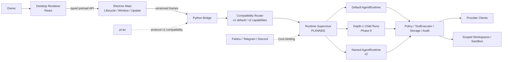
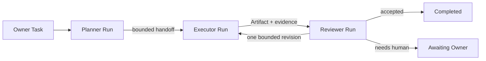
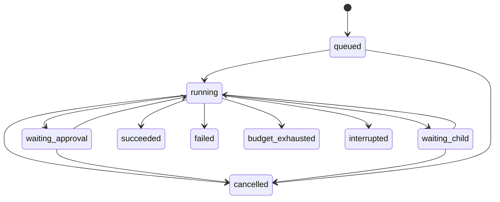
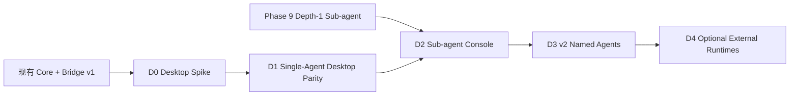

# MiniClaw 桌面多 Agent 产品与架构演进设计

> 日期：2026-08-09
> 文档类型：产品与架构设计
> 状态：`DRAFT FOR REVIEW / PLANNED`
> 当前事实基线：`main@e70a4fd`；本地未提交内容不计入已实现能力
> 目的：在既有 Desktop 路线、Phase 9 Sub-agent 与 v2 Multi-agent Gap 之间建立一条可交付、可验证的演进路径。

> 范围更新（2026-08-09）：产品目标已升级为接近 WorkBuddy、Codex 与相关开源项目的完整桌面 Agent
> 工作台。本稿保留为初始分层、安全边界和渐进式 Runtime 基线；其中“非目标”和 D0～D4 范围不是最终完整版
> 产品范围，后续须由新的完整产品设计评审稿替代，不能据此直接启动全量实现。

## 1. 决策摘要

MiniClaw 桌面版采用“**新产品层，不新建第二套 Core**”的路线：

- 继续使用当前仓库和 Python Core，不 fork OpenAgents，也不另起一套 Agent Loop；
- 新增独立 Desktop package，首选 Electron + React；
- Desktop Main 复用 versioned Bridge 语义，Renderer 不直接访问 Tool、SQLite、Workspace 或 Secret；
- 第一阶段先交付单 Agent Desktop parity，证明安装、进程监督、流式事件、审批和恢复链路；
- Phase 9 的 depth-1 Sub-agent 是桌面多 Agent 的第一个执行原语，但不等同于持久化 Agent persona；
- v2 才引入有独立 workspace、state、model、Skills、Tool scope 和 Channel binding 的 Named Agent；
- 首版多 Agent 使用显式角色、depth 1、严格预算和人工 Gate，不做递归 Swarm；
- OpenAgents、Eigent、LobsterAI、Emdash 和 The Pair 只作为分层、交互和工程门禁参照，不改变 MiniClaw 的安全边界。

一句话产品定义：

> MiniClaw Desktop 是面向单个用户的本地 Agent 控制台：用户可以看见、约束和恢复多个受控 Agent 的任务、交接、审批与产物，而所有现实世界副作用仍由同一个 Python Core 审计和执行。

## 2. 为什么现在需要单独设计

现有文档已经留下了三块互补但尚未连起来的规划：

1. [TUI 稳定化与桌面版架构设计](20260808_TUI稳定化与桌面版架构设计.md)已经明确 Desktop 复用 Python Core 与 versioned Bridge，不复制 Agent Loop；
2. [OpenClaw / Hermes 能力 Gap](20260808_OpenClaw-Hermes能力Gap与演进路线.md)把 depth-1 Sub-agent 放在 Phase 9，把持久化 Multi-agent persona 放在 v2；
3. [Phase 9 实施计划](../superpowers/plans/2026-08-08-phase-9-subagents-and-multimodal.md)已经约束 child Session、Tool 子集、预算、完成回传和审计。

缺失的是桌面产品层如何分阶段消费这些能力，以及什么时候仍是“桌面单 Agent”，什么时候才可以对外称为“桌面多 Agent”。如果不先澄清，容易出现三种范围错误：

- 只换 Electron UI，却把多 Session 错称为多 Agent；
- 为了画 Agent 拓扑，提前复制 Provider、Policy、Memory 和 Tool Runtime；
- 直接接入多个外部 CLI，让它们绕过 MiniClaw 的 Workspace、Approval 和 Audit。

因此本设计把 Desktop 作为一条横向交付轨道，把 Phase 9 和 v2 作为它依赖的 Core 能力，而不是重新排列已经确认的 Phase 5～9 主路线。

## 3. 当前事实与规划边界

### 3.1 已实现、可直接复用

当前实现已经提供 Desktop 所需的核心基础：

| 能力 | 当前事实 | Desktop 复用方式 |
| --- | --- | --- |
| Agent Core | Provider、Context、Memory、Agent Loop、Tool、Policy、Approval、SQLite、Audit 在 Python 内 | Desktop 不重写任何执行逻辑 |
| Bridge | NDJSON protocol v1、握手、Turn、取消、审批、稳定错误、RunEvent | Electron Main 作为新 Client |
| TUI 状态语义 | 流式文本、reasoning、Tool lifecycle、usage、审批和终态 | 抽取语义，不复制终端布局 |
| 安全边界 | Renderer 等 UI 不是权威层；Core 校验权限、路径、命令和网络 | Desktop 延续相同不变量 |
| Session / Storage | SQLite 保存 Session、Message、Turn、ToolRun 和 Approval | Desktop 通过 Core 查询，不直读数据库 |
| Channel | Feishu、Telegram、Discord 复用 Core 语义并隔离 Transport/Delivery | v2 Agent binding 继续在 Core 解析 |
| Automation / Recovery 基础 | Core 已有 durable 状态、恢复和后台运行边界 | 多 Agent 复用账本、预算和恢复方法 |

### 3.2 尚未实现、不得写成当前能力

以下全部是本设计描述的未来能力：

- Electron/React Desktop package、安装包、签名、自动更新；
- Desktop Session 列表、Agent 列表、任务图、Artifact 预览和系统托盘；
- 多活动前台 Run、跨 Agent Handoff、并发预算和 durable Agent status；
- Named Agent profile、独立模型、Workspace、Memory scope、Skills 和 Channel binding；
- 外部 Agent CLI Adapter；
- 多用户、团队 Workspace、云同步和远程 Agent Network。

文档中的 `PLANNED`、`DESIGN TARGET` 和 `OPTIONAL` 都不代表已经实现或验证。

## 4. 产品定位

### 4.1 目标用户

- 首要用户仍是 MiniClaw 的单个 Owner；
- 次要用户是希望观察和控制 Agent 执行过程的开发者或高级个人用户；
- 首版不面向团队管理员、企业租户或公共 Agent 市场运营者。

### 4.2 核心价值

1. **看得见**：统一展示 Agent 状态、任务分解、Tool、审批、预算、交接和产物；
2. **管得住**：所有 Agent 的权限都是 Core Policy 的显式子集，不能通过 UI、Prompt 或 Agent 间消息扩大；
3. **能恢复**：应用关闭、Core 崩溃或模型失败后，Run 有明确终态或可审阅的 interrupted 状态；
4. **不重复建设**：TUI、Desktop 和 IM 使用同一 Core 语义和事实存储；
5. **逐步多 Agent**：先从一个可验证的 child task 开始，再演进到持久化 Agent persona，而不是一步进入任意 Swarm。

### 4.3 “多 Agent”的产品定义

满足下列条件时，MiniClaw 才能把某个流程称为多 Agent：

- 至少两个执行身份拥有不同的 `agent_id`、角色和执行 Scope；
- 每个 Agent 有独立 Session 或经过显式净化的 fork context；
- 任务交接通过 Core 持久化并带来源、预算和终态；
- Tool、Workspace、模型用量和失败归属可以按 Agent 审计；
- 用户能区分“谁做了什么”，并能暂停、取消或限制具体 Agent。

仅有多个聊天窗口、多个 Session、多个 Prompt 模板或并排展示，不算多 Agent。

## 5. 非目标

首个 Desktop 多 Agent 版本明确不做：

- 多用户、多人实时协作、RBAC、组织和租户；
- 云端必选账号、云同步或公开 Workspace URL；
- 多层递归 Agent、动态无限扩容和无预算 Swarm；
- 任意 Agent 之间无审计的自由消息总线；
- 让 Renderer、Electron Main 或外部 CLI 绕过 Python Policy 直接写文件、运行命令或调用业务 API；
- 默认共享同一个可写 Workspace 给多个并发 Agent；
- 在 Desktop MVP 同时建设 Agent Marketplace、Skill Marketplace 和 MCP Marketplace；
- 为追求单二进制而重写 Python Core；
- 把 OpenAgents、Eigent 或其他项目的产品声明当成 MiniClaw 的已验证能力。

## 6. 参考项目与取舍

调研快照以 2026-08-09 的公开仓库为准：

| 项目 | 借鉴重点 | MiniClaw 不照搬的部分 |
| --- | --- | --- |
| [OpenAgents](https://github.com/openagents-org/openagents) | Launcher/daemon、异构 Agent Adapter、统一 Workspace、Agent lifecycle、跨平台打包 | 不复制网络平台和云 Workspace；不让外部 CLI 绕过统一 Policy |
| [LobsterAI](https://github.com/netease-youdao/LobsterAI) | Desktop 产品层复用既有 Runtime；Session、SQLite、审批、Artifact 与 IM 配置留在产品层 | 不一次引入办公套件、几十个 Skill 和所有 IM |
| [Eigent](https://github.com/eigent-ai/eigent) | Workforce、任务分解、Agent 配置、流程可视化和本地部署体验 | 不把 FastAPI/Auth/Cloud/CAMEL 全栈直接移植进来 |
| [Emdash](https://github.com/generalaction/emdash) | 并行 Coding Agent、worktree 隔离、Diff/PR Review、远程执行可观测性 | 不把 MiniClaw 限定成 Coding IDE |
| [The Pair](https://github.com/timwuhaotian/the-pair) | Mentor/Executor 固定角色、质量 Gate、迭代预算、暂停与恢复 | 不把两角色协议固化成唯一业务流程 |

最重要的综合结论是：

> 学 OpenAgents 的 Launcher，学 LobsterAI 的 Runtime 分层，学 Eigent 的 Workforce 交互，学 Emdash 的隔离，学 The Pair 的有界协作；执行权仍只属于 MiniClaw Core。

## 7. 技术路线备选与决策

### 7.1 方案 A：同仓 Electron + React Desktop（采用）

形态：在当前仓库新增独立 Desktop package，由 Electron Main 启动并监督 Python Bridge，Renderer 通过窄 Preload API 接收安全事件。

优点：

- 与当前 Node/TypeScript UI 边界一致；
- 子进程、托盘、自动更新、签名、文件对话框和三平台打包路径成熟；
- 可以复用 Bridge frame、RunEvent reducer 和部分展示语义；
- Python Core 的体积已经存在，Electron 相对 Tauri 的体积优势不是首要矛盾。

代价：

- 安装包和内存占用更大；
- 必须严格约束 Electron Main、Preload 和 Renderer 信任边界；
- Python Sidecar 与 Electron 版本需要原子发布和兼容检查。

### 7.2 方案 B：同仓 Tauri + React Desktop（保留备选）

优点是安装包更小、Rust 主进程边界更强；代价是新增 Rust 工具链、Sidecar 打包和跨平台调试面。只有当 Electron 原型证明体积或资源占用无法接受时才重新评估，不为尚未出现的问题提前引入 Rust Core。

### 7.3 方案 C：本地 Web UI + FastAPI（不采用为首版）

开发速度快，也便于远程访问；但会立即引入端口发现、认证、CSRF/CORS、本地 Token、浏览器来源和服务常驻问题。它更适合未来 Remote Console，不适合作为第一个可信本地 Desktop 边界。

### 7.4 仓库决策

Desktop 首版留在 MiniClaw 同一仓库：

```text
miniclaw/
├── src/miniclaw/          # 已有 Python Core；未来增加通用 orchestration，不放 Renderer 逻辑
├── tui/                   # 已有 pi-tui Client
├── desktop/               # PLANNED：Electron Main / Preload / Renderer / packaging
├── tests/                 # Python 与跨进程契约
└── docs/                  # 产品、架构、实施与发布证据
```

只有满足第 17 节的拆仓条件后，才考虑把 Desktop 变成独立仓库。

## 8. 总体架构

### 8.1 目标结构



### 8.2 权威边界

| 层 | 可以做 | 不可以做 |
| --- | --- | --- |
| Renderer | 展示状态、收集输入、请求 Core 动作、预览安全 Artifact | 读取 Secret/SQLite、直接 Shell/文件/HTTP、决定审批是否有效 |
| Preload | 暴露固定的 typed API、校验基本参数、转发事件 | 暴露 Node/Electron 任意对象或通用 IPC |
| Electron Main | 窗口、托盘、更新、文件选择、Bridge 进程监督 | 解释 Tool Policy、拼接 Shell、替代 Core 写业务状态 |
| Python Bridge | 协议握手、帧校验、请求路由、稳定错误 | 信任 Renderer 提供的身份、权限或完成状态 |
| Runtime Supervisor | Agent 生命周期、并发预算、Run/Handoff 编排 | 绕过 Policy 执行副作用 |
| Policy / ToolExecutor | Workspace、命令、网络、审批、Sandbox、Audit | 被 Prompt、Skill、网页或 Agent 消息扩大权限 |
| SQLite / Artifact Store | 保存运行事实、版本、来源、状态和恢复数据 | 由 Renderer 直接修改 |

### 8.3 进程模型

首版采用一个 Electron Main + 一个受管 Python Bridge：

```text
MiniClaw Desktop
├── Electron Main
│  ├── BrowserWindow / Tray / Updater
│  └── Python Bridge child process
└── Renderer
```

关闭窗口默认只隐藏到托盘，Bridge 继续服务当前 Run；显式 Quit 才触发有界取消、Memory flush 和 Core 关闭。首版不同时建设本地 daemon/socket 协议。只有当 Desktop、Gateway 和 Automation 必须共享同一个长期进程且现有部署证明确实产生冲突时，才设计 Core Host；即使增加新 Transport，也必须复用同一 frame 语义，不能出现第二套业务协议。

## 9. Agent 模型

### 9.1 三种身份必须区分

| 类型 | 生命周期 | 当前路线 | 语义 |
| --- | --- | --- | --- |
| Default Agent | 持久 | 已有单 Agent Core | Owner 的主入口和默认执行者 |
| Sub-agent | 临时、depth 1 | Phase 9 | 为一个父 Run 执行受限 child task，结束后回传 |
| Named Agent | 持久 | v2 | 有独立 profile、workspace/state/binding 的长期角色 |

Desktop D1 可以只有 Default Agent；Desktop D2 展示 Sub-agent；只有 Desktop D3/v2 才提供 Named Agent 创建和管理。

### 9.2 AgentProfile 目标语义

v2 `AgentProfile` 至少包含：

- 稳定 `agent_id`、名称、头像/颜色和角色说明；
- Model profile 引用，不在记录中保存明文 Key；
- System instruction 版本和来源；
- Skill 集合和 MCP/Tool allowlist；
- Workspace scope、只读根、可写根和 Sandbox backend；
- Memory namespace 与可披露范围；
- 默认 Token、Tool、时间和并发预算；
- 可选 Channel binding；
- enabled/disabled 状态和配置 revision。

UI 可请求修改 Profile，但 Core 负责校验、版本化和审计。修改只影响新 Run；运行中的 Run 使用创建时固化的 immutable snapshot。

### 9.3 首版角色模板

首个可验证多 Agent 工作流使用三个有界角色：

| 角色 | 默认权限 | 主要职责 |
| --- | --- | --- |
| Planner | 只读，无外部投递 | 澄清目标、分解任务、定义验收和风险 |
| Executor | Scoped write，需要既有 Policy/Approval | 执行 Tool、产生文件或业务变更、报告证据 |
| Reviewer | 只读，可运行无副作用验证 | 对照目标审查结果，决定通过或请求一次修订 |

该模板是 Desktop 产品预设，不写死在 AgentRunner。用户未来可以创建其他 Named Agent，但 Core 仍执行相同权限、预算和深度限制。

D2 中 Planner 由 parent Default Agent 承担，Executor 和 Reviewer 是两个顺序执行的 depth-1 Child Run；Reviewer
不能再创建 Child。每个 Child 获得只在该 Run 生命周期内有效的临时 `agent_id` 和角色快照。这样既能满足第 4.3 节的
可归属与可审计要求，也不会把 Phase 9 扩大成多层 Agent 树。

## 10. 任务、交接与上下文

### 10.1 首版协作拓扑



默认最多一次 Reviewer→Executor 修订；超过预算或出现语义争议时进入 `awaiting_owner`，不让 Agent 自己循环到满意为止。

### 10.2 Handoff 必须显式持久化

每次交接至少记录：

- `handoff_id`、parent/child Run；
- 来源 Agent、目标 Agent 和创建 Turn；
- 结构化 brief、验收标准和优先级；
- context mode、sanitized snapshot hash 和 Artifact 引用；
- 请求的 Tool/Workspace scope 与 Core 实际授予的 scope；
- Token/Tool/时间预算；
- created/accepted/running/completed/failed/cancelled 状态和时间；
- 完成摘要、证据和错误码。

Agent 间自然语言消息只是 Handoff 的内容，不是权限或状态事实。

### 10.3 Context 模式

- `isolated`：默认。Child 只收到身份、安全约束、明确 brief、必要 Skills/Memory 和 Artifact 引用；
- `fork`：显式请求。Core 生成有 Token 上限的净化快照，不包含隐藏 reasoning、Secret、待审批 Tool 参数或无关 Channel 消息；
- `shared artifact`：Agent 通过不可变 Artifact ID 交换较大内容，不把二进制或完整文档复制进协议帧；
- `shared transcript`：首版不支持任意 Agent 订阅完整父会话。

### 10.4 Workspace 与写入隔离

首版遵循“一个共享目标，最多一个直接 Writer”：

- Planner/Reviewer 默认只读；
- Executor 的写入仍经过当前 Workspace、Checkpoint、Sandbox 和 Approval；
- 并发 Writer 必须使用独立 workspace 或 Git worktree，不能共同写同一目录；
- Child 不能扩大父 Run 的路径、命令、网络、MCP、Browser 或 Channel 权限；
- 产物合并、覆盖已有文件和外部发送仍由 Owner 或既有 Policy 决定。

## 11. 运行事实与状态机

### 11.1 概念数据模型

本节定义语义，不提前锁定表名；实施时优先扩展现有 Session、Turn、TaskRun、ToolRun、Approval 和 Artifact 边界，避免建立第二套重复事实源。

| 实体 | 关键字段 | 权威来源 |
| --- | --- | --- |
| AgentProfile | agent_id、revision、role、model/skill/tool/workspace refs、enabled | SQLite |
| AgentRun | run_id、agent_id、session_id、parent_run_id、snapshot、budget、status | SQLite |
| Handoff | source/target run、brief、context hash、scope、status、result | SQLite |
| RunArtifact | artifact_id、run_id、type、hash、size、visibility、retention | SQLite + bounded file store |
| AgentBinding | agent_id、channel/account/conversation selector、revision | SQLite |

Desktop 时间线是这些事实的投影，不另建由 Renderer 维护的影子状态。

### 11.2 AgentRun 状态机



终态不可逆。重启时遗留 `running` 不自动重放副作用，而是转为 `interrupted` 或由已有幂等恢复规则给出明确结果。

### 11.3 预算

每个 Run 至少有以下有界预算：

- 最大输入/输出 Token；
- 最大模型轮数和 Tool 调用数；
- 最大墙钟时间和无输出超时；
- 最大 Artifact 数量、单件大小和总大小；
- 最大 Child 数量与并发数；
- 可选费用上限。

Child 的所有上限必须小于等于父 Run 剩余预算。预算耗尽是可观察终态，不转换成通用 Provider 错误。

## 12. Bridge 协议演进

### 12.1 保持 v1 兼容

- 当前 pi-tui 继续使用 protocol v1；
- `client.hello` 协商客户端支持的 protocol 和 capability；
- Desktop D1 优先使用 v1 已有 Turn/Approval/Event；
- 新能力使用 capability gate，不因为 Desktop 上线就删除 TUI 或重命名旧事件；
- protocol v2 只有在 Agent/Run/Handoff 语义稳定后才发布。

### 12.2 v2 目标消息族

请求按职责分组：

- `session.list|get|create|archive`；
- `agent.list|get|create|update|enable|disable`；
- `run.start|cancel|get|list`；
- `handoff.get|list`；
- `artifact.list|get|export`；
- `approval.resolve`；
- `desktop.bootstrap|resync`。

事件至少携带可选的 `seq`、`agent_id`、`run_id`、`parent_run_id` 和稳定 `event_id`：

- `event.agent_status_changed`；
- `event.run_started|progress|waiting|finished`；
- `event.handoff_created|accepted|finished`；
- `event.artifact_created`；
- 既有 `event.model_*`、`event.tool_*`、`event.approval_required`。

### 12.3 协议不变量

- 保持 UTF-8 单行 JSON 和 2 MiB frame 上限；
- 大文件、截图和二进制只传 Artifact handle，不内联；
- stdout 只用于协议，诊断走 stderr 和受控日志；
- 未知字段、未知 enum、越界数字、非法 ID 和 NaN 一律拒绝；
- Error 只返回稳定 code、安全 message 和 retryable，不泄露 Prompt、Provider body、Key 或 Traceback；
- Renderer 断线后通过 `resync` 获取 Core snapshot，不自行猜测遗漏事件；
- 每个改变状态的请求有 request id 和幂等边界。

## 13. Desktop 信息架构

### 13.1 主界面

```text
┌ Workspaces / Agents ─┬ Run Timeline ───────────────────────┬ Task / Artifact / Approval ┐
│ Project A             │ Owner: 修复登录回归                 │ Task Graph                 │
│  ● Default Agent      │ Planner: 计划完成                  │ Planner ✓                  │
│  ◐ Executor           │  └─ handoff #12                    │ Executor ◐                 │
│  ○ Reviewer           │ Executor: 正在运行 test_login      │ Reviewer ○                 │
│                       │  tool: run_command ✓ 1.8s           │                            │
│ Sessions              │  artifact: auth.diff               │ Artifacts                  │
│  Today                │                                    │ auth.diff                  │
│  Yesterday            │                                    │ test-report.md             │
├───────────────────────┴────────────────────────────────────┴────────────────────────────┤
│ 输入 / 暂停 / 取消       模型与权限模式       Token / Tool / 时间 / 费用预算             │
└─────────────────────────────────────────────────────────────────────────────────────────┘
```

### 13.2 核心页面

| 页面 | 必须展示 | 首版不展示 |
| --- | --- | --- |
| Home | Core 状态、最近 Session、待审批、失败 Run、预算提醒 | 团队动态、云市场 |
| Session | User/Agent 消息、reasoning 摘要、Tool lifecycle、usage | 未经 Core 提供的隐藏思维链 |
| Agents | Agent 状态和只读 Profile；v2 才允许 CRUD | 任意 Prompt 注入式权限配置 |
| Run | 父子关系、状态、预算、Handoff、取消和恢复结果 | 无限拓扑动画 |
| Artifacts | 类型、来源、hash、大小、预览和导出 | 自动执行 Artifact 内脚本 |
| Approvals | Core 提供的 action、参数、风险、grant modes | UI 自创“已批准”状态 |
| Settings | 模型引用、Workspace、权限模式、日志和更新 | 明文展示完整 Secret |

### 13.3 核心用户流程

#### 单 Agent Desktop

1. 用户选择 Workspace 并启动 Session；
2. Electron Main 完成 Bridge hello 和 capability 检查；
3. Renderer 发起 `turn.start`；
4. Core 流式返回模型、Tool、usage 和审批事件；
5. 用户在 Overlay 中选择 Core 允许的 grant mode；
6. Turn 到达持久终态，Desktop 展示结果和 Artifact。

#### 多 Agent Run

1. 用户选择固定模板并提交目标；D3 以后也可以选择 Named Agent 组合；
2. Core 创建 parent Run 和 immutable execution snapshot；
3. Planner 生成有验收标准的 Handoff；
4. Core 计算 Child 权限/预算子集并创建 Executor Run；
5. Executor 产生 Artifact 和证据；
6. Reviewer 只读审查，返回 accepted、revision_requested 或 awaiting_owner；
7. Core 持久化终态，Desktop 只投影事实。

## 14. Desktop 安全设计

### 14.1 Electron 边界

- `contextIsolation=true`；
- `nodeIntegration=false`；
- Renderer sandbox 开启；
- Preload 只暴露按领域命名的 typed API，不暴露 `ipcRenderer`；
- 主窗口不加载远程网页，不允许任意导航或新窗口；
- 外部链接经 allowlist、协议检查和明确用户动作后交给系统浏览器；
- Content Security Policy 默认禁止 inline script、任意 remote script 和不受控连接；
- Renderer 不读取 `.env`、数据库、日志目录和 Provider Key；
- DevTools、调试端口和 source map 不进入默认生产配置。

### 14.2 Artifact 预览

- Markdown、Mermaid、图片和纯文本使用安全 Renderer；
- HTML/SVG 使用独立 sandboxed preview，禁用 Node、文件访问、持久存储和顶层导航；
- Office/PDF 等格式只交给经过类型、magic、size 和 hash 校验的预览器；
- 可执行文件、脚本和未知类型只能显示元数据并让用户显式导出；
- Artifact 内容是数据，不能成为 Core instruction 或 UI 指令。

### 14.3 Secret 与凭据

- Renderer 永远拿不到完整 Secret；
- Desktop 设置页只接收写入动作和掩码状态；
- 生产版优先使用 OS credential store 或现有私密配置边界；
- Electron Main 只在启动 Core 时通过受控环境/句柄传递所需凭据，不写 argv、协议、日志或 SQLite；
- AgentProfile、Handoff、Artifact 和诊断包只保存 Secret 引用或掩码。

### 14.4 Agent 间安全

- Agent 输出、Handoff brief、网页和外部 CLI 输出都标记为不可信内容；
- Child Tool、路径、网络、Browser、MCP、Channel 和预算是父 Scope 的交集；
- Child 不能批准自己的 Tool、安装 Skill/MCP、修改 Policy、创建 Cron、发送外部消息或再次 spawn；
- Reviewer 的 accepted 只是质量结论，不等于批准危险副作用；
- `yolo` 不关闭敏感路径、SSRF、Sandbox 和参数绑定审批硬边界。

## 15. 生命周期、恢复与发布

### 15.1 启动

1. Electron Main 获取单实例锁；
2. 解析受支持的 MiniClaw Core 路径和版本；
3. 以 `shell=false`、显式 argv 和收窄环境启动 Bridge；
4. 完成 hello、protocol/capability 和 schema 状态检查；
5. 成功后创建主窗口；失败则展示稳定诊断和日志位置，不打开半可用 Renderer。

### 15.2 Core 崩溃

- Main 记录安全错误摘要和 exit code；
- 当前 Run 不自动重放副作用；
- Core 根据 SQLite 把遗留状态转为 interrupted 或执行既有幂等恢复；
- Main 使用有上限的指数退避重启；连续失败后进入 degraded 状态并停止重启；
- Renderer 保留已接收时间线，明确显示“Core 已断开”，不伪造完成。

### 15.3 退出

- 关闭窗口默认保留托盘进程；
- 显式 Quit 停止新任务 intake；
- 等待有界时间完成持久化和 Memory flush；
- 取消仍在运行的前台 operation；
- 回收 Python 进程树；
- 已产生的文件副作用不声称自动回滚，只有已有 Checkpoint 能提供显式恢复。

### 15.4 打包与更新

生产目标是用户不需要预装 Node、Python 或 uv：

- Electron package 固定兼容的 Core 版本；
- Python Sidecar、Node 资源、数据库 migration 和内置 Skill 形成同一个签名发布单元；
- 更新包带签名、hash、版本清单和回滚元数据；
- Shell 与 Core 不允许独立更新到未知组合；
- macOS 先完成签名、公证和真实安装 Gate，再扩展 Windows/Linux；
- 开发模式可以显式指向当前 checkout，但生产版不能依赖系统 Python 或用户 shell rc。

## 16. 交付路线

Desktop 是横向 Track，不改变 Phase 5～9 的依赖顺序。



### D0：Desktop Spike

目标：证明 Electron Main 能安全启动真实 Python Bridge，并完成 hello、一次 Turn、取消、审批和 shutdown。

退出条件：

- 不修改 Agent Loop；
- Renderer 无 Node/Secret/SQLite 权限；
- Core 异常有稳定 UI；
- macOS 开发构建可重复；
- Spike 不作为正式 Desktop 发布。

### D1：Single-Agent Desktop Parity

目标：提供可日常使用的单 Agent Desktop，不宣传多 Agent。

范围：

- Session 列表和恢复；
- 流式对话、Tool、reasoning 摘要、usage；
- Approval Overlay；
- Artifact 基础预览；
- Settings、日志、托盘和更新；
- 与 pi-tui 的 protocol v1 回归兼容。

### D2：Sub-agent Console

依赖：Phase 9 depth-1 Sub-agent 的 Core gate 已通过。

范围：

- 父/子 Run 展示；
- Child 临时 `agent_id`、角色和 immutable scope snapshot；
- Handoff、独立预算和 Tool scope；
- Child queued/running/waiting/completed/failed/cancelled；
- 完成回传、Artifact 和审计；
- 固定 Planner/Executor/Reviewer 模板；
- 仍不提供持久化 Named Agent persona。

### D3：v2 Named Agents

范围：

- AgentProfile CRUD 和 revision；
- 独立 workspace/state/model/Skill/Tool scope；
- Channel binding；
- 多 Run 并发预算；
- Workspace/worktree 隔离；
- protocol v2 和 Desktop resync。

### D4：Optional External Runtimes

只有真实用户需求证明有必要时，才增加 Codex CLI、Claude Code、Gemini CLI 或其他 Agent Adapter。外部 Runtime 必须声明 capability、权限模型、Session/取消语义和隔离证据；不能因为“能启动进程”就标记为受 MiniClaw Policy 保护。

## 17. 何时拆成新仓库

Desktop 只有同时出现下列至少两类变化时才考虑拆仓：

1. Desktop 与 Core 有独立发布节奏，并需要支持多个 Core 主版本；
2. 产品主要价值变成连接任意第三方 Agent，MiniClaw 只是众多 Runtime 之一；
3. 引入多人、云 Workspace、账号、同步、团队权限或托管服务；
4. Desktop 需要独立品牌、许可证、商业发行或贡献者治理；
5. 同仓 CI、Issue ownership 和 Release 已经产生持续而可测量的阻塞。

在此之前，同仓能保证协议、Schema、Sidecar 和 UI 在一个变更中完成兼容验证，成本更低。

## 18. 测试与验收门禁

### 18.1 测试金字塔

| 层 | 重点 |
| --- | --- |
| Python Unit | AgentProfile/Handoff/Run 状态机、Scope 子集、预算、恢复、错误码 |
| TypeScript Unit | reducer、typed IPC、窗口状态、Artifact 安全渲染、审批交互 |
| Protocol Contract | v1/v2 hello、非法帧、未知 capability、seq gap、resync、大帧拒绝 |
| Cross-process Integration | 真实 Electron Main/Node Client + Python Bridge，启动、Turn、取消、崩溃、shutdown |
| Desktop E2E | 首次启动、Session、审批、重启恢复、导出 Artifact、更新提示 |
| Agent Scenario Eval | 固定 Planner/Executor/Reviewer、预算耗尽、Child 失败、上下文隔离、权限不提升 |
| Packaging Gate | 干净机器安装、签名、公证、升级、降级阻止、卸载、无系统 Python |
| Soak / Chaos | 长 Run、Bridge crash、窗口关闭、断网、Provider 限流、SQLite busy、磁盘不足 |

### 18.2 安全不变量

任意版本必须证明：

- Renderer 无法直接读取 Secret、SQLite 或 Workspace；
- Child 权限永远不大于父 Run；
- 并发 Agent 不会无隔离写同一 Workspace；
- Core crash 不自动重复已发生的外部副作用；
- Approval 决定由 Core 绑定 action/参数/revision；
- Artifact preview 不能执行本地脚本或访问 app 权限；
- protocol/log/evidence 不泄露 Key、Prompt、Cookie、OTP、Authorization 或私钥；
- 未支持的 protocol/capability fail closed。

### 18.3 D2 多 Agent 成功场景

首个端到端场景建议固定为：

> 用户要求分析一个本地项目中的失败测试。Planner 只读定位范围并写出验收标准；Executor 在隔离 Workspace 中修改并运行相关测试；Reviewer 只读检查 diff、测试证据和范围。任何写入、命令和网络动作仍经过 Core Policy；如果 Reviewer 请求第二次修订，系统暂停等待 Owner。

系统必须证明：

1. 三个角色有独立 `agent_id`/Run/Session；
2. Planner 和 Reviewer 无写权限；
3. Executor 只在授权 Workspace 中写入；
4. Handoff、Artifact、ToolRun、Approval 和 usage 可以关联到具体 Agent；
5. Child 失败、取消、预算耗尽和 Core 重启都有确定终态；
6. 用户可以看见并中断具体 Run；
7. TUI v1 与现有 Channel 回归不受影响。

## 19. 主要风险与缓解

| 风险 | 结果 | 缓解 |
| --- | --- | --- |
| Desktop 与 Core 同时大改 | 无法定位协议、UI 或 Runtime 问题 | D0/D1 只做 v1 parity；多 Agent 单独进入 D2 |
| 把多 Session 当多 Agent | 产品声明与审计不一致 | 使用第 4.3 节定义和 `agent_id`/Handoff gate |
| 多 Writer 冲突 | 文件覆盖、测试污染、不可恢复 | 首版单 Writer；并发必须 Sandbox/worktree |
| Agent 间上下文泄露 | 私聊、Secret 或无关历史进入 Child | isolated 默认；fork 净化、hash 和 Token 上限 |
| 外部 CLI 绕过 Policy | Desktop 看似安全但真实操作无边界 | D4 延后；Adapter capability 与隔离证据单独验收 |
| Electron 扩大攻击面 | Renderer/预览内容取得本机能力 | contextIsolation、sandbox、窄 preload、严格 CSP |
| Sidecar 版本漂移 | 协议和数据库不兼容 | 原子发布、hello compatibility、固定 manifest |
| 后台 Agent 无限运行 | 成本、CPU、磁盘和副作用失控 | per-Run/child/day 预算、无输出超时、并发上限 |
| 路线膨胀为 OpenAgents 克隆 | MiniClaw 失去小而可审计的边界 | 非目标、D0～D4 gate、拆仓条件和真实需求证据 |

## 20. 与现有 Gap 的追踪关系

| Gap / 设计 | Desktop 消费方式 | 对应 Track |
| --- | --- | --- |
| 当前 NDJSON Bridge | Desktop Client、流式事件、审批和安全错误 | D0～D1 |
| GAP-PROV-002 成本预算 | Agent/Run/Child 预算展示和熔断 | D2～D3 |
| GAP-SAFE-001 Sandbox | Executor workspace 隔离 | D2～D3 |
| GAP-SAFE-002 Checkpoint | 写入前恢复点和显式 rollback UI | D1～D3 |
| GAP-SUB-001 Sub-agent | depth-1 Child Run、Handoff、完成回传 | D2 |
| GAP-MEDIA-001 图片消息 | Artifact preview 和可选 Vision | D1～D2 |
| GAP-MULTI-001 Multi-agent persona | Named Agent profile/state/workspace/binding | D3 / v2 |
| GAP-NODE-001 远程设备 Node | 可选 Remote Runtime；不属于 Desktop MVP | D4 或更后 |

## 21. 完成定义

这份设计只有在以下条件全部满足时才能从 `DRAFT FOR REVIEW` 改为 `APPROVED DESIGN`：

1. 产品确认 Desktop 仍是单用户、本地优先；
2. 技术确认采用同仓 Electron + React、Python Core 权威边界；
3. 路线确认 D1 单 Agent、D2 depth-1 Sub-agent、D3 v2 Named Agent；
4. 安全确认 Renderer、Agent 权限子集、Workspace 隔离和 Artifact 预览边界；
5. 明确 Desktop Track 不改写 Phase 5～9 已确认依赖；
6. 后续实施计划按 D0、D1、D2、D3 分开编写和审批，不生成一个跨多个 Phase 的巨型计划。

批准本设计不代表任何 Desktop 或多 Agent 功能已经实现。每个 Track 仍需独立 TDD 实施计划、代码审查、回归、打包 Gate 和真实运行证据。
