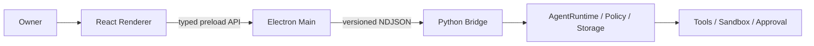

# MiniClaw 通用桌面 Agent 工作台设计

> 日期：2026-08-09
> 文档类型：产品与架构设计
> 状态：`W0/W1 DEVELOPMENT BUILD / AUTOMATED GATE PASS / ELECTRON MANUAL PENDING`
> 当前事实基线：本分支已包含 `desktop/`、Desktop Bridge 查询、跨进程 hello 与 Electron 进程 smoke
>
> 历史说明：本文保留 W0/W1 已实现边界。其 W2/W3 规划已由
> [LobsterAI-first 桌面多 Agent 设计](20260810_LobsterAI-first桌面多Agent设计.md)和
> [D1～D5 分 Phase 落地方案](../engineering/desktop/20260810_桌面多Agent分Phase落地.md)取代。

## 1. 决策摘要

MiniClaw Desktop 定位为单用户、本地优先的通用 Agent 工作台：用户用自然语言提交任务，观察执行、处理审批，
并取得报告、数据文件、演示文稿、代码或其他产物。

首个可用版本采用最小方案：

- 产品结构主要参考 Tencent WorkBuddy；
- 浅色视觉和交互密度参考 Codex；
- Electron 工程与可复用组件优先参考 MIT 许可的 LobsterAI；
- Eigent 的多 Agent 展示只在后续需要时借鉴；
- 同仓新增 Electron + React Desktop，不复制 Python Agent Core；
- 首发提供 4 个界面，但只有“任务工作台”承担核心执行链路；
- 先完成单 Agent 通用任务闭环，再增加 depth-1 Sub-agent；
- 文档、表格、PPT 和代码先作为文件产物预览，不建设内置 Office 或 IDE。

一句话定义：

> MiniClaw Desktop 是让用户提交、监督和接收真实工作结果的本地通用 Agent 工作台。

## 2. 事实与规划边界

### 2.1 当前可以复用

| 当前能力 | Desktop 复用方式 |
| --- | --- |
| Python AgentRuntime、Provider、Tool Loop | Desktop 通过 Bridge 调用，不重写推理循环 |
| Policy、Approval、Workspace、Sandbox | Core 继续是唯一权限与副作用权威 |
| SQLite Session、Message、ToolRun、Audit | Desktop 通过 Core 查询，不直读数据库 |
| NDJSON Bridge protocol v1 | Electron Main 作为受管 Client |
| RunEvent、流式文本、Tool lifecycle、usage | Renderer 使用 typed reducer 投影 |
| Automation、恢复、durable E-stop | 自动化界面消费现有状态，不另建 Scheduler |
| Feishu、Telegram、Discord | 继续作为远程任务、审批和结果入口 |

### 2.2 W0/W1 当前已实现

- `desktop/` Electron + React package 和浅色四界面；
- Electron Main 管理共享 Python Bridge，Preload 只暴露固定 typed API；
- 首页创建/打开最近 Task，任务工作台消费真实 RunEvent、审批、取消与终态；
- Owner-scoped Session history，以及重启后 `runtime_interrupted` 的稳定展示；
- Automation 只读列表、四档 Permission Mode 与用户选择 Workspace 后的 Bridge 重启/失败回滚；
- Renderer sandbox、`contextIsolation=true`、`nodeIntegration=false`；
- Python、TUI、Desktop 单测、类型检查、构建、真实 Python Bridge Desktop hello 和 Electron 进程 smoke。

### 2.3 尚未实现

以下内容均为本设计目标，不是当前能力：

- Electron 安装包、签名、自动更新和三平台发布；
- Artifact 列表、安全预览、系统打开和文件引用；
- Electron 手工视觉 smoke 与真实 Provider LIVE smoke；
- Desktop 中的 Sub-agent、外部 Agent Adapter 或 Office 编辑器。

## 3. 产品模型

首版只引入四个用户可理解的概念：

| 概念 | 含义 |
| --- | --- |
| Workspace | Agent 本次可以读取或写入的工作目录 |
| Task | 用户目标以及一次可恢复的执行记录 |
| Event | 回复、Tool、审批、错误、用量和状态变化 |
| Artifact | Task 产生或修改、可安全预览的文件 |

首版不引入持久化 Agent persona、Agent 市场、Workflow DAG 或团队组织。Sub-agent 在后续只是 Task 下的受限子任务，
不改变这四个顶层概念。

当前 W0/W1 development build 已实现 Workspace、Task 与 Event；Artifact 仍是 W2 目标。

## 4. 首个可用版本范围

### 4.1 唯一核心闭环

1. 用户选择 Workspace；
2. 用户输入任务，可附加 Workspace 内文件引用；
3. Agent 流式回复并调用已有 Tool；
4. Desktop 展示计划、Tool 状态、费用和审批；
5. 用户可以批准、拒绝、取消或继续任务；
6. Task 完成后展示最终回复和 Artifact；
7. 应用重启后可以查看历史 Task，并明确标识 interrupted 状态。

当前 W0/W1 已覆盖文本任务、事件、审批、取消、历史与 interrupted；文件引用和 Artifact 结果展示尚未覆盖。

### 4.2 首发通用性

通用不等于第一天内置所有办公软件。首版用相同任务入口覆盖：

- 调研和报告：网页或本地资料 → Markdown/HTML/PDF 文件；
- 数据处理：CSV/Excel 等输入 → 分析结果和新文件；
- 演示文稿：资料 → PPTX 文件；
- 编程：项目目录 → 代码修改、测试输出和 Diff 文件或摘要。

具体格式只有在对应 Skill/Tool 已安装且通过安全门禁时才可生成；UI 不伪装未安装能力。

### 4.3 明确延后

- 云账号、云同步、多人协作和 RBAC；
- 内置 Word、Excel、PPT 编辑器；
- Agent 拓扑画布、Workflow Builder 和递归 Swarm；
- Plugin/Skill Marketplace；
- 外部 Codex、Claude Code、Gemini 等 CLI Adapter；
- Remote Desktop、系统级任意鼠标键盘控制；
- 深色主题和用户自定义主题系统；
- 为 Desktop 新增 FastAPI、第二套数据库或第二套 Policy。

## 5. 信息架构

首版恰好提供 4 个界面。

### 5.1 首页 / 新任务

用途：开始工作，而不是展示运营仪表盘。

- 新任务入口；
- 最近 Task；
- 历史 Task 状态。

W0/W1 的 Workspace 选择位于设置；首页内嵌选择和文件引用延后到 Artifact 工作。

不展示统计图、推荐模板市场或无数据价值的欢迎卡片。

### 5.2 任务工作台

这是主要界面，采用 WorkBuddy 式三栏结构：

```text
┌──────────────┬──────────────────────────────┬────────────────────┐
│ Task 列表     │ 对话、计划与执行时间线          │ Artifact 与文件预览  │
│ Workspace     │ Tool、审批、错误、继续输入       │ 结果、修改与元数据    │
└──────────────┴──────────────────────────────┴────────────────────┘
```

- 左栏可折叠，显示 Task 和 Workspace；
- 中栏是唯一主交互区；
- 右栏按需打开，不产生 Artifact 时保持收起；
- 计划、Tool、usage 和审批都进入同一时间线；
- 后续 Sub-agent 以可折叠子任务卡出现，不新增拓扑页面。

### 5.3 自动化

W1 只投影 MiniClaw 已有 Automation：

- Task 名称、状态、调度类型和下一次运行时间；
- Automation 全局启用状态。

W1 不提供新建、编辑、暂停、恢复、立即运行或删除，也不建设可视化工作流编排器。

### 5.4 设置

W1 集中展示或管理：

- Core 版本、模型、Workspace；
- 四档权限模式；
- Tool 与 protocol capability；
- 用户选择目录后的安全 Bridge 重启。

Secret 只能写入 Core 已有安全配置边界，Renderer 不读取或回显明文。

## 6. 浅色视觉系统

首版只实现浅色主题：

| Token | 值 | 用途 |
| --- | --- | --- |
| `canvas` | `#F7F8FA` | 应用背景 |
| `surface` | `#FFFFFF` | 面板和输入区 |
| `border` | `#E5E7EB` | 分隔线和边框 |
| `text-primary` | `#1D2433` | 主文字 |
| `text-secondary` | `#667085` | 次要文字 |
| `accent` | `#2563EB` | 主操作和焦点 |
| `success` | `#15803D` | 完成 |
| `warning` | `#B45309` | 审批和注意 |
| `danger` | `#B42318` | 失败和危险操作 |

视觉原则：

- 高信息密度但保留明确留白；
- 少量阴影、浅边框、克制圆角；
- 不使用玻璃拟态、大面积渐变和装饰性 Agent 动画；
- 状态不能只依赖颜色，必须同时提供图标或文字；
- 键盘焦点、对比度、缩放和 reduced motion 是首发基础要求。

## 7. 技术框架

### 7.1 采用

- Electron；
- React + TypeScript；
- Vite；
- Tailwind CSS；
- MiniClaw Python Bridge Sidecar。

首版状态量不需要 Redux、Zustand 或 React Flow。使用 React state、context 和一个 typed event reducer；只有出现
可测量的跨树状态问题时才增加状态库。

### 7.2 当前目录

```text
desktop/
├── package.json
├── src/
│   ├── main/          # Window 和 Bridge 进程监督
│   ├── preload/       # 窄 typed API
│   └── renderer/      # React 四界面
└── test/              # reducer、IPC contract 和 smoke
```

当前目录已按该布局实现；W0/W1 没有引入 Router、Redux、Zustand 或第二套协议 Client。

## 8. 进程与信任边界



| 层 | 可以做 | 不可以做 |
| --- | --- | --- |
| Renderer | 展示、收集输入、请求 Core 动作 | Node、Shell、SQLite、Secret、任意文件读取 |
| Preload | 暴露固定 typed API | 暴露通用 IPC 或 Electron 对象 |
| Electron Main | 窗口、托盘、Sidecar 生命周期 | 解释 Tool Policy 或执行 Agent 业务逻辑 |
| Python Bridge | 帧校验、能力协商和请求路由 | 信任 UI 提供的身份或权限 |
| Core | 权限、执行、存储、审计和恢复 | 被 Prompt、网页或 UI 扩大权限 |

Artifact 元数据和内容必须通过 Core 的 Workspace/Policy 边界返回；Renderer 和 Main 不扫描 Workspace 来猜测结果。

## 9. 数据流

### 9.1 启动

1. Electron Main 取得单实例锁；
2. Main 启动受管 Python Bridge；
3. 双方完成 protocol hello 和 capability 协商；
4. Renderer 只在握手成功后开放任务提交；
5. 不兼容或超时显示稳定错误，并允许重试或查看诊断。

### 9.2 执行

1. Renderer 提交 Task 文本、Workspace 标识和安全文件引用；
2. Core 创建或恢复 Session/Turn；
3. RunEvent 通过 Main 原样转发给 typed reducer；
4. waiting Approval 在时间线显示，决定仍由 Core 校验和消费；
5. 完成后 Core 返回最终消息和有权限的 Artifact 元数据；
6. Renderer 选择 Artifact 时再请求有界内容或调用系统打开动作。

### 9.3 恢复

- Renderer reload 不取消 Core Task；
- Bridge 退出时，运行中 Task 进入 interrupted 或 Core 已定义的终态；
- Desktop 不自动重放可能已有副作用的 Tool；
- 自动恢复只恢复可证明安全的 UI 和查询状态。

## 10. 开源复用规则

| 来源 | 首版复用范围 |
| --- | --- |
| LobsterAI（MIT） | Electron 隔离模式、窗口壳、通用 Agent UI、Artifact renderer 的可移植部分 |
| Eigent（Apache-2.0） | 后续 Sub-agent 状态展示；首版不引入 CAMEL/FastAPI/React Flow |
| Emdash / The Pair（Apache-2.0） | 后续 Diff、隔离 Workspace 和 Reviewer 交互 |
| WorkBuddy / Codex | 行为和视觉参照，不复制闭源代码、品牌或素材 |

每段移植代码必须保留适用的 License/NOTICE、来源路径和本地修改记录。优先移植小模块，不整体 fork 另一套 Runtime。

## 11. 错误与降级

- Bridge 未启动：停留首页并显示重试，不创建幽灵 Task；
- Provider 失败：保留已确认事件，最终状态由 Core 决定；
- Artifact 不支持预览：展示文件名、类型和“用系统打开”；
- 某 Skill/格式未安装：明确显示不可用，不用 Prompt 模拟成功；
- Automation 未启用：界面显示关闭原因，不在 Renderer 改配置绕过；
- Sub-agent capability 缺失：隐藏相关控件，单 Agent 流程不受影响。

## 12. 最小交付顺序

### W0：桌面壳与真实 Bridge

- 4 个浅色界面骨架；
- Electron Main 启停真实 Bridge；
- hello、shutdown 和稳定错误；
- 没有 Agent 业务复制。

### W1：单 Agent 任务闭环

- 首页创建 Task；
- 工作台流式事件、Tool、审批、取消和最终回复；
- 最近 Task 与 interrupted 恢复；
- 设置只覆盖运行闭环需要的最少字段。

### W2：通用 Artifact 与 Automation 控制

- 安全 Artifact 列表、预览和系统打开；
- 报告、数据、PPTX 和代码文件使用统一 Artifact 模型；
- 在已有只读列表之上按需增加 Automation Run 历史和受控写操作。

### W3：受限 Sub-agent

- 依赖 Phase 9 depth-1 Sub-agent gate；
- 仅在任务时间线增加子任务卡；
- 不增加 Agent 拓扑页面或递归协作。

W0、W1、W2、W3 分别编写实施计划和验收，不建立跨四阶段巨型 PR。

## 13. 验证门禁

当前已通过协议/状态/IPC/BridgeService 的离线测试、TypeScript typecheck、Electron Vite build，以及真实 Python
Bridge 的 Desktop identity/workspace hello smoke。以下列表仍是完整发布门禁，其中手工 Electron、打包和三平台
Sidecar 验证尚未完成。

- Renderer：event reducer、界面切换、审批、Artifact 和浅色 token 单测；
- Preload/Main：允许方法白名单、参数校验、退出与重启单测；
- Python：新增 Bridge 请求、Workspace、Artifact 和恢复边界单测；
- 跨进程：真实 Electron Main + Python Bridge 完成 hello、Task、取消、审批和 shutdown；
- 安全：Renderer 无 Node、SQLite、Secret 或 Workspace 直接访问；
- 可访问性：键盘导航、焦点、状态文本、缩放和基础对比度；
- 打包：macOS、Windows、Linux 分别验证 Sidecar、路径、退出和干净卸载；
- 仓库已有 Python、Ruff、文档及相关 versioned eval gate 继续通过。

## 14. 首版完成定义

以下仍是发布版 Desktop W1 的完成定义。当前 development build 尚未满足第 7 项，也没有完成 Electron 手工视觉
smoke，因此不标记为安装包或正式发布版。

首个可用版本只有在以下条件全部满足时才能称为 Desktop W1：

1. 用户从首页选择 Workspace 并提交真实任务；
2. 工作台展示真实 Core 的流式回复、Tool 和审批；
3. 取消、Provider 失败和 Bridge 退出有稳定终态；
4. Renderer 不能绕过 Core 访问本机能力；
5. 最近 Task 和 interrupted 状态在重启后可见；
6. 4 个界面使用同一浅色视觉系统且可键盘操作；
7. 安装包运行的是固定兼容的 MiniClaw Core；
8. 规划能力仍明确标注，未实现的 PPT、Sub-agent 或 Adapter 不出现在可用入口中。
