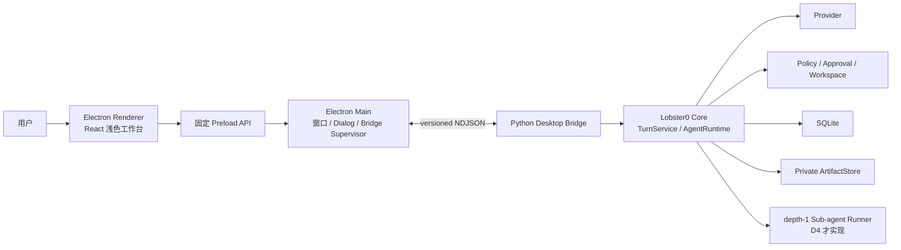
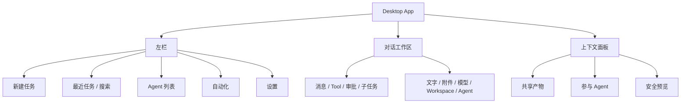
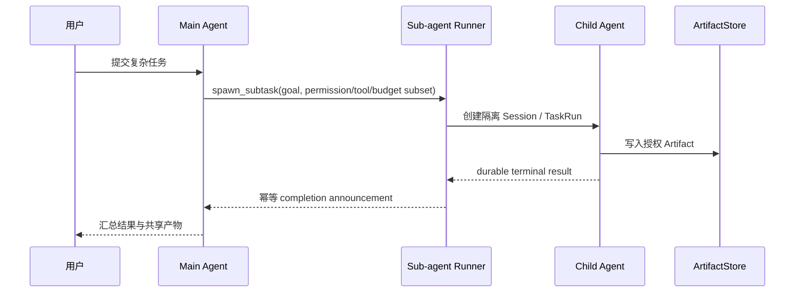
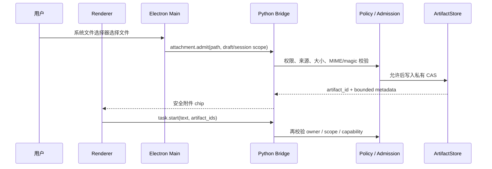

# Lobster0 LobsterAI-first 桌面多 Agent 架构设计

> 日期：2026-08-10
> 文档类型：系统与界面设计
> 状态：`TARGET CONFIRMED / IMPLEMENTATION PENDING`
> 上一版基线：[通用桌面 Agent 工作台设计](20260809_通用桌面Agent工作台设计.md)

## 1. 设计结论

Desktop 保留现有 Electron + React + Python Bridge 技术路线，但重排产品核心：

- LobsterAI Cowork 是主要界面和交互参照；
- OpenAgents 提供 Agent、Thread、Participant、Shared Artifact 的信息架构参照；
- Lobster0 Core 继续是唯一执行、安全与持久化权威；
- 现有首页不再挡在输入框之前，应用默认进入可直接对话的 Workspace；
- Multi-Agent 只实现 Lobster0 Phase 9 定义的 depth-1 子任务，不引入 Agent Network。

这次演进是替换 Desktop 的信息架构，不是重写后端。

## 2. 当前事实基线

### 2.1 已实现并复用

| 能力 | 当前实现 | Desktop 使用方式 |
| --- | --- | --- |
| Agent Tool Loop | Python `AgentRuntime` / `TurnService` | Bridge 发起和取消 Turn |
| 模型 | OpenAI-compatible Provider | bootstrap 返回当前模型 |
| 安全 | Policy、Approval、Workspace、Sandbox | Core 判定，Desktop 只展示与提交决定 |
| 持久化 | SQLite Session、Message、Turn、ToolRun、Audit | Bridge 查询，不允许 Renderer 直读 |
| Artifact | 私有 content-addressed `ArtifactStore` | Browser 已使用；Desktop API 待接入 |
| 自动化 | Task/Scheduler/Runner | Desktop 当前只读展示 |
| 桌面壳 | Electron Main、固定 Preload、React Renderer | 继续沿用 |
| 任务事件 | versioned NDJSON Bridge | typed reducer 投影到时间线 |

### 2.2 尚未实现

- Desktop 附件 admission、Artifact 列表/预览/打开 Bridge API；
- Provider 模型目录和每个 Turn 的明确模型选择；
- 持久化 Agent 配置、参与者和父子任务关联；
- depth-1 Sub-agent runner、预算、恢复和完成回传；
- 多 Agent UI 与真实运行状态的端到端连接。

设计图或静态卡片不能改变这些事实。

## 3. 系统边界



### 3.1 Renderer

Renderer 负责：

- 工作台布局、导航、Composer、对话时间线和右侧上下文面板；
- 将 typed Bridge event 投影为可见状态；
- 收集用户文字、选择结果和审批决定；
- 只显示已授权的附件/Artifact 元数据或有界预览内容。

Renderer 不负责：

- 读取本地文件、SQLite、环境变量或 Secret；
- 调用模型、执行 Tool、扫描 Workspace；
- 判断风险或自动批准；
- 创建独立 Agent Runtime。

### 3.2 Preload

Preload 暴露一组固定、窄而有类型的 API。每个 IPC payload 由 Main 再次做精确字段、类型、长度和枚举校验。
不提供通用 `invoke(channel, payload)`、文件 API 或 Node 对象。

### 3.3 Electron Main

Main 只承担平台能力和进程监督：

- 管理 Python Bridge 生命周期；
- 系统文件/目录选择器；
- 经 Core 授权后的系统打开或 Finder 定位；
- 窗口、菜单和退出；
- 将 Bridge event 转发给正确窗口。

Main 不保存业务真相；Bridge 重启后从 Core 重新 bootstrap 和恢复任务。

### 3.4 Python Bridge

Bridge 是 Desktop 的唯一业务接口，负责：

- 将 Desktop 请求映射到现有 Core 服务；
- 执行 owner、session、状态和 capability 校验；
- 将 Python 模型转换为稳定 JSON；
- 隔离内部异常，返回稳定错误码；
- 发送可恢复的任务、Artifact 和 Sub-agent 事件。

Bridge 不直接绕过 Service 写数据库。

## 4. 产品状态模型

### 4.1 Workspace

一个 Desktop 窗口在任一时刻绑定一个 Core Workspace。切换 Workspace 继续沿用受管 Bridge 重启模型。活跃 Turn、
pending Approval 或运行中的子任务存在时切换失败关闭。

### 4.2 Thread / Task

界面使用“任务”或“线程”称呼，存储仍以现有 Session/Turn 为主：

- 顶层 Task 对应一个 owner-scoped Session；
- 每次发送对应一个 Turn；
- D4 子任务拥有隔离 child Session 和 durable TaskRun；
- UI 不另建一套聊天记录数据库。

### 4.3 Agent

Agent 是 Core 授权的执行配置：

```text
Agent = identity + instructions + allowed tools + permission ceiling + model route + budget
```

- `main` 是默认 Agent，复用当前 Runtime；
- 内置 Agent 配置只描述差异，不复制 Runtime；
- 子 Agent 的工具、权限、Workspace 和预算必须是父任务的子集；
- Agent 配置不能包含 Secret；
- D4 之前，UI 只展示真实可用的 Main Agent。

### 4.4 Participant

Participant 是某个任务中实际参与的 Agent 投影，不是独立账号。最小状态包括：

- `queued`；
- `running`；
- `waiting_approval`（仅主任务可进入用户审批，子任务不能自批）；
- `completed`；
- `failed`；
- `cancelled`；
- `interrupted`。

### 4.5 Artifact

Artifact 继续使用现有私有 content-addressed store。D2/D3 只补齐通用 admission、关联和读取接口，不创建第二个
附件目录。

建议的最小关系：

```text
ArtifactLink = artifact_id + owner_id + session_id + turn_id? + task_run_id? + role + created_by_agent
```

关系可以使用现有表的最小迁移实现；真正设计 D2/D3 时再以当前 schema 和查询需求确定，不提前建表。

## 5. Renderer 信息架构

### 5.1 App Shell



首页统计卡片不再是默认首屏。系统状态收进左栏底部或设置；真正阻止发送的问题在 Composer 附近显示。

### 5.2 Composer 状态

| 状态 | 行为 |
| --- | --- |
| booting | 禁用，显示“正在连接 Lobster0 Core” |
| ready-empty | 首屏大输入框，可选择附件/模型/Workspace/Agent |
| ready-thread | 固定在时间线底部，可继续追问 |
| submitting | 防止重复提交，保留文本直到 Core 接受 |
| running | 显示停止，允许查看但不允许并发提交同一 Session |
| awaiting-approval | 输入仍可编辑，但新 Turn 等待当前审批收口 |
| failed | 恢复草稿，展示稳定错误和重试入口 |

Composer 只实现一次，通过尺寸和空态样式变化适应两种页面状态。

### 5.3 右侧面板

右侧面板按任务上下文组合三个 section：

1. Shared Outputs：真实 Artifact；
2. Participants：主 Agent 和真实子 Agent；
3. Preview：用户选中的可预览 Artifact。

D1 没有 Artifact/Sub-agent API 时，右栏默认收起，不放演示数据。D3/D4 按 capability 打开对应 section。

### 5.4 浅色视觉 token

沿用现有 CSS，不新增 UI 框架。最小 token：

| Token | 用途 |
| --- | --- |
| `--surface-app` | 应用浅灰背景 |
| `--surface-panel` | 左右栏和卡片背景 |
| `--surface-input` | Composer 背景 |
| `--border-subtle` | 分隔线 |
| `--text-primary` / `--text-muted` | 正文与辅助文字 |
| `--accent` | 发送、选中和焦点 |
| `--danger` / `--warning` / `--success` | 错误、审批、完成 |

优先使用原生按钮、textarea、select/popover 语义和 CSS；不为静态布局引入组件库。

## 6. Bridge 能力演进

具体协议版本和字段在每个 Phase 的设计文档中冻结。总体新增能力如下：

### D1

- 复用现有 `desktop.bootstrap`、`task.start`、`task.cancel`、Approval、Session list/history；
- 不需要后端新抽象；
- 只重排默认 View 和共享 Composer/Timeline。

### D2

- `attachment.admit`：Main 收到系统选择路径后交给 Core 校验和入库；
- `attachment.remove`：只移除当前草稿关联，不误删仍被引用的 CAS 内容；
- `models.list`：返回 Core 可用模型与能力，不返回 Secret；
- `agents.list`：返回真实可选 Agent；只有 Main Agent 时只返回一项；
- `task.start` 扩展为绑定 `artifact_ids`、`model_id`、`agent_id`；
- Workspace 继续使用现有选择和重启请求。

### D3

- `artifact.list`：按 owner/session 查询授权 Artifact；
- `artifact.preview`：返回有界、类型安全的预览或临时受控资源；
- `artifact.open` / `artifact.reveal`：Core 校验后由 Main 执行系统动作；
- 新增 Artifact created/updated/deleted event，使右栏无需轮询猜测。

### D4

- `participants.list`：父任务的真实参与 Agent；
- `subtask.list` / `subtask.cancel`：查询和取消授权子任务；
- task event 增加 child queued/running/completed/failed/cancelled 投影；
- 父任务完成回传保持幂等，Bridge 重连可以从 durable state 重建。

## 7. 请求与事件安全

- 请求对象使用 exact-key 校验，未知字段直接拒绝；
- `session_key`、Agent id、模型 id、Artifact id 均有格式和长度上限；
- 本地路径只允许从 Main 的系统 Dialog 流入 Bridge，不经 Renderer 拼接；
- 预览内容有字节、行数、像素和媒体类型限制；
- Artifact 元数据做 owner/session 绑定，不能仅凭 id 跨任务读取；
- 系统打开动作重新校验 Artifact 状态和实际 CAS 路径；
- Sub-agent 所有能力在 Core 计算子集，Renderer 选择不能扩大权限；
- 错误日志只含稳定 id、状态、大小和哈希摘要，不含正文、Secret 或原始附件。

## 8. Multi-Agent 运行模型

D4 复用 Phase 9 的 bounded sub-agent 方案：



硬边界：

- 深度最多 1；
- 默认隔离上下文，仅允许有界、脱敏的显式 fork；
- 子任务独立 token、tool、time 和并发预算；
- 子任务不能外发、定时、安装、修改配置、审批或递归 spawn；
- 子任务输出被视为数据，父 Agent 负责最终面向用户的判断；
- 取消、超时、进程退出和重启都有 durable 终态；
- Desktop 只展示 Core 状态，不在前端调度 Agent。

## 9. Artifact 与附件数据流



用户选择文件不等于模型可以读取文件。Artifact admission、上下文注入和 Provider 多模态序列化是三个独立边界。

## 10. 恢复和失败策略

| 故障 | 用户体验 | 系统行为 |
| --- | --- | --- |
| Bridge 启动失败 | Composer 禁用，显示修复/重试 | 不进入假 ready |
| Bridge 运行中退出 | 当前任务标记 interrupted | Main 可重启并重新 bootstrap |
| 附件拒绝 | 对应 chip 显示原因，可移除 | 不把路径或内容带入消息 |
| 模型不支持附件 | 发送前阻止并说明 | 不静默换模型或丢附件 |
| Artifact 预览失败 | 保留元数据和系统打开选项 | 不影响任务终态 |
| 子任务超时/失败 | Participant 显示终态 | 父任务收到一次结构化结果 |
| 应用重启 | 恢复历史与 durable 状态 | 不自动重放 Tool 或 approval |

## 11. 上游参考与许可台账

设计基于以下固定参考版本，真正移植代码时补充精确文件级记录：

| 项目 | 固定参考 | 许可 | 当前借鉴范围 |
| --- | --- | --- | --- |
| `netease-youdao/LobsterAI` | `bef896b` | MIT | Cowork 首屏、Prompt Input、Session Detail、Agent/Artifact 交互 |
| `openagents-org/openagents` | `3cddf0d` | Apache-2.0 | Launcher Chat、Agent 列表、Session/Thread、Shared Files/Browser 布局 |

实施约束：

- 优先用现有 Lobster0 组件和原生平台能力；
- 若复制或改写 LobsterAI 代码，保留 MIT copyright/license；
- 若复制或改写 OpenAgents 代码，保留 Apache-2.0、NOTICE，并标注修改；
- 不复制 WorkBuddy/Codex 的非公开源码、商标、图标、截图资产或专有文案；
- 不以“致敬”为由省略开源许可义务。

## 12. 验证架构

每个 Phase 从最小失败测试开始：

- Renderer：App 初始态、Composer、reducer、键盘、错误和 capability gate；
- Main/Preload：IPC exact-key、Dialog、Bridge 监督和系统动作；
- Python：Bridge protocol、owner/session、Artifact、Provider capability、Sub-agent 安全与恢复；
- 集成：真实 Python Bridge、Electron 进程、隔离 `LOBSTER0_HOME`；
- 手工：浅色视觉、窗口缩放、输入法、键盘、附件、审批和恢复；
- 全量：Python unittest、Ruff、TUI/Desktop tests/build、docs validation 和 `git diff --check`。

D4 还必须通过 Phase 9 的权限子集、depth、预算、取消、恢复、幂等完成和 Artifact provenance gate。

## 13. 非目标

- 第二套 Runtime、Policy、SQLite 或 Provider client；
- OpenAgents Network、跨设备 Mesh 或远程 Agent 商店；
- 多层递归 Agent、任意拓扑图或 Workflow DAG 编辑器；
- 内置 Office/IDE、完整网页浏览器或远程桌面控制；
- 多用户账号、云同步和实时共同编辑；
- D1～D5 内的 installer signing、自动更新和应用商店发布。
