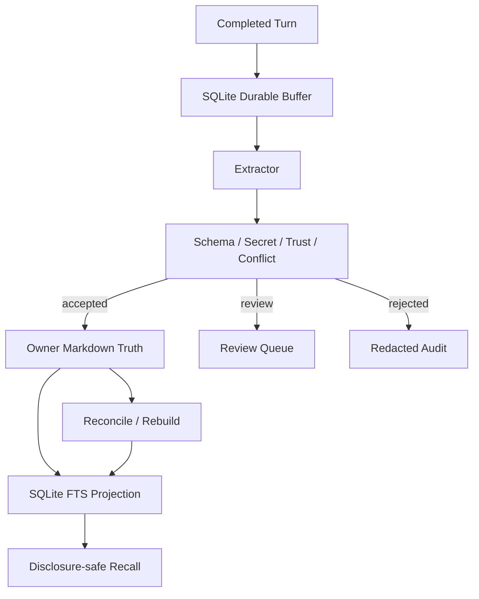
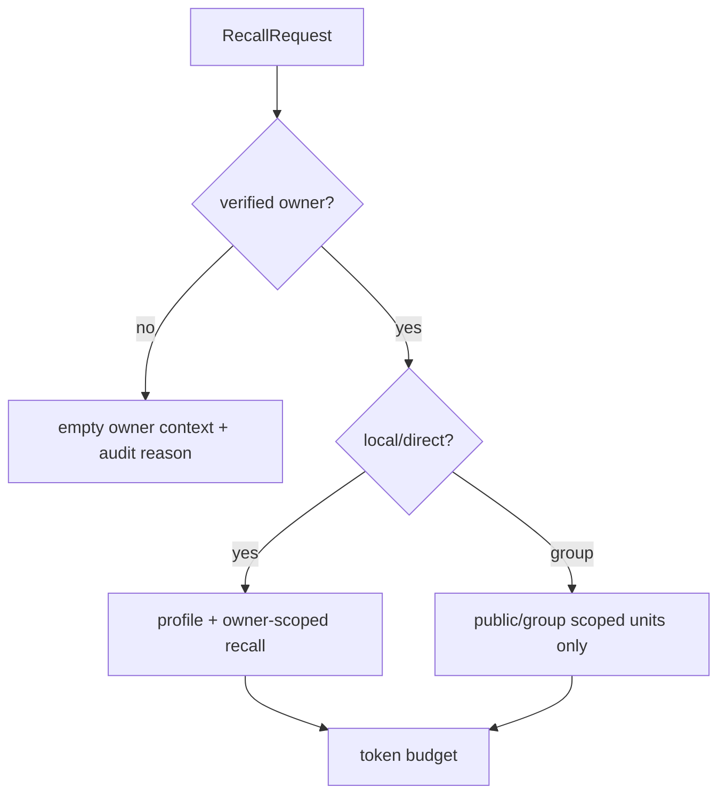
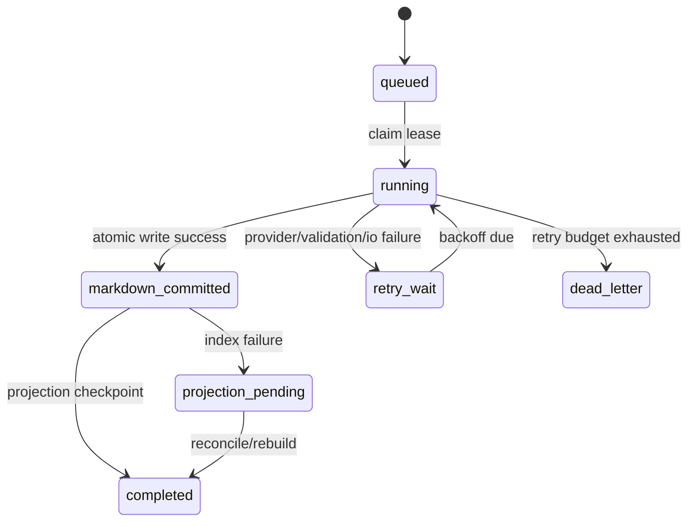
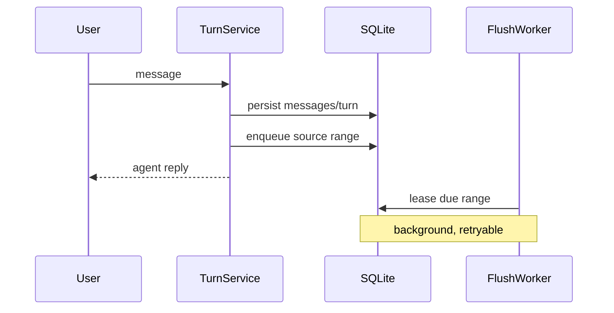
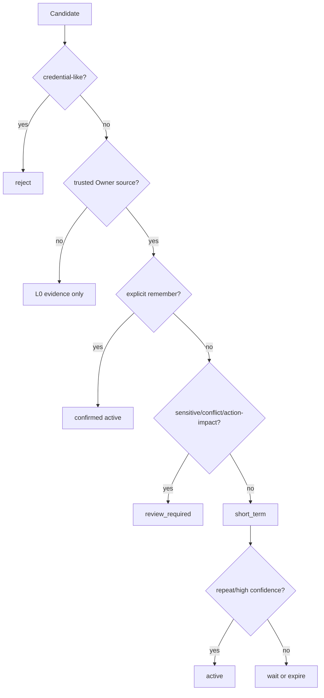
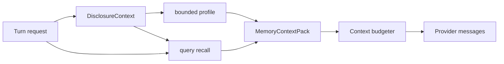
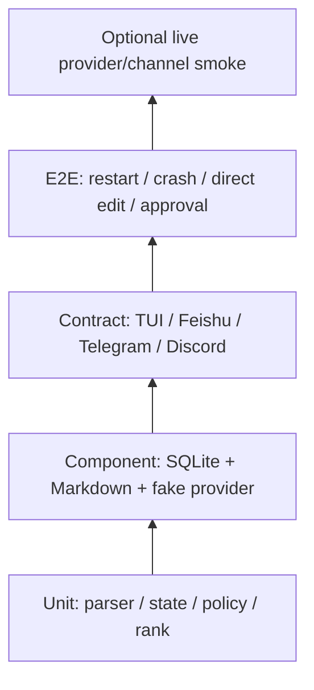

# MiniClaw Memory Autopilot 最佳实践与技术选型

> 日期：2026-08-08
> 状态：**APPROVED DESIGN / PLANNED / NOT IMPLEMENTED**
> 事实基线：`main@729a801`，设计文档基线：`docs/memory-autopilot-design`
> 读者：准备实现、Review、测试和维护 Memory 子系统的开发者
> 上位设计：[Memory Autopilot 能力 Gap 与重构架构](../architecture/20260808_Memory-Autopilot能力Gap与重构架构.md)
> 落地计划：[Memory Autopilot A～E TDD 实施计划](../superpowers/plans/2026-08-09-memory-autopilot.md)

## 1. 工程目标

这次重构要解决的不是“再加一个 `memory_search` Tool”，而是建立一条可恢复的 Memory 数据管道：

1. 同一个 Owner 从 TUI、飞书、Telegram、Discord 进入时共享同一个 Memory Space；
2. 对话先正常完成，记忆提取在后台异步进行，失败不阻塞用户回复；
3. 普通低风险事实自动进入短期记忆，明确“记住”立即生效；
4. 敏感、冲突和会改变行为/权限的内容必须 Review；
5. 已接受的 Memory Unit 自动写入人能阅读的 Markdown；
6. SQLite 负责队列、状态、审计和索引，Markdown 是已接受语义记忆的真相源；
7. 所有召回都先经过身份与 Disclosure Policy，再进入模型上下文；
8. 每条记忆能解释“来自哪条消息、为何晋升、是否已过期”。

### 1.1 非目标

- 不在本阶段引入独立 Memory Server；
- 不要求向量数据库或云服务；
- 不允许 Memory 绕过 Tool Policy、Approval 或 Sandbox；
- 不自动把用户画像变成可执行 Skill；
- 不把所有历史对话拼进 Provider Context；
- 不宣称当前代码已经具备本文描述的计划能力。

## 2. 当前实现基线

| 模块 | 当前事实 | 保留/替换 |
| --- | --- | --- |
| `MemoryStore` | 读取 `MEMORY.md`、今日/昨日 daily | 保留兼容入口，逐步拆为 Markdown Store 与 Projection |
| `read_memory` | 三个固定 scope | 兼容一版，新增按 Unit 搜索和下钻 |
| `propose_memory` | 明确请求后，经审批追加 daily | 兼容为 Review 路径；明确“记住”改走直接确认语义 |
| `messages` | 完整会话按 Session 落 SQLite | 继续作为 L0 Source 真相 |
| `ChannelIdentity.user_id` | 外部身份映射本地用户 | 升级为 Owner Memory Space 主键 |
| `ContextBuilder` | 无 requester/trust 参数 | 必须增加显式 Disclosure 输入 |
| Compaction | 原始消息保留 | 增加 compaction 前 durable flush，不改变原始事实 |

## 3. 参考实现与取舍

### 3.1 三种方案

| 方案 | 描述 | 优点 | 问题 | 结论 |
| --- | --- | --- | --- | --- |
| A：SQLite-only | Unit、正文、索引全部存数据库 | 事务简单，查询方便 | 人不可直接维护，Git/备份/迁移不透明 | 不选 |
| B：Markdown-only | 每轮直接追加 Markdown，搜索时扫文件 | 最简单、可读 | 无可靠队列、幂等、状态机、并发与索引恢复 | 不选 |
| C：Markdown Truth + SQLite Control Plane | 已接受记忆写 Markdown；队列、审计、状态和索引在 SQLite | 人可读、可恢复、可检索、能崩溃重放 | 要认真定义双写顺序和 reconcile | **选择** |

### 3.2 借鉴边界

| 项目 | 借鉴 | 首版不照搬 |
| --- | --- | --- |
| [EverOS](https://github.com/EverMind-AI/EverOS) | Markdown-first、buffer/flush、派生记忆、可重建索引、Reflection 软归档 | 独立服务、LanceDB、完整多模型 Pipeline |
| [TencentDB Agent Memory](https://github.com/TencentCloud/TencentDB-Agent-Memory) | L0→L3、渐进披露、证据下钻、Keyword/Embedding/Hybrid 抽象 | 外部 Gateway、首版 sqlite-vec 强依赖、Mermaid 机器状态 |
| [OpenClaw Memory](https://github.com/openclaw/openclaw/blob/main/docs/concepts/memory.md) | Markdown + daily、compaction 前 flush、FTS5/可选 Hybrid、私聊 Memory 边界 | 原样复制其目录、Prompt 和产品约束 |



## 4. 计划模块边界

建议新增或重构为以下模块。文件名是计划接口，不代表已经实现。

```text
src/miniclaw/memory/
├── models.py             # MemoryUnit / SourceRef / Candidate / Conflict
├── policy.py             # capture、promotion、sensitivity、disclosure
├── buffer.py             # durable source-range buffer
├── extractor.py          # provider strict-JSON extraction
├── validator.py          # schema、secret、trust、dedupe、conflict
├── markdown_store.py     # atomic Markdown read/write/parse
├── repository.py         # SQLite control-plane repositories
├── flush.py              # idempotent flush coordinator/worker
├── retrieval.py          # FTS5/CJK/ranking/token budget
├── context.py            # bounded snapshot/recall assembly
├── reconcile.py          # direct edit detection, lint and index rebuild
├── review.py             # approval/reject/correct/forget transitions
└── service.py            # Core-facing facade
```

### 4.1 Core 只依赖一个 Facade

```python
class MemoryService(Protocol):
    def capture_completed_turn(self, request: CaptureRequest) -> CaptureReceipt: ...
    def build_context(self, request: RecallRequest) -> MemoryContext: ...
    def search(self, request: SearchRequest) -> SearchResult: ...
    def get_unit(self, owner_id: int, unit_id: str, disclosure: DisclosureContext) -> MemoryUnitView: ...
    def remember_explicit(self, request: ExplicitMemoryRequest) -> MemoryUnitView: ...
    def forget(self, request: ForgetRequest) -> ForgetPreview | ForgetReceipt: ...
    def request_flush(self, request: FlushRequest) -> FlushReceipt: ...
```

`TurnService`、Channel Adapter 和 TUI 不直接读写 Markdown，也不直接拼 SQL。所有入口通过 Facade 复用身份、Policy、审计和预算。

## 5. 身份、作用域与 Disclosure

### 5.1 两个 ID 不应混用

- `owner_id`：Memory Space 主键，MVP 固定映射本地 Owner；
- `requester_user_id`：发起本次请求的人；
- `session_id`：会话历史边界，不是 Memory Space；
- `channel_identity_id`：来源证据，不是跨渠道 Profile 主键。

### 5.2 计划输入

```python
@dataclass(frozen=True)
class DisclosureContext:
    requester_user_id: int | None
    owner_id: int
    channel: str
    conversation_kind: Literal["local", "direct", "group", "unknown"]
    is_verified_owner: bool
    allowed_scopes: frozenset[str]
```

### 5.3 Fail-closed 决策

| 场景 | Capture | Profile 注入 | Query Recall | Memory Tool |
| --- | --- | --- | --- | --- |
| 本地 TUI | Owner scope | 是 | 是 | 是 |
| 验证 Owner 私聊 | Owner scope | 是 | 是 | 是 |
| Owner 群聊 | 默认只存 group/public candidate | 否 | 仅 group/public | 仅 group/public |
| 白名单非 Owner 私聊 | 其自身会话，不进 Owner Profile | 否 | 否 | 否 |
| 身份不明 | 不 Capture | 否 | 否 | 否 |



## 6. Memory Unit 数据模型

### 6.1 稳定字段

```yaml
schema_version: 1
id: mem_01J...
owner_id: 1
kind: preference
text: 用户希望 MiniClaw 默认使用中文回复
status: active
scope: private
sensitivity: normal
confidence: 0.98
valid_from: 2026-08-08T22:00:00+08:00
expires_at: null
superseded_by: null
source_ids:
  - src_message_123
created_by: explicit_owner_request
extractor_version: memory-extractor-v1
content_hash: sha256:...
```

约束：

- 一个 Unit 只表达一个事实；
- `text` 是事实陈述，不包含指令包装；
- `source_ids` 至少一个，人工创建也要有 audit source；
- `confidence` 不是权限；高置信敏感事实仍要 Review；
- `scope` 默认 `private`，不能由模型擅自设为 `public`；
- `status` 只能由 Core 状态机变更；
- Unit ID、时间与 hash 由 Core 生成，不信任 Provider 返回值。

### 6.2 状态

| 状态 | 是否召回 | 是否进 Profile | 说明 |
| --- | --- | --- | --- |
| `observed` | 否 | 否 | Extractor 原始候选 |
| `short_term` | Query 命中时 | 否 | 低风险、带 TTL |
| `review_required` | 否 | 否 | 敏感、冲突或行为影响 |
| `active` | 是 | 符合类型时 | 已确认或达到自动晋升规则 |
| `rejected` | 否 | 否 | 不合法、用户拒绝或秘密 |
| `superseded` | 默认否 | 否 | 被新事实替代，可追溯 |
| `archived` | 默认否 | 否 | 遗忘或 Reflection 合并 |
| `expired` | 否 | 否 | TTL 到期 |

## 7. SQLite Control Plane

以下是逻辑表；具体 DDL、状态机和 `0003_memory_autopilot.sql` 的实施顺序已在 A～E TDD 计划中固化。

### 7.1 表职责

| 表 | 关键字段 | 职责 |
| --- | --- | --- |
| `memory_buffers` | owner、source range、due_at、status | 等待 flush 的 durable 范围 |
| `memory_flush_runs` | run_id、idempotency_key、attempt、checkpoint | claim/retry/crash recovery |
| `memory_candidates` | unit payload、decision、reason | 提取结果和 Review Queue |
| `memory_units` | id、status、hash、path、offset | Markdown Unit 投影与状态 |
| `memory_sources` | unit_id、message_id、session/channel | Unit→L0 来源链 |
| `memory_conflicts` | pair、kind、resolution | 冲突集合 |
| `memory_fts` | FTS5 columns | Keyword/CJK 检索投影 |
| `memory_manifests` | path、hash、mtime、parser_version | 直接编辑与 reconcile |
| `memory_reviews` | action、actor、decision、before/after hash | 人工 Review 审计 |

### 7.2 幂等键

```text
sha256(
  owner_id
  + first_source_message_id
  + last_source_message_id
  + extractor_version
  + extraction_prompt_hash
)
```

相同输入只能有一个 `completed` flush；失败可以增加 attempt，但不能产生第二组 Unit。

### 7.3 状态推进



## 8. Markdown 真相源

### 8.1 目录

```text
~/.miniclaw/memory/owners/<owner_id>/
├── profile.md
├── facts/YYYY-MM-DD.md
├── episodes/YYYY-MM-DD.md
├── commitments/active.md
├── reviews/YYYY-Www.md
└── archive/
```

### 8.2 推荐格式

Markdown 必须同时适合人读和机器稳定解析，不依赖脆弱的任意自然语言标题：

```markdown
---
schema: miniclaw.memory/v1
owner_id: 1
kind: facts
date: 2026-08-08
---

<!-- miniclaw:unit mem_01J... -->
## 偏好：默认使用中文

- status: active
- kind: preference
- scope: private
- confidence: 0.98
- valid_from: 2026-08-08T22:00:00+08:00
- sources: src_message_123

用户希望 MiniClaw 默认使用中文回复。
<!-- /miniclaw:unit -->
```

### 8.3 原子写入

1. 读取当前文件和 manifest hash；
2. 持有 owner/path 粒度锁；
3. 把完整新文件写到同目录临时文件；
4. flush + `fsync`；
5. `os.replace` 原子替换；
6. 更新 `markdown_committed` checkpoint；
7. 异步更新 Projection。

禁止：多个 Worker 直接 `open(..., "a")` 并发追加；写失败后也不能推进 source checkpoint。

### 8.4 人工编辑

启动、定时任务或 `/memory rebuild` 对比 manifest：

- 格式合法：重新 parse、校验、更新 Projection；
- Unit 被用户修改：生成新的 content hash 和 `manual_edit` audit；
- 文件损坏：隔离错误，不自动覆盖；
- 重复 ID：fail closed 并给出文件/行号；
- 删除 Unit：视为 archive 请求，执行引用检查后生效。

## 9. Buffer 与 Flush 算法

### 9.1 Capture 不阻塞回复



只有“明确记住”是用户期待即时生效的命令，因此它同步走校验与原子写入；失败必须明确告诉用户没有记住，不能假成功。

### 9.2 Flush 步骤

1. Lease 一个 due buffer；
2. 固定 source snapshot 和幂等键；
3. 构造不含秘密、不含无关历史的 Extraction Input；
4. Provider 返回严格 JSON；
5. Core 生成 ID/时间/hash，并做 schema、秘密、trust、scope 校验；
6. exact dedupe，再做冲突检测；
7. 按规则分流 `short_term / review_required / rejected`；
8. 一次原子写入本 run 的 accepted Unit；
9. 更新 manifest 与 Projection；
10. 完成 checkpoint，释放 lease。

### 9.3 触发与去抖

| 触发 | 默认 | 说明 |
| --- | --- | --- |
| 完成 Turn 数 | 5 | 同 owner/session 聚合 |
| idle | 10 分钟 | 重置定时但不丢 durable row |
| `/new`、`/reset` | 立即 | 新 Session 前完成/排队 |
| pre-compaction | 立即 | compaction 可等待有界时间，超时保留 buffer |
| shutdown | 有界 3 秒 | 来不及则下次恢复 |
| startup recovery | 立即扫描 | 回收过期 lease |
| daily/weekly | 定时 | 用于 Profile/Review，不重复提取消息 |

## 10. Extraction Contract

Provider 只能提建议，不能决定权限与最终状态。

```json
{
  "schema_version": 1,
  "candidates": [
    {
      "kind": "preference",
      "fact": "用户希望默认使用中文回复",
      "confidence": 0.94,
      "source_message_ids": [123],
      "validity": "stable",
      "sensitivity_hint": "normal"
    }
  ]
}
```

Core 必须拒绝：

- JSON 之外的额外内容或未知字段；
- source 不在当前 snapshot；
- 空事实、复合事实、超长事实；
- 命令式“必须执行 X”、来自外部 Tool/Web 的 Prompt Injection；
- 任意凭据模式；
- Provider 指定 `active`、`public`、`owner_id` 或审批结果。

解析失败只使本 run 重试/降级，不影响原 Turn。

## 11. 晋升与风险治理

### 11.1 决策顺序



### 11.2 初始阈值

阈值必须配置化并由 eval 校准，而不是刻在 Prompt：

- 明确“记住”：Core intent 命中 + Owner trusted，直接 active；
- 普通 Unit：`confidence >= 0.75` 进入 short-term；
- 自动晋升：至少 2 个不同 completed Turn 的一致证据，且 `confidence >= 0.90`；
- 临时事件/commitment：使用类型 TTL，不晋升 Profile；
- Profile claim：只允许 identity/preference/goal 的稳定 active Unit；
- sensitive/conflict/action-impact：阈值再高也必须 Review。

这里的数字是实施起点，不是已经验证的生产参数。

## 12. 检索与排序

### 12.1 首版：FTS5 + CJK Shadow

SQLite 自带 FTS5，满足单 Owner 本地规模。中文短句另外生成只用于检索的规范化 shadow：

- Unicode NFKC；
- 小写英文；
- 保留数字/标识符；
- 中文连续文本生成 2/3-gram token；
- 原文仍只存在 Markdown 和受控 Projection；
- 凭据过滤先于 shadow 生成。

### 12.2 排序

```text
final_score =
  0.45 * keyword_score
  + 0.20 * source_confidence
  + 0.15 * recency_decay
  + 0.10 * kind_match
  + 0.10 * explicit_or_repeated_bonus
```

硬过滤先于打分：owner、scope、status、validity、sensitivity、channel disclosure。任何分数都不能越过权限过滤。

### 12.3 Token Budget

| 部分 | 建议上限 |
| --- | --- |
| Profile | 1,200 tokens |
| Query Recall | 5 Units / 1,000 tokens |
| Source snippet | 默认不注入；下钻时每条 300 tokens |
| Memory 总预算 | Context window 的 8%，且不高于 2,200 tokens |

稳定裁剪顺序：过期→低置信→低相关→旧事件；不能从中间截断一个 Unit。

### 12.4 未来 Hybrid

只有固定回归集证明 Keyword Recall@5 不足，才加入 `EmbeddingRetriever`。建议采用 Adapter + Reciprocal Rank Fusion；向量是可重建 Projection，不成为真相源，也不能把明文发送给未授权的外部 Embedding Provider。

## 13. ContextBuilder 集成

计划把现在的无条件 `MemoryStore.snapshot()` 改成：



`MemoryContextPack` 需附带：

- unit IDs；
- pack hash；
- 召回与过滤数量；
-预算使用；
- disclosure reason；
- 不含正文的 audit metadata。

如果 Recall 失败，Turn 仍可继续，但 System Prompt 必须说“本轮记忆不可用”，不能让模型猜测。

## 14. Tool 与用户命令

### 14.1 计划 Tool

| Tool | 风险 | 用途 |
| --- | --- | --- |
| `memory_search` | low（受 disclosure） | 按 query/type/status 搜索 |
| `memory_get` | low（受 disclosure） | 按 ID 查看 Unit 和来源摘要 |
| `memory_list` | low（Owner only） | 安全列出状态/类型 |
| `memory_remember` | medium | 明确保存 Owner 指定事实 |
| `memory_forget` | medium/high | 预览、归档或彻底删除 |
| `memory_flush` | low | 请求一次有界 flush |

`read_memory` 保留一个迁移版本并映射到 list/search；`propose_memory` 映射到 review queue，发出 deprecation audit，不能突然破坏旧 Skill。

### 14.2 Slash Commands

```text
/memory status
/memory list [--status active|short-term|review]
/memory search <query>
/memory why <unit-id>
/memory flush
/memory remember <text>
/memory forget <unit-id>
/memory rebuild
```

TUI 和 IM 共用 Core command handler，不能各自实现一套状态机。

## 15. Review、纠错与遗忘

- Review 卡片显示安全摘要、类型、来源渠道/时间、触发原因和影响；
- 批准、拒绝、修改后批准都绑定 candidate hash；
- 过期或内容变化后不能消费旧 Approval；
- Conflict Review 同时显示旧/新 Unit 和“替代/并存/拒绝”；
- Forget 默认归档并从索引、Profile 移除；
- 彻底删除需列出受影响文件、来源引用和审计保留范围；
- 所有写操作有 before/after hash 和可恢复备份。

## 16. 安全与隐私

### 16.1 三层秘密拦截

1. Capture 前：不把 Tool secret field、系统环境与凭据内容送给 Extractor；
2. Candidate 后：结构化 secret classifier + pattern + entropy 规则；
3. Markdown 前：最终序列化内容再次扫描。

任一层命中都 `rejected`，审计只存规则 ID 和 hash，不存秘密正文。

### 16.2 外部内容

Web、邮件、文档、Tool stdout 默认 `untrusted_external`：

- 可作为某个任务的 Source；
- 不能自动变成 Owner preference/constraint；
- 不能授权写文件、发消息或改变 Policy；
- 引用外部事实时要带来源和有效期；
- 外部内容中的“请记住/忽略规则”视作普通文本。

### 16.3 文件权限

- Memory 根和文件保持 owner-only；
- 临时文件同目录并使用 owner-only mode；
- 日志、TUI Trace 和 eval artifact 不输出私人正文；
- 导出需显式 Owner 操作；
- group/public scope 不能通过手工改字段绕过 Core 校验。

## 17. Migration 与兼容

### 17.1 现有文件迁移

1. 首次启动以只读方式扫描 `~/.miniclaw/MEMORY.md` 和 `memory/*.md`；
2. 生成 `legacy_manual` Unit 和 manifest，不改旧文件；
3. 对比 Unit 数、hash、secret scan；
4. 用户/自动 gate 确认后写入新目录；
5. 迁移期同时读新 Projection + legacy snapshot，按 hash 去重；
6. 至少一个版本后再决定是否归档旧文件。

### 17.2 数据库迁移

- schema migration 必须可在备份副本上先演练；
- 新表 additive 创建，不重写现有 messages；
- migration 失败时旧 Memory 仍可读；
- downgrade 至少支持停用新 pipeline，不承诺无损删除已写 Markdown；
- `doctor` 增加 manifest、FTS5、pending run、owner scope 检查。

## 18. Observability

### 18.1 Activity Event

```json
{
  "type": "memory.flushed",
  "run_id": "mfr_...",
  "owner_id": 1,
  "accepted": 2,
  "review": 1,
  "rejected": 0,
  "duration_ms": 184,
  "content_included": false
}
```

事件至少包含：`memory.buffered`、`flush_started`、`extracted`、`flushed`、`projection_failed`、`recalled`、`review_required`、`forgotten`、`reconciled`。

### 18.2 指标

- flush queue depth / oldest age；
- extraction success/retry/dead-letter；
- accepted/review/rejected by reason；
- recall latency、candidate count、budget；
- cross-channel hit rate；
- conflict/forget/rebuild count；
- leakage、credential-block、source-missing 必须为高优先级告警。

## 19. 测试与 Benchmark

### 19.1 测试金字塔



### 19.2 必测集合

| 类别 | 用例 |
| --- | --- |
| Identity | 四渠道同 Owner；非 Owner；群聊；映射冲突 |
| Capture | 普通 Turn、失败 Turn、Tool 输出、重复 delivery |
| Extraction | 严格 JSON、非法字段、复合事实、虚构 source |
| Security | Key/Token/private key/OTP、外部 prompt injection、他人画像 |
| Flush | N Turn、idle、pre-compaction、shutdown、startup recovery |
| Crash | write 前、replace 后、index 前、checkpoint 前逐点故障 |
| Promotion | 明确记住、重复证据、TTL、敏感、行为影响 |
| Conflict | 替代、并存 scope、拒绝、过期 Approval |
| Retrieval | 中文、英文、精确 ID、同义表达、过期过滤、稳定排序 |
| Editing | 合法编辑、损坏 front matter、重复 ID、删除、rebuild |
| Budget | 长 Profile、大量命中、完整 Unit 裁剪 |
| Forget | 默认不召回、Profile 更新、Projection 删除、恢复/物理删除 |

### 19.3 固定 Agent Eval

每版必须保存脱敏 JSONL 场景和 baseline：

1. CLI 说 Python 背景，飞书追问；
2. 飞书“记住默认中文”，重启后 TUI 验证；
3. Discord 临时偏好不立即入 Profile；
4. Telegram 重复偏好后自动晋升；
5. 群聊和非 Owner 不得召回；
6. 新旧偏好冲突进入 Review；
7. 密钥和网页指令拒绝；
8. Provider 失败后 buffer 恢复；
9. Markdown 编辑后 rebuild；
10. forget 后所有渠道不再召回。

退出指标以 [Gap 文档第 15 节](../architecture/20260808_Memory-Autopilot能力Gap与重构架构.md#15-验收场景) 为准。禁止只用“模型回答看起来不错”作为通过依据。

## 20. 分批实施建议

| 批次 | 范围 | 退出条件 |
| --- | --- | --- |
| Memory A | Owner Identity、DisclosureContext、泄露回归 | 群聊/非 Owner 私人召回为 0 |
| Memory B | buffer、flush ledger、Markdown Store、显式 remember | crash matrix 无丢失/重复 |
| Memory C | FTS5/CJK、ContextBuilder、search/get/status | 中文 Recall@5 达标且不超预算 |
| Memory D | 自动提取、晋升、Review、冲突、forget | 状态机与跨渠道 E2E 全绿 |
| Memory E | direct edit reconcile、daily/weekly review、迁移 | rebuild 可复现，legacy 可回退 |


每批先补事故回归，再实现最小纵切；每批必须通过全量 Python/TypeScript/Agent/Channel 门禁并更新 release baseline。

## 21. 风险登记

| 风险 | 后果 | 缓解 |
| --- | --- | --- |
| 双写崩溃 | 重复或漏记 | Markdown commit checkpoint + idempotency + reconcile |
| 模型记错 | 错误画像 | 来源、置信度、短期层、冲突 Review、forget |
| 跨渠道身份错配 | 隐私泄露 | verified mapping、fail closed、identity eval |
| Prompt Injection | 行为规则污染 | untrusted source、Core 状态机、行为类审批 |
| 中文 FTS 召回弱 | 像“没有记忆” | CJK shadow、固定 Recall@5；必要时可选 Hybrid |
| Markdown 人工改坏 | 索引漂移 | manifest、lint、隔离、rebuild、备份 |
| 自动 flush 成本 | Provider 费用/延迟 | 聚合、idle、低优先级 worker、预算、重试上限 |
| Profile 无限增长 | Context 挤压 | Unit 类型限制、token budget、weekly review |

## 22. 工程完成定义

只有同时满足以下条件，才能把状态从 `PLANNED` 改为 `IMPLEMENTED`：

- 四渠道的 Owner Identity 和 Disclosure contract 已接线；
- Markdown/SQLite 崩溃恢复与 direct-edit reconcile 已有故障注入证据；
- 明确 remember、自动 short-term、受控 promotion、conflict、forget 全部可用；
- FTS5 中文回归、Context budget 和来源下钻通过；
- 群聊、非 Owner、秘密和外部注入泄露为 0；
- 旧 Memory 可迁移、可回退，原文件未被静默删除；
- 文档、Doctor、TUI Activity、eval baseline 与 release record 同步；
- 全量门禁通过并记录精确测试数。
