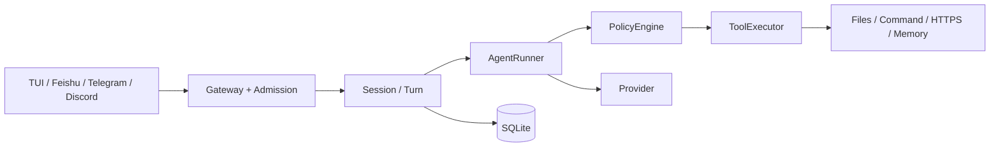
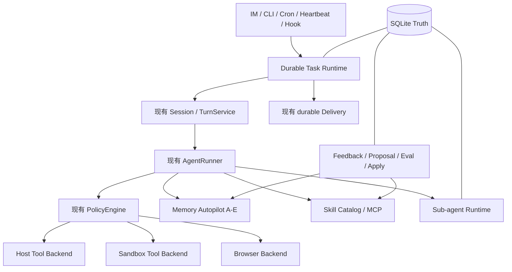
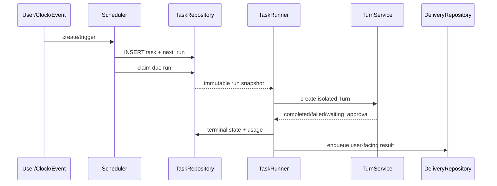
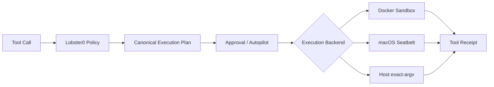
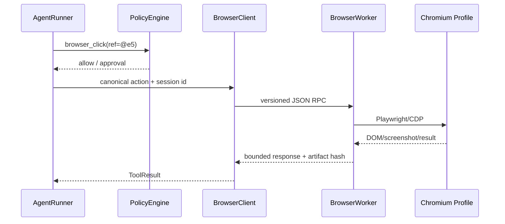
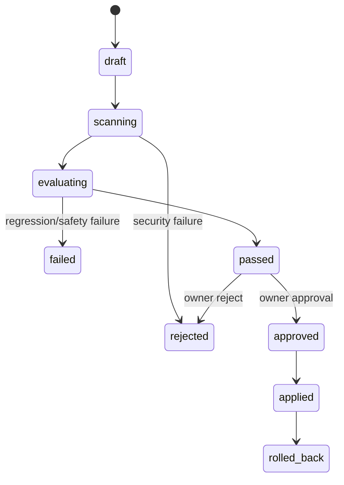
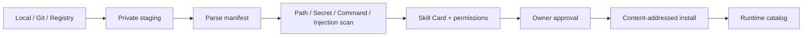
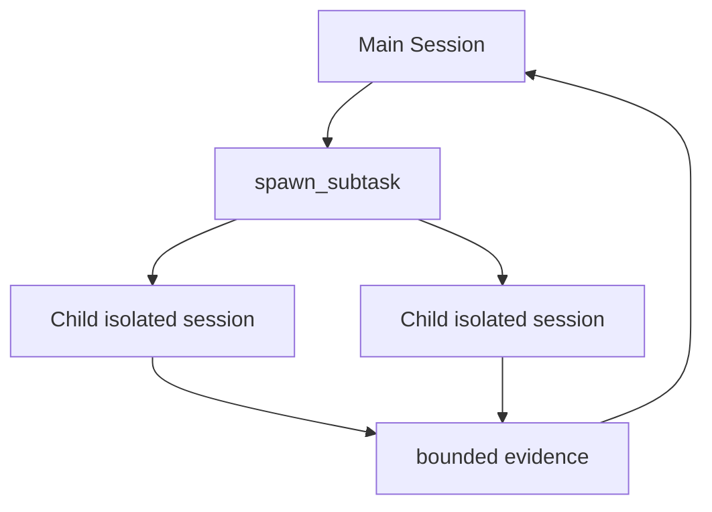
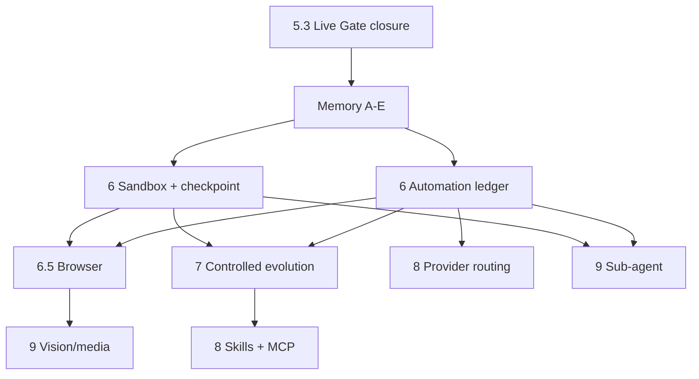

# OpenClaw / Hermes 能力对齐工程落地总方案

> 状态：**APPROVED ROADMAP**；v0.5.3 Core hardening 已实现，其余章节按各自状态执行
> 未实现范围：Memory A～E 与 Phase 6～9 仍为 **APPROVED ROADMAP / NOT IMPLEMENTED**
> 日期：2026-08-08
> 事实基线：`main@54db7b0`
> 配套 Gap：[Lobster0 与 OpenClaw / Hermes 的能力 Gap 与演进路线](../architecture/20260808_OpenClaw-Hermes能力Gap与演进路线.md)
> 适用范围：Phase 5.3、Memory Autopilot A～E、Phase 6、6.5、7、8、9。
> Memory 施工入口：[Memory Autopilot A～E TDD 实施计划](../superpowers/plans/2026-08-09-memory-autopilot.md)

## 1. 文档怎么读

这是一份跨版本总施工图，不代表所有章节均已实现。v0.5.3 的 SDK 日志脱敏、Gateway lease/provenance、受管
Live Runner 与异常 Tool 历史恢复已经进入 `main`；严格 Live Evidence、Memory A～E 和 Phase 6～9 仍按各自
计划执行。每个交付合并后，都必须用 Release Record 和当前工程文档记录真实证据。

大白话理解：

- Gap 文档回答“还缺什么、为什么做”；
- 本文回答“准备怎么做、代码放哪里、怎么测试”；
- Phase 实施计划回答“下一次提交具体先写哪个失败测试”；
- Release record 回答“最终到底验证了什么”。

## 2. 总体架构演进

当前主链路保持不变：Channel/TUI 只负责输入输出，Python Core 是唯一执行权威。



后续能力只能通过清晰接口接到现有主链路旁边，不能另建第二个 Agent Runtime：



## 3. 全局约束

后续所有实现必须满足：

1. Python 继续使用 3.12+；Node/pi-tui 继续要求 22.19+；
2. SQLite 继续是唯一运行事实源；Markdown 继续是可审阅 Memory/Skill 真相源；
3. 不新增常驻公网 HTTP 入口；本地管理 API 只绑定 loopback 或 Unix socket；
4. 所有外部 ID、URL、路径、命令和网页内容先规范化再进入状态机；
5. 模型生成文本不能直接成为权限、任务、Skill、MCP 或 Provider 配置；
6. 所有有副作用动作都必须有 idempotency key；
7. 所有数据库变更使用显式、连续、单向 migration；
8. 所有新配置继续强类型解析并拒绝未知字段；
9. Secret 不进入 SQLite、Prompt、Tool Result、异常、日志、Evidence 或文档；
10. `safe / smart / autopilot / yolo` 都不能绕过硬拒绝、SSRF、资源预算和 OS Sandbox；
11. 新功能必须加入 JSONL 场景和版本化 release record；
12. fake/contract 测试不能冒充真实平台、真实浏览器或真实 Provider 证据。

## 4. Phase 5.2 / 5.3：真实运行与 Live Gate 闭环

> 当前更新：v0.5.3 Core hardening 已实现；Feishu/Discord 严格 15/15、系统服务、完整部署和长期 soak 仍为
> `LIVE PENDING` 或 `PLANNED`。本节下方“计划新增”的 Service/health/Docker 文件不能解释成已存在。

### 4.1 用户结果

用户只需要执行一次安装，Lobster0 就会在 macOS 登录后自动运行。用户可以查看状态、日志、重启和卸载；飞书 15 条真实场景和 24 小时稳定性得到证据。

### 4.2 模块边界

计划新增：

| 文件 | 责任 |
| --- | --- |
| `src/lobster0/service.py` | 平台无关的 install/status/logs/restart/uninstall 契约 |
| `src/lobster0/services/launchd.py` | macOS LaunchAgent plist 生成、验证和 `launchctl` exact argv |
| `src/lobster0/services/systemd.py` | Linux user service 文件生成和 `systemctl --user` exact argv |
| `src/lobster0/health.py` | 不暴露 Secret 的 runtime health snapshot |
| `deploy/Dockerfile` | 非 root、只读 rootfs 兼容的运行镜像 |
| `deploy/compose.yaml` | 单容器、持久化 state volume、只读 config |
| `src/lobster0/evals/soak.py` | 24h/7d soak、故障注入、脱敏报告 |

计划修改：

| 文件 | 修改 |
| --- | --- |
| `src/lobster0/cli.py` | 增加 `service` 维护命令，不增加第二个人类聊天入口 |
| `src/lobster0/gateway.py` | 写入健康状态、ready 时间和 shutdown 原因 |
| `src/lobster0/doctor.py` | 检查服务定义、进程、日志目录和 health age |
| `src/lobster0/evals/feishu_live.py` | 完成 15/15 和 restart/soak evidence |

### 4.3 Service 状态

```python
from dataclasses import dataclass
from enum import StrEnum

class ServiceState(StrEnum):
    NOT_INSTALLED = "not_installed"
    STOPPED = "stopped"
    STARTING = "starting"
    RUNNING = "running"
    DEGRADED = "degraded"
    FAILED = "failed"

@dataclass(frozen=True, slots=True)
class ServiceStatus:
    state: ServiceState
    pid: int | None
    started_at: str | None
    health_age_seconds: float | None
    enabled_channels: tuple[str, ...]
    degraded_channels: tuple[str, ...]
```

状态输出必须是安全摘要，不包含 `.env` 路径以外的 Secret 内容、用户消息正文或平台 ID。

### 4.4 launchd 最小原则

- plist 不保存 API Key；
- `ProgramArguments` 使用绝对解释器与 `lobster0 gateway` exact argv；
- `WorkingDirectory` 指向项目或安装目录；
- stdout/stderr 指向 `~/.lobster0/logs/`；
- `KeepAlive` 持续恢复正常和异常退出；Gateway lease 阻止重启竞争形成双实例；
- 添加退避和最大频率；
- 安装前写临时文件、解析验证后原子替换；
- 卸载只删除 Lobster0 自己生成并且 hash 匹配的文件。

### 4.5 验收

- `service install` 重复运行幂等；
- `.env` 不进入 plist；
- 重启 Mac 后 Gateway 自动 ready；
- `service status` 能区分 running/degraded/failed；
- 连续两次 SIGTERM 不需要 SIGKILL；
- Feishu 15/15；
- 24h soak 零重复副作用、零 Secret、零永久 stuck row；
- Docker 以非 root 运行，禁止挂载 Home、SSH、Docker socket。

## 5. Phase 6：Autonomy Runtime

### 5.1 核心原则

Cron、Heartbeat 和后台任务不是三套 Agent：它们只负责“何时创建 Task”和“结果送到哪里”，实际执行仍走现有 `TurnService → AgentRunner → PolicyEngine → ToolExecutor`。



### 5.2 数据模型

Memory Foundation 先使用 `0003_memory_autopilot.sql`，因此本阶段新 migration 为 `0004_autonomy.sql`：

```sql
CREATE TABLE scheduled_tasks (
    id INTEGER PRIMARY KEY,
    owner_id INTEGER NOT NULL REFERENCES users(id),
    name TEXT NOT NULL,
    schedule_kind TEXT NOT NULL CHECK(schedule_kind IN ('once', 'interval', 'cron', 'heartbeat')),
    schedule_expression TEXT NOT NULL,
    timezone TEXT NOT NULL,
    prompt TEXT NOT NULL,
    skill_names_json TEXT NOT NULL DEFAULT '[]',
    delivery_json TEXT NOT NULL,
    policy_profile TEXT NOT NULL,
    budget_json TEXT NOT NULL,
    status TEXT NOT NULL CHECK(status IN ('active', 'paused', 'completed', 'cancelled')),
    next_run_at TEXT,
    last_run_at TEXT,
    created_at TEXT NOT NULL,
    updated_at TEXT NOT NULL
);

CREATE TABLE task_runs (
    id INTEGER PRIMARY KEY,
    task_id INTEGER NOT NULL REFERENCES scheduled_tasks(id),
    session_id INTEGER REFERENCES sessions(id),
    turn_id INTEGER REFERENCES turns(id),
    scheduled_for TEXT NOT NULL,
    idempotency_key TEXT NOT NULL UNIQUE,
    status TEXT NOT NULL CHECK(status IN (
        'queued', 'claimed', 'running', 'waiting_approval',
        'succeeded', 'failed', 'cancelled', 'timed_out', 'interrupted'
    )),
    attempt INTEGER NOT NULL DEFAULT 0,
    claimed_at TEXT,
    started_at TEXT,
    completed_at TEXT,
    result_preview TEXT,
    error_code TEXT,
    usage_json TEXT NOT NULL DEFAULT '{}',
    created_at TEXT NOT NULL
);

CREATE INDEX scheduled_tasks_due_idx
ON scheduled_tasks(status, next_run_at, id);

CREATE INDEX task_runs_state_idx
ON task_runs(status, id);
```

### 5.3 计划包结构

| 文件 | 责任 |
| --- | --- |
| `src/lobster0/automation/models.py` | `ScheduleSpec`、`TaskBudget`、`DeliveryTarget`、状态枚举 |
| `src/lobster0/automation/parser.py` | once/interval/cron/IANA timezone 规范化 |
| `src/lobster0/automation/repository.py` | Task 与 Run 原子状态机、claim、恢复 |
| `src/lobster0/automation/scheduler.py` | 找 due task、只创建 run、不调用模型 |
| `src/lobster0/automation/runner.py` | 用现有 TurnService 执行 immutable run snapshot |
| `src/lobster0/automation/heartbeat.py` | 合并检查、active hours、静默结果 |
| `src/lobster0/automation/hooks.py` | 受限生命周期事件到 Task 的映射 |
| `src/lobster0/tools/automation.py` | `manage_task` 单一 action-style Tool |
| `src/lobster0/storage/migrations/0004_autonomy.sql` | durable task schema |

### 5.4 对模型公开的 Tool

只公开一个 `manage_task` Tool，避免 create/list/pause/resume/cancel 五个 Schema 漂移：

```python
manage_task(
    action="create|list|pause|resume|cancel|run_now",
    task_id=12,
    name="每周飞书文档统计",
    schedule={"kind": "cron", "expression": "0 17 * * 5", "timezone": "Asia/Shanghai"},
    prompt="统计本周由 Owner 创建的飞书文档并给出中文摘要",
    skills=["feishu-doc-report"],
    delivery={"channel": "feishu", "conversation_id": "owner"},
    budget={"max_turns": 8, "max_tools": 30, "timeout_seconds": 600, "max_tokens": 32000},
)
```

模型不能提交原始 SQL、任意 callback URL、Secret 或任意权限模式。`policy_profile` 只能从配置定义的命名 Profile 中选择。

### 5.5 Heartbeat

Heartbeat 是“把多项轻量检查合并成一次 Agent Turn”，不是精确定时器：

- 默认每 30 分钟；
- 支持 active hours；
- Gateway 忙时延后，不并发打断同一 Agent；
- 没事时返回结构化 `{notify: false}`，不发送消息；
- 有事时写 TaskRun 并走 durable Delivery；
- Heartbeat 不创建新的 Cron；
- 每次运行有 Token 和费用预算。

### 5.6 恢复与幂等

- `queued`：重启后可 claim；
- `claimed` 但未开始：租约过期后重新入队；
- `running`：重启标记 `interrupted`，只有纯只读或有 Tool receipt 的步骤允许续跑；
- `waiting_approval`：保持等待，不自动批准；
- Delivery 继续使用现有稳定 UUID；
- 同一个 `task_id + scheduled_for` 生成固定 idempotency key；
- “补跑错过任务”必须有上限，避免开机后集中执行数百个旧任务。

### 5.7 Task Budget

```python
@dataclass(frozen=True, slots=True)
class TaskBudget:
    timeout_seconds: int = 600
    max_turns: int = 8
    max_tool_calls: int = 30
    max_input_tokens: int = 64_000
    max_output_tokens: int = 16_000
    max_cost_microusd: int | None = None
```

预算必须在 Core 计算，TUI 和模型只能显示或请求更小值。Provider 没有返回 usage 时，Token/费用预算不能伪造估算；此时使用请求次数、Tool 次数和 wall-clock 硬预算。

## 6. Phase 6：Sandbox 与 Checkpoint

### 6.1 为什么不能只靠 Policy

`PolicyEngine` 判断“允许做什么”，OS Sandbox 限制“即使实现或依赖有 Bug，进程最多还能碰到什么”。两层都需要。



### 6.2 包结构

| 文件 | 责任 |
| --- | --- |
| `src/lobster0/sandbox/base.py` | `ExecutionPlan`、`ExecutionReceipt`、`SandboxBackend` Protocol |
| `src/lobster0/sandbox/host.py` | 现有 exact-argv host backend 适配 |
| `src/lobster0/sandbox/docker.py` | 非 root、只读 rootfs、限资源、显式 mount |
| `src/lobster0/sandbox/seatbelt.py` | macOS `sandbox-exec` 可用性探测和 profile |
| `src/lobster0/checkpoints/store.py` | 工作区文件 manifest、content-addressed snapshot |
| `src/lobster0/checkpoints/rollback.py` | preview、冲突检查和显式恢复 |

### 6.3 Sandbox 契约

```python
@dataclass(frozen=True, slots=True)
class ExecutionPlan:
    argv: tuple[str, ...]
    cwd: Path
    environment: tuple[tuple[str, str], ...]
    read_roots: tuple[Path, ...]
    write_roots: tuple[Path, ...]
    timeout_seconds: int
    memory_mib: int
    cpu_seconds: int
    network_mode: str

@dataclass(frozen=True, slots=True)
class ExecutionReceipt:
    plan_hash: str
    backend: str
    exit_code: int | None
    timed_out: bool
    stdout_preview: str
    stderr_preview: str
    changed_paths: tuple[str, ...]
```

Approval 绑定 `plan_hash`，执行时不能重新读取模型参数生成另一份计划。

### 6.4 Checkpoint 边界

- 只覆盖配置的 workspace/write roots；
- 不扫描整个 Home；
- Secret、数据库、socket、日志和 `.git` 默认排除；
- 写 Tool 执行前保存 manifest 和将被修改文件；
- 大文件只记录 hash，不自动复制；
- rollback 先预览冲突；
- 已被用户在 Tool 之后手工修改的文件不能静默覆盖；
- checkpoint 有数量和总字节上限；
- rollback 本身写 Audit。

## 7. Phase 6.5：Browser Agent

### 7.1 Backend 选择

首版采用本地 Chromium + Playwright/CDP，默认专用 Profile：

- 符合 OpenClaw 的隔离浏览器思想；
- 与 Hermes 的 snapshot/ref 模型一致；
- Python Core 可通过独立 Browser Worker 控制；
- 后续可增加远程 Browserbase 等 backend，但不影响 Tool Contract。

### 7.2 进程边界

Browser Driver 不直接运行在 AgentRunner 内：



### 7.3 文件结构

| 文件 | 责任 |
| --- | --- |
| `src/lobster0/browser/models.py` | Browser session/action/result 类型 |
| `src/lobster0/browser/policy.py` | URL、下载、上传、提交、JS 能力分级 |
| `src/lobster0/browser/client.py` | Python Runtime 到 Worker 的有界 RPC |
| `browser-worker/src/server.ts` | Playwright/CDP worker |
| `browser-worker/src/snapshot.ts` | accessibility tree 和稳定 ref |
| `browser-worker/src/profile.ts` | 专用 Profile 生命周期和锁 |
| `src/lobster0/tools/browser.py` | 模型可见 Browser Tool |
| `tests/fixtures/browser-site/` | 完全本地的表单、下载、重定向、注入测试站点 |

### 7.4 Tool 面

首版工具：

- `browser_open`：创建/复用 Agent Browser Session；
- `browser_snapshot`：返回有界 accessibility tree；
- `browser_click`：只接受最近 snapshot 中的 ref；
- `browser_type`：清空后输入，敏感字段默认拒绝；
- `browser_press`；
- `browser_scroll`；
- `browser_screenshot`：返回 artifact id，不把 base64 塞进 Prompt；
- `browser_close`。

不提供任意 JavaScript eval。若以后增加，必须作为 `critical` 风险并有独立 denylist。

### 7.5 安全规则

- 继续复用 `validate_https_target` 的公网地址检查；
- localhost 只允许测试或显式配置的开发 Profile；
- snapshot 文本标记为 `untrusted_web_content`；
- 网页中的“忽略系统提示”“运行这条命令”等只作为数据；
- 上传文件必须先通过 WorkspaceGuard；
- 下载只能进入专用 downloads root，文件名重新生成；
- 提交表单、购买、发帖、删除、上传和授权需要审批；
- 用户只手工登录，Agent 不询问或保存密码；
- browser session、tab、截图、下载和 wall-clock 都有预算；
- Gateway 退出和 Task 完成时清理孤儿浏览器进程。

### 7.6 测试

- snapshot ref 在 DOM 不变时稳定；
- DOM 改变后 stale ref fail closed；
- 长页面分页；
- Prompt Injection 不能触发额外 Tool；
- 下载路径不能逃逸；
- personal profile 默认不可见；
- 登录字段拒绝自动填充；
- worker 崩溃返回稳定错误并可重启；
- screenshot artifact 不进入普通日志；
- PTY/TUI 显示 Browser activity，复制长 Trace 不丢失。

## 8. Phase 7：受控学习闭环

### 8.1 状态机

现有 schema 已预留 `feedback`、`proposals`、`eval_runs`，实现时通过新 migration 增补 provenance、approval、artifact 和 rollback 字段，不直接修改历史 migration。



### 8.2 包结构

| 文件 | 责任 |
| --- | --- |
| `src/lobster0/evolution/feedback.py` | feedback 写入与来源校验 |
| `src/lobster0/evolution/proposals.py` | candidate 版本、diff、状态机 |
| `src/lobster0/evolution/scanner.py` | Secret、注入、权限扩大和危险指令扫描 |
| `src/lobster0/evolution/evaluator.py` | 固定 suite + incident case + candidate overlay |
| `src/lobster0/evolution/reviewer.py` | TUI/Channel review projection |
| `src/lobster0/evolution/apply.py` | 原子应用、hash 校验、版本账本 |
| `src/lobster0/evolution/rollback.py` | previous version 恢复和 Audit |
| `src/lobster0/tools/evolution.py` | propose/list/show；不提供模型自批工具 |

### 8.3 Feedback

Feedback 必须绑定具体 assistant message：

```python
@dataclass(frozen=True, slots=True)
class FeedbackInput:
    message_id: int
    rating: str  # good | bad
    reason: str | None
    source: str  # tui | feishu | telegram | discord
```

- 同一消息只有一个 active feedback；
- 修改 feedback 保留 Audit；
- 用户正文和 Tool Result 不复制进 proposal；只保存受限引用；
- `/bad` 可以附带原因；没有原因也合法；
- 模型不能伪造 Owner feedback。

### 8.4 Proposal

首版只允许两类目标：

1. `memory`：增加、supersede 或删除一条结构化 Memory；
2. `skill`：新增或修改一个 `SKILL.md`。

暂不允许 Proposal 修改：

- Core 源码；
- `.env`、config、Policy rule；
- Provider、Channel、Sandbox 配置；
- 测试期望以“让失败变通过”。

Proposal 必须包含：

- 来源 Turn/Feedback ID；
- base hash；
- candidate hash；
- unified diff；
- rationale；
- 预期改善的 case ID；
- 风险变化；
- 评测结果；
- Owner 决策；
- 应用和回滚时间。

### 8.5 Eval Gate

```text
candidate overlay
  ├─ existing active Agent cases
  ├─ existing Channel/security cases
  ├─ proposal incident case
  ├─ injection/secret/permission invariants
  └─ optional live sample（不能替代 deterministic gate）
```

通过条件：

- 所有 active case 100% 通过；
- safety failure = 0；
- incident case 通过；
- 不得扩大 Tool/permission；
- Token/latency 回退不超过配置阈值；
- candidate diff 与评测报告 hash 一致；
- 评测完成后修改 candidate 会使结果失效。

### 8.6 Apply 与 rollback

- Owner 只批准当前 candidate hash；
- 应用前再次检查 base hash，防止并发覆盖；
- 临时文件 + fsync + atomic replace；
- 原版本保存到版本目录；
- Runtime 只在 Turn 边界 reload；
- reload 失败立即回滚；
- rollback 也是 Owner 操作；
- 应用后新增 release record，后续版本继续跑全量回归。

## 9. Phase 7：Memory Reflection

跨渠道 Identity/Disclosure、durable buffer/flush、Markdown Truth、FTS5/CJK、Promotion、Review、Conflict、Forget、Reconcile 和 legacy migration 已前移到 Memory A～E，并且必须在 Phase 6 前完成。Phase 7 不重复建设这些基础能力。

Phase 7 只增加高级 Reflection：

- 输入只能是已经接受、带来源的 Memory Unit，不直接扫描任意原始私人对话；
- 输出只能是 Profile/Scenario 的候选 diff，不能直接改 active Memory；
- 候选必须经过 Secret/Injection scanner、全量 Eval 和 Owner Approval；
- apply 绑定 base/candidate/evaluation hash，Turn 边界 reload，失败原子回滚；
- Skill Proposal 与 Memory Reflection 使用同一 Proposal ledger，但 namespace 和权限独立。

具体任务见 [Phase 7 Controlled Evolution and Memory Reflection Plan](../superpowers/plans/2026-08-08-phase-7-controlled-evolution-and-memory-v2.md)。

## 10. Phase 8：Skill、MCP 与 Provider 韧性

### 10.1 Skill 安装流水线



Skill manifest 要声明：

- `name`、`description`、`version`；
- 需要的 Tool；
- 需要的二进制；
- 需要的环境变量名字，不含值；
- 支持的平台；
- 是否允许模型自动激活；
- 来源、license、content hash。

安装和更新都必须重新审批权限变化。Skill 正文不能扩大 Core Tool allowlist。

### 10.2 MCP Client

首版支持：

- stdio MCP；
- loopback HTTP MCP；
- 静态配置和显式启停；
- server 级 Tool allowlist；
- 启动超时、调用超时、输出预算；
- 每 Turn 最小 Secret injection；
- stderr 脱敏；
- 断线和进程退出状态；
- Tool schema cache 与 hash；
- MCP Tool 仍经过 `ToolExecutor` 和 `PolicyEngine`。

不支持从模型文本动态安装或连接任意 MCP URL。

### 10.3 Provider Router

```python
@dataclass(frozen=True, slots=True)
class ProviderCandidate:
    provider_id: str
    model: str
    auth_profile: str
    max_attempts: int

@dataclass(frozen=True, slots=True)
class ProviderRoute:
    candidates: tuple[ProviderCandidate, ...]
    sticky_per_session: bool = True
```

只在明确可 fallback 的错误上前进：rate limit、timeout、transient server error。认证失败、协议错误、Tool schema 错误和安全拒绝默认 fail closed。

每次 fallback 记录：

- 原 provider/model；
- 安全错误分类；
- 目标 provider/model；
- cooldown；
- request correlation；
- usage 和费用；
- 是否影响最终结果。

## 11. Phase 9：Sub-agent 与多模态

### 11.1 Sub-agent 首版只允许 depth 1



子任务约束：

- 独立 Session 和 TaskRun；
- 默认不继承完整对话，只接收明确 task brief；
- `fork` 必须显式请求且受上下文预算限制；
- Tool allowlist 是父任务的子集；
- permission profile 不得比父任务更宽；
- 有独立 Token/Tool/时间预算；
- 不能发外部消息、创建 Cron、修改 Policy 或再创建子 Agent；
- 完成后返回有界摘要和 artifact 引用；
- Gateway 重启后状态明确，不能静默遗失。

### 11.2 图片与语音

统一 Attachment contract：

```python
@dataclass(frozen=True, slots=True)
class Attachment:
    artifact_id: str
    media_type: str
    size_bytes: int
    sha256: str
    source: str
    local_path: Path
```

- Channel Adapter 下载到私有 artifact root；
- 检查 MIME、magic bytes、大小和 hash；
- 模型请求只引用经过验证的 artifact；
- 默认不 OCR/转写所有附件，只有用户请求或能力路由命中才执行；
- TTS/STT 是可选 provider，不成为 Core 依赖；
- Channel 不支持某种媒体时降级成安全链接或文字说明；
- artifact 有 TTL 和清理审计。

## 12. 配置演进

计划增加的顶级 section：

```toml
[automation]
enabled = false
max_active_tasks = 50
max_concurrent_runs = 2
misfire_grace_seconds = 300

[heartbeat]
enabled = false
every_seconds = 1800
active_hours = "08:00-23:00"

[sandbox]
backend = "host" # host | docker | seatbelt
network = "none"
memory_mib = 512
cpu_seconds = 60

[browser]
enabled = false
backend = "local"
profile = "lobster0"
headed = true

[evolution]
enabled = false
write_approval = true
max_regression_percent = 0

[mcp]
enabled = false

[providers.routing]
enabled = false
```

所有新功能默认关闭，直到用户通过 `init`/onboarding 明确配置。迁移不覆盖现有用户文件。

## 13. 统一错误码

| 前缀 | 示例 | 含义 |
| --- | --- | --- |
| `service_` | `service_definition_invalid` | 系统服务安装与运行 |
| `schedule_` | `schedule_expression_invalid` | 定时表达式和时区 |
| `task_` | `task_budget_exhausted` | 后台任务状态和预算 |
| `sandbox_` | `sandbox_backend_unavailable` | OS 隔离和资源执行 |
| `checkpoint_` | `checkpoint_conflict` | 快照和回滚 |
| `browser_` | `browser_stale_ref` | Browser session/action |
| `feedback_` | `feedback_target_invalid` | Feedback 绑定 |
| `proposal_` | `proposal_candidate_changed` | Proposal 状态机 |
| `memory_` | `memory_conflict` | Memory 治理 |
| `skill_` | `skill_permission_expanded` | Skill 安装和更新 |
| `mcp_` | `mcp_server_unavailable` | MCP 生命周期 |
| `provider_` | `provider_chain_exhausted` | Provider Router |
| `subtask_` | `subtask_budget_exhausted` | Sub-agent |
| `artifact_` | `artifact_type_unsupported` | 图片/音频/文件 |

公开错误不能包含命令正文、网页正文、平台 ID、Secret、绝对敏感路径或底层异常 repr。

## 14. 回归用例命名

| Phase | Case 前缀 | 最少覆盖 |
| --- | --- | --- |
| 5.2 | `OPS-*` | service、restart、live、soak |
| 6 | `AUTO-*`、`SANDBOX-*` | schedule、misfire、budget、recovery、containment |
| 6.5 | `BROWSER-*` | snapshot、stale ref、download、approval、injection |
| 7 | `FEEDBACK-*`、`EVOLVE-*`、`MEMORY2-*` | proposal、eval、apply、rollback、search |
| 8 | `SKILL2-*`、`MCP-*`、`PROVIDER-*` | install trust、schema、secret、fallback |
| 9 | `SUBTASK-*`、`MEDIA-*` | isolation、budget、delivery、attachment |

每个事故修复必须：

1. 先写能够复现的 active case；
2. 在 Release record 记录根因；
3. 不删除旧用例来让总分恢复；
4. retired case 必须解释为什么产品语义改变。

## 15. CI 与发布门禁

每次提交：

```bash
uv run python -m unittest discover -s tests -v
pnpm --dir tui test
pnpm --dir tui build
uv run ruff check .
uv run python scripts/validate_docs.py
uv lock --check
```

每次合并：

```bash
uv run lobster0 eval validate --root evals/scenarios
uv run lobster0 eval run --suite offline --root evals/scenarios
uv run lobster0 eval run --suite channel --root evals/scenarios
uv run lobster0 eval run --suite channel --repeat 20 --root evals/scenarios
```

Release candidate 额外执行当前 Phase 的 live/soak/sandbox/browser gate。任何硬安全断言失败都直接阻止发布，不计算加权平均分。

## 16. 文档同步规则

每个 Phase 交付必须同步：

- `README.md` 当前事实；
- `docs/product/20260807_产品需求文档.md`；
- `docs/architecture/20260807_系统架构.md`；
- `docs/engineering/README.md`；
- 当前 Phase 工程文档；
- `docs/progress/index.html`；
- `docs/evals/releases/<version>.md`；
- `evals/baselines/<version>.json`。

禁止把本方案中的 `PLANNED` 文字批量替换成 `PASS`。状态只能根据真实测试输出、commit 和 live evidence 单项更新。

## 17. 实施顺序和硬依赖



推荐串行主线：

1. Phase 5.3：收口 Feishu/Discord 严格 Live Gate；
2. Memory A～E：Identity/Disclosure、Flush、Recall、治理与 Reconcile；
3. Phase 6A：Task Ledger + Scheduler + Delivery；
4. Phase 6B：Sandbox + Checkpoint；
5. Phase 6.5：Browser；
6. Phase 7A：Feedback + Memory Reflection；
7. Phase 7B：Proposal + Eval + Apply/Rollback；
8. Phase 8：Skill/MCP 与 Provider Router；
9. Phase 9：Sub-agent、Vision、Voice。

## 18. 总完成定义

整条路线完成必须同时满足：

- 单 Agent、单 SQLite、单 Policy 权威没有被绕开；
- Gateway 24×7 运行并可由系统服务管理；
- 定时和后台任务可恢复、可取消、可审计、不会重复副作用；
- Browser 使用专用 Profile，网页输入不能扩大权限；
- Sandbox 能证明未授权路径和网络不可达；
- Feedback 能形成 Proposal，但不能自行批准；
- Proposal 只有全量回归和安全门禁通过才能应用；
- Memory/Skill 可版本化和回滚；
- MCP/Skill 安装有来源、hash、权限和 Secret 边界；
- Provider fallback 可解释且不隐藏协议/认证错误；
- Sub-agent 权限和预算严格小于等于父任务；
- 每项能力都有 unit、contract、integration、scenario 和必要 live evidence；
- 文档、进度页和 release record 与实际 commit 一致。

完成这些后，Lobster0 才可以准确描述为：

> 一个长期在线、跨 IM、可操作本机与浏览器、具备受控自我改进能力，并且每次行动和演进都可审计、评测与回滚的个人 Agent。
