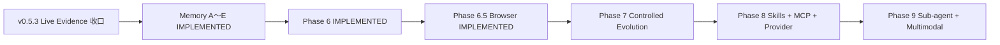

# MiniClaw 开发与交付时间线

> 文档性质：`CURRENT` 导航文档
>
> 目的：说明真实 Git/Release 交付顺序；不替代各 Phase 的架构定义，也不把本地门禁冒充 Live Evidence。

## 1. 两条轴必须分开

- **Capability Phase** 回答“这个能力在架构上属于哪里”。
- **Delivery Version** 回答“这项能力实际在什么时候进入 `main`”。

因此 P2.3B Personal Machine 仍属于 Phase 2，但实际在 Phase 4 之后以 v0.4.1 交付；v0.5.1～v0.5.3
主要加固 Feishu 与 Live Gate，也不改变“架构 Phase 5 = Telegram / Discord”的定义。

## 2. 真实交付顺序

| 顺序 | 交付 | 主要内容 | 证据状态 | 记录 |
| --- | --- | --- | --- | --- |
| 1 | Phase 0 | 包、配置、Workspace、SQLite、`init`/`doctor` | 本地实现完成 | [Phase 0 计划](../superpowers/plans/2026-08-07-phase-0-foundation.md) |
| 2 | Phase 1 | Provider、ContextBuilder、AgentRunner、TurnService、旧 CLI 闭环 | Core 保留；旧 CLI 已迁移 | [Phase 1 设计](../superpowers/specs/2026-08-07-phase-1-cli-agent-design.md) |
| 3 | v0.1.0 | Tool Runtime、只读文件 Tool、首个 Agent Eval | 177 tests、10/10 Agent | [Release v0.1.0](../evals/releases/v0.1.0.md) |
| 4 | v0.2.0 | 写入、Approval、exact argv、HTTPS 与 Phase 2 release gate | 245 tests、20/20 Agent；历史 DeepSeek smoke PASS | [Release v0.2.0](../evals/releases/v0.2.0.md) |
| 5 | TUI stabilization | 裸 `miniclaw` 单入口、pi-tui Bridge、可观测与审批 UI | 已并入当前入口 | [单入口 TUI](phase-2/20260808_single-entry-tui.md) |
| 6 | v0.3.0 | Memory v1、Skills、Compaction | 296 tests、24/24 Agent；本版本未跑 live model | [Release v0.3.0](../evals/releases/v0.3.0.md) |
| 7 | v0.4.0 | Feishu Channel、durable Inbox/Outbox、Gateway | Implementation PASS；当时 Live Pending | [Release v0.4.0](../evals/releases/v0.4.0.md) |
| 8 | v0.4.1 | P2.3B Personal Machine 权限与用户 CLI 发现 | Implementation PASS；当时 auth live pending | [Release v0.4.1](../evals/releases/v0.4.1.md) |
| 9 | v0.5.0 | Telegram/Discord、单 Runtime 多 Pipeline | 483 tests、32/32 Channel、640/640 soak；Live Pending | [Release v0.5.0](../evals/releases/v0.5.0.md) |
| 10 | v0.5.1 Stabilization | Feishu 15-case Runner 与脱敏 Evidence | Harness PASS；后来补充 Owner DM evidence | [Release v0.5.1](../evals/releases/v0.5.1.md) |
| 11 | v0.5.2 Stabilization | Feishu 单卡、恢复、direct lark-cli Skill | Implementation PASS；完整 Live Pending | [Release v0.5.2](../evals/releases/v0.5.2.md) |
| 12 | mainline increment | Owner Autopilot 默认值与 Claw Trail Agent Card | Implementation PASS；Owner 范围受限 | [Autopilot 工程文档](phase-2/20260808_autopilot-permissions-and-approval-ui.md) |
| 13 | v0.5.3 Core | SDK 日志脱敏、Gateway lease/provenance、受管 Live Runner、异常 Tool 历史恢复 | 562 tests；Feishu/Discord 15/15 Pending | [Release v0.5.3](../evals/releases/v0.5.3.md) |
| 14 | v0.6.0～v0.6.1 | Memory Autopilot A～E 与回调/续跑加固 | 671 tests；39/39 Agent；平台 Live 结论不变 | [Release v0.6.0](../evals/releases/v0.6.0.md) |
| 15 | v0.7.0 | Phase 6 Task/Scheduler/Runner、Sandbox、Checkpoint/Rollback | 798 tests；15/15 Automation；Docker live verified | [Release v0.7.0](../evals/releases/v0.7.0.md) |
| 16 | v0.6.5 capability record | Phase 6.5 专用 Chromium、snapshot/ref、Browser Policy 与 Artifact | 925 tests；14/14 Worker；18/18 Browser；live smoke pending | [Release v0.6.5](../evals/releases/v0.6.5.md) |

## 3. 当前主线

Memory Autopilot A～E、Phase 6 与 Phase 6.5 Browser 已进入 `main`，当前本地状态为 **IMPLEMENTATION PASS**：
925/925 Python、36/36 TUI TypeScript、14/14 Browser Worker、39/39 Agent、33/33 Channel、660/660 local
Channel soak、15/15 Automation、18/18 Browser 与 360/360 Browser soak。Feishu 为
**TARGETED CALLBACK LIVE VERIFIED / 15-CASE LIVE PENDING**；Docker 为 **LIVE VERIFIED**，Telegram/Discord/Seatbelt
仍需独立收口；Browser controlled live smoke 同样 pending。下一条功能主线是 **Phase 7 Controlled Evolution**。

## 4. 更新规则

1. 新能力先判断架构归属，再记录实际交付版本；不要为了时间顺序移动既有能力目录。
2. 历史 Release Record 保留当时数字和状态，不回写成当前基线。
3. 当前索引可以引用最新基线，但必须同时给出历史替代链接。
4. `IMPLEMENTATION PASS`、`LIVE VERIFIED`、`LIVE PENDING` 分栏记录，不能相互替代。
5. 设计和计划只有在代码、测试与必要 evidence 都存在后才能更新为已实现。
