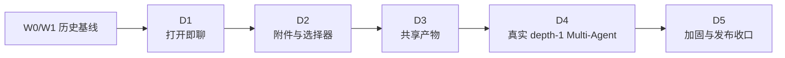

# Lobster0 Desktop D1～D5 分 Phase 落地方案

> 日期：2026-08-10
> 文档类型：工程落地路线
> 状态：`TARGET CONFIRMED / PHASE IMPLEMENTATION PENDING`
> 产品需求：[桌面多 Agent 工作台开发需求](../../product/20260810_桌面多Agent工作台开发需求.md)
> 架构设计：[LobsterAI-first 桌面多 Agent 设计](../../architecture/20260810_LobsterAI-first桌面多Agent设计.md)

## 1. 落地原则

这条路线替代旧 W2/W3 的宽泛规划，但保留 W0/W1 作为已经实现的历史基线。

开发遵循五条规则：

1. 每个 Phase 先写独立设计文档和 TDD 实施计划，再改代码；
2. 每个 Phase 交付可独立运行的真实纵切，不提交只会演示的假入口；
3. 优先复用现有 Desktop、Bridge、Core、Policy、SQLite 和 ArtifactStore；
4. 后端 capability 未完成时隐藏对应 UI；
5. 当前 Phase 通过相关测试、全量门禁和文档校验后，才进入下一 Phase。

## 2. 当前基线

W0/W1 development build 已完成：

- Electron Main + sandbox Renderer + fixed Preload；
- Python Bridge bootstrap、任务开始/取消、审批、Session list/history；
- 单 Agent 时间线、Automation 只读、Permission Mode、Workspace 切换；
- 一键脚本的 Python/TUI/Desktop 依赖和 Electron binary 自修复；
- 自动化测试、构建和进程级 Electron + Python Bridge smoke。

现有基线的主要产品缺陷是首屏先展示首页，Composer 只在任务页出现。D1 从这里开始修正。

## 3. Phase 总览



| Phase | 目标 | 主要风险 |
| --- | --- | --- |
| D1 | 让默认首屏成为真实对话工作区 | UI 重排破坏现有审批/历史 |
| D2 | 接入附件、模型、Workspace、Agent 选择 | 文件信任边界和能力误报 |
| D3 | 展示、预览和打开真实 Artifact | 越权读取和不安全预览 |
| D4 | 实现并展示 depth-1 子 Agent | 权限扩大、递归、恢复和预算 |
| D5 | 完整恢复、可用性、许可和真实 smoke | 把自动化通过误写成生产验证 |

## 4. D1：LobsterAI-first 打开即聊（已实现，2026-08-10）

独立设计：[Desktop D1 打开即聊设计](../../superpowers/specs/2026-08-10-desktop-d1-conversation-shell-design.md)。
跟进修复（真实使用后发现的窗口拖拽、对话命名、Markdown 渲染缺口）：
[D1 跟进修复记录](20260810_D1跟进修复-拖拽命名与Markdown渲染.md)。

### 4.1 用户结果

- 启动后中央立即显示大对话框；
- 最近任务和导航移入左栏，首页不再挡住输入；
- 用户发送后原地进入同一任务线程；
- 已有任务时 Composer 固定在底部；
- Tool、审批、取消、历史和错误继续真实工作；
- 视觉保持浅色，布局以 LobsterAI Cowork 为主体。

### 4.2 最小工程范围

优先修改现有 Renderer，预计集中在：

- `desktop/src/renderer/app.tsx`；
- `desktop/src/renderer/task-workbench.tsx`；
- `desktop/src/renderer/navigation.ts`；
- `desktop/src/renderer/styles.css`；
- 对应 Renderer tests。

D1 不增加 Bridge 请求、数据库迁移或依赖。当前 `task.start`、Session history 和 reducer 足以完成真实纵切。

### 4.3 设计前必须回答

- 新任务空态与已有任务态如何共用同一个 Composer；
- 左栏在窄窗口如何折叠；
- bootstrap 失败、未配置和运行中状态如何阻止误发送；
- 新建任务、切换历史时草稿如何处理；
- 现有 Home 测试和用户可见入口如何迁移。

### 4.4 TDD 起点

先添加会失败的 Renderer 测试：

1. 初始 View 直接存在可输入 Composer；
2. 无需点击“新建任务”即可调用 `startTurn`；
3. 发送后时间线和 Composer 同屏；
4. 打开历史后可以继续追问；
5. booting/failed/running 状态的控件行为正确；
6. 审批、取消和 Workspace/Automation/Settings 入口不回归。

### 4.5 退出条件

- D1 独立设计和实施计划已提交；✅
- Desktop tests/typecheck/build 通过；✅（35 tests）
- 真实 Python Bridge + Electron 进程 smoke 通过；⏳ 待补
- 手工确认应用启动后首屏可直接输入、发送和停止；✅（浏览器预览验证首屏、时间线、两个断点、Enter/Shift+Enter/输入法）
- 文档只宣称 D1 已实现，D2～D5 仍标记 pending。✅

视觉基准在实施中调整为直接采用 [LobsterAI](https://github.com/netease-youdao/LobsterAI)（MIT）的
`classic-light` 设计系统，取代设计初稿的自定义墨绿方案，详见 D1 设计文档 §5。

## 4.6 路线调整（2026-08-11）

用户提出对标 [ClawX](https://github.com/ValueCell-ai/ClawX) 并点名「定时任务」「配置模型/换模型/
填 API Key」两项。盘点后发现这两项的 Core 能力**早已具备**（定时任务的 pause/resume/run/cancel/
halt 全在，只是 Bridge 只开了只读的 `automation.list`），属于"桌面端没有入口"而非"功能缺失"。

因此在原 D2 之前插入两个投入产出比更高的 milestone，详见
[对标 ClawX 能力差距与 Milestone 规划](../../superpowers/specs/2026-08-11-desktop-clawx-capability-gap-and-roadmap.md)：

| Milestone | 目标 | 性质 |
| --- | --- | --- |
| D2a | 定时任务从只读变可控（暂停/恢复/立即运行/取消/运行历史/急停 + **表单新建**） | 接线为主，创建入口需额外安全设计 |
| D2b | **多 Provider** 模型配置与密钥写入 | 风险最高：首次引入配置写入 + 数据结构变更 + 迁移 |
| D2c | 原 D2：附件与 Composer 控件（已实现 2026-08-11） | 原计划顺延；设计经修订，见 [D2c 修订版](../../superpowers/specs/2026-08-11-desktop-d2c-attachments-design.md) |

原 D2 的「模型选择器」「Agent 选择器」两项按该文档结论调整：前者在 D2b 后改为跳转设置页，
后者因 Core 无多 Agent 概念仍保持只读，真正的选择器等 D4。

## 5. D2c：附件、模型、Workspace 与 Agent 选择（原 D2）

独立设计：[D2 附件/模型/Workspace/Agent 控件设计](../../superpowers/specs/2026-08-10-desktop-d2-composer-controls-design.md)（`DRAFT FOR REVIEW`）。

### 5.1 用户结果

Composer 下方出现四类真实控件：

- 附件：选择文件、看到校验状态、移除；
- 模型：选择 Core 返回的真实可用模型；
- Workspace：查看并通过系统 Dialog 切换；
- Agent：选择真实可用 Agent，至少包含 Main Agent。

### 5.2 最小工程范围

D2 预计涉及：

- Bridge protocol/server 的版本化请求；
- Core 侧附件 admission 与现有 ArtifactStore 复用；
- Provider/model capability 的只读查询；
- `task.start` 对附件、模型和 Agent 绑定；
- Main/Preload 的文件选择 IPC；
- Composer 控件和 draft state；
- SQLite 迁移仅在现有 schema 无法可靠表达关联时增加。

不为“未来多模型”建设路由平台。若 Core 只有一个配置模型，`models.list` 返回一项即可。

### 5.3 安全门禁

- Renderer 不能提交任意本地路径；
- Main Dialog 返回值由 Bridge/Core 再校验；
- 文件先做权限、大小、MIME/magic、哈希和来源校验；
- Artifact id 绑定 owner 和 draft/session；
- 模型/Agent id 必须来自 Core capability list；
- 活跃任务切换 Workspace 失败关闭；
- Secret、原始附件和 base64 不进入日志或 SQLite 消息正文。

### 5.4 TDD 起点

- protocol exact-key、长度和非法枚举；
- symlink、越权路径、超大文件、类型伪装和 admission race；
- 单模型、未知模型、不支持媒体能力；
- Main Agent 唯一项和伪造 Agent id；
- Workspace 切换失败后恢复旧值和草稿；
- Renderer 附件 chip、移除、错误和发送 payload。

### 5.5 退出条件

- 文本 + 至少一种通用文件附件走完整 Core admission；
- 四类控件都展示真实状态，没有静态假选项；
- 单模型/单 Agent 配置仍可用；
- Python、TUI、Desktop 和文档全量门禁通过；
- 图片 Vision 若尚未实现，明确禁用并给出原因。

## 6. D3：Artifact 与右侧共享产物

### 6.1 用户结果

- 当前任务产生 Artifact 后，右侧面板自动出现；
- 可以查看元数据、来源 Agent 和创建状态；
- 文本、Markdown、图片等允许类型可以安全预览；
- 其他类型可以经授权用系统应用打开或在 Finder 中显示；
- 切换任务时右栏只展示对应任务的产物。

### 6.2 最小工程范围

- 为现有 ArtifactStore 增加 owner/session 关联查询所需的最小数据；
- Bridge 提供 list/preview/open/reveal；
- Main 执行受控系统动作；
- Renderer 增加按需右栏和 Preview；
- Tool/Browser/附件产物统一投影，不复制存储。

### 6.3 预览策略

| 类型 | D3 处理 |
| --- | --- |
| 纯文本 / Markdown | 有界 UTF-8 预览，转义不可信内容 |
| 图片 | 校验后的本地受控资源，限制尺寸和字节 |
| JSON / CSV | 先提供有界文本预览，不建设表格编辑器 |
| PDF / Office / 其他 | 元数据 + 系统打开，不内嵌复杂解析器 |

只有出现明确用户需求和安全实现后，才增加 PDF/Office 内置渲染。

### 6.4 TDD 起点

- owner/session 越权与伪造 Artifact id；
- 已删除、过期、损坏和 symlink 替换；
- 文本字节/行数边界、二进制伪装和 HTML/script 转义；
- 系统打开前的二次校验；
- task 切换、event 更新和预览失败隔离。

### 6.5 退出条件

- 至少文本、Markdown、图片的授权预览通过；
- 未支持类型可以安全系统打开；
- Artifact provenance 和 task scope 可审计；
- 预览失败不影响对话；
- Browser 现有 Artifact 回归不受影响。

## 7. D4：OpenAgents-inspired 真实 Multi-Agent

### 7.1 用户结果

- 左栏能看到真实 Agent 列表；
- 父任务内能看到参与 Agent 和子任务状态；
- 主 Agent 可以把一个明确子目标交给子 Agent；
- 用户能查看子任务摘要、取消运行中的子任务，并取得其 Artifact；
- 右栏显示每个产物由哪个 Agent 创建；
- 所有状态在重启后可恢复。

### 7.2 后端优先顺序

D4 必须先完成 Phase 9 depth-1 Sub-agent 后端，再开放 UI：

1. durable parent/child TaskRun 与 child Session；
2. 权限、工具、Workspace 和预算子集计算；
3. 隔离/有界上下文 fork；
4. runner、并发、超时、取消和重启恢复；
5. 幂等完成回传；
6. Artifact provenance；
7. Bridge capability/event；
8. Agent list、Participant 和子任务 UI。

### 7.3 不可放宽的边界

- max depth = 1；
- 子 Agent 不能 spawn、外发、调度、安装、改 Policy 或审批；
- 子 Agent 的权限、工具、模型费用和 Workspace 只能收窄；
- 默认隔离上下文，不复制完整父会话；
- 子输出作为不可信数据回传；
- 父取消传播到所有运行中子任务；
- 终态和 completion announcement 跨重启幂等。

### 7.4 TDD 起点

- depth 拒绝和 capability 不暴露；
- permission/tool/budget/model/workspace 子集；
- context isolation 与敏感内容过滤；
- 并发上限、timeout、取消传播和 worker crash；
- restart recovery、重复完成、父任务已终止；
- child Artifact provenance 和跨任务越权；
- Desktop participant reducer、状态、取消和历史恢复。

### 7.5 退出条件

- 一个父任务可真实启动至少一个 depth-1 子任务并完成回传；
- 取消、失败、超时、重启和重复事件全部有稳定结果；
- UI 只显示 durable Core 状态；
- Phase 9 Sub-agent versioned gate 和多轮 soak 通过；
- 不出现递归 Agent、静态假参与者或前端调度。

## 8. D5：加固与发布收口

### 8.1 用户结果

- 常见失败都有明确、可恢复的界面；
- 任务、附件、Artifact 和子 Agent 在重启后状态一致；
- 键盘、输入法、窗口缩放和基本读屏语义可用；
- 一键启动脚本在干净环境能补齐依赖并打开应用；
- 当前实现与文档、截图和许可台账一致。

### 8.2 工程范围

- crash/restart matrix；
- 大历史、长文本、多 Artifact 和受限并发性能；
- accessibility 和 responsive layout；
- telemetry/log redaction；
- 上游 attribution、LICENSE/NOTICE 和修改清单；
- 真实 Electron 手工 smoke、受控 Provider/Tool/附件/Sub-agent smoke；
- README、产品、架构、工程文档和 release evidence 同步。

### 8.3 退出条件

至少完成：

```bash
uv run python -m unittest discover -s tests -v
uv run ruff check .
pnpm --dir tui test
pnpm --dir tui build
pnpm --dir desktop test
pnpm --dir desktop typecheck
pnpm --dir desktop build
uv run python scripts/validate_docs.py
git diff --check
```

还要执行与实际改动对应的 Artifact、Sub-agent、Automation、Browser versioned gate 和 soak。真实 smoke 只记录脱敏的
版本、id、哈希、数量、状态和时间，不记录 Secret、附件正文或用户隐私。

## 9. 文档先行清单

进入每个 Phase 前新增两份文档：

| Phase | 设计文档 | 实施计划 |
| --- | --- | --- |
| D1 | 首屏、Composer、布局和状态迁移 | 精确 Renderer 文件、RED→GREEN 测试和 smoke |
| D2 | Attachment/model/workspace/agent 契约 | Bridge/Core/Main/Renderer 纵切和安全用例 |
| D3 | Artifact scope、preview/open 威胁模型 | schema/API/UI 测试和兼容门禁 |
| D4 | depth-1 Sub-agent 正式设计 | durable runtime、Policy、Bridge、UI 和 soak |
| D5 | 恢复、无障碍、许可与发布设计 | 矩阵化验证和 release record |

文档状态依次为 `DRAFT` → `APPROVED` → `IMPLEMENTED`。实施记录可以描述过程，产品和架构文档只能把已验证的
能力写成当前事实。

## 10. 完整开发完成定义

D1～D5 全部退出后，才能将本路线标记为 `IMPLEMENTATION PASS`：

- 打开即聊；
- 附件、模型、Workspace、Agent 控件真实可用；
- Artifact 共享和安全预览真实可用；
- depth-1 Multi-Agent 真实可用且安全门禁通过；
- Lobster0 Core、Policy、Approval、SQLite 和 ArtifactStore 仍然唯一；
- 一键启动、自动化测试、全量构建、手工 Electron 和受控 live smoke 有证据；
- 文档、实现和开源归属一致。

签名安装包、自动更新、应用商店、多用户协作、公开 Agent Network 和递归 Agent 继续留到独立后续项目。

## 4.7 D2a 实现记录（2026-08-11）

设计文档：[D2a 定时任务从只读变可控](../../superpowers/specs/2026-08-11-desktop-d2a-automation-control-design.md)。

分三层落地，每层 TDD 先红后绿：

1. **Bridge 协议**：新增 8 个请求类型 + `automation_write` capability。校验全在 protocol 层，
   server 分支只做路由与错误码映射。写操作沿用 `turn.start` 的忙碌判定，并先读当前 `version`
   再交给 repository 做乐观锁（与 CLI 同款模式）。
2. **Desktop IPC**：`common/api` → `bridge-service` → `ipc` 三层接通，IPC 侧做与 Core 同构的
   exact-key 校验。TS 的 `RequestType` 联合类型同步补齐——两端协议定义必须一致，typecheck 会挡。
3. **界面**：新增 `automation-panel.tsx`（统计卡、任务卡、运行历史、新建表单）与
   `automation-stats.ts`（统计与调度描述纯函数）。

### 实现中修正的三处问题

- **字典字面量求值全部分支**：动作分发原先写成 `{"pause": tasks.pause, ...}`，字面量会求值
  所有方法引用，导致一次 pause 也要求 repository 具备 resume/cancel，平白扩大依赖面。改为按需
  `getattr`，由测试暴露。
- **摘要缺 `schedule_expression`**：界面要把调度转成"每 1 小时"这类人话，但 Core 的 task 摘要
  只有 `schedule_kind`。补上表达式字段——它是时间信息，不属于 prompt/delivery/budget 那类敏感数据。
- **旧 CSS 命中新结构**：`.automation-list article > div` 等旧规则仍在，正好命中新组件的 DOM，
  把 `.automation-card-actions` 的 `display` 从 flex 覆盖成 grid，主体列被压到 0 宽。实测
  `getComputedStyle` 发现后删除这些死规则。

### 验证

- Python：bridge 29/29、automation_repository 7/7、task_runner 10/10、cli 26/26，ruff 干净；
- Desktop：85/85、typecheck、build 通过；
- 视觉：构造覆盖 cron/interval/once/heartbeat 四种调度与 active/paused/failed 三种状态的任务，
  用 `getBoundingClientRect` 实测布局（主体 554px、操作区 260px、标题单行），并验证运行历史
  （含失败的 `provider_timeout`）、新建表单字段、下拉中**不含 heartbeat**、以及 interval 低于
  5 分钟时的界面拦截。
