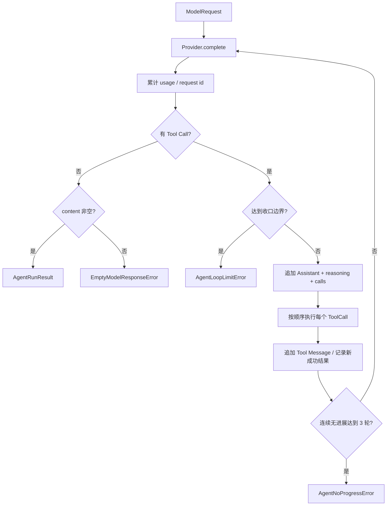

# Phase 1 工程文档：AgentRunner

> 文档性质：`HISTORICAL SNAPSHOT`（Phase 1 交付状态）
>
> 当前替代：Phase 2.1A 已删除临时 `ToolHandler` Mapping，改为 Policy 控制的 `ToolExecutor`，并持久化
> 中间消息；当前实现见
> [Tool Runtime 与 system_info](../phase-2/20260807_tool-runtime-and-system-info.md)。

## 1. 模块目的

`src/lobster0/agent/runner.py` 管理一次 Turn 内部的模型与 Tool Call 循环。它接收完整 `ModelRequest`，
重复调用 `ModelProvider.complete()`，按响应顺序执行工具，直到得到非空最终回答或完成有界收口。当前默认采用
32 轮软预算、64 轮硬预算和连续 3 轮无进展保护。

Runner 不知道消息来自 CLI、飞书、Telegram 还是 Discord，也不知道 SQLite。Channel 与持久化都由
TurnService 包裹在外层。

## 2. 核心状态机



`max_iterations` 统计模型调用次数，不是 Tool 数量。默认值来自 `AgentConfig.max_tool_iterations=32`，名称为
历史兼容；语义以 Runner 的模型轮数为准。`hard_max_iterations=64` 是绝对上限，
`max_no_progress_iterations=3` 用于阻止重复调用造成的空转。

## 3. 公共接口

```python
class AgentRunner:
    def __init__(
        self,
        provider: ModelProvider,
        executor: ToolExecutor | None = None,
        *,
        max_iterations: int = 32,
        hard_max_iterations: int = 64,
        max_no_progress_iterations: int = 3,
    ) -> None: ...

    async def run(
        self,
        request: ModelRequest,
        on_text: StreamHandler | None = None,
    ) -> AgentRunResult: ...
```

当前工具执行边界是 Policy 控制的 `ToolExecutor`。它先准备并绑定可审计的 Tool Call，再执行或返回审批等待；
Runner 不绕过这个边界。历史上的 `ToolHandler` Mapping 仅用于 Phase 1 的早期测试，不再是当前运行时接口。

## 4. AgentRunResult

| 字段 | 计算方式 | Storage 用途 |
| --- | --- | --- |
| `content` | 最终无 Tool Call 响应原文 | Assistant Message |
| `iterations` | 实际 Provider 调用数 | 运行诊断 |
| `input_tokens` | 所有响应非空 input usage 之和 | Turn.input_tokens |
| `output_tokens` | 所有响应非空 output usage 之和 | Turn.output_tokens |
| `provider_request_id` | 最后一个非空 request ID | runtime snapshot / 排障 |
| `finish_reason` | 最终响应结束原因 | runtime snapshot |

Provider 未返回用量时该轮按 0 聚合。原始契约仍用 `None` 表示缺失；Runner 的 Turn 汇总使用整数以匹配
SQLite 非空字段。

## 5. 不可变请求演进

每轮使用 `dataclasses.replace()` 创建新请求：

```python
current = replace(initial_request, messages=tuple(messages))
```

model、tools、temperature 和 max output budget 保持初始值；只追加消息。已经交给 Provider 或保存在 Fake
中的历史 Request 不会被后续轮原地修改，便于测试和任务回放。

## 6. Tool Call 继续消息

模型返回工具调用后，Runner 先追加完整 Assistant Message：

```python
ModelMessage(
    role="assistant",
    content=response.content,
    tool_calls=response.tool_calls,
    reasoning_content=response.reasoning_content,
)
```

再为每个调用追加：

```python
ModelMessage(
    role="tool",
    content=<handler result>,
    tool_call_id=call.call_id,
)
```

reasoning 必须与对应 Tool Call 同时回传 DeepSeek，否则思考模式的下一次请求会被 API 拒绝。

## 7. 工具执行顺序

一个响应最多包含多个 Tool Call。Phase 1/2 都按响应数组顺序逐个 `await`：

1. 避免并发文件写入顺序不确定；
2. 让审批和 Audit 顺序与模型输出一致；
3. 简化单用户任务回放。

未来只有在工具声明无副作用且性能测量证明需要时，才增加并行执行能力。

### 7.1 未注册工具

未注册工具不抛 Python 异常，而是返回确定性 JSON：

```json
{"ok":false,"error":"tool_not_found","tool":"missing"}
```

模型可以据此改用其他方案或向用户解释。Phase 2 的参数校验、Policy deny 与工具失败也会采用结构化 Tool
Result，但不会复用这一条错误码冒充不同原因。

## 8. 自适应循环预算与收口

默认预算是 `max_iterations=32`（软预算）、`hard_max_iterations=64`（硬预算）与
`max_no_progress_iterations=3`（连续无进展上限）。它们都统计 Provider 模型调用次数，不统计 Tool 数量。

- 第 1–31 轮的 Tool Call 正常按顺序执行。
- 第 32 轮前一批若产生新的成功 Tool 结果，Runner 可以继续；否则第 32 轮成为无 Tool 的最终收口请求。
- 继续后的第 33–63 轮仍可执行 Tool；第 64 轮始终是无 Tool 的最终收口请求。
- 收口请求附加仅存在于当前 Provider 副本中的 system 指令，并移除 Tool schema；它不会写入会话历史。若模型仍
  返回 Tool Call，Runner 抛 `AgentLoopLimitError`，不执行这批 Tool。
- Runner 使用 Tool 名和规范化参数识别语义重复的调用。重复调用不再执行真实 Tool，而是返回
  `duplicate_tool_call` 结构化结果；连续 3 轮没有新的成功 Tool 结果会抛 `AgentNoProgressError`，TurnService
  持久化稳定错误码 `loop_no_progress`。

这既允许复杂任务在持续有效进展时使用 32～64 轮，也让重复 `help`、`inspect` 或副作用 Tool 不会无界重跑。
审批等待、取消、Policy deny 和 Provider 失败保持各自原有终态，不由预算策略自动延长或重试。`loop_limit`
失败卡会明确说明无 Tool 的预算收口轮仍请求 Tool 且最后请求未执行；该收口轮既可能来自未获扩展的 soft 边界，
也可能来自 hard 边界。诊断只暴露阶段、轮次、Tool 数和 Turn/Event 编号，不能暴露 Prompt、Tool 参数、Tool
原始结果或 Provider 原文。

## 9. 空响应

响应没有 Tool Call 且 `content.strip()` 为空时抛：

```text
EmptyModelResponseError: model returned an empty final response
```

Runner 不把空白保存为正常 Assistant Message。TurnService 会标记 `empty_response`，用户可以重试或检查
Provider request ID。

工具响应的 content 可以为空，因为 Tool Call 本身是有效结构；是否展示中间文本由 Channel 决定。

## 10. 流式回调

`run(..., on_text=...)` 把回调交给每次 Provider 调用。Provider 只发送 `content`，不发送 reasoning 和 Tool
arguments。

Phase 1 CLI 使用最终聚合结果，不传回调。后续 Channel 使用时需要在 Delivery 层区分中间 Tool Turn 与
最终回答；Runner 本身不加入平台展示规则。

## 11. 取消与异常

Runner 不捕获：

- `asyncio.CancelledError`；
- `ProviderError` 具体子类；
- ToolHandler 的编程错误。

原因：

- TurnService 必须把取消保存为 `cancelled`，不能误记为失败；
- CLI 需要用认证错误映射 exit 3，其他 Provider 错误映射 exit 4；
- Phase 2 会定义正式 ToolError 与 Policy 结果，当前不应把未知代码缺陷伪装成模型可恢复错误。

Runner 自己会产生 `EmptyModelResponseError`、`AgentLoopLimitError` 和 `AgentNoProgressError`，都继承
`AgentError`。

## 12. FakeProvider

`tests/fakes/fake_provider.py` 保存预设的完整响应或异常序列：

- 每次调用先记录真实 `ModelRequest`；
- 按索引返回响应；
- 预设异常按原类型抛出；
- 调用超过配置数量立即 AssertionError；
- 有流回调时用响应 content 模拟一次可见 delta。

Fake 只替代外部模型，不替代 ContextBuilder、Runner、TurnService 或 SQLite。测试断言真实模块的返回值和
状态，并检查记录的第二轮 Request 是否包含正确 reasoning/Tool Message。

## 13. 测试矩阵

`tests/test_agent_runner.py` 覆盖：

- 单轮最终文本、轮数、用量和 request ID；
- Tool → Handler → 下一次模型调用 → 最终回答；
- Assistant reasoning 与 Tool Call 原样续接；
- 多轮 Token 累加；
- 未注册工具的结构化结果；
- 空白最终响应；
- 软预算、硬预算无 Tool 收口和最后 Tool 不执行；
- 重复 Tool 指纹不重新执行，以及连续无进展的稳定停止；
- CancelledError 原样传播。

这些测试均使用真实 Runner 和手写模型结果，不访问网络。

## 14. 本地调试

聚焦测试：

```bash
uv run python -m unittest tests.test_agent_runner -v
```

定位循环问题时检查：

1. Fake/Provider 每轮请求数；
2. 第二轮 messages 最后两项是否为 Assistant Tool Calls 与 Tool Result；
3. Assistant 是否包含 `reasoning_content`；
4. Tool Message 的 `tool_call_id` 是否匹配；
5. max iterations 是否来自当前配置。

不要在调试输出中打印完整 Messages；它可能包含用户对话、reasoning 和工具结果。正式 Audit 只保存必要
摘要和哈希。

## 15. Phase 2 接入点

Phase 2 用一个受 PolicyEngine 控制的 Handler 替换当前测试 Handler：

```text
ToolCall
→ Registry 参数 Schema 校验
→ PolicyEngine.authorize
→ allow / deny / waiting approval
→ ToolResult JSON string
```

Provider、消息续接、轮数和 Token 聚合不改变。Waiting Approval 将返回结构化 Tool Result 并结束当前
Turn，由新的 approval Turn 续执行。

## 16. 已知限制与升级条件

- Phase 1 不持久化每个中间 Tool Call；Phase 2 增加 `tool_runs` Repository。
- ToolHandler 暂时返回字符串；Phase 2 升级为带 `ok/content/metadata` 的 ToolResult。
- 一个 Turn 内工具顺序执行，不并行。
- Token 缺失按 0 汇总，不估算。
- Runner 不做上下文压缩；Context Phase 负责。
- 只有第二个真实 Runner 策略出现时才提取策略接口，不为单实现创建 Factory。
