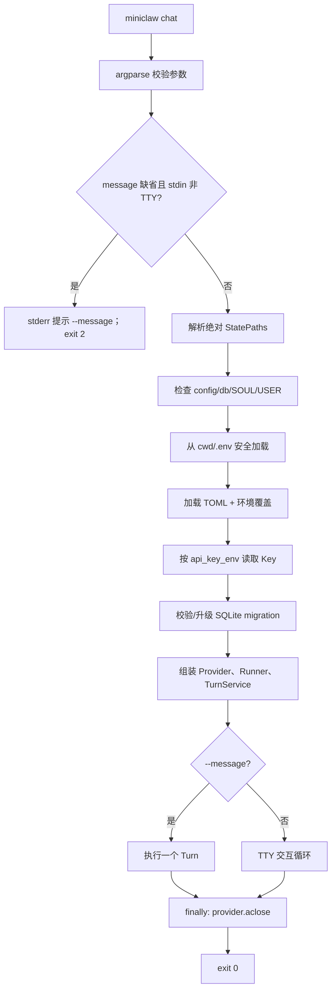
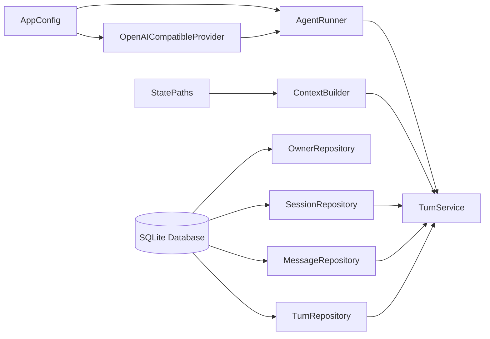
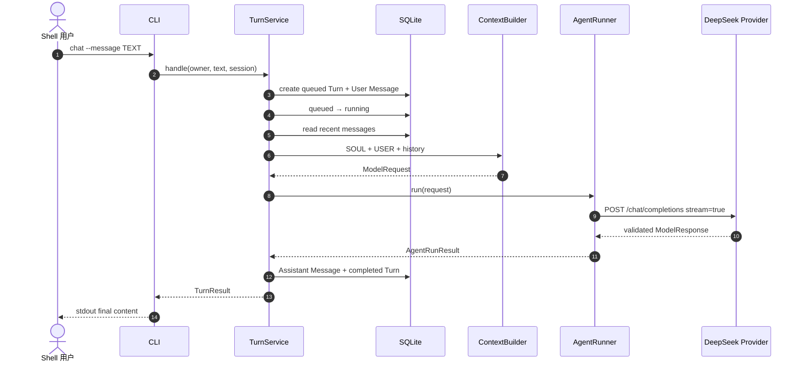

# Phase 1 工程文档：CLI Chat

> [!WARNING]
> 文档性质：`HISTORICAL SNAPSHOT`。Phase 2.2B 已移除 `miniclaw chat`、one-shot 与 `input()` REPL。
> 当前人类对话入口是裸 `miniclaw` 的默认 pi-tui，Textual 仅作 fallback。请优先阅读
> [单入口 TUI 工程文档](../phase-2/20260808_single-entry-tui.md)。

## 1. 模块目的

`src/miniclaw/cli.py` 是 Phase 1 当时的用户入口。该阶段在已有 `init`、`doctor` 之上增加：

```bash
miniclaw chat --message TEXT [--session ID] [--home /absolute/path]
miniclaw chat [--session ID] [--home /absolute/path]
```

第一种是适合脚本、调试和冒烟验证的 one-shot 模式；第二种只在标准输入是 TTY 时进入交互循环。两个模式
使用完全相同的 Context、AgentRunner、Provider、TurnService 和 SQLite Repository，不存在“演示路径”。

## 2. 职责边界

CLI 负责：

- 解析命令和参数；
- 解析状态目录，但不替用户猜测相对路径；
- 只为 `chat` 从当前工作目录加载 `.env`；
- 检查状态已由 `miniclaw init` 安全初始化；
- 装配一个运行期内需要的具体组件；
- 保证 HTTP Provider 在成功或失败后关闭连接池；
- 把稳定异常映射为可用于 shell 自动化的退出码；
- 把最终 Assistant 文本写到 stdout，把诊断写到 stderr。

CLI 不负责：

- 解析 Provider JSON/SSE；
- 构造 System Prompt；
- 执行 Agent/Tool 循环；
- 手写 SQL 或决定 Turn 状态；
- 输出 reasoning、API Key、请求 Header 或完整 Provider payload；
- 自动创建缺失状态；
- 提供飞书、Telegram 或 Discord 长连接。

## 3. 参数契约

| 参数 | 类型 | 默认值 | 行为 |
| --- | --- | --- | --- |
| `--home` | 绝对路径 | `MINICLAW_HOME` 或 `~/.miniclaw` | 由 `resolve_home()` 校验 |
| `--session` | 非空字符串 | `default` | 映射为 `sessions.external_conversation_id` |
| `--message` | 字符串或缺省 | 缺省 | 存在时 one-shot；缺省时要求 TTY |

`--session` 不是数据库 ID。它是 CLI Channel 内的稳定外部会话标识，Repository 通过以下组合实现幂等：

```text
channel = cli
account_id = local
external_conversation_id = --session
```

同一个 `--session` 的后续消息会读到最近历史；不同 session 相互隔离。

## 4. 启动流程



### 4.1 为什么不自动 init

`chat` 只接受已经初始化的状态根。缺少 `config.toml`、`miniclaw.db`、`SOUL.md` 或 `USER.md`，以及这些
文件是符号链接时，CLI 返回：

```text
error: MiniClaw is not initialized at ...; run miniclaw init first
```

这样可避免拼错 `--home` 时，在未知目录创建一个新身份和数据库，也避免聊天命令混合初始化副作用。

### 4.2 `.env` 的选择

固定读取进程启动时的：

```text
Path.cwd() / ".env"
```

不是状态目录内 `.env`，也不向父目录递归搜索。该选择让仓库本地开发行为可预测，并避免无意读取其他项目
凭据。完整语法、权限和覆盖规则见 [20260807_environment.md](20260807_environment.md)。

只有 `chat` 调用 `load_dotenv()`；`init` 和 `doctor` 保持无需凭据、无需网络。

## 5. 依赖装配

Phase 1 只有一个实现，因此直接构造，不增加 Factory 或依赖注入容器：



装配顺序：

1. `Database(paths.database)` 创建连接工厂；
2. `apply_migrations()` 保证 Schema 与当前程序一致；
3. `OwnerRepository.get_or_create()` 取得单 Owner；
4. 使用内存中的 Key 创建一个 `OpenAICompatibleProvider`；
5. 创建空工具映射的 `AgentRunner`，循环上限来自配置；
6. 用三个 Repository、ContextBuilder 和 Runner 创建 `TurnService`；
7. 完成 one-shot 或整个交互循环；
8. 在 `finally` 中调用 `provider.aclose()`。

Key 只传给 Provider 构造函数；不写入 `AppConfig`、SQLite、runtime snapshot 或错误文本。

## 6. One-shot 模式

示例：

```bash
uv run miniclaw chat --message "只回答：MiniClaw online"
uv run miniclaw chat --session research --message "记住我们正在研究 Agent 架构"
```

成功时 stdout 只包含完整最终回答和结尾换行：

```text
MiniClaw online
```

Phase 1 one-shot 不传 `on_text` 流回调。Provider 仍真正增量读取 SSE，但 CLI 在完整响应通过协议校验、Agent
Loop 完成且数据库事务成功后才输出。这样脚本不会在远端中断或数据库失败时收到半条成功结果。

一条消息的真实执行顺序：



## 7. 交互模式

直接运行：

```bash
uv run miniclaw chat
```

行为：

```text
You> hello
MiniClaw> ...
You> /exit
```

- stdin 必须是 TTY；脚本或管道环境必须显式使用 `--message`；
- 整个循环复用同一个 Provider 连接池和 `--session`；
- 空白输入被忽略，不创建 Turn；
- `/exit`、`/quit` 或 EOF 正常返回 0；
- 任一 Turn 失败会结束当前 CLI 进程，并按错误类型返回非零码；
- Phase 1 只在每个 Turn 完整成功后打印回答，不逐 token 刷屏。

交互读取使用同步 `input()`。CLI 是单用户前台进程，没有其他并发任务需要调度；飞书 Gateway 阶段会使用独立的
异步 Channel Queue，不能复用这个终端循环。

## 8. 退出码与错误边界

| 退出码 | 类别 | 典型原因 | 是否可直接重试 |
| ---: | --- | --- | --- |
| 0 | 成功 | one-shot 完成；交互正常退出 | 不需要 |
| 2 | 参数/配置 | 相对 home、未 init、`.env` 权限、缺 Key、空 session、非 TTY 缺 message | 修正后重试 |
| 3 | Provider 认证 | 401/403、Key 无效或模型无权限 | 修正凭据/权限 |
| 4 | Agent/Provider | 429、超时、5xx、协议错误、空回答、循环达到上限 | 按错误诊断 |
| 5 | 本地状态 | SQLite、migration、文件 I/O 或会话状态失败 | 先备份并运行 doctor |
| 130 | 用户取消 | `Ctrl-C` 或 async cancellation | 可重新运行 |

CLI 只打印已经收窄的异常消息。Provider 的错误不包含请求正文或认证 Header；`.env` Parser 的错误只包含
文件路径和行号，不回显原行。

## 9. stdout / stderr 契约

| 内容 | 输出流 |
| --- | --- |
| one-shot 最终 Assistant 文本 | stdout |
| 交互 `You>` / `MiniClaw>` | stdout |
| 参数、配置、认证、模型、数据库错误 | stderr |
| 用户取消提示 | stderr |
| API Key、reasoning、Header、原始 SSE | 永不输出 |

因此脚本可以安全分离数据和诊断：

```bash
answer=$(uv run miniclaw chat --message "hello")
status=$?
```

## 10. 持久化结果

成功 one-shot 至少写入：

- 一个 `sessions` 行，或复用已有行；
- 一个 `turns` 行，最终为 `completed`；
- 一条 `messages.role=user`；
- 一条 `messages.role=assistant`；
- `input_tokens`、`output_tokens`；
- runtime snapshot 中的 iterations、finish reason 和可选 request ID。

失败请求保留 User Message 和失败 Turn，便于之后回放与诊断；不会伪造 Assistant Message。具体事务状态机见
[20260807_conversation-storage.md](20260807_conversation-storage.md) 和 [20260807_turn-service.md](20260807_turn-service.md)。

## 11. 测试覆盖

`tests/test_cli_chat.py` 用标准库 `ThreadingHTTPServer` 运行 loopback 兼容端点，覆盖：

- 缺 Key 返回 2，错误只出现变量名；
- 未初始化状态返回 2 并提示 `miniclaw init`；
- 非 TTY 且缺 `--message` 返回 2；
- 真实 CLI → HTTP POST → SSE → Runner → SQLite 完整链路；
- 请求路径、Bearer 存在、模型名与 `stream=true`；
- completed Turn、Token 和 User/Assistant Message；
- HTTP 401 映射为 3 且 Key 不泄露；
- TTY 交互、稳定 session 和 `/exit`。

HTTP Server 只保存 `authorized: bool`，不会把测试凭据存入 observation 或失败输出。

## 12. Phase 1 限制

- 只有 CLI Channel；飞书在 Phase 4。
- AgentRunner 支持 Tool Call 协议，但 CLI 尚未注册真实工具；未知工具返回确定性错误结果。
- 历史固定读取最近 20 条，尚未按 token budget 压缩。
- 不支持并行 Turn；一个 CLI 进程顺序执行。
- 不提供 Web 管理页或后台 daemon。
- `.env` 只从当前工作目录读取，不提供全局凭据搜索。

这些边界是阶段范围，不在 CLI 内提前放置抽象或空实现。
