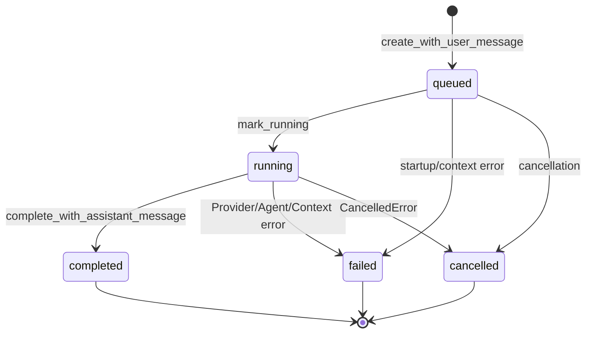
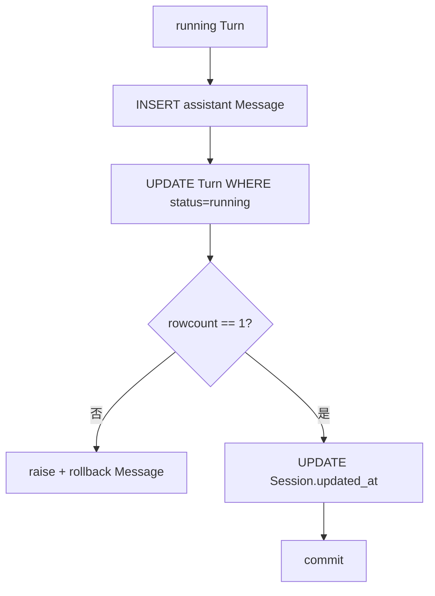

# Phase 1 工程文档：Conversation Storage

> 文档性质：`HISTORICAL SNAPSHOT`（Phase 1 会话存储）
>
> 当前替代：Phase 2.1A 已增加 ToolRun/Audit 和完整工具消息事务；当前实现见
> [Tool Runtime 与 system_info](../phase-2/20260807_tool-runtime-and-system-info.md)。

## 1. 模块目的

`src/miniclaw/storage/conversations.py` 是 CLI Agent 闭环对 SQLite 的唯一会话写入边界。它把 Phase 0
已经迁移的 `sessions`、`turns` 和 `messages` 表封装为小型 Repository，并保证关键状态变更使用单个
事务。

模块不新增 Schema Migration。Phase 0 的 v1 Schema 已包含 Phase 1 所需字段和索引。

## 2. Repository 划分

| Repository | 负责 | 不负责 |
| --- | --- | --- |
| `SessionRepository` | CLI Session 幂等创建与 Owner 校验 | Channel 身份映射、标题生成、归档命令 |
| `MessageRepository` | 最近消息的有限读取与稳定顺序 | Prompt 拼装、Memory、消息写入状态机 |
| `TurnRepository` | Turn/User 创建、running、成功事务、失败、取消 | 调模型、错误分类、Channel 回复 |

三个类共享一个轻量 `Database` 值对象。每个方法打开短生命周期连接，启用 Phase 0 配置的 foreign keys、
WAL 和 busy timeout，退出时提交或回滚。

## 3. 数据对象

### 3.1 Session

```text
id, user_id, channel, account_id, external_conversation_id,
status, created_at, updated_at
```

Phase 1 CLI 固定：

```text
channel = cli
account_id = local
external_conversation_id = --session 值，默认 default
```

Schema 的唯一键 `(channel, account_id, external_conversation_id)` 足以覆盖当前单 Owner 产品。Repository
仍校验查询到的 user_id 与调用方一致，避免未来数据被错误 Owner 复用。

### 3.2 StoredMessage

```text
id, session_id, turn_id, role, content,
provider_message_id, tool_call_id, metadata, created_at
```

Phase 1 写入 user 与最终 assistant 两种角色。中间 Tool Message 只存在于当前 Runner 内存；Phase 2 接入
`tool_runs` 时再决定哪些中间消息持久化。

`metadata_json` 在 Repository 边界解析为 JSON object；损坏、数组或标量抛 `ConversationDataError`，
不会静默当成空对象。

### 3.3 StoredTurn

```text
id, session_id, inbound_event_id, status, model,
started_at, completed_at, input_tokens, output_tokens,
runtime_snapshot, error_code, error_message
```

Turn 是一次用户输入的执行记录，不等于 Session。一个 Session 可以有多个成功、失败或取消 Turn。

## 4. Session 幂等创建

```sql
INSERT INTO sessions (...)
VALUES (...)
ON CONFLICT(channel, account_id, external_conversation_id) DO NOTHING;

SELECT * FROM sessions
WHERE channel = 'cli'
  AND account_id = 'local'
  AND external_conversation_id = ?;
```

创建和读取在同一连接事务中执行。重复命令不会切断历史；不同 `--session` 值创建独立会话。

## 5. 消息最近窗口

Repository 先选择最新 ID：

```sql
SELECT * FROM messages
WHERE session_id = ?
ORDER BY id DESC
LIMIT ?;
```

再在内存反转为旧到新，供 ContextBuilder 使用。用自增 ID 而不是 `created_at` 排序，因为同一事务中的
User/Assistant 或高速测试可能拥有相同时间精度。

Phase 1 默认 limit 20。这个上限属于历史选择，不是精确 Token Budget；Phase 3 会加入摘要与 Token
预算，但仍保持 Context 输入为时间正序。

当 limit 截在会话中间时，首条可能是 Assistant。模型兼容协议允许 System 后出现历史 Assistant；未来
压缩器会按 Turn 边界选择历史，当前不为尚未实现的压缩增加复杂查询。

## 6. Turn 状态机



Repository 使用带旧状态条件的 UPDATE。重复完成、失败后再完成、completed 后取消都会因为 `rowcount != 1`
抛 `ConversationStateError`，不能悄悄覆盖终态。

## 7. 创建事务

`create_with_user_message()` 在一个事务中：

1. 插入 queued Turn；
2. 插入同 turn_id 的 User Message；
3. 更新 Session.updated_at；
4. 查询并返回新 Turn。

任何 foreign key、唯一键或 NOT NULL 失败都会回滚 User 与 Turn，避免孤儿消息。

`inbound_event_id` 由 TurnService 生成 `cli:<uuid>`。Schema 的 `(session_id, inbound_event_id)` 唯一约束为
未来 Channel 事件幂等保留。

## 8. 成功事务

`complete_with_assistant_message()` 在一个事务中：



Turn 同时写入：

- `status=completed`；
- `completed_at`；
- 累计 input/output Token；
- 紧凑 `runtime_snapshot_json`。

当前快照：

```json
{
  "finish_reason": "stop",
  "iterations": 2,
  "provider_request_id": "req_..."
}
```

不保存 API Key、Base URL Header、完整 Prompt、reasoning 或响应正文副本。

Assistant 的 `provider_message_id` 暂存最后一个 Provider request ID，便于排障。若未来厂商同时提供独立
message ID，将在 Migration 中拆分含义，不能直接覆盖现有数据解释。

## 9. 失败与取消

`fail()` 保存：

- `status=failed`；
- `completed_at`；
- 稳定 `error_code`；
- 已收窄 `error_message`。

`cancel()` 保存：

- `status=cancelled`；
- `completed_at`；
- error_code/message 保持 null。

Repository 不自行解析异常类型。错误映射属于 TurnService，保证 CLI 与未来 Channel 使用同一分类。

## 10. 时间与 JSON

所有新时间使用：

```python
datetime.now(UTC).isoformat()
```

读取用 `datetime.fromisoformat()`，返回值保留时区。SQLite 只比较 ID，不依赖时间字符串排序。

JSON 使用：

```python
json.dumps(value, ensure_ascii=False, separators=(",", ":"), sort_keys=True)
```

紧凑且键顺序稳定，方便 diff/测试。读取拒绝非 object。

## 11. 错误与事务语义

| 错误 | 来源 | 事务结果 |
| --- | --- | --- |
| `ValueError` | 空 conversation、非正 limit | 未打开写事务 |
| `ConversationStateError` | Owner 冲突、错误旧状态、缺失 Turn | 当前方法回滚 |
| `ConversationDataError` | metadata/snapshot JSON 损坏 | 只读调用失败 |
| `sqlite3.IntegrityError` | FK、UNIQUE、NOT NULL、CHECK | 当前写事务回滚 |
| `DatabaseError` | 打开/PRAGMA 失败 | 无连接泄漏 |

Repository 不捕获并改写 sqlite3.IntegrityError，因为测试和上层运维需要区分数据约束错误；公开 CLI 会在
最外层转换为通用本地存储错误，不展示 SQL。

## 12. 测试矩阵

`tests/test_conversations.py` 使用真实临时 SQLite，验证：

- 同 Owner/conversation Session 幂等；
- 不同 conversation 隔离；
- 最新 limit 选择后按旧到新返回；
- Assistant、Token、快照和 completed 同事务；
- Assistant NOT NULL 失败会回滚消息且 Turn 仍 running；
- failed 与 cancelled 终态和错误码区分。

测试不 Mock SQLite 或 Repository，因此能发现 SQL、约束、事务与 Row 映射回归。

## 13. 本地调试与检查 SQL

只读查看最近 Turn：

```bash
sqlite3 ~/.miniclaw/miniclaw.db \
  'SELECT id, session_id, status, model, input_tokens, output_tokens, error_code FROM turns ORDER BY id DESC LIMIT 10;'
```

查看消息角色，不输出内容：

```bash
sqlite3 ~/.miniclaw/miniclaw.db \
  'SELECT id, session_id, turn_id, role, length(content), created_at FROM messages ORDER BY id DESC LIMIT 20;'
```

聚焦测试：

```bash
uv run python -m unittest tests.test_conversations -v
```

不要把真实 `content`、metadata 或 snapshot 复制到公开 Issue。

## 14. 并发与限制

- SQLite WAL 与 5 秒 busy timeout 来自 `Database`；
- CLI 单用户通常串行，Session 级 asyncio lock 在 Gateway Phase 加入；
- Session 创建依赖唯一键处理同进程/多进程竞争；
- Turn 状态依赖条件 UPDATE 防止重复终态；
- 当前没有自动恢复长期 queued/running Turn，Gateway 启动恢复策略在 Phase 4 实现。

## 15. 已知限制与升级条件

- Phase 1 不保存中间 Tool Messages/Tool Runs；Phase 2 使用现有 `tool_runs` 表。
- 最近窗口按 Message 数而非完整 Turn 边界。
- Session 标题为空且没有 sessions CLI；后续独立实现。
- 没有归档写接口。
- 运行快照只记录模型诊断元数据，不含 Prompt/Memory/Skill 哈希；对应模块落地后再扩展。
