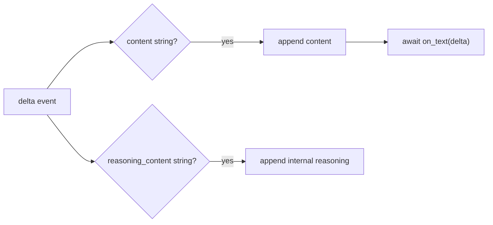
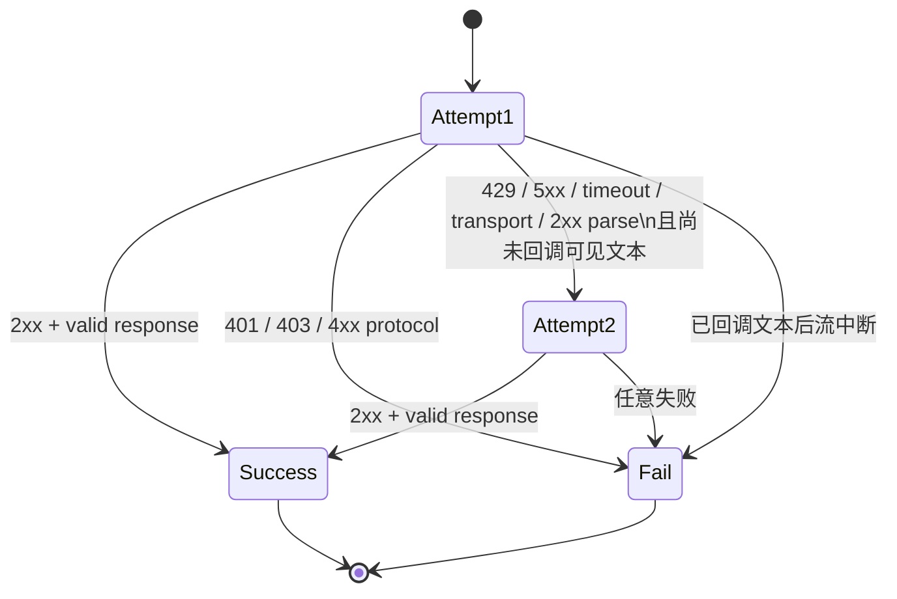

# Phase 1 工程文档：OpenAI-compatible Provider

> 文档性质：`HISTORICAL SNAPSHOT`（Phase 1 Provider 首次交付）
>
> 当前替代：公共 Provider 契约仍有效，当前请求历史还包含完整 Tool 消息、Memory/Skills 与 compaction；
> 最新整体链路从[工程文档索引](../README.md)进入。

## 1. 模块目的

`src/lobster0/providers/openai_compatible.py` 把 Lobster0 的稳定 `ModelRequest` 转换成 OpenAI Chat
Completions 请求，并把 DeepSeek 或其他兼容端点的 SSE/JSON 响应收窄为 `ModelResponse`。

Phase 1 生产配置固定使用：

```text
base_url = https://api.deepseek.com
model = deepseek-v4-pro
endpoint = POST /chat/completions
```

模块使用 `httpx.AsyncClient`，原因是它同时提供异步连接池、真正的响应流、统一超时和可注入
`MockTransport`。不使用 OpenAI SDK，避免把 Agent 内核绑定到 SDK 对象和版本。

## 2. 职责边界

模块负责：

- 构造认证 Header 和兼容请求 JSON；
- 维护单个 Provider 实例拥有的 HTTP 连接池；
- 增量消费 SSE 并按顺序回调最终文本；
- 聚合 `content`、`reasoning_content` 和分片 Tool Call；
- 解析 Token usage 与 Provider request ID；
- 对尚未产生可见输出的临时故障重试一次；
- 把远端/HTTPX 错误转换成不泄密的稳定异常。

模块不负责：

- 从 `.env` 或 TOML 读取配置；
- 选择模型、构造 System Prompt 或截断上下文；
- 决定 Tool 是否允许执行；
- 保存消息、Token 或请求 ID；
- 将 reasoning 展示给用户；
- 记录完整请求、响应或 Header。

## 3. 生命周期

```python
provider = OpenAICompatibleProvider(
    base_url="https://api.deepseek.com",
    api_key=api_key,
    timeout_seconds=120,
)
try:
    response = await provider.complete(request)
finally:
    await provider.aclose()
```

构造函数不访问网络。它创建一个 `httpx.AsyncClient` 连接池；CLI 单次或交互会话结束时调用
`aclose()`。后续 Gateway 会让 Provider 与进程运行期一致，并在优雅停机阶段关闭。

测试可注入：

- `transport=httpx.MockTransport(handler)`：替换外部网络；
- `sleep=async_sleep`：观察重试延迟而不真实等待。

生产代码没有 Factory 或 Registry；当前只有一个具体 Provider。

## 4. 请求映射

最小请求：

```json
{
  "model": "deepseek-v4-pro",
  "messages": [
    {"role": "system", "content": "..."},
    {"role": "user", "content": "..."}
  ],
  "stream": true,
  "stream_options": {"include_usage": true}
}
```

可选字段映射：

| Lobster0 | Chat Completions |
| --- | --- |
| `request.tools` | `tools` |
| `request.temperature` | `temperature` |
| `request.max_output_tokens` | `max_tokens` |
| `message.tool_calls` | Assistant `tool_calls`，arguments 重新编码为 JSON string |
| `message.tool_call_id` | Tool Message `tool_call_id` |
| `message.reasoning_content` | Assistant `reasoning_content` |

DeepSeek V4 Pro 思考模式默认开启。本阶段默认不传 temperature，因此不会发送官方说明中思考模式下
无效的采样参数。

认证 Header 每次调用时临时构造：

```text
Authorization: Bearer <private>
Accept: text/event-stream, application/json
Content-Type: application/json
```

Header 不进入 `repr`、日志、异常或持久化快照。

## 5. 真正的 SSE 增量消费

Provider 使用：

```python
async with client.stream("POST", url, json=payload, headers=headers) as response:
    async for line in response.aiter_lines():
        ...
```

不能使用 `await client.post(...)` 后再拆正文：HTTPX 的普通 `post()` 会先调用 `response.aread()`，这会
让“流式回调”只在完整响应结束后执行。

`tests/test_openai_compatible_provider.py` 使用门控 `AsyncByteStream` 验证真实顺序：

1. 传输先发送一个 content delta；
2. 传输暂停，等待 `on_text` 设置 Event；
3. Provider 必须在读取结束帧前回调；
4. Event 被释放后传输才发送 finish 与 `[DONE]`。

缓冲实现会死锁并触发测试超时，真流式实现通过。

## 6. SSE 事件解析

支持的行：

```text
: optional comment
data: {JSON object}
data: [DONE]
```

空行和冒号注释忽略；其他非空前缀视为协议错误。每个 JSON 事件必须是 object，`choices` 必须是 list。
usage-only 事件允许 `choices=[]`。

### 6.1 文本与 reasoning



最终文本增量保持到达顺序并等待回调，形成自然背压。reasoning 只聚合，不调用文本回调。

### 6.2 Tool Call 分片

DeepSeek/OpenAI 流会把同一调用拆成多个片段：

```json
{"index":0,"id":"call_1","function":{"name":"read_file","arguments":"{\"path\":"}}
{"index":0,"function":{"arguments":"\"README.md\"}"}}
```

内部 `_ToolAccumulator` 按 `index` 保存：

- 第一次出现的非空 `id`；
- 第一次或后续非空 `function.name`；
- 按到达顺序追加的 `function.arguments` JSON 字符串，或一个完整 JSON object 兼容值。

部分兼容端点会先发送 `arguments: ""`，再结束无参数 Tool Call。这是合法的中间分片，必须参与
聚合；Provider 不能把空字符串当成缺失字段。流完成后，拼接结果为空时按 `{}` 解析。该事故以
`[PROTO-001]` 固化在 Provider 回归测试中。

OpenAI 规范要求 `arguments` 是 JSON 字符串，但部分 DeepSeek/OpenAI-compatible 网关会直接返回完整 JSON
object。Lobster0 对这种已经结构化的完整值做兼容：先编码为紧凑 JSON，再进入同一聚合和最终 object 校验。
object 只能作为完整值出现，不能与字符串分片混用；数组、数字、布尔值和 `null` 仍然 fail closed。这样既解决
真实端点的 `ProviderProtocolError`，也不放宽 Tool 参数必须为 JSON object 的内部契约。

流完成后按 index 排序，拼接 arguments，并用 `json.loads()` 解码。只有字符串键 JSON object 可以进入
`ToolCall.arguments`。缺少 ID、name、非法 JSON、数组或标量都转换为 `ProviderProtocolError`。

### 6.3 结束条件

一个成功 SSE 响应必须至少包含：

- 一条 JSON data 事件；
- 一个非空 `finish_reason`。

`[DONE]` 用于停止读取，但远端正常关闭且此前已有 finish 也保持兼容。最终响应可以是：

- 非空 `content` 且无 Tool Call；
- 空/非空 `content` 加一组完整 Tool Call。

空 content 且无 Tool Call 是否有效由 AgentRunner 判断，而不是 Provider 猜测。

## 7. 非流式 JSON 兼容

如果响应 `Content-Type` 不含 `text/event-stream`，Provider 完整读取一次 JSON，并解析：

```text
choices[0].message.content
choices[0].message.reasoning_content
choices[0].message.tool_calls
choices[0].finish_reason
usage.prompt_tokens / completion_tokens
id
```

非流式存在是为了兼容忽略 `stream=true` 的端点。DeepSeek 正常路径仍为 SSE。

## 8. Token 与请求 ID

Token 必须是非负整数，显式拒绝 Python 中属于 int 子类的 bool。字段缺失保留 `None`，不会伪造 0。

请求 ID 优先级：

1. `x-request-id` 响应 Header；
2. SSE/JSON 根对象 `id`；
3. `None`。

Header 更适合联系 Provider 排障；正文 ID 作为兼容后备。

## 9. 重试状态机



| 失败 | 首次 | 第二次/已输出文本 |
| --- | --- | --- |
| 401 / 403 | 立即认证错误 | 不适用 |
| 429 | 等待后重试 | 速率错误 |
| 5xx | 等待后重试 | 服务端错误 |
| HTTPX timeout | 等待后重试 | 超时错误 |
| HTTPX transport | 等待后重试 | 服务端连接错误 |
| 其他 4xx | 协议错误 | 不重试 |
| 2xx JSON/SSE/Tool arguments 解析 | 等待后重试 | 协议错误 |

### 9.1 Retry-After

只解析数值秒数：

```text
delay = clamp(float(Retry-After), 0, 30)
fallback = 0.5 seconds
```

HTTP-date 暂不解析，值非法时走 0.5 秒后备。

### 9.2 可见增量后的失败

如果 `on_text` 已成功接收任一 delta，读超时、连接中断或协议解析失败不再重试。原因是第二次请求会重新生成完整前缀，
Channel 无法可靠识别并消除重复文本。Provider 返回稳定错误，由未来 Delivery 层决定如何标记不完整流。

CLI Phase 1 不传流回调，因此尚未产生可见增量的请求仍可安全重试一次。

2xx 响应中的畸形 Tool arguments 只触发重新请求，不会被本地 JSON repair 猜测补齐。这样可以提高兼容模型偶发截断时的
成功率，同时保持“只有完整 JSON object 才能进入 AgentRunner”的安全边界。

## 10. 错误与脱敏

公开异常只包含固定类别和必要状态码：

```text
model provider authentication failed
model provider rate limit exceeded
model provider request timed out
model provider server error
model provider returned invalid SSE JSON
```

以下内容不会拼入异常：

- API Key；
- Authorization Header；
- HTTPX 底层异常文本；
- 远端响应正文；
- 用户 Prompt 或 reasoning；
- 完整请求 URL 的 query/fragment。

HTTPX 异常通过 `raise ... from error` 保留进程内因果链，但 CLI 只显示外层安全消息。日志模块落地后也只
记录分类和 request ID。

## 11. 测试矩阵

`tests/test_openai_compatible_provider.py` 当前覆盖：

- 请求模型、消息、reasoning、stream 与 usage 参数；
- Bearer Header 到受控测试传输；
- SSE content/reasoning/Tool arguments/usage/request ID 聚合；
- 非流式 JSON 后备；
- 文本回调发生在完整流读取前；
- 503 后成功只重试一次；
- 连续 5xx 在第二次停止；
- 401 不重试且远端回显 Key 不泄露；
- 429 使用数值 Retry-After；
- 超时只重试一次且底层详情不泄露；
- 已产生可见 delta 的超时不重试；
- `[PROTO-001]` 无参数 Tool 的空 arguments 中间分片可正常聚合；
- 兼容端点返回的完整 arguments object 被规范化并正常执行；
- Tool arguments 数组、标量、残缺分片或混合形态被拒绝。

所有测试使用 `httpx.MockTransport` 或自定义 `AsyncByteStream`，不连接真实模型。

## 12. 本地调试

聚焦测试：

```bash
uv run python -m unittest \
  tests.test_provider_contracts \
  tests.test_openai_compatible_provider -v
```

静态检查：

```bash
uv run ruff check src/lobster0/providers tests/test_openai_compatible_provider.py
```

真实调用只能通过裸 `lobster0` 的唯一 TUI 做显式 Live Smoke，不在 Provider 模块临时加入 `print()`、示例
Key 或调试 main。自动化协议复现优先使用 MockTransport 和离线 Agent cases。

排障顺序：

1. `lobster0 doctor` 确认配置与凭据变量存在；
2. 根据稳定错误类型判断认证、限速、超时、5xx 或协议；
3. 使用持久化的 Provider request ID 联系服务商；
4. 仅在本地受控测试中构造相同状态或 SSE，不保存真实响应。

## 13. 性能与资源上限

- 一个 Provider 复用一个 HTTPX 连接池；
- 单次请求使用配置的统一超时；
- SSE 文本和 arguments 当前在内存聚合；Phase 1 由模型输出上限和 Agent 使用场景控制；
- 错误正文不读取用于展示，避免大响应进入错误路径；
- 最多两次 HTTP 尝试，不存在无限退避任务。

如果未来出现超大工具参数或长答案导致实际内存问题，再在 Parser 加累计字节上限；当前没有测量证据，
不提前加入第二套截断语义。

## 14. 已知限制与升级条件

- 只支持 Chat Completions，不支持 Responses API 或 Anthropic Messages。
- 只消费首个 choice；Lobster0 不请求多候选。
- SSE 只接受 `data:` 事件和注释，不实现通用浏览器 EventSource 重连。
- `Retry-After` 只支持数值秒数。
- Provider 不实现上下文预算和输出截断；分别属于 ContextBuilder 与 AgentRunner。
- 未来飞书流式交付接入后，需要在 Delivery 文档中定义“已发送部分文本后 Provider 失败”的用户展示，
  但不能在这里自动重试产生重复内容。
