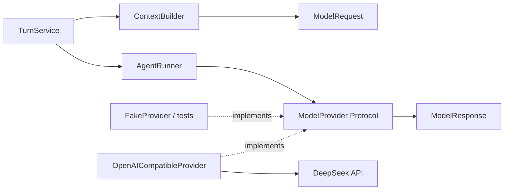
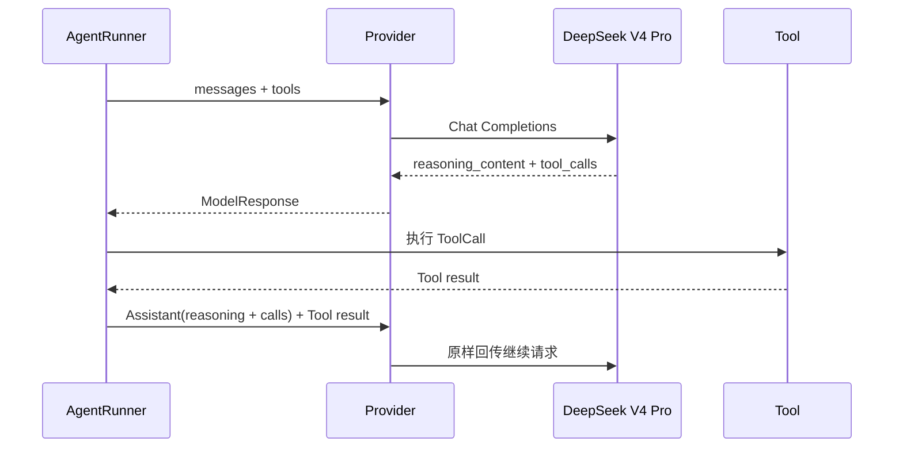

# Phase 1 工程文档：Model Provider 公共契约

> 文档性质：`HISTORICAL SNAPSHOT`（Phase 1 契约首次交付）
>
> 当前替代：Provider Protocol 仍是 Agent Core 边界，但请求/响应字段已随 Tool、usage、reasoning 和
> compaction 扩展；当前全仓状态从[工程文档索引](../README.md)进入。

## 1. 模块目的

`src/lobster0/providers/base.py` 是 Agent Core 与任意模型服务之间唯一稳定边界。AgentRunner 只认识
`ModelProvider.complete()`、请求/响应值对象和五类错误；它不知道 HTTP、SSE、SDK、Base URL 或 API
Key。

这个边界解决两类长期问题：

1. Channel、Turn 和 Tool Loop 不被某个厂商的动态 JSON 结构污染；
2. 单元测试可以使用确定性 Fake Provider，不访问网络或真实凭据。

Phase 1 只有一个具体实现 `OpenAICompatibleProvider`。保留 Protocol 是因为 Fake 与生产实现都需要被
AgentRunner 使用，不是为了提前建设 Provider 市场。

## 2. 依赖方向



`providers/base.py` 只依赖标准库。它不得导入 Agent、Storage、CLI、HTTPX 或配置模块。

## 3. JSON 值边界

```python
type JsonValue = (
    str | int | float | bool | None | list[JsonValue] | dict[str, JsonValue]
)
```

该别名约束工具参数和 Schema 可以序列化为 JSON。远端动态数据进入系统时，具体 Provider 必须先验证
类型，再构造这些值对象；Agent 内部不接收未经收窄的 `Any`。

## 4. ToolCall

```python
@dataclass(frozen=True, slots=True)
class ToolCall:
    call_id: str
    name: str
    arguments: dict[str, JsonValue]
```

| 字段 | 来源 | 约束 |
| --- | --- | --- |
| `call_id` | Provider 原生调用 ID | 同一模型响应内唯一，后续 Tool Message 原样引用 |
| `name` | Function name | Provider 解析后为非空字符串；注册校验由 Runner/ToolRegistry 负责 |
| `arguments` | JSON arguments | 必须是 object，不接受数组、标量或未解析字符串 |

值对象使用 frozen dataclass，防止回调替换字段；其中的字典由调用边界拥有，代码约定构造后不原地修改。
如果后续出现真实并发修改问题，再把参数转换为只读映射，不提前引入深冻结工具。

## 5. ModelMessage

`ModelMessage` 统一支持五类协议片段：

| 场景 | `role` | 关键字段 |
| --- | --- | --- |
| 系统规则 | `system` | `content` |
| 用户输入 | `user` | `content` |
| 最终回答 | `assistant` | `content` |
| 工具请求 | `assistant` | `tool_calls`、可选 `content`、`reasoning_content` |
| 工具结果 | `tool` | `tool_call_id`、`content` |

### 5.1 reasoning_content 生命周期

DeepSeek V4 Pro 默认思考模式会在 Assistant 响应中返回 `reasoning_content`。当同一轮响应还包含 Tool
Call 时，官方协议要求下一次请求把该字段原样放回对应 Assistant Message；缺失时服务端返回 400。



安全边界：

- `reasoning_content` 只保留在当前 Agent Loop 的内存消息中；
- 不发送到 Channel，不作为流式文本回调；
- Phase 1 不写入普通 SQLite Assistant Message；
- 不出现在日志、错误消息或任务回放预览中。

未来若为厂商协议需要持久化连续思考状态，必须先增加独立敏感字段与保留策略，不能塞进普通 content。

## 6. ModelRequest

```python
@dataclass(frozen=True, slots=True)
class ModelRequest:
    model: str
    messages: tuple[ModelMessage, ...]
    tools: tuple[dict[str, JsonValue], ...] = ()
    temperature: float | None = None
    max_output_tokens: int | None = None
```

`messages` 和 `tools` 使用 tuple，使 Runner 每轮通过构造新 Request 表达上下文追加，不原地修改已经交给
Provider 的请求。

DeepSeek V4 Pro 思考模式下不使用 temperature；字段仍保留在兼容契约中，但具体 Provider 只在值非空
且目标协议支持时发送。Phase 1 默认请求保持为空。

## 7. ModelResponse

Provider 必须聚合完整 SSE 或 JSON 后才能构造响应：

| 字段 | 含义 | 空值语义 |
| --- | --- | --- |
| `content` | 最终可见回答 | 可以为空，仅当存在 Tool Call；否则 Runner 报空响应 |
| `tool_calls` | 已按 index 排序且参数完成 JSON 解码的调用 | 无调用为空 tuple |
| `reasoning_content` | 当前 Assistant 的内部继续状态 | 厂商未提供时为 `None` |
| `finish_reason` | 上游首选 choice 的结束原因 | 上游缺失属于协议错误 |
| `input_tokens` | Prompt token usage | 兼容服务未返回时为 `None` |
| `output_tokens` | Completion token usage | 兼容服务未返回时为 `None` |
| `provider_request_id` | Header 或 JSON 请求 ID | 上游未提供时为 `None` |

Token 的缺失和数值 0 必须区分；Storage 层可按产品规则把缺失聚合为 0，但 Provider 不伪造用量。

## 8. 异步流式回调

```python
type StreamHandler = Callable[[str], Awaitable[None]]
```

回调只接收最终回答 `content` 增量。Provider 对每个非空 delta 按到达顺序 `await` 回调，因此调用方可以
自然施加背压。Tool arguments 和 reasoning 不进入该回调。

Phase 1 CLI 只输出最终聚合文本；该接口先由测试覆盖，后续飞书流式卡片可以直接复用。

## 9. 错误模型

所有公开 Provider 异常继承 `ProviderError`：

| 类型 | 典型来源 | Turn 行为 | CLI 行为 |
| --- | --- | --- | --- |
| `ProviderAuthenticationError` | 401、403 | failed/authentication | exit 3 |
| `ProviderRateLimitError` | 429 重试后仍失败 | failed/rate_limit | exit 4 |
| `ProviderTimeoutError` | connect/read/write/pool timeout | failed/timeout | exit 4 |
| `ProviderProtocolError` | 400、无效 JSON/SSE、缺失字段 | failed/protocol | exit 4 |
| `ProviderServerError` | 5xx 重试后仍失败 | failed/server | exit 4 |

具体实现只能构造不含 API Key、Authorization Header、完整 URL query 或远端正文的安全消息。调用方不得
依赖异常中的原始响应内容。

## 10. Fake Provider

测试 Fake 只需实现同一个方法：

```python
class FakeProvider:
    def __init__(self, responses: tuple[ModelResponse, ...]) -> None:
        self.responses = responses
        self.requests: list[ModelRequest] = []

    async def complete(self, request: ModelRequest, on_text=None) -> ModelResponse:
        self.requests.append(request)
        return self.responses[len(self.requests) - 1]
```

Fake 应验证请求顺序并返回完整真实结构。测试断言 Agent 的结果和状态，不把“Fake 被调用”本身当成产品
行为。

## 11. 测试矩阵

`tests/test_provider_contracts.py` 当前保护：

- reasoning 与工具参数经过 Request 继续传递；
- frozen 值对象不能被替换字段；
- 五类具体错误都可以由 Turn 层用一个 `ProviderError` 捕获，类型仍保持可区分。

HTTP/SSE、重试和远端动态类型验证属于 `tests/test_openai_compatible_provider.py`，不混入纯契约测试。

## 12. 本地调试

契约不访问网络，可直接运行：

```bash
uv run python -m unittest tests.test_provider_contracts -v
```

若新增字段，需要同步检查以下消费者：

```bash
rg -n "Model(Request|Response|Message)|ToolCall|ProviderError" src tests
```

## 13. 已知限制与升级条件

- `role` 当前使用字符串以直接映射兼容协议；若多个 Channel/Provider 产生拼写问题，再升级为 `StrEnum`。
- Tool Schema 使用 JSON 字典，不引入 JSON Schema 模型库；Phase 2 由 ToolRegistry 生成并验证。
- 只有 Chat Completions 契约，不抽象 Responses API 或 Anthropic Messages。出现第二个真实协议实现时再评估
  是否扩展，而不是现在添加空适配层。
