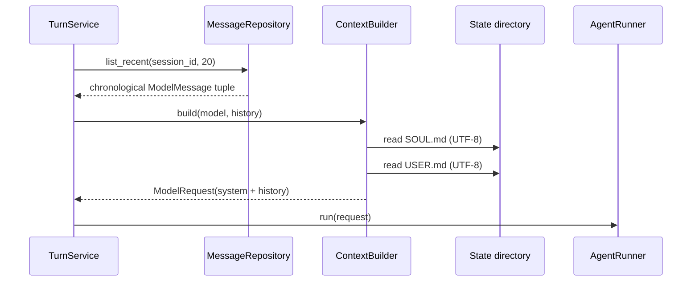

# Phase 1 工程文档：ContextBuilder

> 文档性质：`HISTORICAL SNAPSHOT`（Phase 1 最小上下文）
>
> 当前替代：ContextBuilder 已接入 Memory、Skills、persistent compaction、runtime snapshot 与精确预算；
> 当前行为见 [Memory、Skills 与上下文压缩](../phase-3/memory-skills-compaction.md)。

## 1. 模块目的

`src/miniclaw/agent/context.py` 把 MiniClaw 的固定身份和 Storage 已筛选的会话历史组合成
`ModelRequest`。它保证不同 Channel 最终使用相同的身份顺序，不让 CLI、飞书或 Provider 各自拼 Prompt。

Phase 1 的上下文是可运行闭环所需的最小版本：

```text
内置安全/产品前言
→ SOUL.md
→ USER.md
→ 最近会话消息（包含当前用户消息）
```

在 Phase 1 快照中，Memory、Skills、Workspace `AGENTS.md`、压缩摘要和精确 Token Budget 尚未接入；
这些能力后来由 Phase 3 落地。本段只描述当时不提前放置空 Loader 的决定。

## 2. 职责边界

模块负责：

- 读取当前实例固定的 `SOUL.md` 与 `USER.md`；
- 使用一个稳定的 MiniClaw System Preamble；
- 保证 SOUL 在 USER 前、身份在历史前；
- 保持 Storage 提供的历史顺序，不删除或改写当前用户消息；
- 把身份读取错误收窄为不含文件内容的 `ContextError`。

模块不负责：

- 查询 SQLite 或选择最近消息；
- 写入/整理 Memory；
- 选择 Skill；
- 估算 Token 或截断 Tool Result；
- 创建 Tool Schema；
- 调用模型或保存结果。

## 3. 公共接口

```python
class ContextBuilder:
    def __init__(self, paths: StatePaths) -> None: ...

    def build(
        self,
        model: str,
        history: tuple[ModelMessage, ...],
    ) -> ModelRequest: ...
```

| 输入 | 生产者 | 前置条件 |
| --- | --- | --- |
| `StatePaths` | CLI/Gateway 装配层 | 已执行 init，身份文件存在 |
| `model` | `AppConfig.agent.model` | 非空并已通过配置校验 |
| `history` | `MessageRepository.list_recent()` | 按时间升序，最多 20 条，最后一条是当前用户消息 |

输出只包含 model 与 messages；Phase 1 tools 为空，生成参数保持 `None`。

## 4. System Message 结构

最终首条消息为：

```markdown
You are MiniClaw, a private self-hosted personal agent. Follow the owner's
identity instructions, preserve user privacy, and answer clearly.

## SOUL
<SOUL.md 去除首尾空白后的原文>

## USER
<USER.md 去除首尾空白后的原文>
```

内置 Preamble 只声明产品身份、Owner 指令与隐私原则。个人性格和偏好留在用户可编辑的 Markdown 中，
避免修改 Python 才能调整 Agent。

`SOUL.md` 与 `USER.md` 的正文不做 Markdown 解析或转义；它们本来就是用户明确提供给模型的指令文件。

## 5. 数据流



ContextBuilder 不缓存文件，因此用户编辑 SOUL/USER 后下一次 Turn 立即生效。个人使用下两次小文件读取成本
可忽略，也避免缓存失效和文件监听复杂度。

## 6. 顺序与所有权

`history` 的筛选和顺序归 Storage：

- Repository 负责 SQL `ORDER BY`、limit 和由旧到新返回；
- TurnService 负责先保存当前 User Message 再读取历史；
- ContextBuilder 只把一个 System Message 放到 tuple 前面。

该分工防止 Context 同时理解 SQLite 与 Prompt。未来 Channel 不需要复制查询或排序逻辑。

## 7. 错误模型

读取失败统一为：

```text
ContextError: cannot read MiniClaw identity file <absolute path>
```

错误可能由文件缺失、目录替代文件、权限、I/O 或 UTF-8 解码产生。异常使用 `raise ... from error` 保留内部
因果链，但公开消息不包含文件正文。

ContextError 发生时：

1. Provider 不被调用；
2. TurnService 把当前 Turn 标为 failed/context；
3. CLI 输出安全短消息和修复路径；
4. 已保存的 User Message 保留，便于任务回放。

## 8. 安全约束

- 只读取 `StatePaths` 中固定的 SOUL/USER，不接受模型或用户消息提供任意路径；
- 文件内容只进入模型请求，不进入异常或普通日志；
- 不读取 `.env`、config.toml、MEMORY 或 Workspace；
- 不执行 Markdown 中的命令或代码；
- Provider 层不得重新读取这些文件。

State 目录由 Phase 0 创建并限制权限。若后续支持多 Owner，ContextBuilder 必须接收 Owner 级路径快照，
不能继续使用一个全局目录。

## 9. 测试矩阵

`tests/test_context.py` 使用完整 `initialize_state()` 与临时目录，验证：

- model 原样进入请求；
- 首条消息为 system；
- Preamble 后依次出现 SOUL 和 USER；
- 历史 tuple 的角色、内容和顺序不变；
- 当前用户消息保持最后；
- 身份路径不可读时错误指出路径但不泄露另一个身份文件内容。

测试使用真实文件系统和真实 Bootstrap，不 Mock `Path.read_text()`，因此能发现编码、文件类型和初始化路径
回归。

## 10. 本地调试

查看当前身份文件：

```bash
sed -n '1,120p' ~/.miniclaw/SOUL.md
sed -n '1,120p' ~/.miniclaw/USER.md
```

不要在共享日志或 Issue 中粘贴包含个人信息的 USER 内容。

聚焦测试：

```bash
uv run python -m unittest tests.test_context -v
```

出现 `ContextError` 时依次检查：目标路径是否存在、是否普通文件、当前用户是否可读、是否 UTF-8。不要
通过捕获异常后使用空身份继续运行，这会让 Agent 在用户不知情时失去规则。

## 11. Phase 3 扩展顺序

完整 Context 目标顺序固定为：

1. System Preamble；
2. SOUL；
3. USER；
4. Workspace `AGENTS.md`；
5. 长期 MEMORY；
6. 按描述选择的 Skills；
7. Session 压缩摘要；
8. 最近未压缩消息；
9. 当前 User Message。

Phase 3 应扩展 `build()` 的输入为已经选择好的只读片段，而不是让 ContextBuilder 自己查询所有 Store。

## 12. 已知限制与升级条件

- Phase 1 不按 Token 精确预算，只依赖 Repository 最多 20 条历史的保守限制。
- 身份文件每 Turn 读取，不缓存。
- 内置 Preamble 暂无版本表；Evolution Phase 会把 Prompt 版本与运行快照关联。
- 不解析 Markdown Frontmatter；SOUL/USER 是纯指令正文。
- 只有在 Phase 3 有实际 Memory/Skill 数据源时才扩展接口，不提前添加可选空参数。
