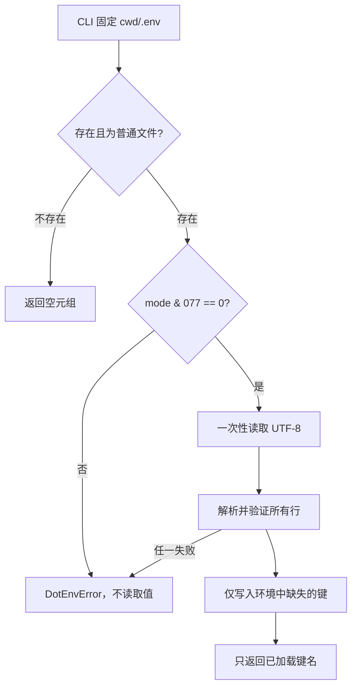

# Phase 1 工程文档：本地 `.env` 与模型凭据边界

## 1. 模块目的

`src/miniclaw/env.py` 只解决一个问题：把用户明确放在当前工作目录 `.env` 中的本地变量，安全地加入
MiniClaw 进程环境。它不是 Shell 解释器、通用 dotenv 兼容层或秘密管理系统。

Phase 1 使用它承载 DeepSeek 凭据：

```dotenv
MINICLAW_MODEL_API_KEY=<your-local-key>
MINICLAW_MODEL_BASE_URL=https://api.deepseek.com
MINICLAW_MODEL_NAME=deepseek-v4-pro
```

真实 `.env` 已由仓库 `.gitignore` 忽略；`.env.example` 只保存虚拟值和公开模型配置。

## 2. 职责边界

模块负责：

- 检查目标是 owner-only 普通文件；
- 按 UTF-8 读取完整文件；
- 在修改环境之前验证全部行；
- 加载当前进程尚未显式设置的变量；
- 用路径和行号报告错误，但不回显原始行或值。

模块不负责：

- 搜索父目录或用户主目录中的 `.env`；
- 调用 EvalHub 或解密其凭据；
- 校验 API Key 是否真实可用；
- 把变量写回文件、日志或 SQLite；
- 支持 Shell 的 `export`、插值、命令替换、转义或多行语法。

## 3. 公共接口

```python
def load_dotenv(
    path: Path,
    environ: MutableMapping[str, str] | None = None,
) -> tuple[str, ...]: ...
```

| 参数 | 含义 |
| --- | --- |
| `path` | CLI 传入的固定文件位置；Phase 1 使用 `Path.cwd() / ".env"` |
| `environ` | 可替换映射，便于离线测试；省略时使用 `os.environ` |

返回值是实际加入目标环境的变量名，绝不包含变量值。文件不存在返回空元组。

`DotEnvError` 表示权限、文件类型、读取、编码或语法错误。异常消息只包含固定类别、路径和必要行号。

## 4. 支持的文件语法

语法有意保持窄小：

```text
file     := line*
line     := blank | comment | assignment
comment  := optional-space "#" text
assignment := KEY optional-space "=" optional-space VALUE
KEY      := [A-Z_][A-Z0-9_]*
VALUE    := unquoted | 'single quoted' | "double quoted"
```

引号只用于去除最外层的一对匹配字符，不处理反斜线转义。无引号值保留其中的 `#`、`$` 和空格；这些
字符不会被解释或执行。

以下写法被拒绝：

```dotenv
export MINICLAW_MODEL_API_KEY=...
lowercase=value
MINICLAW_MODEL_API_KEY='unclosed
```

## 5. 加载与优先级



最终配置优先级仍由 `config.load_config()` 控制：

1. 代码安全默认值；
2. `~/.miniclaw/config.toml`；
3. `.env` 加入的进程环境；
4. 启动命令原本已有的 Shell 环境；
5. CLI 显式覆盖。

因为 `load_dotenv()` 使用“不覆盖”语义，Shell 中的同名变量自然高于 `.env`。

## 6. 文件权限

在 POSIX 系统上，加载前要求：

```text
文件类型 = regular file
mode & 0o077 = 0
```

推荐创建方式：

```bash
touch .env
chmod 600 .env
```

`0640`、`0644` 或对 other 可写的文件都会被拒绝。检查发生在读取前，避免先接触不安全文件中的凭据。

## 7. EvalHub 凭据迁移

EvalHub 把 DeepSeek Key 以 Fernet 密文保存在自身 `.runtime/model_providers.sqlite3`，主密钥在权限为
`0600` 的 `.runtime/provider_credentials.key`。迁移只在开发机本地执行一次：调用 EvalHub 的公开
Repository 解密，然后直接写入 MiniClaw `.env`，目标权限设为 `0600`。

MiniClaw 仓库中不会保存迁移脚本，原因是：

- EvalHub 的绝对路径不是 MiniClaw 产品接口；
- 运行时不应依赖另一个个人仓库；
- 一次性迁移命令不应长期扩大攻击面。

迁移过程不得把返回值写到 stdout、命令参数、日志或 Git diff。

## 8. 错误与数据安全

| 情况 | 结果 | 是否修改环境 |
| --- | --- | --- |
| 文件不存在 | 返回 `()` | 否 |
| 不是普通文件 | `DotEnvError` | 否 |
| group/other 有权限 | `DotEnvError` | 否 |
| 非 UTF-8 | `DotEnvError` | 否 |
| 任一行非法 | `DotEnvError(path:line)` | 否 |
| 键已在环境 | 跳过该键 | 否 |
| 全部合法 | 返回新增键名 | 是，仅缺失键 |

解析先生成完整键值元组，再统一更新环境，因此最后一行损坏不会留下前几行已生效的半配置状态。

## 9. 测试矩阵

`tests/test_env.py` 使用临时文件和独立字典验证：

- 文件不存在；
- 单引号、双引号和无引号值；
- 进程环境优先；
- `export` 被拒绝且异常不含秘密值；
- 非法键名与未闭合引号；
- NUL 导致全文件失败且不产生部分写入；
- group-readable 文件被拒绝。

这些测试不读取开发者真实 `.env`，也不修改真实 `os.environ`。

## 10. 本地调试

只验证解析行为，不调用模型：

```bash
chmod 600 .env
uv run python -c 'from pathlib import Path; from miniclaw.env import load_dotenv; print(load_dotenv(Path(".env")))'
```

输出只应是变量名元组，例如 `('MINICLAW_MODEL_API_KEY',)`。不要执行会打印 `os.environ` 的调试命令。

聚焦测试：

```bash
uv run python -m unittest tests.test_env -v
```

## 11. 已知限制与升级条件

- 只读取显式路径；不向上搜索。这避免从意外父目录吸收凭据。
- 不支持 BOM、转义、多行值和 `export`。真实 Provider Key 不需要这些语法。
- 不提供加密落盘；`.env` 的安全来自本机账户权限。需要团队共享或生产密钥轮换时，再接入操作系统
  Keychain、容器 Secret 或部署平台 Secret，不扩展当前解析器为秘密管理器。
