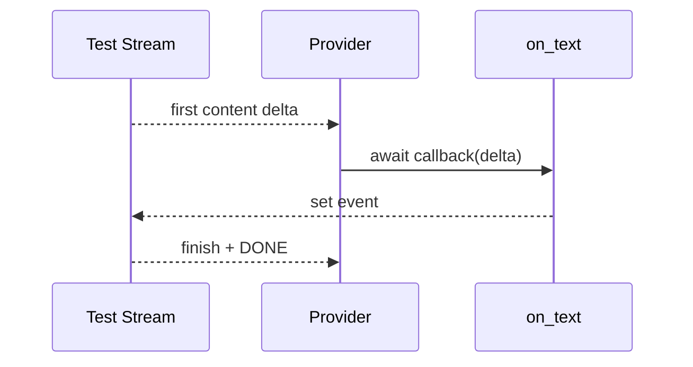

# Phase 1 工程文档：测试与调试

> 文档性质：`HISTORICAL SNAPSHOT`。本文保留 Phase 1 的测试分层和旧 CLI 证据；`test_cli_chat.py` 已随
> 单入口 TUI 迁移删除。当前测试与
> Live Smoke 命令以 [Phase 2 回归、恢复与调试](../phase-2/testing-and-debugging.md) 为准，下面出现的
> `miniclaw chat --message` 只表示当时的发布流程，不能用于当前版本。

## 1. 目标

Phase 1 的验证目标不是证明某个函数能返回字符串，而是证明一条真实消息可以安全穿过：

```text
CLI → .env/config → TurnService → ContextBuilder → AgentRunner
    → HTTP/SSE Provider → SQLite terminal state → stdout
```

普通测试必须离线、确定、可重复；真实 DeepSeek 只做显式冒烟验证，不能成为 CI 或本地回归的前置条件。

## 2. 测试分层

| 层 | 主要文件 | 验证内容 | 外部网络 |
| --- | --- | --- | --- |
| 配置边界 | `test_env.py`, `test_config.py` | `.env` 权限/语法、TOML、覆盖顺序 | 否 |
| Provider 契约 | `test_provider_contract.py` | 不可变请求/响应、异常类型 | 否 |
| Provider 协议 | `test_openai_compatible_provider.py` | JSON、SSE、Tool Call、usage、重试、脱敏 | 否 |
| Agent 单元 | `test_context.py`, `test_agent_runner.py` | 身份顺序、循环、工具、空回答、上限 | 否 |
| 持久化 | `test_conversations.py`, `test_turn.py` | Session、状态机、事务、终态 | 否 |
| 入口/Runtime/TUI | `test_cli.py`, `test_runtime.py`, `test_tui.py` | 单入口、真实装配、事件与审批交互 | 否 |
| 真实冒烟 | 手动命令 | 当前 Key、账号权限和 DeepSeek 在线兼容性 | 是，显式执行 |

## 3. 常用命令

从仓库根目录执行：

```bash
uv sync --extra dev

# 单模块
.venv/bin/python -m unittest tests.test_cli tests.test_runtime tests.test_tui -v
.venv/bin/python -m unittest tests.test_openai_compatible_provider -v
.venv/bin/python -m unittest tests.test_turn -v

# 全量离线回归
.venv/bin/python -m unittest discover -s tests -v

# 静态与包检查
.venv/bin/ruff check --no-cache .
git diff --check
uv build
```

测试框架使用 Python `unittest`。Phase 1 没有引入 pytest 插件、Docker 测试容器或录制网络响应，因为标准库和
HTTPX 的可注入传输已经覆盖当前边界。

## 4. 离线 Provider 测试

### 4.1 HTTPX MockTransport

Provider 单元测试使用 `httpx.MockTransport`：

- 直接检查 URL、JSON 字段和认证存在性；
- 返回 401、429、5xx、非法 JSON 或完整 JSON；
- 注入无等待 `sleep` 验证一次有限重试；
- 从异常与捕获输出中检查凭据不出现。

这类测试快且精确，适合协议分支。

### 4.2 门控 AsyncByteStream

“响应声明为 SSE”不等于真正增量消费。门控流先发一个 delta，然后等待回调设置 Event，最后才发送结束帧：



如果 Provider 先完整缓冲响应再回调，测试会超时；因此该测试能区分真流式和伪流式实现。

## 5. CLI loopback E2E

`tests/test_cli_chat.py` 使用 `ThreadingHTTPServer(("127.0.0.1", 0), handler)`：

1. 操作系统分配随机 loopback 端口；
2. 临时 MiniClaw home 执行真实 `init`；
3. 只把临时 `config.toml` 的 `base_url` 改为 loopback；
4. 创建权限为 `0600` 的临时 `.env`；
5. 调用真实 `cli.main()`；
6. Server 返回两段 content、finish、usage 和 `[DONE]`；
7. 测试读取真实 SQLite 验证 Turn 和 Message。

Server 观测值只有：

```json
{
  "path": "/chat/completions",
  "authorized": true,
  "model": "deepseek-v4-pro",
  "stream": true
}
```

不会保存 Authorization 原文，避免失败断言把测试 Key 打印出来。

某些受限沙箱禁止进程绑定 loopback socket；这是运行环境限制，不是外网依赖。在正常本机和 CI 中该测试只访问
`127.0.0.1`。

## 6. 安全检查

### 6.1 Git 边界

提交前：

```bash
git status --short
git diff --cached --check
git check-ignore -v .env
```

预期 `.env` 被 `.gitignore` 命中，staged diff 中没有 `.env`、SQLite、临时 home 或真实响应。

### 6.2 权限

```bash
stat -f '%Sp %N' .env        # macOS
stat -c '%A %n' .env        # Linux
```

预期 owner 可读写，group/other 无权限，即 `0600`。权限更宽时 Loader 应在联网前返回退出码 2。

### 6.3 脱敏

不要用 `set -x` 运行带 Key 的命令，不要 `cat .env`，也不要把完整 `os.environ`、请求 Header、Provider
payload 或响应写入日志。

自动测试至少检查：

- 缺 Key 只报告环境变量名；
- 401 错误不含测试 Key；
- Provider 错误不含 Header 或响应正文；
- HTTP Server 不存认证原文。

## 7. SQLite 调试

先停止正在运行的 CLI，再使用只读方式：

```bash
sqlite3 "file:$HOME/.miniclaw/miniclaw.db?mode=ro" \
  "SELECT id,status,model,input_tokens,output_tokens,error_code FROM turns ORDER BY id DESC LIMIT 10;"

sqlite3 "file:$HOME/.miniclaw/miniclaw.db?mode=ro" \
  "SELECT id,session_id,turn_id,role,length(content) FROM messages ORDER BY id DESC LIMIT 20;"
```

优先检查状态和长度，不在共享终端打印完整个人对话。一次正常 Turn 应表现为：

```text
queued → running → completed
```

失败应是：

```text
queued → running → failed
queued → running → cancelled
```

如果 Turn 停留在 running，说明进程被强制杀死或机器断电；Phase 1 尚无启动恢复任务，先保留数据库用于诊断。

## 8. 历史 DeepSeek 冒烟

前置：仓库根 `.env` 已安全配置 `MINICLAW_MODEL_API_KEY`，且不在 Git 中。

以下命令仅用于解释 Phase 1 的历史证据，当前版本请使用裸 `miniclaw --home "$smoke_home"` 进入唯一 TUI：

```bash
smoke_home=$(mktemp -d)
chmod 700 "$smoke_home"
uv run miniclaw init --home "$smoke_home"
uv run miniclaw chat --home "$smoke_home" --message "只回答：MiniClaw online"
```

验收：

- 退出码为 0；
- stdout 非空，stderr 为空；
- SQLite 最新 Turn 为 `completed`；
- `model=deepseek-v4-pro`；
- input/output tokens 为正数；
- stdout/stderr 和 Git diff 不含 Key；
- 测试完成后删除临时目录。

真实冒烟不固定回答的逐字内容，因为生成模型输出可能变化；只固定最小可观察属性。

## 9. 故障分诊

### 9.1 exit 2

依次检查：

```bash
uv run miniclaw doctor --home /absolute/state
ls -l .env
```

常见原因：相对 `--home`、没有 init、`.env` 不是 `0600`、变量名拼错、空 `--session`、管道中缺
`--message`。

### 9.2 exit 3

说明端点返回 401/403。检查 Key 是否属于当前 DeepSeek 账号、是否有模型权限、环境变量是否被 shell 中旧值优先
覆盖。不要把 Key 复制到 issue 或日志。

### 9.3 exit 4

根据固定错误类别判断：

- `rate limit`：等待配额恢复；
- `timed out`：检查网络或提高配置超时；
- `server error`：Provider 5xx 或连接失败；
- `invalid ...`：兼容协议发生变化；
- `empty final response`：模型没有文本和 Tool Call；
- `iteration limit`：工具循环超过配置上限。

Provider 对 429、5xx、timeout、transport 在未输出可见文本时已经重试一次，不应在 CLI 内再套无上限重试。

### 9.4 exit 5

先备份 `miniclaw.db`，再运行 `doctor`。检查磁盘空间、文件权限、Schema 版本和 SQLite integrity。不要直接删除个人
数据库来“修复”。

## 10. 完成门禁

Phase 1 只有同时满足以下条件才可合并：

- 全量 unittest 通过；
- Ruff 通过；
- `git diff --check` 通过；
- `uv build` 通过；
- 离线 CLI E2E 通过；
- 真实 DeepSeek 冒烟通过；
- `.env` 被忽略且为 `0600`；
- 每个新增运行模块都有对应工程文档；
- README、架构、本地运行指南与进度页不把后续 Tool/IM 能力写成已实现。
