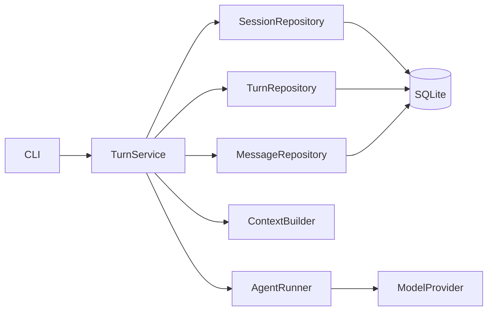
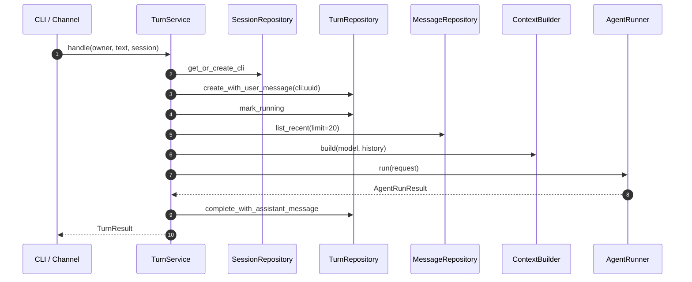

# Phase 1 工程文档：TurnService

> 文档性质：`HISTORICAL SNAPSHOT`（Phase 1 Turn 闭环）
>
> 当前替代：TurnService 已持久化完整 Tool transcript、Approval 续执行、crash recovery、Session lock 与
> runtime snapshot；当前 Tool 事务见[Tool Runtime](../phase-2/tool-runtime-and-system-info.md)，上下文恢复见
> [Memory、Skills 与上下文压缩](../phase-3/memory-skills-compaction.md)。

## 1. 模块目的

`src/miniclaw/agent/turn.py` 是所有 Channel 最终进入 Agent Core 的用例边界。Phase 1 由 CLI 调用；飞书、
Telegram 和 Discord 后续把标准化消息映射到同一服务，而不是直接调用 Provider。

TurnService 把一次用户输入从持久化 queued 记录推进到 completed、failed 或 cancelled，并保证已发生的用户
输入和错误状态可回放。

## 2. 依赖图



TurnService 不拥有连接和 HTTP Client 生命周期；装配层创建组件。它只保存引用并执行一次用例。

## 3. 公共接口

```python
async def handle(
    self,
    user_id: int,
    text: str,
    conversation_id: str,
    on_text: StreamHandler | None = None,
) -> TurnResult: ...
```

| 输入 | 来源 | 规则 |
| --- | --- | --- |
| `user_id` | Phase 0 OwnerRepository | 当前单 Owner ID |
| `text` | CLI/Channel 标准化文本 | 不能只含空白；原文持久化 |
| `conversation_id` | CLI `--session` | 空值由 SessionRepository 拒绝 |
| `on_text` | 可选 Delivery | Phase 1 CLI 不传；后续流式 Channel 使用 |

输出 `TurnResult` 包含内部 turn/session ID、最终文本、累计 Token 和最后 Provider request ID。

## 4. 成功执行顺序



User Message 在模型调用前提交。即使进程在远端调用时失败，输入仍能与 failed/cancelled Turn 一起回放。

## 5. 入站事件 ID

Phase 1 CLI 每次输入生成：

```text
cli:<uuid4>
```

CLI 没有平台原生事件 ID，重复输入应创建新 Turn，因此不按文本哈希去重。后续 Channel 必须传平台稳定
event_id 并先写 `processed_events`；届时 TurnService 会接收标准化 InboundMessage，而不是在内部生成 UUID。

## 6. 历史转换

MessageRepository 返回 StoredMessage；TurnService 转换为 Provider 无关消息：

```python
ModelMessage(
    role=message.role,
    content=message.content,
    tool_call_id=message.tool_call_id,
)
```

Phase 1 快照中的数据库只保存 User 和最终 Assistant，因此当时不恢复历史 Tool Calls/reasoning。当前实现已经
持久化完整 Tool transcript，并在异常历史恢复时 fail closed；reasoning 仍不混入普通 Message content。

## 7. 终态保证

创建成功并进入 running 后，受控路径一定尝试写入一个终态：

| 结果 | Repository 调用 | 对外行为 |
| --- | --- | --- |
| AgentRunResult | complete + Assistant | 返回 TurnResult |
| Context/Agent/ProviderError | fail(code, safe message) | 原异常继续抛给 CLI |
| CancelledError | cancel | CancelledError 继续传播 |
| SQLite/编程错误 | 当前事务回滚 | 原错误传播，可能保留 running 供排障 |

最后一类不伪装为 AgentError。数据库自身不可写时再尝试 `fail()` 可能同样失败，并会掩盖根因；因此只对
已经定义为安全、可分类的 Agent 边界错误写 failed。

## 8. 错误码映射

```text
ProviderAuthenticationError → provider_authentication
ProviderRateLimitError      → provider_rate_limit
ProviderTimeoutError        → provider_timeout
ProviderProtocolError       → provider_protocol
ProviderServerError         → provider_server
EmptyModelResponseError     → empty_response
AgentLoopLimitError         → loop_limit
ContextError                → context
其他 ProviderError          → provider
其他 AgentError             → agent
```

映射按具体到通用排序。错误码用于 SQLite、任务回放、CLI exit code 和未来指标；不要用异常英文文本作为机器
判断条件。

错误消息来自已收窄的模块边界：Provider 不含正文/Key，Context 不含文件内容，Runner 不含 Prompt/Tool
参数。TurnService 不再次拼接用户输入。

## 9. 取消语义

`asyncio.CancelledError` 单独捕获：

1. `TurnRepository.cancel(turn.id)`；
2. 不设置 error_code/error_message；
3. 使用裸 `raise` 原样传播；
4. CLI 映射为 130；Gateway 用于优雅停机和活动 Turn 收敛。

CancelledError 在 Python 3.12 属于 BaseException 路径，不能依赖普通 `except Exception`。Runner 与
Provider 均不吞掉它。

## 10. Session 历史连续性

同一个 Owner + conversation ID 的第二次 handle 会读取：

```text
previous user
previous assistant
current user
```

ContextBuilder 再在最前放 System/SOUL/USER。不同 conversation ID 使用独立 Session，不共享短期历史；
长期跨 Channel Memory 在 Phase 3 实现。

## 11. Streaming 边界

TurnService 接收 `on_text` 并原样交给 AgentRunner。流回调失败会终止当前 Turn；Provider 已保证可见 delta
后不自动重试，避免重复。

Phase 1 CLI 只在 complete 后打印最终内容，因此数据库成功提交与 stdout 顺序由 CLI 控制。后续 Channel
允许先发送增量，发送失败不回滚已完成 Agent Turn，Delivery 状态另表记录。

## 12. 测试矩阵

`tests/test_turn.py` 使用真实：

- Bootstrap 与 SQLite Schema；
- Session/Message/Turn Repository；
- ContextBuilder；
- AgentRunner。

只把外部模型替换为 FakeProvider，覆盖：

- 成功后 User/Assistant、Token 与 completed；
- Provider 请求最后一条是当前 User；
- 第二 Turn 获取上一轮按时间排序的历史；
- ProviderAuthenticationError 原样抛出并保存 provider_authentication；
- CancelledError 原样传播并保存 cancelled。

这种测试是离线纵向集成，不断言某个 Mock 被调用次数来代替产品状态。

## 13. 本地调试

聚焦测试：

```bash
uv run python -m unittest tests.test_turn -v
```

安全查看最近状态：

```bash
sqlite3 ~/.miniclaw/miniclaw.db \
  'SELECT id,status,model,input_tokens,output_tokens,error_code FROM turns ORDER BY id DESC LIMIT 10;'
```

排障顺序：

1. Turn 是否创建；
2. 状态停在 queued、running 还是终态；
3. error_code 属于哪一层；
4. Session 最近消息角色是否成对；
5. runtime snapshot 是否有 request ID；
6. 使用对应模块聚焦测试复现，不打印用户 content。

## 14. 并发与幂等

Phase 1 CLI 单进程、单输入串行，不需要 Session asyncio lock。Turn ID 与数据库条件更新仍防止错误重复终态。

Phase 4 Gateway 会增加：

- `processed_events` 原子占位；
- Session 级 asyncio lock；
- 同 Channel 原生 event/message ID；
- 有界入站队列。

这些能力应包在 TurnService 外围或扩展输入契约，不复制 AgentRunner。

## 15. Phase 1 当时的限制与后续升级

- Phase 1 只接受 CLI conversation ID；统一 InboundMessage 已由 Phase 4/5 Channel 实现。
- Phase 1 没有 Session 锁；当前实现已经为 Channel 并发增加相应串行边界。
- Phase 1 硬崩可能留下 queued/running；当前启动恢复会把过期运行记录转成稳定终态。
- Phase 1 历史最多 20 条且不压缩；Phase 3 已实现持久化 compaction。
- Phase 1 不持久化中间 Tool Runs；Phase 2 已实现完整事务与恢复。
- TurnService 仍不负责平台 Delivery；Channel Outbox/Delivery Repository 负责发送状态。
