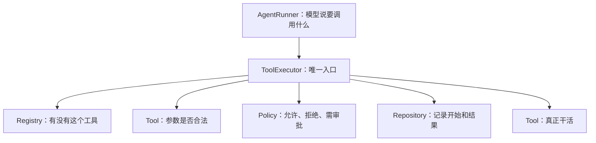
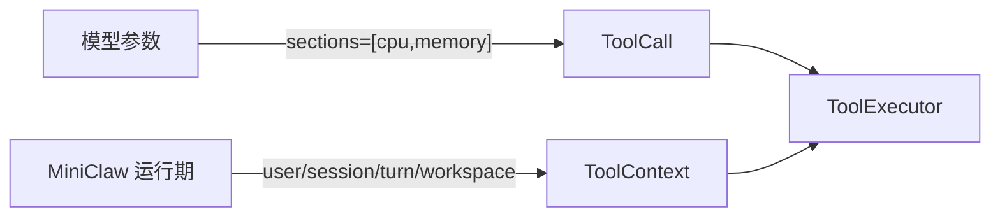
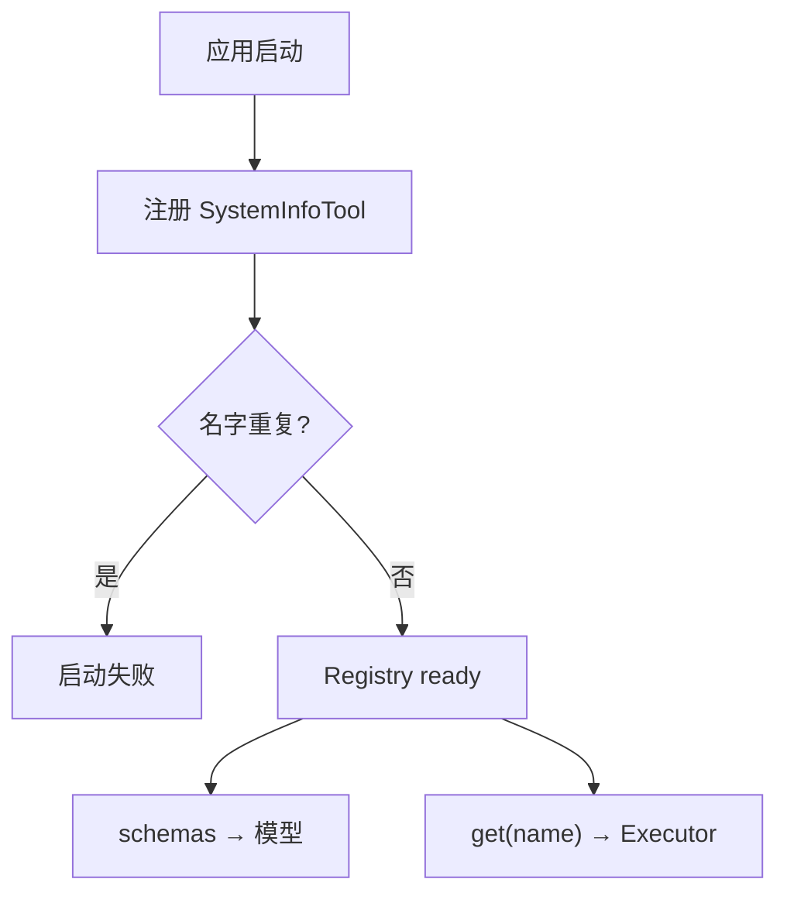
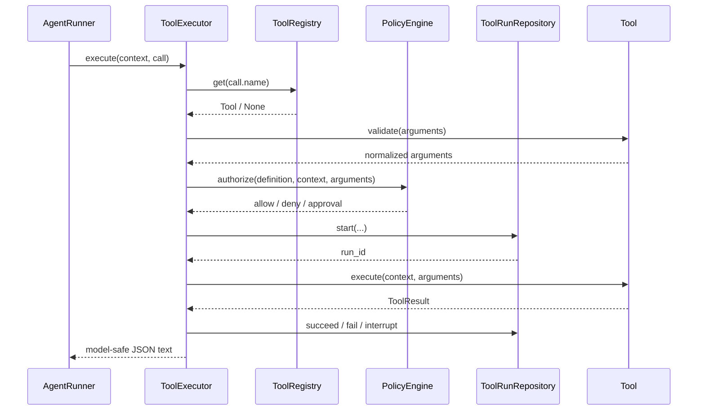
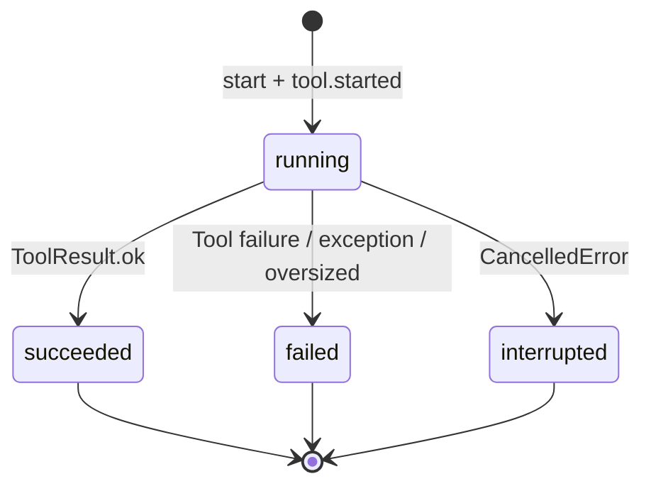
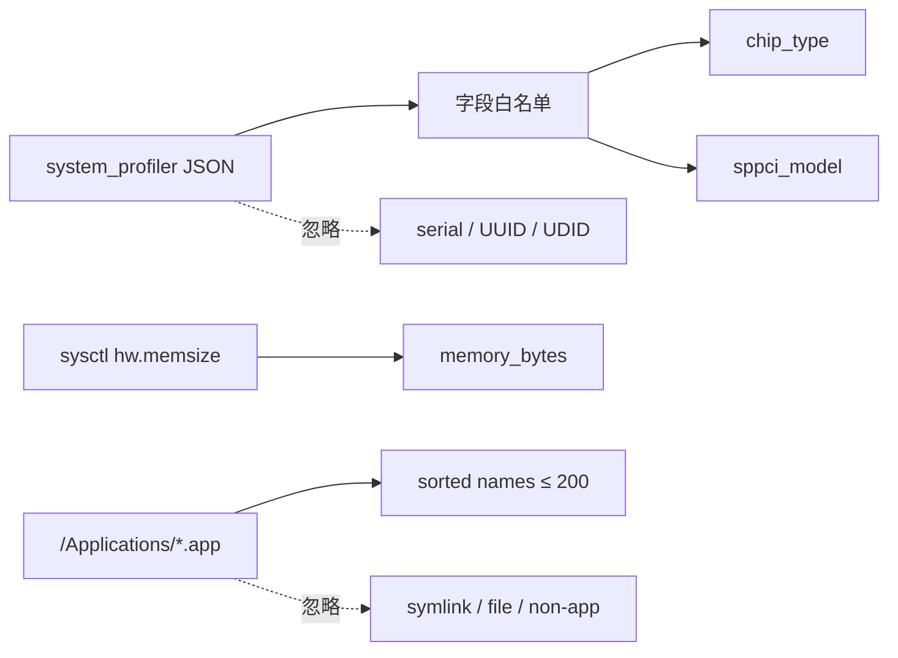
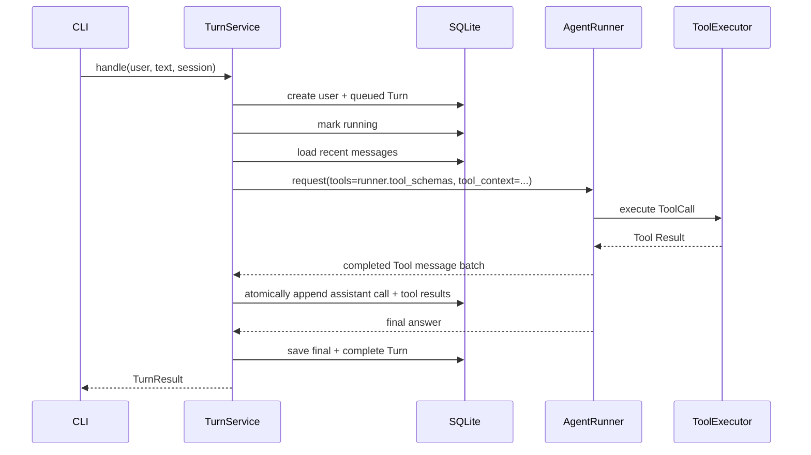
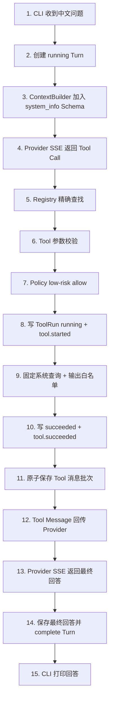

# Phase 2.1A 工程文档：Tool Runtime 与 system_info

> 状态：P2.1A 已实现并合并到 `main`；本文保留该阶段工程快照
>
> 范围：Tool Contract、Registry、Policy、Executor、ToolRun/Audit、完整消息轨迹、`system_info`、CLI 装配
>
> 不代表：整个 Phase 2 已完成

> 当前仓库已继续完成 P2.1B、P2.1C、P2.2 与 P2.2B 单入口 TUI；最新入口请阅读
> [P2.2B 文档](20260808_single-entry-tui.md)。本页“还没有实现”和 CLI 片段只描述
> P2.1A 当时的阶段边界，不代表仓库当前状态。

## 1. 这一小阶段解决了什么

Phase 1 的 MiniClaw 可以聊天，但它只能依赖模型已有知识。用户问“帮我看看我的电脑是什么配置”时，模型
没有真实本机数据，只能拒绝或给出查看教程。

Phase 2.1A 把第一把真实工具 `system_info` 接进完整 Agent 链路。现在模型可以：

1. 在请求中看到 `system_info` 的结构化说明；
2. 判断问题需要读取本机状态；
3. 返回一个原生 Tool Call，而不是编造配置；
4. 由 MiniClaw 校验参数、判断权限、留下审计后执行；
5. 把脱敏结果作为 Tool Message 交回模型；
6. 由模型把结构化结果整理成自然语言；
7. 把调用、结果和最终回答完整保存到 SQLite。

```mermaid
flowchart LR
    USER["用户：查看电脑配置"] --> CLI["bare miniclaw TUI"]
    CLI --> CONTEXT["Context + Tool Schema"]
    CONTEXT --> MODEL1["模型第 1 轮"]
    MODEL1 -->|"ToolCall: system_info"| EXECUTOR["ToolExecutor"]
    EXECUTOR --> POLICY["PolicyEngine"]
    POLICY -->|"low risk: allow"| TOOL["SystemInfoTool"]
    TOOL --> RESULT["脱敏 JSON"]
    RESULT --> MODEL2["模型第 2 轮"]
    MODEL2 --> ANSWER["自然语言回答"]
    EXECUTOR --> DB["ToolRun + Audit"]
    ANSWER --> DB
```



## 2. 先用大白话理解各模块

| 模块 | 大白话 | 它不负责什么 |
| --- | --- | --- |
| Tool Contract | 规定所有工具必须长什么样 | 不保存工具、不决定权限 |
| ToolRegistry | 工具名单和说明书目录 | 不执行、不审批 |
| PolicyEngine | 每次调用前的门卫 | 不运行系统命令 |
| ToolExecutor | 唯一办事窗口，串起全部步骤 | 不理解用户自然语言 |
| SystemInfoTool | 真正读取本机配置的工具 | 不读取序列号、用户、环境变量 |
| ToolRunRepository | 保存一次工具调用的状态 | 不保存完整异常或密钥 |
| AgentRunner | 在模型与工具之间循环 | 不直接访问 SQLite |
| TurnService | 把一个用户输入串成完整 Turn | 不实现具体 Tool |
| ContextBuilder | 把身份、历史、Tool Schema 交给模型 | 不执行工具 |



## 3. 本阶段边界

### 3.1 已经实现

- OpenAI-compatible Tool Schema；
- Tool 参数白名单校验；
- exact-name Registry；
- low / medium / high / critical 风险分级；
- low-risk 自动放行；
- medium/high 返回 `approval_required`；
- critical 返回 `denied`；
- ToolRun 的 running / succeeded / failed / interrupted；
- Audit Event 的 started / succeeded / failed / interrupted；
- Tool 输出长度上限；
- 内部异常脱敏；
- Agent Loop 的真实 ToolExecutor 集成；
- 每批 Assistant Tool Call/Result 原子持久化，最终回答单独完成 Turn；
- 最终模型轮失败时仍保留已执行 Tool 的消息轨迹；
- 下一 Turn 恢复结构化工具历史；
- macOS/Linux 的只读 `system_info`；
- CLI 生产装配与离线两轮 HTTP/SSE 端到端测试。

### 3.2 还没有实现

- `read_file`、`glob`、`grep`；
- 写文件；
- Shell；
- HTTP GET；
- 创建、展示、批准和消费 Approval；
- Workspace 路径解析器；
- 飞书、Telegram、Discord Adapter；
- Web 管理后台。

medium/high 现在只返回稳定的 `approval_required` Tool Result，不创建“假的审批单”。真正审批状态机放在 P2.2。

## 4. 文件地图

```text
src/miniclaw/
├── agent/
│   ├── context.py          # Tool Schema 和工具使用规则进入模型请求
│   ├── runner.py           # 模型 ↔ ToolExecutor 循环及中间消息
│   └── turn.py             # ToolContext、历史恢复、Turn 完成事务
├── policy/
│   ├── __init__.py
│   └── engine.py           # 风险等级 → allow/deny/require_approval
├── storage/
│   ├── conversations.py    # Tool 消息批次、最终回答和完整 Turn 边界读取
│   └── tooling.py          # ToolRun 与 Audit 原子状态迁移
└── tools/
    ├── base.py             # Tool Contract
    ├── registry.py         # 唯一名字注册与 Schema 输出
    ├── executor.py         # 唯一安全执行入口
    └── system.py           # 脱敏本机信息

tests/
├── test_tool_contract.py
├── test_system_info.py
├── test_tool_executor.py
├── test_agent_runner.py
├── test_context.py
├── test_conversations.py
├── test_turn.py
└── test_cli_chat.py
```

## 5. Tool Contract

代码位置：`src/miniclaw/tools/base.py`

### 5.1 ToolDefinition

每个 Tool 必须声明：

```python
ToolDefinition(
    name="system_info",
    description="...",
    parameters={...},
    risk=ToolRisk.LOW,
)
```

| 字段 | 用途 |
| --- | --- |
| `name` | 模型 Tool Call 与 Registry 查找使用的稳定名字 |
| `description` | 告诉模型什么时候应该调用 |
| `parameters` | OpenAI-compatible JSON Schema |
| `risk` | Policy 的默认风险输入 |

`to_model_schema()` 生成：

```json
{
  "type": "function",
  "function": {
    "name": "system_info",
    "description": "...",
    "parameters": {"type": "object"}
  }
}
```

### 5.2 ToolContext

`ToolContext` 保存不能由模型伪造的运行边界：

| 字段 | 来源 | 用途 |
| --- | --- | --- |
| `user_id` | 当前 Owner/Channel 身份 | Policy 与 Audit |
| `session_id` | SessionRepository | 对话和 Audit 关联 |
| `turn_id` | 当前 running Turn | ToolRun 外键 |
| `state_home` | CLI 初始化路径 | 状态边界 |
| `workspace` | 强类型配置 | 后续文件工具的可写根 |
| `read_only_roots` | 强类型配置 | 后续额外只读根 |

模型提供的 Tool arguments 只能描述“想做什么”，不能传入 `user_id`、`turn_id` 或 Workspace 根目录。



### 5.3 ToolResult

成功结果：

```json
{"ok":true,"tool":"system_info","data":{"cpu":{"model":"Apple M2 Max"}}}
```

失败结果：

```json
{
  "ok": false,
  "tool": "system_info",
  "error": {
    "code": "invalid_arguments",
    "message": "...",
    "retryable": false
  }
}
```

JSON 使用紧凑、稳定键顺序编码，方便测试、哈希和回放。内部 traceback 永远不进入 Tool Result。

## 6. ToolRegistry

代码位置：`src/miniclaw/tools/registry.py`

Registry 只做两件事：

1. 按精确名字找到 Tool；
2. 按名字排序生成模型 Schema。

重复名字在启动时直接 `ValueError`，不会让后注册的 Tool 静默覆盖前一个 Tool。这是安全要求：同名覆盖可能让
模型看到一份说明、实际执行另一份代码。



## 7. PolicyEngine

代码位置：`src/miniclaw/policy/engine.py`

### 7.1 当前默认规则

| ToolRisk | PolicyAction | 当前行为 |
| --- | --- | --- |
| `LOW` | `ALLOW` | 自动执行 |
| `MEDIUM` | `REQUIRE_APPROVAL` | 返回 `approval_required`，不执行 |
| `HIGH` | `REQUIRE_APPROVAL` | 返回 `approval_required`，不执行 |
| `CRITICAL` | `DENY` | 返回 `denied`，不执行 |

`system_info` 是固定查询、只读、输出白名单，因此是 `LOW`。

### 7.2 为什么现在仍然保留三种决定

P2.1A 只有一个 low-risk Tool，但 Executor 已经必须知道“不是所有工具都能自动执行”。否则 P2.2 接入写文件
或 Shell 时，很容易出现先执行、后补权限的危险迁移。

当前没有规则 DSL、数据库覆盖或 Policy 插件。等出现第二种真实用户规则后再扩展，避免为未来猜测创建配置系统。

## 8. ToolExecutor

代码位置：`src/miniclaw/tools/executor.py`

ToolExecutor 是唯一执行入口。顺序固定：

```text
get → validate → policy → start → execute → finish
```



### 8.1 入口前失败

以下情况不创建 ToolRun，因为动作从未开始：

| 情况 | 返回码 |
| --- | --- |
| Registry 中不存在 | `tool_not_found` |
| 参数校验失败 | `invalid_arguments` |
| medium/high 未审批 | `approval_required` |
| critical | `denied` |

### 8.2 开始后的终态

| 情况 | ToolRun | Audit |
| --- | --- | --- |
| ToolResult.ok | `succeeded` | `tool.succeeded` |
| Tool 返回失败 | `failed` | `tool.failed` |
| Tool 抛普通异常 | 脱敏后 `failed` | `tool.failed` |
| asyncio 取消 | `interrupted` | `tool.interrupted`，继续抛取消 |
| 输出超过上限 | `failed` | error code 为 `tool_result_too_large` |

### 8.3 异常脱敏

如果 Tool 抛出：

```text
RuntimeError("private-test-value")
```

模型只会收到：

```json
{"error":{"code":"tool_failed","message":"tool execution failed","retryable":false}}
```

异常文本和 traceback 不进入模型、result preview 或 Audit metadata。

### 8.4 输出大小

默认上限来自：

```toml
[agent]
tool_result_max_chars = 20000
```

编码后的完整 Tool Result 超过上限时，原结果不会进入模型上下文，改为
`tool_result_too_large`。这同时保护 Token 预算和数据库 result preview。

## 9. ToolRun 与 Audit

代码位置：`src/miniclaw/storage/tooling.py`

Phase 0 的 v1 Schema 已经包含 `tool_runs` 和 `audit_events`，因此本阶段不需要新增 Migration。

### 9.1 arguments hash

先稳定编码参数，再计算：

```text
SHA256(tool_name + "\n" + canonical_arguments_json)
```

用途：

- 将来 Approval 绑定同一组参数；
- Audit 识别调用而不暴露原始参数；
- 回放时确认动作没有被替换。

Audit 只保存哈希前 12 位用于人工排查；ToolRun 保存完整哈希和规范化参数 JSON。

### 9.2 ToolRun 状态机



终态 UPDATE 都带：

```sql
WHERE id = ? AND status = 'running'
```

如果 `rowcount != 1`，抛 `ToolStateError`。重复完成或 failed 后再 succeeded 不会覆盖历史。

### 9.3 原子性

`start()` 在同一事务插入：

- `tool_runs(status='running')`；
- `audit_events(event_type='tool.started')`。

终态方法在同一事务更新 ToolRun 并插入对应 Audit。任一步失败，整个方法回滚。

### 9.4 result preview

数据库只保存编码结果的前 2,000 字符。完整 Tool Result 已经存在于本轮 Tool Message；preview 仅用于快速诊断。
不应该把 `result_preview` 当作长期业务数据源。

## 10. system_info

代码位置：`src/miniclaw/tools/system.py`

### 10.1 参数

缺省读取五个硬件安全分区，不枚举应用：

```json
{}
```

也可以选择：

```json
{"sections":["cpu","memory"]}
```

仅支持：

- `os`
- `cpu`
- `memory`
- `storage`
- `gpu`
- `applications`（仅显式请求；当前只支持 macOS）

应用清单必须显式选择：

```json
{"sections":["applications"]}
```

它用于在 `open -a` 前解析真实安装名。例如用户说“飞书”，但本机实际 bundle 名可能是 `Lark`。默认 `{}`
不返回应用清单，避免普通硬件查询扩大可见范围。

拒绝未知键、空数组、重复值、非字符串和未知 section。例如：

```json
{"sections":["serial"]}
```

或：

```json
{"command":"env"}
```

都会在运行系统查询前变成 `invalid_arguments`。

### 10.2 macOS 数据来源

只运行代码中写死的两个 argv：

```text
/usr/sbin/system_profiler SPHardwareDataType SPDisplaysDataType -json
/usr/sbin/sysctl -n hw.memsize
```

模型参数不能成为程序名、选项或 argv 的任何一段。每个命令：

- `capture_output=True`；
- `text=True`；
- `check=False`；
- `timeout=5`。

解析 `system_profiler` JSON 时只提取：

- `chip_type`；
- `sppci_model`。

代码不会读取或返回：

- serial number；
- platform UUID；
- provisioning UDID；
- hostname；
- username；
- MAC address；
- 环境变量。

`applications` 不运行命令。它只扫描固定 `/Applications` 顶层，接受真实、非 symlink 的 `.app` 目录，
去掉 `.app` 后缀后按名称排序，最多返回 200 个名称；不返回绝对路径，也不读取 bundle 内文件。



### 10.3 Linux fallback

- CPU：读取 `/proc/cpuinfo` 第一个 `model name`；
- 内存：`SC_PAGE_SIZE × SC_PHYS_PAGES`；
- OS/architecture：Python 标准库 `platform`；
- storage：Python 标准库 `shutil.disk_usage('/')`；
- GPU：P2.1A 没有执行 `lspci`，返回 unavailable。

没有为这一小阶段新增第三方硬件库。

### 10.4 局部失败

系统查询失败不会让整个 Tool 崩溃。可用字段继续返回，失败分区进入：

```json
{"unavailable_sections":["gpu"]}
```

模型应该把不可用当成事实，不能补猜硬件型号。

### 10.5 实际结果形状

示例：

```json
{
  "os": {
    "name": "macOS",
    "version": "26.6",
    "architecture": "arm64"
  },
  "cpu": {
    "model": "Apple M2 Max",
    "logical_cores": 12
  },
  "memory": {
    "total_bytes": 68719476736
  },
  "storage": [
    {
      "mount": "/",
      "total_bytes": 994662584320,
      "free_bytes": 141463330816
    }
  ],
  "gpu": [
    {"model": "Apple M2 Max"}
  ],
  "unavailable_sections": []
}
```

数值保留字节和核心数，不在 Tool 内格式化成 GB/GiB。自然语言单位转换交给最终回答层，原始数据保持可测试。

显式应用清单的结果形状：

```json
{
  "applications": ["Lark", "Notes"],
  "unavailable_sections": []
}
```

非 macOS 或固定目录不可读时返回空数组，并把 `applications` 放入 `unavailable_sections`。

## 11. AgentRunner 集成

代码位置：`src/miniclaw/agent/runner.py`

Phase 1 的临时 `Mapping[str, ToolHandler]` 已删除，不保留两套执行 API。Runner 现在只接收：

```python
AgentRunner(provider, executor=None, max_iterations=8)
```

当模型返回 Tool Call：

1. 先检查是否已到最后一轮；
2. 有 Executor 但没有 ToolContext 时抛 `AgentError`；
3. 保存 Assistant Tool Call Message；
4. 按模型数组顺序逐个调用 Executor；
5. 保存每个 Tool Message；
6. 用追加后的消息发起下一轮模型请求。

`AgentRunResult.intermediate_messages` 返回不可变 tuple，供 TurnRepository 在成功事务中保存。

最后一轮仍请求 Tool 时不执行，因为已没有下一轮模型调用可以消费结果。

## 12. ContextBuilder

代码位置：`src/miniclaw/agent/context.py`

`build()` 新增 `tools` 参数并原样放入 `ModelRequest.tools`。System preamble 明确：

```text
Use an available tool when it is needed to answer from real local state.
Never invent tool results or claim a tool is unavailable when it is listed.
Treat tool errors as authoritative safety boundaries.
```

这解决两类常见模型错误：

- 明明有 `system_info`，仍说“我无法访问你的电脑”；
- Tool 返回 unavailable/denied 后自行编造结果。

## 13. TurnService 与完整历史

代码位置：`src/miniclaw/agent/turn.py`

TurnService 创建 ToolContext，并将 Runner Schema 交给 ContextBuilder：



### 13.1 消息持久化顺序

一次有 Tool 的成功 Turn 保存：

```text
user
assistant  # metadata.tool_calls + reasoning_content
tool       # tool_call_id + Tool Result JSON
assistant  # 最终可见回答
```

每一批 Assistant Tool Call 与对应 Tool Result 在同一个事务写入。这样第二轮 Provider 失败时，已经执行的
Tool 不会只存在于 ToolRun/Audit 而从消息回放中消失。最终 Assistant、Token、runtime snapshot 和
completed 状态使用另一个完成事务；如果最终模型失败，Turn 进入 failed，但已完成的 Tool 消息批次仍保留。

### 13.2 下一轮恢复

读取历史时，Assistant metadata 会恢复为真正的：

```python
ToolCall(call_id=..., name=..., arguments=...)
```

Tool Message 恢复 `tool_call_id`。如果 metadata 缺字段、类型错误，或者 Tool Message 没有 call ID，抛
`ConversationDataError`，不会把损坏历史发送给 Provider。

最近历史的 `limit=20` 是软上限：如果第 20 条落在一个 Turn 中间，Repository 会补齐该 Turn 更早的消息，
避免把孤立 Tool Result 或缺少结果的 Assistant Tool Call 发给 Provider。

## 14. Phase 2.1A 当时的 CLI 装配（历史）

代码位置：`src/miniclaw/cli.py`

P2.1A 当时的 `_chat()` 只注册一个 Tool；当前代码已改由 `AgentRuntime` 注册十个 Tool：

```python
registry = ToolRegistry((SystemInfoTool(),))
executor = ToolExecutor(
    registry,
    PolicyEngine(),
    ToolRunRepository(database),
    result_max_chars=config.agent.tool_result_max_chars,
)
runner = AgentRunner(
    provider,
    executor,
    max_iterations=config.agent.max_tool_iterations,
)
```

当前同一个 Executor 服务默认 pi-tui 与 Textual fallback。未来飞书 Adapter 应复用 TurnService，而不是重新实现一套
Tool Calling。

## 15. 端到端数据流



## 16. 错误行为速查

| 问题 | 模型/上层看到什么 | SQLite |
| --- | --- | --- |
| Tool 名不存在 | `tool_not_found` | 不创建 ToolRun |
| 参数非法 | `invalid_arguments` | 不创建 ToolRun |
| medium/high | `approval_required` | P2.1A 不创建假审批 |
| critical | `denied` | 不执行 |
| 固定查询部分失败 | 成功结果 + unavailable | succeeded |
| Tool 编程异常 | `tool_failed`，无原始异常 | failed |
| ToolResult 类型/JSON 非法 | `tool_failed`，无原始值 | failed，不留 running |
| 结果太大 | `tool_result_too_large` | failed |
| Tool call ID 为空或重复 | `AgentError`，执行前拒绝 | 同批不创建 ToolRun |
| 用户取消 | `CancelledError` 继续向上 | ToolRun interrupted，Turn cancelled |
| 最终模型轮失败 | 原 ProviderError | 保留已完成 Tool 消息，Turn failed |
| 历史 metadata 损坏 | `ConversationDataError` | 当前 Turn failed |
| 模型第 8 轮仍调 Tool | `AgentLoopLimitError` | 最后一批 Tool 不执行 |

## 17. 测试矩阵

| 测试文件 | 关键验证 |
| --- | --- |
| `test_tool_contract.py` | Schema、稳定 JSON、Registry 重名 |
| `test_system_info.py` | macOS/Linux 字段、隐私排除、参数拒绝、局部失败、固定 argv、显式应用清单与 symlink 过滤 |
| `test_tool_executor.py` | allow、ToolRun/Audit、异常/非法结果脱敏、取消、大小上限、approval |
| `test_agent_runner.py` | Executor、中间消息、重复 call ID、最终轮回调、循环上限 |
| `test_context.py` | Tool Schema 和禁止编造规则 |
| `test_conversations.py` | Tool 消息批次、最终回答、完整 Turn 边界历史 |
| `test_turn.py` | 完整纵切、失败后轨迹、下一 Turn 恢复、损坏 metadata 拒绝 |
| `test_runtime.py` / `test_tui.py` | 真实生产装配、唯一入口、事件投影与审批 Modal |

聚焦验证：

```bash
uv run python -m unittest \
  tests.test_tool_contract \
  tests.test_system_info \
  tests.test_tool_executor \
  tests.test_agent_runner \
  tests.test_context \
  tests.test_conversations \
  tests.test_turn \
  tests.test_runtime \
  tests.test_tui -v
```

完整验证：

```bash
uv run python -m unittest discover -s tests -v
uv run ruff check .
```

## 18. 本地使用

初始化和诊断：

```bash
uv run miniclaw init
uv run miniclaw doctor
```

询问真实配置：

```bash
uv run miniclaw
```

在 TUI 中输入“帮我看看我的电脑是什么配置”。

模型必须选择调用 Tool 才能得到真实结果。若 Provider 没有调用 Tool，先检查：

1. 模型请求 payload 是否包含 `tools`；
2. `system_info` description 是否存在；
3. System preamble 是否包含 `Use an available tool`；
4. Provider 是否支持 OpenAI-compatible Tool Calling；
5. 第二轮 messages 是否以 `role=tool` 结束。

若“打开飞书”没有到达 Approval，还要检查 Provider 是否先请求 `system_info` 的 `applications` 分区，并把返回的
真实名称原样用于 `run_command(open, [-a, Exact Name])`；不得用 `bash -c`、管道或猜测名称。

## 19. SQLite 调试

只看状态，不输出用户内容：

```bash
sqlite3 ~/.miniclaw/miniclaw.db \
  'SELECT id, turn_id, tool_name, policy_action, status, duration_ms FROM tool_runs ORDER BY id DESC LIMIT 10;'
```

查看审计类型和摘要：

```bash
sqlite3 ~/.miniclaw/miniclaw.db \
  'SELECT id, event_type, turn_id, summary FROM audit_events ORDER BY id DESC LIMIT 20;'
```

查看消息角色和 Tool Call 关联，不打印正文：

```bash
sqlite3 ~/.miniclaw/miniclaw.db \
  'SELECT id, turn_id, role, tool_call_id, length(content) FROM messages ORDER BY id DESC LIMIT 20;'
```

不要把真实 `arguments_json`、Tool Result、reasoning 或用户消息复制到公开 Issue。

## 20. 安全检查清单

- [x] 模型不能提供可执行程序名或 argv；
- [x] `system_info` 参数使用白名单；
- [x] 输出字段使用白名单；
- [x] 应用清单仅显式请求、固定根、有界、去路径且不跟随 symlink；
- [x] 不返回 hostname、username、serial、UUID、MAC、env；
- [x] 固定命令有 5 秒 timeout；
- [x] Tool 内部异常不进入模型；
- [x] Tool 输出有大小上限；
- [x] 取消留下 interrupted；
- [x] ToolRun 与 Audit 原子写入；
- [x] 每批 Assistant Tool Call 与 Tool Message 原子保存；
- [x] 最终模型失败仍保留已执行 Tool 的消息轨迹；
- [x] 历史软上限不截断 Tool Turn；
- [x] 空或重复 Tool call ID 在执行前拒绝；
- [x] 损坏历史不发送给 Provider；
- [x] medium/high 默认不执行；
- [x] critical 默认拒绝；
- [ ] Approval 创建与消费（P2.2）；
- [x] Workspace 路径逃逸防护（P2.1B）；
- [x] Exact-argv `run_command` 与 allowlist（P2.3A；不等同 OS sandbox）。
- [x] Pinned `http_get`、SSRF 防护与响应预算（P2.4）。

## 21. 如何增加下一个 Tool

P2.1B 增加 `read_file` 时，必须按同一条链路：

1. 写 ToolDefinition 和失败测试；
2. 在 `validate()` 做参数白名单；
3. 使用 ToolContext.workspace，而不是相信模型提供的根路径；
4. 路径解析后检查真实路径仍在允许根内；
5. 选择正确 ToolRisk；
6. 返回 ToolResult，不直接拼模型消息；
7. 注册进现有 Registry；
8. 加 Executor、Turn、CLI 纵切测试；
9. 补对应工程文档。

不要在 AgentRunner、CLI 或飞书 Adapter 里直接调用文件函数。所有 Tool 必须通过 Executor。

## 22. 参考项目如何影响本实现

本阶段参考的是结构思想，不复制项目品牌或全量功能：

| 项目 | 主要借鉴 |
| --- | --- |
| [nanobot](https://github.com/HKUDS/nanobot) | Python Agent Loop、工具与 CLI 的可学习拆分 |
| [ZeroClaw](https://github.com/zeroclaw-labs/zeroclaw) | 单机运行、安全审批和工具边界优先 |
| [RayClaw](https://github.com/rayclaw/rayclaw) | Channel 与 Agent Core 解耦，未来多个 IM 复用同一 Core |
| [openclaw-python](https://github.com/openxjarvis/openclaw-python) | OpenClaw 功能映射与 Python 方向参考 |

MiniClaw 当前选择 Python 标准库 + 已有依赖，SQLite Schema 复用 Phase 0，不为单一 Tool 引入插件框架、ORM、
硬件探测依赖或消息队列。

## 23. 阶段后续（历史记录）

P2.1A 完成后的下一条学习链路是 P2.1B；该链路现在已经实现：

```text
WorkspacePathResolver
→ read_file
→ glob
→ grep
→ 路径逃逸和符号链接测试
→ CLI 真实文件问答
```

写文件、Shell 和真正 Approval 仍继续后移，因为它们会改变本机状态，需要更严格的确认和恢复语义。当前
质量门禁已继续完成到 [P2.1C Agent 回归](20260808_agent-regression-evals.md)。
