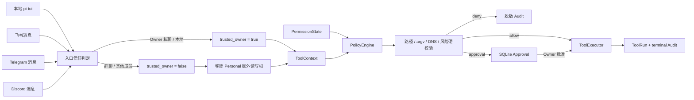
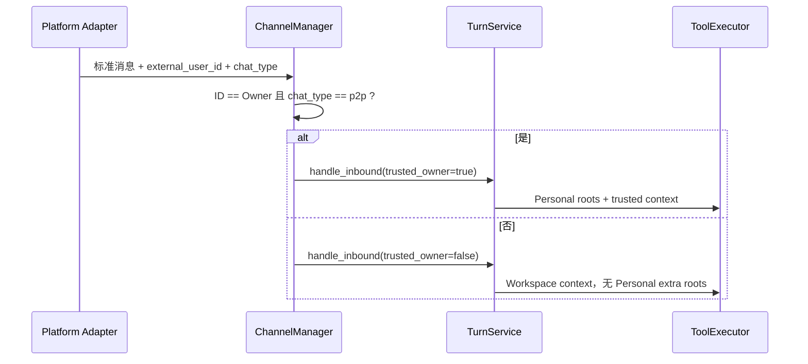

# Phase 2 工程文档：Autopilot 权限与紧凑审批 UI

> 状态：**IMPLEMENTATION PASS / FEISHU OWNER-DM DELIVERY VERIFIED / 15-CASE LIVE PENDING**；Autopilot 已通过离线发布门禁，完整真实 IM 验收仍需独立完成。
> 当前门禁：562 Python、30 TypeScript、29/29 Agent、32/32 Channel、640/640 local soak。
> 日期：2026-08-08  
> 适用版本：MiniClaw 0.1.0 之后的当前 `main`  
> 相关代码：`policy/modes.py`、`policy/engine.py`、`channels/manager.py`、`bridge/`、`tui/src/app.ts`

## 1. 先用大白话说明

以前 MiniClaw 即使确认了“这是我的电脑、这是我本人”，写文件、运行本机 CLI、访问网络时仍可能反复弹审批。
现在增加了四档权限模式。个人使用推荐 `autopilot`：只要消息来自本地 TUI 或经过验证的 Owner 私聊，已经通过
路径、命令和网络硬校验的动作可以自动执行。

“自动执行”不等于“关掉安全系统”。下面这些边界在 `yolo` 中也不能绕过：

- 不能读取 Keychain、浏览器登录库、私钥、`.env`、应用凭据和 MiniClaw 自身数据库；
- 不能用 `..`、符号链接或路径大小写技巧逃出允许根；
- 不能把一整段 Shell 字符串交给终端解释，`run_command` 仍只接受 `program + args[]`；
- 不能执行提权、硬禁止命令或访问内网、回环、云元数据等危险网络目标；
- 仍受超时、输入大小、输出大小和 Tool 迭代次数限制；
- 飞书、Telegram、Discord 的群聊和其他白名单成员不会继承 Owner 的 Personal 权限。

因此权限模型不是一个简单的“总开关”，而是两道门：

1. 入口是不是可信 Owner；
2. 动作是否通过确定性的安全校验。

只有两道门都通过，`autopilot` 才会减少审批。

## 2. 完整数据流



关键点是 `PermissionState` 只影响 Policy 的“自动执行还是审批”判断。路径解析、参数归一化和危险目标拒绝都发生
在模式放行之前，所以切到 `autopilot` 不会跳过 WorkspaceGuard、命令硬禁止或 SSRF 防护。

## 3. 四档模式

| 模式 | 推荐场景 | HTTPS GET | 未命中规则的安全命令 | 允许写根内的写入 | 硬拒绝 |
| --- | --- | --- | --- | --- | --- |
| `safe` | 调试、陌生环境、升级兼容 | 按旧规则决定 | 审批 | 审批 | 始终保留 |
| `smart` | 多读少写 | 校验通过后自动 | 审批，精确规则自动 | 审批 | 始终保留 |
| `autopilot` | 个人日常使用，推荐 | 自动 | 自动 | 自动 | 始终保留 |
| `yolo` | 显式 break-glass 状态 | 自动 | 自动 | 自动 | 始终保留 |

当前十个 Tool 下，`autopilot` 和 `yolo` 的执行结果相同。保留两个状态是为了未来新增更高风险 Tool 时能继续区分
“推荐自动化”和“我明确接受更高风险”。TUI 对 `yolo` 使用红色徽标，不把它伪装成普通状态。

只读低风险 Tool 仍会自动运行。表中的自动化只对 `trusted_owner=true` 有效；不可信入口即使进程处于 `yolo`，也
不会获得 Personal 额外根或自动执行权限。

## 4. 哪些入口算可信 Owner

| 入口 | 必须同时满足 | 可信自动化 |
| --- | --- | --- |
| 本地 pi-tui | 由本机 Python Bridge 绑定 SQLite Owner | 是 |
| 飞书 | `external_user_id` 等于配置 Owner，且 `chat_type=p2p` | 是 |
| Telegram | numeric user ID 等于配置 Owner，且是私聊 | 是 |
| Discord | numeric author ID 等于配置 Owner，且是 DM | 是 |
| Owner 在群聊发言 | 即使 ID 相同，也不是私聊 | 否 |
| 其他白名单成员 | 只通过 Admission，不等于 Owner | 否 |

ChannelManager 不使用模型猜测身份，也不相信消息正文中的“我是 Owner”。平台 Adapter 完成签名/结构解析后，Manager
使用标准化的外部用户 ID 和 chat type 计算 `trusted_owner`。其他成员仍可对话和使用安全 Workspace 能力，但
`TurnService` 会把 Personal `read_only_roots`、`write_roots` 和 `owner_home` 从 ToolContext 中移除。



## 5. 配置与启动默认值

新初始化的 Personal 配置明确包含：

```toml
[tools]
mode = "autopilot"
```

旧配置如果没有 `mode`，会按 `autopilot` 加载，与新安装默认值一致；显式配置的 `safe`/`smart` 不变。Autopilot
仍只对本地入口和经过验证的 Owner 私聊生效，群聊、其他用户、敏感路径和硬拒绝不会扩权。要让每次新进程都以某模式
启动，应编辑私密状态目录中的 `config.toml`，然后重启 MiniClaw。有效值只能是：

```text
safe  smart  autopilot  yolo
```

未知值会在联网和 Tool 执行前作为配置错误失败。`security` 和 `ask` 暂时保留，供 `safe` 模式兼容既有 exact
command/network rule；新功能应优先以 `mode` 表达整体监督级别。

## 6. 运行时切换

在 pi-tui 输入：

```text
/permissions
/permissions safe
/permissions smart
/permissions autopilot
/permissions yolo
```

第一条只查询当前模式，其余命令通过 versioned NDJSON 发给 Python Core：

```json
{"v":1,"id":"ui-7","type":"permissions.set","payload":{"mode":"autopilot"}}
```

Core 是唯一真相源。TUI 不会只改一个颜色假装切换成功；它必须收到 Core 的 `response.ok` 后才更新顶栏。

运行中的 Turn 或待处理 Approval 存在时，Core 返回 `permissions_busy`，当前模式保持不变。这能避免一个 Turn 的前半段
按 `safe`、后半段突然按 `autopilot` 执行。动态切换只影响当前进程；重启后重新读取 `config.toml`。

三个 IM 也支持相同 `/permissions` 文本命令，但只允许 Owner 私聊。群聊和其他成员会收到稳定拒绝提示，命令不会
进入 Provider，不消耗模型 Token。

## 7. TUI 如何显示

Bridge 握手返回 `permission_mode`。pi-tui 顶栏常驻显示：

```text
MiniClaw 0.1.0 · deepseek-v4-pro · 会话 default · 工作区 workspace · [AUTOPILOT]
```

颜色含义：

- `SAFE`：绿色；
- `SMART`：青色；
- `AUTOPILOT`：琥珀色；
- `YOLO`：红色。

`/status` 也会输出当前模式，`/help` 会列出 `/permissions`。顶栏仍保持一行，在窄终端中按可见宽度截断，不会
把输入区挤下去。

## 8. 紧凑审批框

即使使用 `autopilot`，硬边界或不可信入口仍可能产生审批，所以审批 UI 不能被删掉。旧实现一次性渲染全部 JSON，
外层 Overlay 再从底部裁剪，导致真正重要的按钮消失。新实现先计算固定头尾，再只给参数区分配滚动窗口：

```text
┌─ 审批 #7 · run_command ───────────────────────────┐
│ 详情 1-8/83 · ↑↓ / PgUp PgDn                     │
│ run lark-cli                                       │
│ {                                                  │
│   "program": "/usr/local/bin/lark-cli",          │
│   "args": [                                       │
│     "doc",                                        │
│     "list"                                        │
│ 注意：当前用户身份执行，可读当前用户可访问的文件。 │
│ [1 拒绝] [2 仅一次] [3 本次运行] [4 始终允许]      │
└────────────────────────────────────────────────────┘
```

布局约束：

- 最大 84 列、18 行；小终端使用 `columns - 4` 和 `rows - 2`；
- 标题、命令风险提示、Core 授权的选择和底边始终可见；
- 只有 summary/arguments 详情滚动；
- `↑/↓` 移动一行，`PageUp/PageDown` 移动一页，`Home/End` 到首尾；
- `1/2/3/4` 对应拒绝、仅一次、本次运行、始终允许，`Esc` 等价于拒绝；
- TUI 只显示 Core `grant_modes` 提供的按钮，不能自行扩大授权范围。

文件写入在 `safe`/`smart` 下仍只支持 Once；exact argv 和 exact hostname 可以由 Core 提供 Session/Always。
`autopilot` 对可信 Owner 在硬校验通过后通常不会创建这些低于 critical 的审批。

## 9. 审计与排查

模式变化写入 `audit_events` 的 `policy.mode_changed`。metadata 只包含：

```json
{"current_mode":"autopilot","previous_mode":"safe","source":"cli"}
```

不会写平台用户 ID、消息正文、完整参数或凭据。可以只读查询最近记录：

```bash
sqlite3 ~/.miniclaw/miniclaw.db \
  "SELECT created_at, event_type, metadata_json FROM audit_events WHERE event_type = 'policy.mode_changed' ORDER BY id DESC LIMIT 20;"
```

Tool 运行仍使用 `tool.started`、`tool.succeeded`、`tool.failed`、`tool.denied`。Policy hard deny 不会创建一个假的
running ToolRun，但会先写脱敏拒绝 Audit；Audit 写入失败时动作 fail closed。

常见问题：

| 现象 | 原因 | 处理 |
| --- | --- | --- |
| 顶栏仍显示 SAFE | 旧配置没有 `tools.mode`，或动态切换失败 | 输入 `/permissions`；检查配置值并重启 |
| `/permissions` 返回 busy | 当前 Turn 或 Approval 未结束 | 先等待、取消 Turn 或处理审批 |
| Owner 群聊仍要审批 | 群聊按设计不是 trusted Owner | 改用 Owner 私聊或本地 TUI |
| 其他白名单成员读不到 Home | Personal extra roots 被主动移除 | 这是安全边界；把协作文件放入 Workspace |
| Autopilot 仍拒绝某路径 | 命中了敏感路径或逃逸硬规则 | 不要放宽模式；改用非敏感路径 |
| 切换后重启又变回去 | `/permissions` 只改进程状态 | 修改 `[tools].mode` 作为启动默认值 |
| 审批详情很长 | 参数区可滚动，不再撑大 Overlay | 使用 PgUp/PgDn 或 Home/End |

## 10. 回滚

最小回滚不需要删数据库或规则。在 TUI 输入：

```text
/permissions safe
```

如果希望重启后也保持 safe，把配置改成：

```toml
[tools]
mode = "safe"
```

然后重启。不要删除 `audit_events`、`tool_runs` 或 `approvals`，这些记录用于解释过去发生了什么。

## 11. 回归测试矩阵

| 层 | 覆盖重点 | 当前证据 |
| --- | --- | --- |
| Python Policy | 四档状态表、trusted/untrusted、hard deny、审计失败关闭 | 全量 Python 562/562 |
| Channel | Owner 私聊、Owner 群聊、其他白名单、命令绕过模型 | 32/32 deterministic cases |
| Bridge | 精确枚举、握手、idle 切换、busy 拒绝、真实子进程 | Python/Node bridge tests |
| pi-tui | 状态徽标、slash command、80×24 长审批、滚动与按钮常驻 | TypeScript 30/30 |
| 既有稳定性 | 250,000 字符粘贴、鼠标选择、streaming、草稿恢复 | TypeScript 回归继续通过 |
| Soak | 三平台 deterministic channel suite 重复 20 次 | 640/640 |

发布前运行：

```bash
.venv/bin/python -m unittest discover -s tests -v
pnpm --dir tui test
.venv/bin/ruff check --no-cache .
.venv/bin/miniclaw eval run --suite channel --root evals/scenarios
.venv/bin/miniclaw eval run --suite channel --repeat 20 --json --root evals/scenarios
.venv/bin/python scripts/validate_docs.py
git diff --check
```

离线门禁证明本地代码、协议和确定性平台夹具一致；它不冒充飞书、Telegram、Discord 的真实账号权限和网络验收。

## 12. 仍未做的事

- 不把运行时模式自动写回 `config.toml`；
- 不允许模型自行改变权限模式；
- 不使用第二个模型判断命令风险；
- 不取消敏感路径、exact argv、SSRF、超时和大小边界；
- 不把 Autopilot 开给群聊、Webhook 或未验证身份；
- 不因为离线测试通过就声明三个 IM 已 production verified。

设计取舍和实现步骤分别保存在
[Autopilot 设计规格](../../superpowers/specs/2026-08-08-autopilot-permissions-and-approval-ui-design.md)与
[实施计划](../../superpowers/plans/2026-08-08-autopilot-permissions-and-approval-ui.md)。
