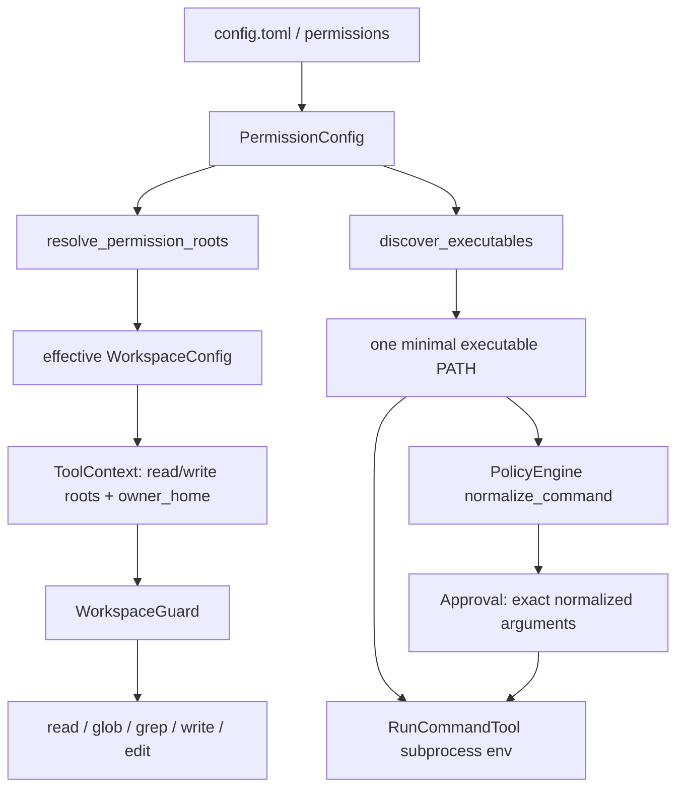
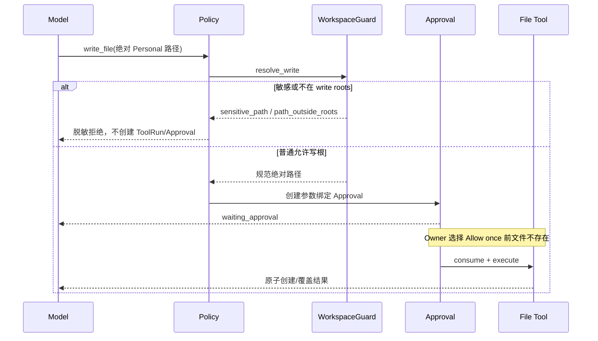

# Phase 2.3B：Personal Machine 权限与本机 CLI 发现

> 文档性质：`CURRENT` 能力说明；v0.4.1 表格保留首次 release 状态，后续真实 smoke 单独标注。

## 1. 这次解决了什么

以前 Lobster0 只认识一个 Workspace，也只在一条固定系统 `PATH` 里找命令。因此即使 Mac 上已经安装
`lark-cli`，只要它位于 NVM 目录，Agent 仍会说“找不到”；即使 Owner 想读取自己的普通文档，文件 Tool
也会返回 `workspace_escape`。

Phase 2.3B 增加了一个显式的 `personal` 权限 Profile：

- 普通个人文件可通过文件 Tool 读取；
- Documents、Downloads、Desktop 和常见项目目录可在审批后写入；
- NVM、uv、pnpm、`~/.local/bin` 等用户 CLI 可以被确定性发现；
- `run_command` 仍不经过 Shell，仍使用 exact argv 和参数绑定审批；
- Keychain、浏览器登录数据、1Password、云凭据、私钥和 Lobster0 状态仍硬拒绝；
- 旧配置没有 `[permissions]` 时继续保持 `workspace`，升级不会静默扩大权限。

一句大白话：Lobster0 现在更像真正的个人 Agent，但不是“把整台电脑无条件交给模型”。读取范围扩大了，
写入与执行仍由 Owner 看过参数后决定。

## 2. 当前状态

| 项目 | 状态 |
| --- | --- |
| `workspace` 兼容 Profile | 已实现 |
| `personal` Profile | 已实现 |
| Home / Applications / Homebrew 普通文件读取 | 已实现 |
| Documents / Downloads / Desktop / 项目目录受控写入 | 已实现 |
| NVM / uv / pnpm / local / cargo / bun CLI 发现 | 已实现 |
| `lark-cli` wrapper + `env node` 离线纵切 | 已实现 |
| 命令审批中的 OS 权限提示 | 已实现，中英文 |
| Personal 回归场景 | 4 条，28/28 offline gate |
| 当前用户 `lark-cli auth status --verify` | 已验证；不代表所有业务 Scope 均可用 |
| direct read-only Drive search | 已验证；真实文档标题和内容不进入仓库证据 |
| OS 级 sandbox / 容器隔离 | 尚未实现 |

## 3. 两个 Profile

| Profile | 适用场景 | 读取 | 写入 | 用户 CLI |
| --- | --- | --- | --- | --- |
| `workspace` | CI、容器、旧配置、最小权限 | Workspace + 旧 `[workspace].read_only_roots` | 仅 Workspace | 仅系统最小 PATH |
| `personal` | Owner 自己的 Mac、本地个人 Agent | Workspace + Home + 存在的公共应用/工具根 | Workspace + 明确写根 | 系统根 + 显式根 + 已知用户安装器目录 |

`personal` 是新初始化配置的默认值。旧的 `~/.lobster0/config.toml` 不会被 `init` 覆盖，所以必须由 Owner
手工加入 `[permissions]` 才会启用。

## 4. 权限矩阵

| 动作 | 默认行为 | 是否审批 | 是否可 Session / Always |
| --- | --- | --- | --- |
| 读取普通 Workspace 文件 | 允许 | 否 | 不适用 |
| 读取普通 Home 文件 | `personal` 允许 | 否 | 不适用 |
| 读取 Keychain / 浏览器登录数据 / 私钥 | 硬拒绝 | 不生成审批 | 否 |
| 写 Workspace | 等待审批 | 是 | 仅 Allow once |
| 写 Documents 等写根 | 等待审批 | 是 | 仅 Allow once |
| 写 Home 其他位置 | 拒绝 | 不生成审批 | 否 |
| 调用安全本机 CLI | exact rule 命中则允许，否则审批 | 视规则而定 | Core 可提供 Session / Always |
| Shell、删除、提权、上传、包安装 | 硬拒绝 | 不生成审批 | 否 |

文件写入不提供 Always，是为了避免一次批准变成长期任意改文件。命令 Always 也只保存“解析后的程序绝对路径
与完整 argv”，多一个参数、换一个二进制路径或 inline AppleScript 都不会复用。

## 5. 运行时架构



关键约束是“只解析一次边界，然后同时注入 Policy 和执行器”。不能出现 Policy 在 A 路径批准 `lark-cli`，
执行器又用另一条 PATH 找到 B 路径的情况。

## 6. 文件读取和写入流程



模型看到的 Personal 路径使用 `home/Documents/...` 等稳定标签，不包含真实用户名。Workspace 内仍显示原有
相对路径，兼容旧 Tool 输出与测试。

## 7. 默认 Roots

`personal` Profile 在目录真实存在时使用：

### Read roots

1. Owner Home；
2. `/Applications`（仅 macOS）；
3. `/opt/homebrew`（仅 macOS）；
4. `/usr/local`（仅 macOS）；
5. `[permissions].read_roots` 中的显式真实目录。

### Write roots

默认写根与平台无关，macOS 与 Linux 使用同一份清单：`Desktop`/`Documents`/`Downloads`
正是 Linux `xdg-user-dirs` 的默认英文名，`PycharmProjects`/`WebstormProjects` 是
JetBrains 在各平台相同的默认目录。

1. `~/Desktop`；
2. `~/Documents`；
3. `~/Downloads`；
4. `~/PycharmProjects`；
5. `~/WebstormProjects`；
6. `[permissions].write_roots` 中的显式真实目录。

不存在的默认目录会跳过。Root 必须是绝对、存在、真实目录；相对目录、文件、重复项和 symlink root 会在配置
边界被拒绝。

## 8. 敏感路径硬拒绝

以下是明确类别，不是完整文件名清单：

- `.ssh`、`.aws`、`.gnupg`、`.kube`；
- `.env*`、`.netrc`、`.npmrc`、`.git-credentials`、`.pypirc`；
- `credentials.json`、Token/Secret 文件、PEM/KEY/P12/PFX/JKS/keystore；
- macOS `Library/Keychains`；
- Safari、Chrome、Chromium、Firefox 用户档案；
- 1Password、Slack、Discord、Lark/Feishu Application Support 数据；
- `.local/share/keyrings`、`.config/gcloud`、`.config/lark-cli`；
- Lobster0 config、SQLite、WAL/SHM/journal 和日志；
- `/etc/shadow`、sudoers、Docker/container runtime socket。

Guard 会对模型给出的逻辑路径和 symlink 解析后的真实路径各检查一次。模型 Prompt 也明确规定：收到
`sensitive_path` 后不得改用 `run_command`、`cat`、Python 或其他 Tool 绕过。

## 9. 本机 CLI 发现

发现器不启动登录 Shell、不读取 `.zshrc`，只枚举固定目录：

1. 系统：`/usr/bin`、`/bin`、`/usr/sbin`、`/sbin`；
2. macOS：`/opt/homebrew/bin`、`/usr/local/bin`；
3. `[permissions].executable_roots`；
4. `~/.config/nvm/versions/node/*/bin`；
5. `~/.nvm/versions/node/*/bin`；
6. `~/.local/share/uv/tools/*/bin`；
7. `~/.local/share/pnpm`、`~/Library/pnpm`、`~/.local/bin`；
8. `~/.cargo/bin`、`~/.bun/bin`。

Root 按稳定顺序去重。用户发现 Root 含 symlink 组件时跳过；显式非法 Root 则配置失败。裸命令使用
`shutil.which(..., path=discovered_path)` 解析，最终 Approval 绑定解析后的真实 executable 和完整 argv。

## 10. 最小子进程环境

Personal 命令只收到：

```text
PATH=<发现后的稳定 PATH>
HOME=<Owner Home>
LANG=C.UTF-8
LC_ALL=C.UTF-8
LARKSUITE_CLI_NO_UPDATE_NOTIFIER=1
LARKSUITE_CLI_NO_SKILLS_NOTIFIER=1
```

Workspace Profile 不提供 `HOME`。模型 API Key、飞书 App Secret、代理、Cookie、`PYTHONPATH` 和父进程其他
变量不会继承。`cwd` 仍固定为 Workspace，stdin 固定 EOF，stdout/stderr 各最多保留 1 MiB，超时会终止整个
独立进程组。

## 11. TUI 审批提示

`run_command` 的 pi-tui Approval 会额外显示：

> 注意：该程序将以当前用户身份运行，并可能读取当前用户可访问的文件。

英文界面显示等价英文。提示不改变 Core 发布的 `grant_modes`，也不会让文件写入获得 Session/Always。

## 12. 配置与迁移

新初始化环境已经包含：

```toml
[permissions]
profile = "personal"
read_roots = []
write_roots = []
executable_roots = []
discover_user_executables = true
```

旧配置想启用 Personal，手工把上述 section 加到 `~/.lobster0/config.toml`，然后运行：

```bash
chmod 600 ~/.lobster0/config.toml
uv run lobster0 doctor
```

想恢复最小权限：

```toml
[permissions]
profile = "workspace"
read_roots = []
write_roots = []
executable_roots = []
discover_user_executables = false
```

修改后必须完全退出并重启 Lobster0；Session 授权也会随 Runtime 结束而清空。

## 13. Doctor

`lobster0 doctor` 现在固定 15 项，新增：

- `personal_permissions`：只显示 Profile、read root 数和 write root 数；
- `executables`：只显示 executable root 数和 `lark-cli available/unavailable`。

Doctor 不输出 Home、完整 PATH、Token 或认证内容，也不执行 `lark-cli`、不联网、不修改配置。

## 14. 稳定错误码

| 错误码 | 含义 | 用户动作 |
| --- | --- | --- |
| `path_outside_roots` | Personal 路径不在配置读/写根 | 调整请求或显式配置 Root |
| `workspace_escape` | 旧 Workspace Profile 发生逃逸 | 把文件放入 Workspace 或启用 Personal |
| `sensitive_path` | 命中硬拒绝凭据/会话/状态路径 | 不可审批，不应绕过 |
| `read_only_path` | 旧只读 Root 被请求写入 | 使用 Workspace 或 Personal write root |
| `symlink_path` | 写路径包含 symlink | 使用真实目录路径 |
| `parent_not_found` | 写目标父目录不存在 | Owner 先创建目录 |
| `command_not_found` | 可信 PATH 中没有 executable | 用 doctor 检查；配置 executable root |
| `command_forbidden` | Shell/删除/提权等硬禁止 | 不可审批；改用受限 Tool |
| `approval_required` | 安全动作需要 Owner 决策 | 在 TUI 检查参数后选择范围 |

## 15. 代码地图

| 模块 | 职责 |
| --- | --- |
| `config.py` | `PermissionConfig`、严格 Root 校验、默认 Root 解析 |
| `policy/executables.py` | 系统/NVM/uv/pnpm 等可信 PATH 发现 |
| `policy/workspace.py` | 多读取根、多写根、敏感路径和展示标签 |
| `policy/command.py` | 使用注入 PATH 解析 executable、硬禁止与 exact argv |
| `runtime.py` | 构造唯一 effective Workspace 和 executable environment |
| `tools/command.py` | 最小环境、直接进程、输出/超时边界 |
| `doctor.py` | 15 项只读诊断 |
| `tui/src/components/approval.ts` | 双语当前用户权限提示 |
| `evals/scenarios/personal.v1.jsonl` | 4 条 Personal 纵切回归 |

## 16. 测试证据

本阶段新增并通过：

- Root/Profile 配置与向后兼容；
- Home 读取、外部拒绝、路径标签脱敏；
- 外部写入批准前无副作用、Allow once 后原子创建；
- Keychain、浏览器、密码管理器与应用会话拒绝；
- NVM、uv、pnpm、local/cargo/bun 发现与 symlink fail closed；
- fake `lark-cli` 的 `#!/usr/bin/env node` 最小 PATH 启动；
- Runtime 同一 PATH 注入 Policy 和 Tool；
- Doctor 不泄露 Home/PATH；
- pi-tui 中英文审批提示和终端宽度；
- `FILES-PERSONAL-READ-001`；
- `FILES-PERSONAL-WRITE-APPROVAL-001`；
- `CLI-DISCOVERY-LARK-001`；
- `CLI-SENSITIVE-DENY-001`。

阶段门禁目标：412 项 Python、27 项 TypeScript、28/28 offline Agent、12/12 Channel、Ruff 和
`git diff --check` 全部通过。最终数字以同分支完成门禁的输出为准。

## 17. 已知边界

- 这不是 OS sandbox。获批程序以当前 Owner 身份运行，可能访问该用户能访问的文件；
- 对 executable 的批准绑定路径和 argv，尚未绑定文件内容哈希；获批后二进制被替换属于后续加固项；
- 文件边界有 symlink 与真实路径复验，但无法完全消除所有 TOCTOU；
- 不支持 Shell 字符串、管道、重定向或命令替换；复杂飞书动作应使用明确 CLI argv 或专用 Skill/Tool；
- `lark-cli --version` 只证明本机发现和启动，不证明飞书认证、Scope 或企业权限；
- Telegram/Discord、Docker 隔离和受控自我迭代不属于本阶段。

## 18. 调试清单

```bash
uv run lobster0 doctor
uv run lobster0
# TUI 中输入：调用本机 lark-cli 查看版本

uv run python -m unittest tests.test_executable_discovery tests.test_run_command -v
uv run python -m unittest tests.test_workspace_policy tests.test_tool_executor -v
corepack pnpm --dir tui test
uv run lobster0 eval run --suite offline --root evals/scenarios
```

如果 Doctor 显示 `lark-cli unavailable`：

1. 在你自己的终端执行 `command -v lark-cli`；
2. 确认安装目录属于上述发现规则；
3. 特殊目录写入 `[permissions].executable_roots`；
4. 确认 Root 不是 symlink，且目录真实存在；
5. 完全重启 Lobster0，再运行 Doctor。
