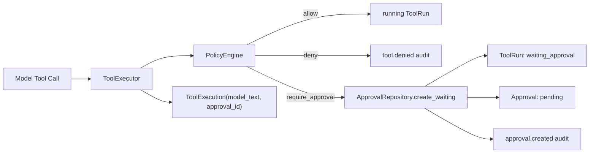
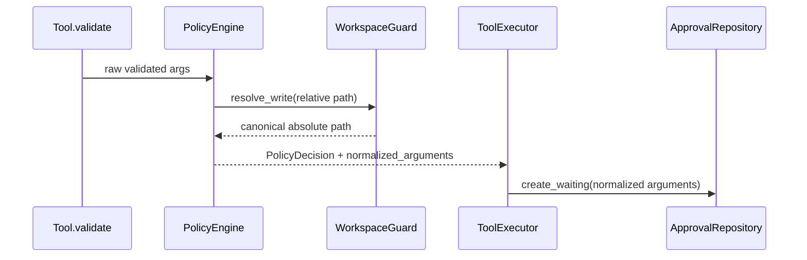
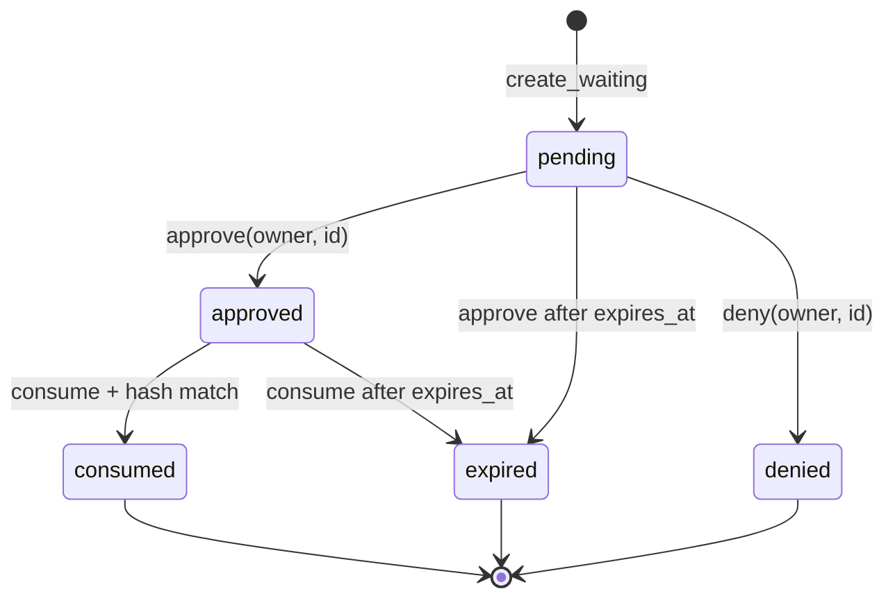
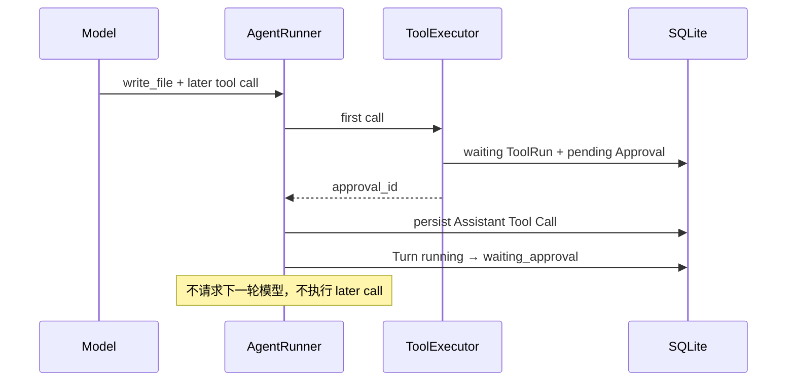
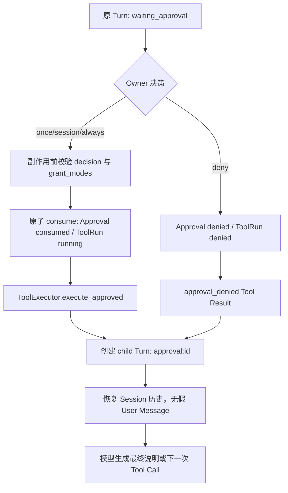
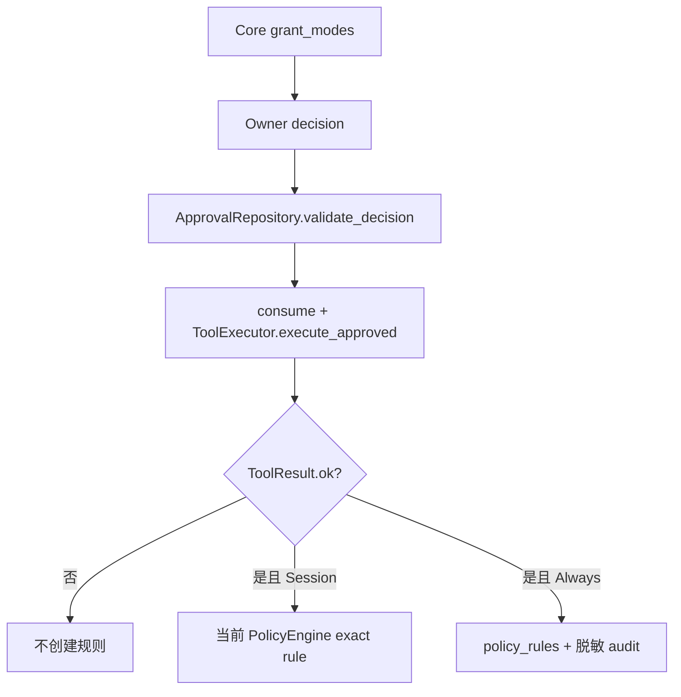

# Phase 2.2 工程文档：参数绑定 Approval 与跨进程续执行

> 状态：参数哈希、waiting Turn、approve/deny、child Turn、单次执行和 Textual TUI 已进入生产链路
>
> 当前门禁：273/273 tests、21/21 offline Agent cases、Ruff PASS
>
> 当前非目标：持久规则的 TUI 查看/撤销；飞书卡片审批不在本阶段

Phase 2.2B 已移除独立 `miniclaw approvals` 命令。Owner 现在在同一个 TUI 中查看完整归一化参数，并选择
Allow once、受限的 Allow this session / Always allow 或 Deny；底层 SQLite 生命周期和本文安全约束不变。

## 1. 大白话解释

Approval 不是一句“我同意 Agent 写文件”。它更像一张只对一次具体操作有效的电子签字单：

```text
工具名：write_file
目标：note.txt
内容和 overwrite：已经参与 hash，但不会显示在 Audit
有效期：10 分钟
次数：只能消费一次
```

只要工具名或任一参数变化，原签字就不能使用。状态全部在 SQLite，不依赖某个 Python 进程一直活着。

## 2. 当前链路



`ToolExecutor.execute()` 不再返回一个无法携带业务状态的裸字符串，而是：

```python
@dataclass(frozen=True, slots=True)
class ToolExecution:
    model_text: str
    approval_id: int | None = None
    succeeded: bool = False
```

普通 allow/deny 的 `approval_id` 是 `None`。只有真实写入 SQLite 的 waiting Approval 才返回 ID。

## 3. 为什么使用 SQLite，而不是内存等待

内存 ApprovalManager 有三个问题：

1. CLI 进程退出后审批丢失；
2. 未来飞书消息可能由另一个进程生命周期处理；
3. 两个批准请求可能同时执行同一副作用。

当前实现直接复用 Schema v1 的 `tool_runs`、`approvals`、`audit_events`，没有新增 migration、轮询线程或
busy-wait。重启后创建新的 `ApprovalRepository` 仍能查询同一条 pending 记录。

## 4. Canonical JSON 与 hash

完整规则：

- 对象键字典序；
- UTF-8，不转义中文；
- 紧凑分隔符；
- 只允许标准 JSON，拒绝 NaN/Infinity；
- Policy 先把文件路径解析成规范绝对路径；
- SHA-256 输入包含 Tool 名。

```text
canonical_json = {"content":"hello","overwrite":false,"path":"/safe/workspace/note.txt"}
hash_input = "write_file\n" + canonical_json
arguments_hash = sha256(hash_input)
```

因此：

- 参数键顺序不同，hash 相同；
- 内容、路径、overwrite 任一个变化，hash 不同；
- 同一参数从 `write_file` 换成 `edit_file`，hash 不同；
- 数据库中的 `arguments_json` 被修改但 hash 没同步，消费返回 `hash_mismatch`。

## 5. Policy 参数规范化



Assistant 的原始 Tool Call 仍保留模型参数；本机加密边界内的 ToolRun 保存规范参数，供续执行和签名校验。
Audit 只保存 hash 前 12 位，不保存路径、content 或完整参数 JSON。

## 6. 创建事务

`ApprovalRepository.create_waiting()` 在同一个 SQLite 事务执行：

1. 插入 `tool_runs(status='waiting_approval', policy_action='require_approval')`；
2. 插入 `approvals(status='pending', expires_at=now+ttl)`；
3. 插入 `approval.created` 审计；
4. 返回不可变 `StoredApproval`。

任何一条 SQL 失败，三条记录一起回滚。Tool 尚未执行，因此不会出现“文件写了但审批没保存”。

## 7. 状态机



Phase 2.2 已验证的迁移：

| Approval 迁移 | 绑定 ToolRun 迁移 | 条件 |
| --- | --- | --- |
| 新建为 `pending` | 新建为 `waiting_approval` | Policy 返回 require approval |
| `pending -> approved` | 保持 waiting | Owner 正确且未过期 |
| `pending -> denied` | `waiting_approval -> denied` | Owner 明确拒绝 |
| `pending/approved -> expired` | `waiting_approval -> denied` | 决策或消费时发现 TTL 到期 |
| `approved -> consumed` | `waiting_approval -> running` | Owner、TTL、两个 hash 与重算 hash 全部一致 |

拒绝也会生成结构化 Tool Result，模型可以向用户解释“操作已取消”，但原 Tool 永不执行。

## 8. 原子单次消费

消费使用 SQLite `BEGIN IMMEDIATE`：

```mermaid
sequenceDiagram
    participant A as Consumer A
    participant DB as SQLite
    participant B as Consumer B

    A->>DB: BEGIN IMMEDIATE
    B->>DB: BEGIN IMMEDIATE (wait)
    A->>DB: verify owner/TTL/hash
    A->>DB: approved→consumed; waiting→running
    A->>DB: COMMIT
    DB-->>B: lock released
    B->>DB: sees consumed
    DB-->>B: already_decided
```

测试用两个真实线程和两个独立 SQLite connection 同时消费。结果必须恰好一个 `consumed`、一个
`already_decided`，最终只存在一条 `approval.consumed` Audit。

## 9. 持久化对象

### `StoredApproval`

包含 ID、Owner、原 Turn、ToolRun、Tool 名、参数 hash、脱敏摘要、状态和三个时间字段。它不包含写入内容。

### `StoredToolRun`

只有成功消费后返回，包含绑定 ToolRun ID、原 Tool Call ID、Tool 名、完整规范参数、hash 和 `running` 状态。
续执行会把它直接交给 `ToolExecutor.execute_approved()`，不会重新经过一个可改变参数的模型请求。

## 10. 稳定错误码

| code | 触发条件 | 是否消费/执行 |
| --- | --- | --- |
| `not_found` | Approval ID 不存在 | 否 |
| `not_owner` | ID 存在但不属于当前 Owner | 否 |
| `expired` | TTL 到期 | 否；ToolRun 变 denied |
| `already_decided` | 已批准、已消费或其他非目标状态 | 否 |
| `hash_mismatch` | JSON 损坏、参数或 hash 被修改 | 否 |
| `scope_forbidden` | UI/调用方请求了 Core 未开放的 Session/Always | 否 |
| `scope_unavailable` | 请求 Always 但当前 Runtime 没有规则 Repository | 已执行成功，但不伪装规则已创建 |

底层数据库不可用不会伪装成上述业务错误，而是继续向上抛出，让 CLI 使用本地 I/O 失败退出码。

## 11. 审计与秘密边界

当前新增事件：

- `approval.created`
- `approval.approved`
- `approval.denied`
- `approval.expired`
- `approval.consumed`

metadata 只包含：Approval ID、ToolRun ID、Tool 名、12 位 hash 前缀。测试使用
`private-content` 哨兵证明内容不会进入 `summary` 或 `metadata_json`。

完整参数只存在 owner-only 状态目录中的 SQLite `tool_runs.arguments_json`，这是批准后恢复执行所必需；
不会进入普通日志或进度页面。

## 12. 测试证据

聚焦门禁：

```bash
uv run python -m unittest tests.test_approvals tests.test_tool_executor tests.test_agent_runner -v
uv run ruff check src/miniclaw/policy/approvals.py src/miniclaw/policy/engine.py \
  src/miniclaw/storage/tooling.py src/miniclaw/tools/executor.py src/miniclaw/agent/runner.py \
  tests/test_approvals.py tests/test_tool_executor.py
```

结果已并入当前全仓门禁：273/273 tests、21/21 offline Agent cases、Ruff PASS、diff check PASS。

全仓门禁：273/273 tests、21/21 offline Agent cases、Ruff PASS、diff check PASS。

## 13. Runner 为什么必须停下来



`AgentRunStatus.WAITING_APPROVAL` 是正常业务状态，不是异常。首个待审批项立即结束当前 Loop；同批后续调用
不会执行。批准续跑时，它们会收到 `not_executed` Tool Result，保证 OpenAI-compatible 消息协议完整。

## 14. Child Turn 如何恢复



child Turn 的 `parent_turn_id` 指向产生 Approval 的 Turn，`inbound_event_id` 固定为 `approval:<id>`。
它只新增 Tool Message 和模型回答，不伪造“用户又说了一句话”。进程重启后所有恢复数据来自 SQLite。

安全取舍：Approval 一旦 `consumed` 就绝不自动重放。若进程在 consume 后崩溃，用户会看到冲突并需要重新发起
操作；这比不确定地再次写文件更安全。

## 15. Session / Always 怎样安全生效



| Tool/参数 | Session | Always |
| --- | --- | --- |
| 安全 `run_command` | 同一 resolved executable + 完整 argv | 同一 exact argv 持久规则 |
| `osascript -e ...` | 相同正文 exact argv 可在本次 Runtime 复用 | 禁止 |
| `http_get` | 同一 hostname + port | 同一 exact hostname + port 持久规则 |
| `write_file` / `edit_file` | 禁止 | 禁止 |

作用域在批准/consume/执行前先校验，防止不受支持的 Always “先执行再失败”。规则只在绑定 Tool 成功后生效；
失败命令不会留下 Session 或 Always。持久命令规则还会在 `PolicyRuleRepository` 再次检查
`command_rule_is_persistable()`，即使绕过 TUI 直接调用 Repository，inline AppleScript 仍返回
`scope_forbidden`。

## 16. 当前边界

- `ApprovalRepository.list/get` 只查询；过期状态在 approve/deny/consume 时结算。
- Always 已用于成功的精确 argv 与精确 hostname；文件写入和 inline AppleScript 不支持持久放行。
- 审批 UI 当前是 Textual TUI；飞书交互卡片会复用同一 Repository 和 TurnService，而不是复制状态机。
- 任意 Shell、删除/移动文件、多用户审批和自动重放明确不在 Phase 2.2。

TUI 的按钮投影、真实遥测和测试证据见
[TUI 可观测、长文本与分级审批](tui-observability-and-scoped-approvals.md)。
