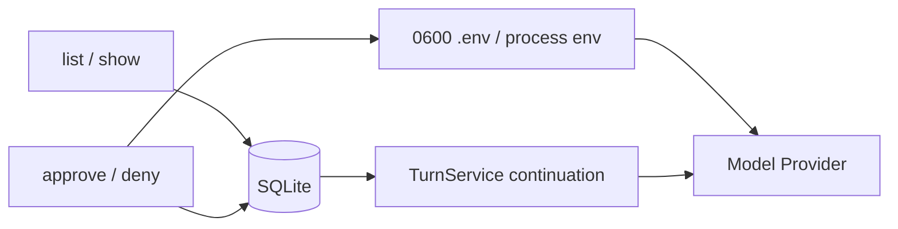

# Phase 2.2 工程文档：Approvals CLI 与操作手册

> [!WARNING]
> 本文保留 Phase 2.2A 的历史交付证据。Phase 2.2B 已删除 `miniclaw approvals`；当前审批在同一个 Textual
> TUI 中展示完整归一化参数，并按 Core scope 提供 **Allow once / Allow this session / Always allow / Deny**。
> 文件写入仍只提供 Once。SQLite Approval 生命周期与安全约束仍然有效，当前用法见
> [单入口 TUI 工程文档](single-entry-tui.md)。

> 历史状态：`list / show / approve / deny` 曾实现，Phase 2.2B 已移除这些入口
>
> 当时验证基线：210/210 tests、10/10 offline Agent cases、Ruff PASS

## 1. 最短使用流程

先让 Agent 发起写操作：

```bash
uv run miniclaw chat --message "请把 hello 写到 note.txt"
```

如果模型调用 `write_file`，CLI 会返回类似：

```text
Approval 42 required for write_file.
```

查看并决定：

```bash
uv run miniclaw approvals list --status pending
uv run miniclaw approvals show 42
uv run miniclaw approvals approve 42
# 或
uv run miniclaw approvals deny 42
```

`approve` 执行原先绑定的参数，再让同一模型基于真实 Tool Result 继续回答；`deny` 不执行工具，但也会让模型
基于 `approval_denied` 结果给出结束语。

## 2. 命令一览

| 命令 | 是否需要模型 Key | 行为 |
| --- | --- | --- |
| `approvals list [--status pending] [--json]` | 否 | 列出当前 Owner 的脱敏记录 |
| `approvals show ID [--json]` | 否 | 查看 Tool、摘要、状态和时间 |
| `approvals approve ID [--json]` | 是 | 单次消费、执行 Tool、继续模型 |
| `approvals deny ID [--json]` | 是 | 拒绝 Tool、继续模型解释 |
| `approvals approve ID --always` | 视 Tool 而定 | 历史入口已移除；当前 TUI 由 Core 决定是否显示 Always |

自定义状态目录时，`--home` 放在 `approvals` 后面：

```bash
uv run miniclaw approvals --home /absolute/state list --json
```

## 3. 输出为什么不显示完整参数

列表和详情只包含：ID、Tool 名、脱敏摘要、状态、创建/到期/决策时间。写入内容、绝对路径和完整 hash 不会
进入终端表格或 JSON 输出。

```json
[{"id":42,"tool":"write_file","summary":"write_file note.txt","status":"pending"}]
```

示例省略了时间字段；真实 JSON 会包含完整 ISO 8601 时间。完整参数只保存在 owner-only SQLite 中，并在执行前
重新计算 Tool-bound SHA-256。

## 4. 进程与凭据边界



- `list/show` 不加载 API Key，也不构造 Provider；可以离线排查。
- `approve/deny` 需要模型继续回答，因此加载与 `chat` 相同的 Provider 配置。
- Provider 始终在 `finally` 中关闭；Key 只保留在当前进程内存。
- CLI 不会在审批命令中暗中初始化状态；缺失状态需先运行 `miniclaw init`。

## 5. 状态与退出码

| 情况 | 退出码 | 说明 |
| --- | --- | --- |
| 成功 | `0` | 查询完成或 child Turn 正常结束/再次等待审批 |
| `not_found/not_owner/expired/already_decided/hash_mismatch` | `2` | 可操作的审批业务冲突 |
| API Key 无效 | `3` | Provider 认证失败 |
| Provider/Agent 失败 | `4` | 模型协议、速率、服务或 Loop 失败 |
| SQLite/本地 I/O 失败 | `5` | 本地状态不可读写 |
| 用户中断 | `130` | child Turn 保存 cancelled |

重复 `approve` 不会重放 Tool：第一次 consume 后 Approval 是 `consumed`，第二次稳定返回
`already_decided`/`not pending` 类错误。

## 6. 数据流与消息顺序

批准成功后的历史是：

```text
User(original turn)
Assistant(tool_calls, original turn)
Tool(approved result, child turn)
Assistant(final answer, child turn)
```

没有第二条 User Message。这样回放、跨进程恢复和未来 IM Adapter 都使用同一条真实对话链。

## 7. 测试矩阵

| 场景 | 断言 |
| --- | --- |
| list/show 无 Key | Provider 构造器从未调用 |
| approve after restart | 文件写入、child parent 正确、模型续答 |
| approve replay | 第二次退出码 2，文件内容不变 |
| deny | ToolRun denied、文件不存在、模型收到 `approval_denied` |
| 参数 JSON 被改 | `hash_mismatch`、无 child、无写入 |
| 同批后续调用 | 后续 Tool Result 为 `not_executed`、无副作用 |
| 并发 consume | 两个消费者只有一个获得 running ToolRun |

复现：

```bash
uv run python -m unittest tests.test_approvals tests.test_turn tests.test_tui -v
uv run python -m unittest discover -s tests -v
uv run ruff check .
```

## 8. 下一阶段边界

P2.3A 已让 `run_command` 复用相同 Approval/Turn/TUI Modal；长期规则只能由 Owner 在配置中显式写入
“program + 完整 exact argv”。P2.4
的 `http_get` 只保存精确 hostname。文件内容、任意命令字符串和 URL path 都不会成为宽泛的永久规则。
