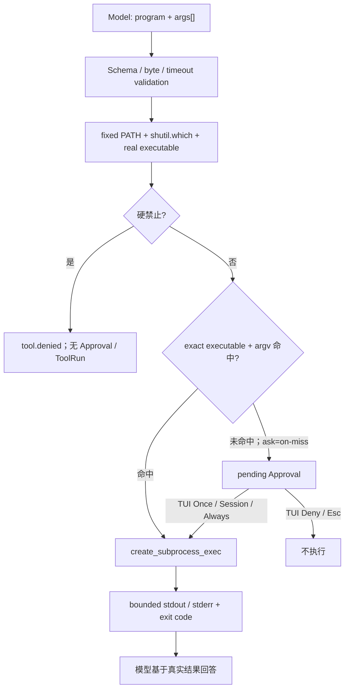

# Phase 2.3A 工程文档：Exact-Argv 命令执行

> 状态：`run_command` 已进入 pi-tui 与 Textual fallback 共享的唯一 `AgentRuntime`，默认未命中规则时生成参数绑定 Approval
>
> 当前门禁：556/556 Python tests、30/30 TypeScript tests、29/29 offline Agent cases、32/32 Channel cases、Ruff PASS

## 1. 大白话解释

MiniClaw 没有“运行一段 Shell 文本”这个入口。模型必须把动作拆成程序和参数数组：

```json
{
  "program": "git",
  "args": ["status", "--short"],
  "timeout_seconds": 30
}
```

这与 `"git status --short"` 不一样：代码从不拼接字符串，不解释空格、引号、管道、重定向、`$()` 或反引号。
最终调用的是 `asyncio.create_subprocess_exec(resolved_program, *args, shell=False)`。

## 2. 完整链路



硬禁止先于审批。因此 `bash -c`、`sudo`、`rm` 或 `git push` 不会生成一张“也许可以点批准”的单子。

## 3. 参数契约

| 字段 | 规则 |
| --- | --- |
| `program` | 非空字符串；按固定最小 PATH 查找，或显式绝对/Workspace 相对 executable |
| `args` | 最多 64 个字符串；边界、空参数和重复参数原样保留 |
| `timeout_seconds` | 默认 30，配置上限不超过 120，模型不能放大 |
| 完整 argv | UTF-8 大小最多 32 KiB；控制字符与 NUL 拒绝 |

不存在 `command`、`cwd`、`env`、stdin、PTY 或 background 参数。`cwd` 永远是当前 MiniClaw Workspace。

## 4. executable 规范化

裸程序名只在固定路径中查找：

```text
/usr/bin:/bin:/usr/sbin:/sbin:/opt/homebrew/bin:/usr/local/bin
```

不会读取用户的动态 `PATH`。解析结果保存为绝对真实路径并进入 Approval hash；同名程序被替换成另一位置后，旧规则
不会模糊匹配。找不到程序、不可执行文件和 symlink loop 都返回脱敏 `command_not_found`。

## 5. 不可审批的命令

| 类别 | 例子 |
| --- | --- |
| Shell / 间接分发 | `sh`、`bash`、`zsh`、PowerShell、`env`、`xargs` |
| inline eval | `python -c/-m`、`node -e`、Ruby/Perl `-e` |
| 删除/直接覆盖 | `rm`、`rmdir`、`shred`、`mv`、`cp`、`truncate`、`dd`、`tee` |
| 远程/上传下载 | `ssh`、`scp`、`sftp`、`rsync`、`curl`、`wget`、`nc` |
| 提权 | `sudo`、`su`、`doas` |
| 容器/系统服务 | Docker/Podman、`systemctl`、`service`、`launchctl` |
| 包安装入口 | pip、npm、yarn、pnpm、brew、apt、yum、dnf 等 |
| Git 红线 | `push`、`clean`、`reset --hard`、`config/credential` |

通用网络读取必须走已实现的 P2.4 `http_get`；文件创建和精确修改应使用带 Workspace Guard 的文件 Tool。

## 6. security × ask

命令 Policy 使用配置中的两个轴：

| security | ask | exact rule 命中 | 未命中 |
| --- | --- | --- | --- |
| `deny` | 任意 | deny | deny |
| `allowlist` | `off` | allow | deny |
| `allowlist` | `on-miss` | allow | require approval |
| `allowlist` | `always` | require approval | require approval |
| `full` | `off/on-miss` | allow | allow |
| `full` | `always` | require approval | require approval |

默认是 `allowlist + on-miss`，即首次需要 Owner 确认。

## 7. 审批时能看到什么

文件写入摘要隐藏 content；命令审批不同，它必须让 Owner 看清完整动作。TUI Modal 使用无歧义 JSON argv，
同时展示 Policy 归一化后的完整参数，包含 resolved executable 和每个原始参数：

```text
summary: run_command ["/usr/bin/git","status","--short"]
```

这段 summary 只存在 owner-only SQLite 和本地 TUI，不进入普通 Audit metadata。Audit 仍只记录 Tool 名、ID 和
参数 hash 前缀。

## 8. Exact rule 为什么不是“永久允许 git”

当前 TUI 对安全 exact argv 可提供 **Allow once**、**Allow this session** 与 **Always allow**。Session 只在当前
Runtime 生效；Always 只在命令成功后创建同一 exact argv 规则。inline `osascript -e` 不提供 Always，失败命令
不创建规则。Owner 也可以在 `config.toml` 显式写入完整规则：

```toml
[tools.run_command]
allow_commands = [{ program = "git", args = ["status", "--short"] }]
```

只有 executable 和完整 argv 同时相等才自动放行。多一个 `--porcelain`、少一个参数、顺序变化或 executable
路径变化都会重新进入审批。SQLite exact rule 可在新 Runtime 读取，但当前不会为规则管理恢复第二个交互式 CLI。

## 9. 子进程隔离

```mermaid
sequenceDiagram
    participant Tool as RunCommandTool
    participant Proc as New process group
    participant Out as stdout reader
    participant Err as stderr reader

    Tool->>Proc: exec(program, *args), cwd=Workspace, stdin=DEVNULL
    Tool->>Out: drain concurrently; keep ≤1 MiB
    Tool->>Err: drain concurrently; keep ≤1 MiB
    alt entire group + drains finish before timeout
        Proc-->>Tool: exit code
        Out-->>Tool: bounded bytes + truncated
        Err-->>Tool: bounded bytes + truncated
    else timeout / cancellation
        Tool->>Proc: SIGTERM process group
        Tool->>Proc: after 2s SIGKILL
        Tool->>Out: finish draining and close transport
        Tool->>Err: finish draining and close transport
    end
```

环境只包含 Runtime 确定性构造的 PATH、HOME、locale 和必要 Windows 平台变量。API Key、Token、Cookie、Secret、代理和用户
`PYTHONPATH` 都不会继承。stdout/stderr 分开保留，各最多 1 MiB；进入模型前还受 Executor 全局 20,000 字符上限。

## 10. 结果与错误

成功执行表示“进程被安全启动并结束”，不等于 exit code 必须为 0。模型会收到：program basename、原样 args、
固定 cwd、exit code、两个文本流、各自 truncated 标记和 duration。

| 错误码 | 含义 |
| --- | --- |
| `invalid_arguments` | Schema、argv 或 timeout 不合法 |
| `command_not_found` | executable 无法安全解析 |
| `command_forbidden` | 命中不可审批红线 |
| `approval_required` | 安全但未命中规则 |
| `command_failed` | 进程无法启动 |
| `tool_timeout` | 整个进程组/管道未在期限内结束 |

## 11. 测试证据

```bash
uv run python -m unittest tests.test_command_policy tests.test_run_command \
  tests.test_runtime tests.test_tui -v
uv run python -W always::ResourceWarning -m unittest tests.test_run_command -v
uv run python -m unittest discover -s tests -v
uv run ruff check .
```

覆盖：硬禁止、exact/extra argv、配置矩阵、真实 subprocess、秘密环境清理、stdin EOF、双流 1 MiB、普通超时、
后台子进程占管道、transport 回收、Runtime 注册、TUI scoped approvals、失败不授权和 forbidden 无 ToolRun。

## 12. 打开应用事故与通用修复

用户输入“你能帮我打开飞书吗”时，旧 Provider 可见 description 没有解释 direct argv 和 Approval 语义。
真实 DeepSeek 一次直接口头拒绝，另一次在读取 Darwin 后生成 `bash -c` 与管道；两条路径都没有到达安全的
应用启动 Approval。

当前契约明确要求：本机动作先尝试已列出的 Tool；需要 Approval 不等于 Tool 不可用；`run_command` 只能调用
单个 executable，不能使用 Shell、管道、重定向或 inline code。macOS 打开应用的通用形态是：

```json
{
  "program": "open",
  "args": ["-a", "Lark"]
}
```

这不是飞书硬编码。任何应用名都走相同 `open -a <Application>` 形态、现有 `normalize_command()` 和参数绑定
Approval。`ACTION-OPEN-APP-001` 的 offline gate 断言状态停在 `waiting_approval`；真实 planning probe 只检查
Provider 选择，不经过 Executor，因此验证时不会启动应用。

## 13. 已知边界

- 这是应用层 Policy，不是 OS sandbox；受批准的普通程序仍拥有当前用户本来拥有的 OS 权限。
- 新进程组能终止正常后代；恶意程序主动重新 `setsid` 逃离进程组，需要 Phase 7 的 Seatbelt/container 级隔离。
- 不提供后台任务、PTY、交互 stdin、任意 Shell、删除/移动或包安装。
- Windows 进程组终止尚未作为当前 macOS/Linux MVP 的发布门禁。
- P2.3B 已解决 NVM/Node 安装下的 `lark-cli` 确定性发现、Doctor 可用性检查和最小环境启动；真实
  `auth status`、飞书 Scope 与企业权限仍需 live gate。详见
  [Personal Machine 权限与 CLI 发现](personal-machine-permissions.md)。
