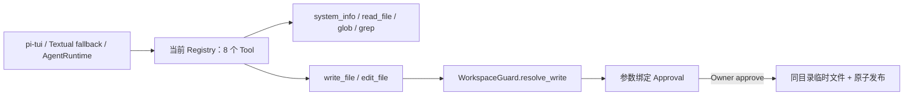
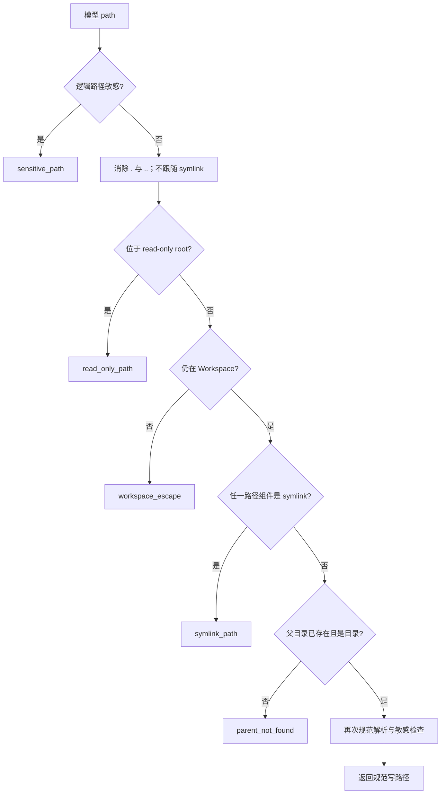
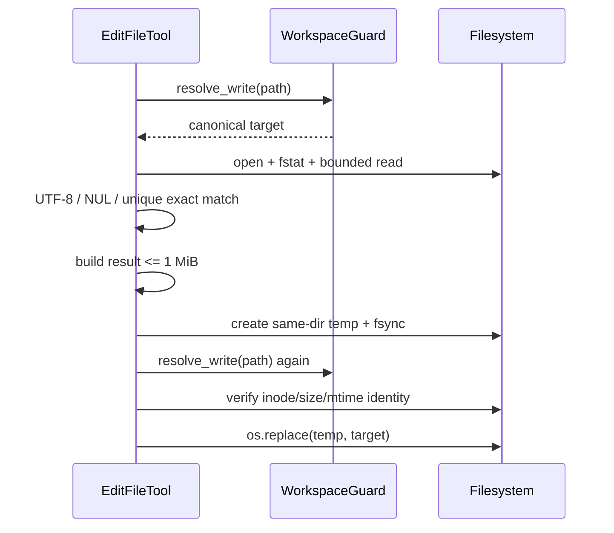

# Phase 2.2A 工程文档：安全写边界与原子文件 Tool

> 状态：`write_file`、`edit_file`、严格 `[tools]` 配置和 Workspace 写边界已经进入代码并通过测试
>
> 当前仓库门禁：369/369 Python tests、25/25 TypeScript tests、24/24 offline Agent cases、Ruff PASS；本模块首次退出门禁为 194 tests
>
> 当前入口：两个写 Tool 已注册到 pi-tui/Textual fallback 共享 Runtime，但只能在参数绑定 Approval 被 Owner 选择
> Allow once 后执行

## 1. 这一小步解决什么

P2.1B 只允许 Agent 读取 Workspace。P2.2A 先把真正改动磁盘前最难回滚的底层能力做稳：

- 哪些路径允许写；
- 如何拒绝 read-only root、敏感文件和 symlink；
- 新文件如何避免意外覆盖；
- 覆盖和编辑失败时如何保住旧文件；
- 精确编辑怎样避免“猜测替换位置”；
- Tool 参数和结果大小如何被限制。

P2.2A 先独立验证文件内核；完整 Phase 2.2 现已把 `require_approval` 接入 SQLite、waiting Turn 和 CLI
续执行，因此模型可以发起写请求，但不能绕过人工决定。

## 2. 当前状态图



`approval_required` 现在携带真实可查询 ID；拒绝、过期、参数篡改或重复消费都不会触碰文件。

## 3. 文件和职责

| 文件 | 当前职责 |
| --- | --- |
| `src/miniclaw/config.py` | 严格解析 `[tools]`、命令子配置和 HTTP 子配置 |
| `src/miniclaw/policy/workspace.py` | 分离 `resolve_read` 与 `resolve_write` 权限边界 |
| `src/miniclaw/policy/engine.py` | 写 Tool 在进入 Executor 后先做路径硬禁止，再要求审批 |
| `src/miniclaw/tools/filesystem.py` | `ReadFileTool`、`WriteFileTool`、`EditFileTool` 和唯一原子写 helper |
| `tests/test_config.py` | 默认值、未知键、枚举、重复工具、exact argv 配置 |
| `tests/test_workspace_policy.py` | 写根、父目录、read-only、逃逸、symlink 和敏感路径 |
| `tests/test_file_tools.py` | 新建、覆盖、编辑、权限、上限、失败清理和并发修改保护 |

没有新增依赖、文件服务层、事务框架或通用 patch 引擎。

## 4. 严格 Tools 配置

当前 `AppConfig.tools` 已有完整强类型默认值：

```toml
[tools]
enabled = ["system_info", "read_file", "write_file", "edit_file", "glob", "grep", "http_get", "run_command"]
security = "allowlist"
ask = "on-miss"
approval_ttl_seconds = 600

[tools.run_command]
allow_commands = []
timeout_seconds = 30
max_timeout_seconds = 120

[tools.http_get]
allow_hosts = []
timeout_seconds = 20
max_response_bytes = 2097152
```

配置加载会拒绝：

- 未知顶层或嵌套字段；
- 未知、重复的 Tool 名；
- 非法 `security` / `ask` 枚举；
- 把布尔值当整数；
- 命令默认超时大于其最大超时；
- HTTP 响应预算大于 2 MiB；
- 缺字段、重复的 exact command rule。

命令 argv 保留重复值和空字符串，因为它们可能具有真实程序语义；配置层不能擅自去重参数。

## 5. Workspace 写边界



写操作永远只允许 `workspace.path`，不会继承 `read_only_roots` 的读取许可。即使 symlink 最终仍指向
Workspace 内部，也拒绝用于写入；这是为了让审批摘要和最终落点保持同一个路径含义。

## 6. `write_file` 契约

模型参数：

```json
{
  "path": "notes/today.md",
  "content": "今天完成了 MiniClaw P2.2A。\n",
  "overwrite": false
}
```

| 参数 | 规则 |
| --- | --- |
| `path` | 非空字符串，仅 Workspace |
| `content` | UTF-8 文本，不含 NUL，最大 256 KiB（按编码后字节） |
| `overwrite` | 严格布尔值，默认 `false` |

行为：

- 新文件默认 mode `0600`；
- `overwrite=false` 使用同目录临时文件加原子 hard-link 发布，竞态出现同名文件时返回 `file_exists`，不会覆盖；
- `overwrite=true` 使用同目录临时文件、`flush`、`fsync`、`os.replace`；
- 覆盖保留旧文件权限位；
- 不自动创建多级父目录；
- 发布失败时清理临时文件，原文件保持不变。

成功结果只返回相对路径、字节数和是否覆盖，不回显完整写入内容。

## 7. `edit_file` 契约

```json
{
  "path": "notes/today.md",
  "old_text": "P2.1",
  "new_text": "P2.2A"
}
```

`old_text` 必须非空，并且在原文件中只出现一次。查找使用精确字符串，也会识别重叠匹配：例如在
`aaa` 中查找 `aa` 会返回 `text_not_unique`，不会擅自选择第一处。



编辑保留权限位；原文件或编辑结果超过 1 MiB 时失败。若文件在读取后、发布前发生变化，返回
`file_changed`，不覆盖新的内容。

## 8. 稳定错误码

| 错误码 | 含义 | 是否改动目标文件 |
| --- | --- | --- |
| `sensitive_path` | 凭据、状态或系统敏感路径 | 否 |
| `read_only_path` | 目标属于额外只读根 | 否 |
| `workspace_escape` | 目标逃出 Workspace 或无法安全解析 | 否 |
| `symlink_path` | 写路径包含 symlink | 否 |
| `parent_not_found` | 父目录不存在 | 否 |
| `file_exists` | 未允许覆盖或新建竞态撞名 | 否 |
| `not_found` | 编辑目标不存在 | 否 |
| `not_a_file` | 目标不是普通文件 | 否 |
| `binary_file` | NUL 或非法 UTF-8 | 否 |
| `text_not_found` | 精确旧文本不存在 | 否 |
| `text_not_unique` | 精确旧文本出现多次 | 否 |
| `file_too_large` | 原文件或结果超过 1 MiB | 否 |
| `file_changed` | 编辑读取后目标发生变化 | 否 |
| `write_failed` | 脱敏后的底层写入失败 | 原文件保持不变 |

## 9. Policy 状态

`PolicyEngine` 已识别 `write_file.path` 和 `edit_file.path`：

1. 路径硬禁止失败：返回 `DENY`，由 Executor 写脱敏 deny audit；
2. 路径安全：两个 Tool 的风险为 `MEDIUM`，返回 `REQUIRE_APPROVAL`；
3. Executor 把第 2 步持久化为带参数哈希的 Approval；Owner approve 后才执行写入。

生产 Agent 不存在绕过 Policy 的第二条入口。单元测试直接调用 Tool 是为了验证纯文件行为，不等于生产授权。

## 10. 测试证据

Task 2 聚焦门禁：

```bash
uv run python -m unittest tests.test_file_tools tests.test_tool_contract tests.test_tool_executor -v
uv run ruff check src/miniclaw/tools/filesystem.py src/miniclaw/policy/engine.py tests/test_file_tools.py tests/test_tool_contract.py
```

结果：36/36 通过。

全仓门禁：

```bash
uv run python -m unittest discover -s tests
uv run miniclaw eval run --suite offline
uv run ruff check .
git diff --check
```

结果：194/194 tests、10/10 offline Agent cases、Ruff PASS、diff check PASS。

## 11. 已知边界与下一步

- 应用层通过重复 Guard、普通文件身份和原子发布缓解 TOCTOU，但不能取代 OS sandbox；Phase 7 再增加进程级隔离。
- 新文件使用 hard-link 实现原子 no-clobber，因此要求 Workspace 和临时文件位于同一文件系统；临时文件固定创建在目标目录。
- 当前不支持创建目录、删除、移动、regex replace、模糊 patch 或批量编辑。
- 当前 AgentRuntime 注册 4 个只读系统/文件 Tool、2 个需审批文件 Tool、`run_command` 与 `http_get`，共 8 个。
- 参数绑定 `ApprovalRepository + ToolExecution.approval_id`、waiting/child Turn 和 TUI Modal 已完成；命令与
  HTTPS 复用同一生命周期，下一缺口是 P2.3B 真实 `lark-cli` 闭环。
