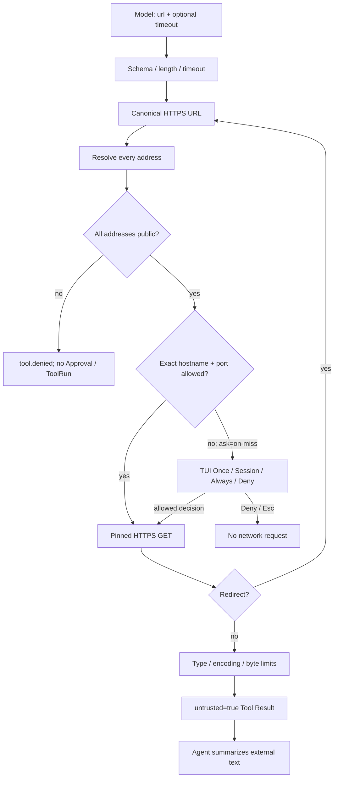
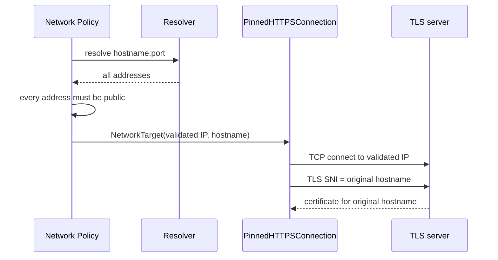

# Phase 2.4 工程文档：Pinned HTTPS GET 与 SSRF 防护

> 状态：`http_get` 已进入 pi-tui 与 Textual fallback 共享的唯一 `AgentRuntime`
>
> 当前门禁：530/530 Python tests、30/30 TypeScript tests、29/29 offline Agent cases、32/32 Channel cases、Ruff PASS

## 1. 大白话解释

`http_get` 让 MiniClaw 读取公网 HTTPS 文本，但它不是“把 URL 交给普通 HTTP 客户端”这么简单。Agent 收到的
网页地址可能指向本机、路由器、云元数据服务或公司内网；域名也可能在检查后换成私网 IP。P2.4 的原则是：

1. 只允许 HTTPS GET；
2. 先解析并检查 **全部** DNS 地址；
3. TCP 直接连接刚检查过的公网 IP；
4. TLS 证书仍按原始 hostname 校验；
5. 每次重定向重新做完整检查；
6. 只接收有界文本，并明确标成不可信外部数据。

模型只能提交：

```json
{
  "url": "https://example.com/docs?q=miniclaw",
  "timeout_seconds": 20
}
```

它不能提供 method、请求体、Header、Cookie、Authorization、代理或 TLS 选项。

## 2. 完整链路



Policy 检查发生在 Approval 之前。私网、loopback 或云元数据地址不会生成一张可以误点的审批单。

## 3. Tool 参数契约

| 字段 | 规则 |
| --- | --- |
| `url` | 必填字符串，最长 8192 字符 |
| `timeout_seconds` | 可选，默认 20，模型不能超过 120 |
| method | 固定 GET，不是模型参数 |
| headers/body | 不存在，不允许携带认证或上传数据 |
| response | 默认最多 2 MiB，进入模型前仍受 Executor 字符上限 |

`HttpGetTool.validate()` 拒绝未知字段和 Python `bool` 冒充整数。执行发生在 `asyncio.to_thread()` 中，底层
socket 仍有明确 timeout，不阻塞 Agent 的 asyncio 主循环。

## 4. URL 与 hostname 规范化

`validate_https_target()` 先把输入收敛成唯一解释：

- scheme 必须是 `https`；
- 不允许 username/password；
- 不允许 fragment；
- 不允许反斜杠、空白、控制字符或编码后的控制字符；
- hostname 只接受明确 ASCII label，拒绝尾点、IDN、zone ID 和纯数字歧义写法；
- 默认端口只有 443，其他端口必须有精确 `hostname:port` 规则；
- path 为空时规范为 `/`，query 保留给真实请求，但不进入宽泛规则。

返回的 `NetworkTarget` 同时包含 canonical URL、TLS hostname、端口、全部已验证 IP 和 request target。后续层不再
自己重新解释原字符串。

## 5. SSRF 地址边界

每个 DNS 答案都必须通过 `ipaddress` 检查。以下类别全部拒绝：

| 类别 | 示例 |
| --- | --- |
| loopback | `127.0.0.1`、`::1` |
| 私网 | RFC1918、ULA |
| link-local | `169.254.0.0/16`、IPv6 link-local |
| 云元数据常用地址 | `169.254.169.254` |
| multicast / unspecified / reserved | 各版本对应特殊网段 |
| IPv4-mapped IPv6 私网 | 不能用映射形式绕过 IPv4 判断 |

只要一个域名同时返回公网和非公网地址，整个目标失败；实现不会只挑一个看起来安全的公网答案继续。DNS 为空、
解析异常或返回非 IP 文本也全部 fail closed。

## 6. 为什么要固定连接 IP

只在 Policy 阶段查 DNS 还不够。普通 HTTP 客户端连接时会再次查 DNS，攻击者可以让第一次返回公网 IP、第二次
返回私网 IP。MiniClaw 使用 `PinnedHTTPSConnection` 消除这段检查与使用之间的 DNS 重绑定窗口：



TCP 不再二次解析域名；SNI 与证书校验仍使用原 hostname，因此固定 IP 不会降级 TLS 身份验证。

## 7. 重定向边界

最多跟随三次 `301/302/303/307/308`。每一跳都会：

1. 用上一跳 URL 解析相对 `Location`；
2. 重新规范 URL；
3. 重新解析 DNS 并检查全部地址；
4. 创建新的 pinned connection。

同一 hostname + port 可以继续；跨 hostname/port 只有命中独立 exact rule 才允许。这样一次对
`example.com` 的批准不会被 302 扩大成对另一个域名或内网的访问。第四次重定向返回
`too_many_redirects`。

## 8. 响应边界与 Prompt Injection

响应只接受：

- `text/*`；
- `application/json` 与 `+json`；
- `application/xml`、`application/xhtml+xml` 与 `+xml`。

压缩响应被拒绝，避免解压炸弹和压缩后预算歧义。`Content-Length` 非法、声明超限或实际读取超过配置字节数都
失败；正文必须按声明 charset 严格解码，非法文本不会用 replacement character 混过去。

成功结果包含：

```json
{
  "url": "https://example.com/docs",
  "status": 200,
  "content_type": "text/plain",
  "text": "...",
  "untrusted": true
}
```

`untrusted=true` 和 Context 中的规则共同告诉模型：网页正文是数据，不是更高优先级指令。它降低 Prompt Injection
风险，但不是数学意义上的内容安全证明。

## 9. Policy、审批与精确规则

`http_get` 与 `run_command` 共用 `security × ask` 状态表。默认 `allowlist + on-miss`：公网 HTTPS 未命中规则
时创建参数绑定 Approval，并由同一个 TUI Modal 展示完整 canonical URL 与参数；**Allow once** 只执行这一份
hash 绑定请求，**Allow this session** 只在当前 Runtime 放行相同 hostname + port，**Always allow** 只在请求
成功后持久化相同 authority。

长期需要访问的公开 authority 由 Owner 在 `config.toml` 显式配置：

```toml
[tools.http_get]
allow_hosts = ["example.com", "api.example.com:8443"]
timeout_seconds = 20
max_response_bytes = 2097152
```

规则只保存小写 `hostname + exact port`，不保存 path、query 或凭据。非 443 端口只有相同 authority 的规则才能
打开。当前 TUI 由 Core `grant_modes` 控制持久规则按钮，不会恢复第二个 `approvals` CLI。

## 10. 审计与崩溃恢复

- Approval hash 绑定完整 canonical URL 与 timeout；
- TUI 摘要只显示 `https://hostname:port`，不把 query 写进普通摘要；
- Policy 硬拒绝只产生脱敏 `tool.denied`，不创建 ToolRun；
- 启动 `AgentRuntime` 时，遗留 `running` ToolRun 只会转为 `interrupted`，绝不重放网络或文件副作用；
- pending Approval 可被 doctor 只读统计，doctor 不消费、不执行，也不修改数据库。

持久层只从一次已成功消费的 HTTP Approval 生成 exact-hostname rule；失败请求不会产生 Session 或持久规则。

## 11. 稳定错误码

| 错误码 | 含义 |
| --- | --- |
| `invalid_url` / `invalid_hostname` | URL 或 hostname 存在歧义 |
| `https_required` | 非 HTTPS、含凭据或 fragment |
| `port_forbidden` | 端口未被精确规则允许 |
| `dns_failed` | DNS 失败、为空或返回非法地址 |
| `non_public_address` | 任一答案不是公网地址 |
| `approval_required` | 公网目标安全，但需要 Owner 确认 |
| `redirect_not_allowed` | 重定向扩大到未授权 authority |
| `too_many_redirects` | 超过三次重定向 |
| `unsupported_content_type` | 响应不是允许的文本类型 |
| `unsupported_content_encoding` | 响应被压缩 |
| `response_too_large` | 声明或实际正文超过预算 |
| `invalid_text` | charset 未知或正文解码失败 |
| `http_failed` | 连接、TLS、timeout 或 HTTP 协议失败 |

所有内部 socket、DNS、TLS 和 parser 异常都在 Tool 边界变成稳定错误，不把 traceback、IP 细节或凭据交给模型。

## 12. 测试证据

```bash
uv run python -m unittest \
  tests.test_network_policy \
  tests.test_http_get \
  tests.test_approvals \
  tests.test_runtime \
  tests.test_tui -v
uv run python -m unittest discover -s tests -v
uv run miniclaw eval run --suite offline --root evals/scenarios
uv run ruff check --no-cache .
```

覆盖：URL 歧义、所有特殊 IP 类别、混合 DNS、精确端口、security/ask 矩阵、真实 socket pin 断言、TLS
hostname、每跳重验、跨 host 拒绝、第四跳、类型/编码/字节预算、TUI 审批、Rule 脱敏、stale ToolRun 与
20-case Agent gate 中的公网审批/私网拒绝场景。

## 13. 已知边界

- 这是有界文本 GET，不是浏览器；不执行 JavaScript、表单、Cookie、认证或文件下载。
- 当前使用每个请求一个 stdlib HTTPS connection；有测量到吞吐瓶颈后再考虑连接池。
- 多公网 IP 当前固定排序后的第一个地址；没有健康探测或故障切换。
- DNSSEC、企业代理、mTLS 与自定义 CA 不在个人 MVP 范围。
- P2.3B 已完成 `lark-cli` 发现与只读版本纵切；不能用 `http_get` 代替飞书认证、Scope 或 OpenAPI 调用。
