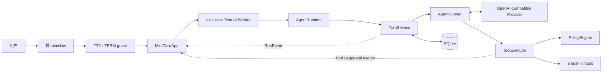
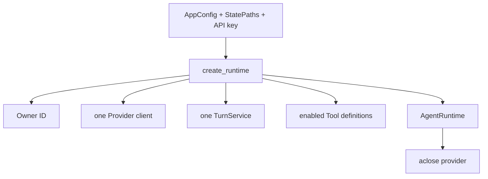
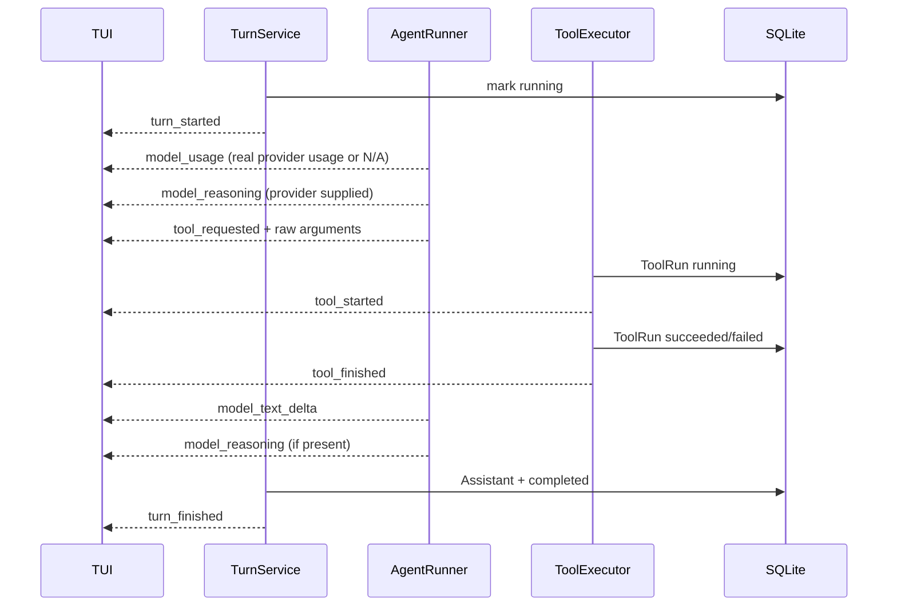
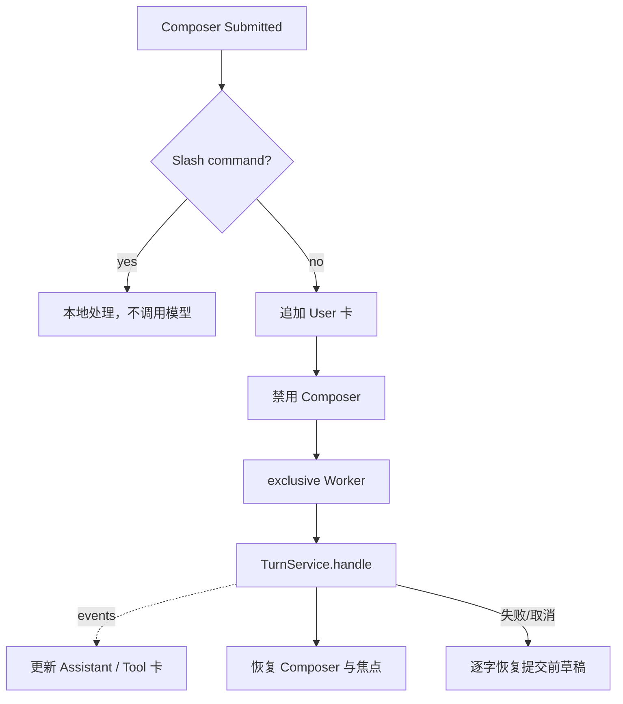
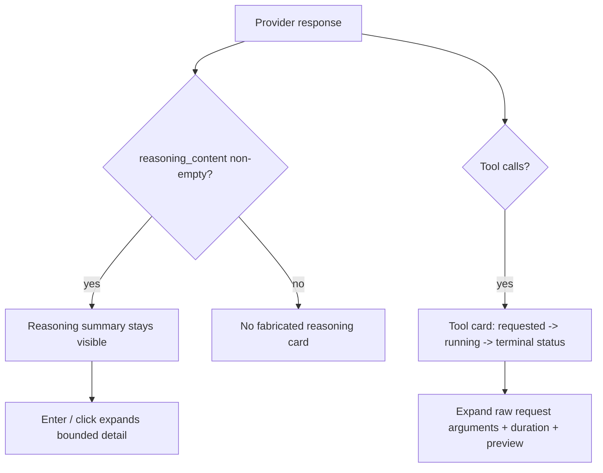
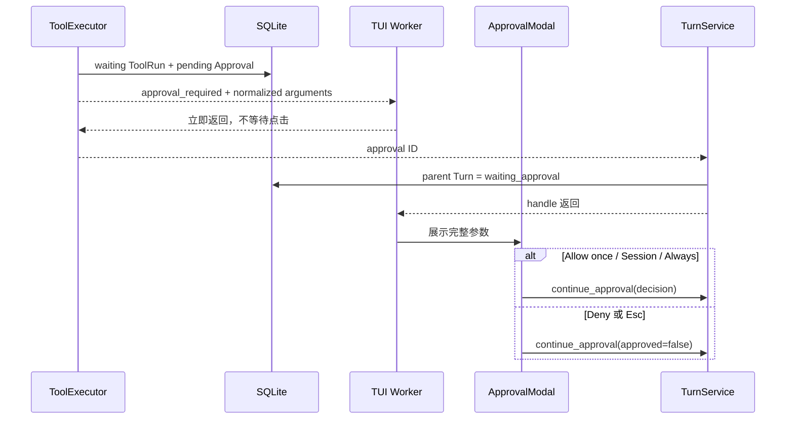
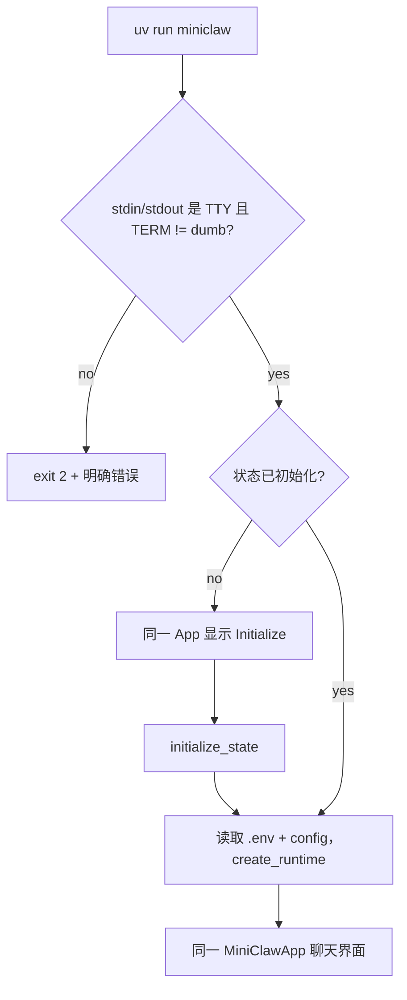

# Phase 2：单入口 TUI（pi-tui 默认，Textual fallback）

> 状态：pi-tui 已成为裸 miniclaw 默认展示层；Textual 暂作首次 onboarding 和运行时 fallback。
> 当前全仓通过 295 项 Python、25 项 TypeScript 测试与 21/21 离线 Agent 场景。
> 本文第 3–11 节保留 Textual fallback 的实现记录；当前跨语言架构见
> [Python Core + pi-tui Bridge 工程文档](python-core-pi-tui-bridge.md)。

## 1. 当前解决了什么

人类入口仍然只有裸 miniclaw，但入口内部会选择展示层：

~~~mermaid
flowchart LR
    CLI["bare miniclaw"] --> CHECK{"已初始化 + Node >=22.19 + dist?"}
    CHECK -->|yes| PI["pi-tui + Python Bridge"]
    CHECK -->|no| TEXTUAL["Textual onboarding/fallback"]
    PI --> CORE["同一个 AgentRuntime"]
    TEXTUAL --> CORE
~~~

显式 MINICLAW_TUI=pi|textual 方便验收和排障；不会新增第二个人类命令。

### 历史交付：Textual 单入口

Phase 1 的 `miniclaw chat --message` 和 `input()` REPL 能证明 Agent Core 可用，但不像一个长期使用的
个人 Agent：流式内容、Tool 过程、取消和审批都只能退化成终端文本。Phase 2.2B 将本地人类交互统一为：

```bash
uv run miniclaw
```

裸命令进入同一个 Textual App。项目不再提供：

- `miniclaw chat`；
- `miniclaw tui`；
- `chat --message` 或 `--plain`；
- `miniclaw approvals`；
- 第二套 `input()` / `print()` 对话循环。

`init`、`doctor` 和 `eval` 是维护/门禁命令，不是第二套聊天入口，因此继续保留。

## 2. 为什么选择 Textual

参考项目的终端 UI 与 MiniClaw 的现实约束不同：

| 参照物 | 终端方案 | 适合它的原因 | MiniClaw 的结论 |
| --- | --- | --- | --- |
| OpenClaw | `@earendil-works/pi-tui` / pi-mono 生态 | OpenClaw 主体是 TypeScript，复用同语言组件和事件模型成本最低 | 学交互思想，不为 TUI 引入第二套 TS runtime |
| Gemini CLI | React + Ink 风格组件模型 | Node/React 团队可共享前端心智 | Python 项目会增加 IPC、打包和双语言调试成本 |
| OpenCode | Go TUI 生态 | Go 单二进制、并发与终端组件成熟 | 适合 Go 主体，不适合当前 Python Agent Core |
| Python Prompt Toolkit | 输入、补全、历史非常强 | 适合 REPL 与编辑器式交互 | Tool 卡、Modal、布局和 Worker 需要自己组装更多状态 |
| Rich Live | 输出渲染简单直接 | 适合 dashboard 或单向日志 | 缺少完整焦点、Screen、Modal 和输入事件模型 |
| Textual | Python 原生 App/Widget/Worker/Modal/test pilot | 与异步 Agent 同进程，且提供可无头测试的完整 UI 生命周期 | 当前最佳匹配 |

这里的“最佳实践”不是说 Textual 对所有 CLI 都最好，而是它在 MiniClaw 当前约束下总代价最低：

1. Agent、Policy、SQLite 和 Provider 都是 Python；
2. TUI 可直接 await `TurnService`，不需要 JSON-RPC 或子进程协议；
3. Textual Worker 能承载长模型请求并响应取消；
4. ModalScreen 能实现阻断式人工审批；
5. `run_test()` 能在 CI 中验证焦点、按键、Widget 和 Modal。

依赖锁定为 `textual>=8.2,<9`。没有再引入命令框架、DI 容器或自研 Widget 框架。

## 3. 当前架构



关键文件：

| 文件 | 责任 |
| --- | --- |
| `src/miniclaw/cli.py` | 解析裸入口与维护命令；做 TTY guard；不装配 Agent |
| `src/miniclaw/runtime.py` | 唯一装配 Owner、Provider、TurnService、Policy、Approval 和八个 Tool |
| `src/miniclaw/agent/events.py` | 定义进程内 `RunEvent` 与安全交付函数 |
| `src/miniclaw/agent/turn.py` | 在 SQLite 状态迁移后发 Turn 事件，并负责审批 continuation |
| `src/miniclaw/agent/runner.py` | 发模型增量、Provider reasoning 与带原始参数的 Tool requested 事件 |
| `src/miniclaw/tools/executor.py` | 在 ToolRun/Approval 落库后发 Tool 与审批事件 |
| `src/miniclaw/tui/app.py` | Widget、Worker、Tool 卡、审批 Modal、Slash Command 与本地状态投影 |

## 4. AgentRuntime：为什么只保留一个装配点

旧 CLI 自己创建 Database、Provider、Registry、Executor 和 TurnService。若 TUI 再复制一次，两个入口很快会
出现 Tool 列表、审批 TTL 或关闭行为不一致。现在装配只在 `create_runtime()` 中发生：



当前注册的八个 Tool 按名称稳定暴露：

```text
edit_file, glob, grep, http_get, read_file, run_command, system_info, write_file
```

`run_command` 与 `http_get` 都由同一个 Runtime 接入监督 Policy 与 TUI 审批；后者额外执行 SSRF、DNS pin、
redirect 和文本响应预算。

## 5. RunEvent 契约

TUI 不查询内部对象的瞬时字段，也不自己推测状态。Core 只发送以下进程内事件：

| kind | 谁发出 | 发出前必须完成 |
| --- | --- | --- |
| `turn_started` | TurnService | Turn 已持久化为 `running` |
| `model_text_delta` | AgentRunner | Provider 已收到该文本分片 |
| `model_reasoning` | AgentRunner | Provider 明确返回非空 `reasoning_content` |
| `model_usage` | AgentRunner | 当前 Provider 响应已通过协议与 call ID 校验 |
| `tool_requested` | AgentRunner | 模型 Tool Call ID 已通过批次校验 |
| `tool_started` | ToolExecutor | ToolRun 已持久化为 `running` |
| `tool_finished` | ToolExecutor/TurnService | ToolRun 或拒绝决定已进入终态 |
| `approval_required` | ToolExecutor | pending Approval 与 waiting ToolRun 已原子落库 |
| `turn_finished` | TurnService | Assistant Message 与 completed Turn 已提交 |
| `turn_failed` | TurnService | failed 状态与稳定 error code 已提交 |
| `turn_cancelled` | TurnService | cancelled 状态已提交 |

正常 Tool Turn 的顺序为：



`emit()` 隔离普通展示异常，避免 UI 渲染失败把业务 Turn 改成失败；日志只记录事件 kind，不记录事件正文。
`CancelledError` 继续传播，使 Esc 能走既有的 Turn/Tool 取消与持久化路径。

## 6. 输入与并发模型

界面只保留一个 Composer：

| 操作 | 行为 |
| --- | --- |
| Enter | 提交非空消息 |
| Shift+Enter | 在光标位置插入换行 |
| Esc | 取消当前 Worker；审批 Modal 中等价于 Deny |
| Ctrl+O | 展开所有 Trace 详情；已全展开时收起全部 |
| Ctrl+D | 空闲时退出 |

普通消息流程：



`exclusive=True` 保证同一 App 只有一个活动 Turn。没有再造队列、调度器或多会话并发；个人 MVP 当前不需要。

## 7. 对话层级、流式回答与可展开 Trace 卡

- 用户与 Assistant 分别显示“你”/“MiniClaw”文字角色标签、不同边线和背景，不只靠颜色区分；
- 同一 Turn 的所有 `model_text_delta` 更新同一个临时 Markdown Widget；
- `turn_finished` 用数据库最终正文固化该 Widget；
- Markdown 禁止自动打开链接；
- 模型和 Tool 文本先移除 ANSI/C0/C1 控制字符；
- Tool Call ID 只作为字典键，不拼入 CSS selector；
- Reasoning 默认展开、弱色且无 Tool 卡的厚边框；终端不支持局部小字体，以更少留白实现“小字感”；
- 每次 Tool Call 的“Tool 名 + 文字状态”始终保留在 transcript；
- 按 Enter 或点击单张卡的标题，展开原始模型参数、完整状态路径、执行耗时和结果预览；
- `Ctrl+O` 只批量折叠/展开详情，不会隐藏 Tool 或 Reasoning 概要；
- Tool 结果预览最多显示 2,000 字符；完整结果仍保存在既有 Tool/消息边界内；
- 可展开详情最多显示 8,000 字符，防止超大模型参数或 reasoning 拖垮终端；
- Tool 状态同时显示文字，不依赖颜色表达成功、失败或等待审批。

### 7.1 “思考过程”的边界

MiniClaw 只展示 Provider API 明确返回的 `reasoning_content`，中文 UI 标题为
`思考（模型）· 第 N 轮`，英文 UI 为 `Reasoning (provider) · Turn N`。这是模型产品边界给出的可见 reasoning，不是 MiniClaw 内部隐藏思维链，
也不会从最终答案反推或伪造思考步骤。Provider 不返回该字段时，界面不显示空卡。

System Prompt 要求回答和 provider-visible reasoning 跟随 Owner 最新消息的主要语言；`/lang` 只切换 UI 文案，
不翻译模型内容。



## 8. 审批为什么在原 Turn 返回后才弹出

`approval_required` 事件发生时，Approval 已落库，但 AgentRunner 和 TurnService 还需要把父 Turn 更新为
`waiting_approval`。如果事件处理器同步等待用户点击，Core 会被 Modal 阻塞，用户点击后 continuation 会发现父 Turn
仍是 `running`。当前实现只缓存事件，让原 Turn 完成持久化，然后再展示 Modal：



Modal 的安全约束：

- 展示 Policy 归一化后的完整参数，而不是模型原始参数；
- 默认焦点为 **Deny**；
- 文件写入只提供 **Allow once**；
- 安全 exact argv / exact hostname 可由 Core 提供 **Allow this session** 与 **Always allow**；
- TUI 不推导 scope，只显示 `approval_required.grant_modes`；
- Session 只在当前 Runtime 生效，Always 只在成功后持久化 exact rule；
- inline AppleScript 不提供 Always；
- 不直接调用 Tool，只调用 `TurnService.continue_approval()`；
- SQLite 的 Owner、TTL、hash、状态与单次 consume 约束仍是最终安全边界。

## 9. 本地 Slash Command

Slash Command 固定写在一个 `match` 中，没有命令注册框架：

```text
/help  /status  /tools  /new  /lang zh|en  /exit  /quit
```

`/new` 只切换本地 conversation ID 并清空当前可见投影，不创建第二个 Runtime。`/lang` 原地切换固定 UI 文案；
默认值由 `[ui].language = "zh-CN"` 提供。`/status` 显示 Provider Request ID 与完整真实指标。

## 10. 紧凑审计栏

```text
上下文 1.2k/128k · 输入 1.5k · 输出 64 · 工具 2 · 迭代 2 · 耗时 432 ms
```

- 上下文是最后一次 Provider 上报的 input/prompt token 与配置预算；
- 输入/输出是当前 Turn 多次 Provider 调用的累计值；
- Tool 次数统计模型产生且 call ID 合法的调用，不等于成功次数；
- 耗时来自 TurnService 单调时钟；
- Provider 不上报 usage 时显示 `N/A`，绝不估算；
- 审计栏不显示 Prompt、密钥、原始 Tool 参数或完整结果。

## 11. 启动与 Onboarding



当前 `.env` 仍从启动命令的工作目录读取。若状态已存在但 Key 缺失，启动返回配置错误；若在 Onboarding 中
初始化后 Key 缺失，错误显示在同一 App，不会创建第二个界面。

## 12. 测试矩阵

| 层 | 主要断言 |
| --- | --- |
| CLI | 裸入口、`--home`、TTY guard、旧入口不存在、init/doctor/eval 保留 |
| Runtime | 八个 Tool、Owner、model、workspace、Provider 生命周期 |
| Event | 精确一次交付、异常脱敏、取消传播、持久化后顺序 |
| TUI shell | 80x24 布局、唯一 Composer、默认焦点、终端控制字符过滤 |
| Interaction | Enter、Shift+Enter、exclusive Worker、Esc 取消、焦点恢复 |
| Projection | 单一流式 Assistant、Provider reasoning、Tool 参数/状态/耗时/预览、动态 call ID 安全 |
| Trace interaction | 单卡 Enter 展开、Ctrl+O 全展开/收起、概要始终可见、ANSI 过滤 |
| Approval | 完整参数、Deny 默认焦点、Once/Session/Always Core scope、Esc=Deny、同一 Service 续跑 |
| Reliability | 250,000 字符 bracketed paste 失败/取消逐字恢复、Runtime 缺失不丢输入 |
| Language | 默认中文、`/lang zh|en`、按最新 User 消息选择中英文 System Prompt |
| Telemetry | 真实 usage、N/A、Provider Request ID、Tool/迭代/耗时 |
| Full suite | 295/295 Python + 25/25 TypeScript tests + Ruff + diff check |
| Agent gate | 21/21 active offline Claw-like cases |

运行命令：

```bash
.venv/bin/python -m unittest discover -s tests -v
.venv/bin/ruff check --no-cache .
uv run miniclaw eval run --suite offline --root evals/scenarios
git diff --check
```

TUI 的用例编号、无头测试策略、PTY smoke 与版本门禁详见
[TUI 回归测试规范](tui-regression-testing.md)。

## 13. 当前边界与 Phase 2.3B

本阶段没有实现：

- 飞书 Channel；
- NVM/Node 路径下 `lark-cli` 的真实 help/auth smoke；
- TUI 历史记录浏览或多 Tab；
- 自动恢复进程重启前尚未处理的审批 UI；
- 持久规则的 TUI 查看/撤销；
- Web 管理台。

Phase 2.3A 已实现 exact-argv `run_command`，不经过 shell 字符串；安全命令未命中精确规则时复用同一
Approval/Turn continuation/TUI Overlay 链路。pi-tui 已解决自身 Node 版本检测和构建入口；Phase 2.3B 下一步处理
本机 NVM `lark-cli` 的独立可执行路径、
doctor 检查与 `auth status` 真实 smoke，不会把“已安装”误写成“Agent 已可稳定调用”。P2.4 `http_get` 已复用
同一 Runtime/Modal；网络边界见 [Pinned HTTPS 工程文档](https-get-and-ssrf.md)。

设计取舍与参考项目对比见
[Gemini 风格 TUI 设计](../../superpowers/specs/2026-08-08-gemini-style-tui-and-lark-cli-design.md)，逐任务实现记录见
[P2.2B 实施计划](../../superpowers/plans/2026-08-08-p2-2b-single-entry-textual-tui.md)。

本轮双语、长文本、真实遥测与 scoped approvals 的完整工程说明见
[TUI 可观测、长文本与分级审批](tui-observability-and-scoped-approvals.md)。
