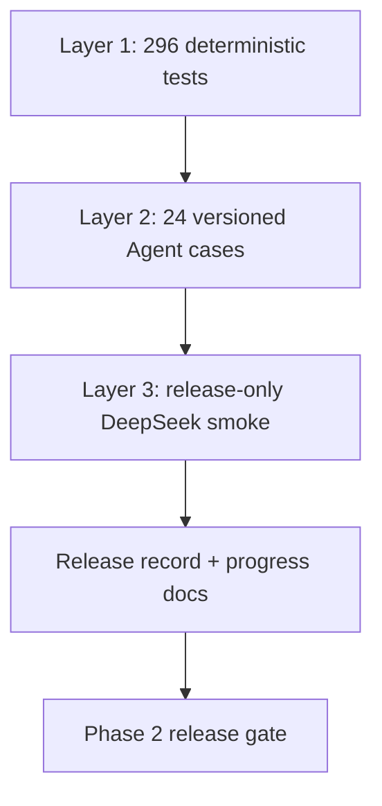
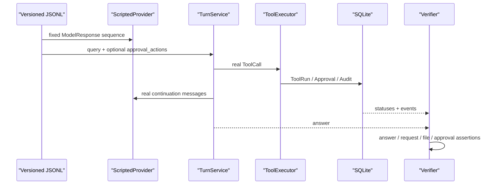
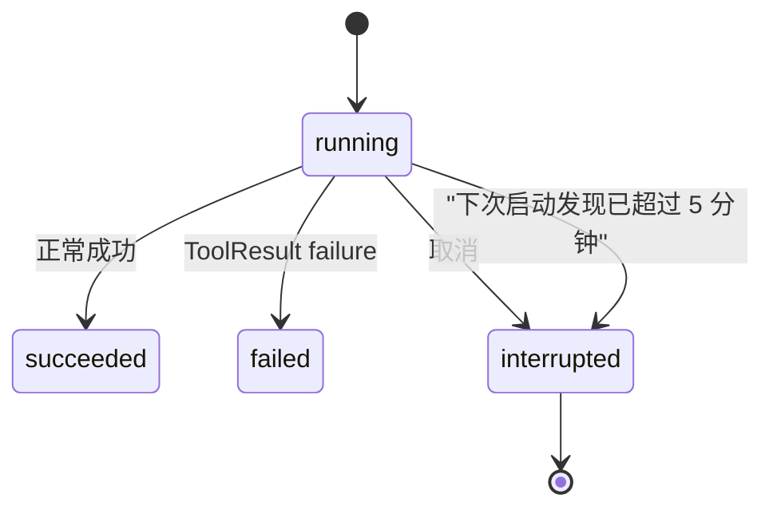
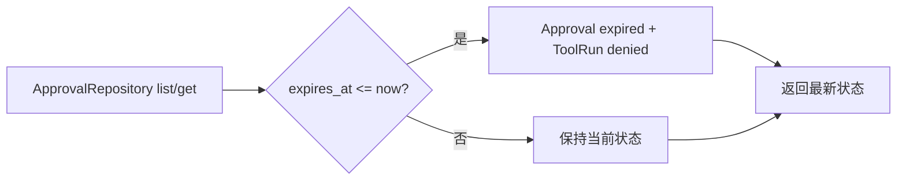

# Phase 2 工程文档：回归门禁、恢复与调试手册

> v0.2.0 发布证据：245/245 tests、20/20 offline Agent cases、Ruff PASS、diff check PASS
>
> 当前 Phase 3 基线：296/296 tests、24/24 offline Agent cases、Ruff PASS；历史 PTY smoke PASS
>
> 历史 live smoke：DeepSeek V4 Pro 的 system_info、write approval、read_file、run_command approval 均完成

## 1. 这份文档解决什么问题

Phase 2 不只要求“某个 Tool 能跑”。每次版本都必须证明：

1. 8 个 Tool 的公开 Schema 没漂移；
2. 所有动作仍经过 Policy 和 ToolExecutor；
3. 写入、命令、网络在执行前仍遵守审批；
4. 敏感路径、Shell 和私网请求仍然硬拒绝；
5. SQLite 状态可跨进程恢复，Approval 不会重放；
6. 真实模型仍会按 Tool Calling 协议使用这些能力。

因此发布门禁分三层，而不是把所有风险都压给一次真实模型聊天。



## 2. 一条命令跑完整本地门禁

```bash
uv run python -m unittest discover -s tests -v
uv run ruff check .
uv run miniclaw eval validate --root evals/scenarios
uv run miniclaw eval run --suite offline --root evals/scenarios
git diff --check
```

发布要求：

- unittest 0 failure / 0 error；
- Ruff 0 finding；
- validate 必须正好加载当前 README 声明的 active 数；
- offline 必须 100% PASS，不允许 skipped；
- diff check 无空白错误；
- 文档中的计数来自这次新鲜输出，不手算、不预测。

## 3. 24 条 Claw-like 回归场景

### 3.1 Phase 1 / P2.1 基线

| 类别 | ID | 证明内容 |
| --- | --- | --- |
| 身份 | `CORE-001` | 基础 MiniClaw 身份回答 |
| 会话 | `STATE-001` | 同 session 恢复前一轮文本 |
| Provider | `PROTO-001` | empty tool arguments 兼容事故 |
| 系统 Tool | `TOOL-001` | system_info 真实 Tool Loop |
| 文件读取 | `FILE-READ-001` | 文件哨兵来自 Tool Result |
| 路径查找 | `FILE-GLOB-001` | glob 结果与过滤 |
| 文本搜索 | `FILE-GREP-001` | grep 行号与类型过滤 |
| 敏感路径 | `SAFE-001` | `.env` 拒绝且不泄漏 |
| 路径逃逸 | `SAFE-002` | Workspace 外路径拒绝 |
| 未知 Tool | `ERROR-001` | 结构化失败后模型可继续 |

### 3.2 Phase 2 新增

| 类别 | ID | 关键可观察结果 |
| --- | --- | --- |
| 新文件 | `WRITE-APPROVE-001` | waiting → consumed → succeeded；文件精确内容 |
| 覆盖 | `WRITE-OVERWRITE-001` | overwrite 仍需审批；旧内容消失 |
| 精确编辑 | `EDIT-APPROVE-001` | 唯一 old_text 替换 |
| 拒绝 | `APPROVAL-DENY-001` | denied ToolRun；文件不存在 |
| 参数篡改 | `APPROVAL-HASH-001` | `hash_mismatch`；无副作用 |
| 命令批准 | `COMMAND-APPROVE-001` | exact argv `/usr/bin/true` 成功 |
| Shell 硬拒绝 | `COMMAND-FORBID-001` | `command_forbidden`；无 Approval |
| 打开应用 | `ACTION-OPEN-APP-001` | direct `open -a`；waiting Approval；live planning 3 次采样 |
| HTTPS pending | `HTTP-APPROVAL-001` | 公网 IP 只创建 waiting Approval，不访问网络 |
| SSRF | `HTTP-PRIVATE-001` | `127.0.0.1` 审批前拒绝 |
| 重放 | `APPROVAL-REPLAY-001` | 首次执行一次；第二次 `already_decided` |

### 3.3 Phase 3 新增

| 类别 | ID | 关键可观察结果 |
| --- | --- | --- |
| Memory 读取 | `MEMORY-READ-001` | 长期/今日记忆进入真实 Tool 与模型上下文 |
| Memory 审批写入 | `MEMORY-PROPOSE-001` | waiting → consumed；只追加绑定的 daily 内容 |
| Skill 激活 | `SKILL-ACTIVATE-001` | 命中正文进入请求；未命中 Skill 不加载 |

这些场景不是纯 JSON 模拟。只有模型边界换成 `ScriptedProvider`；Context、Runner、Policy、Tool、Approval、Turn 和
SQLite 都走生产类。



## 4. 场景 Schema 的 Phase 2 字段

```json
{
  "approval_actions": ["approve", "replay"],
  "expected": {
    "approval_statuses": ["consumed"],
    "files": {"result.txt": "exact content\n"},
    "absent_files": ["must-not-exist.txt"],
    "error_code": "already_decided"
  }
}
```

| 字段 | 作用 |
| --- | --- |
| `approval_actions` | 固定枚举：`approve`、`deny`、`tamper`、`replay` |
| `approval_statuses` | 按 ID 顺序精确匹配 SQLite Approval 状态 |
| `files` | 在临时 Workspace 校验精确 UTF-8 内容 |
| `absent_files` | 证明拒绝/失败没有副作用 |
| `error_code` | 预期业务失败，如 `hash_mismatch`、`already_decided` |

路径仍必须是安全相对路径；Schema 递归拒绝 credential-like 字段名。真实 Key、Token、对话和个人路径不得进入 JSONL。

## 5. Crash recovery

ToolRun 从 `running` 进入终态通常由当前进程完成。但进程被强制退出时，SQLite 可能留下 `running`。MiniClaw 不会
猜测动作是否完成，更不会自动再执行一次。



`ToolRunRepository.interrupt_stale_runs()` 在 Runtime 组装时：

- 只选择 `created_at` 早于 5 分钟 cutoff 的 `running`；
- 条件更新为 `interrupted`；
- 写入 `tool.interrupted`，metadata 标记 `stale_recovery`；
- 不解码、不执行、不重放原 arguments；
- 第二次运行返回空集合，保证幂等。

5 分钟是个人单进程 MVP 的恢复窗口，高于当前命令/HTTP 的 120 秒最大 timeout。未来若支持后台任务，需要改成持久
lease/heartbeat，而不是继续放大这个固定窗口。

## 6. Approval lazy expiry

`ApprovalRepository.list/get` 会先把当前 Owner 已过期的 pending/approved 记录结算为
`expired`，绑定 ToolRun 变 `denied`。它只做状态结算，不消费 Tool。历史 Approvals CLI 已被
单入口 TUI 取代，但 Repository 契约和回归测试仍保留。`doctor` 为保持完全只读，直接统计
“仍未过期的 pending”，不会调用 lazy expiry。



## 7. Doctor 的七项检查

```text
[PASS] state_home
[PASS] config
[PASS] workspace
[PASS] tools
[PASS] database
[PASS] approvals
[PASS] permissions
```

| 检查 | 会做什么 | 明确不会做什么 |
| --- | --- | --- |
| state_home | 检查目录存在 | 不创建目录 |
| config | 用生产 loader 严格解析 | 不读取 API Key 值 |
| workspace | 检查目录和写权限 | 不创建测试文件 |
| tools | 解析 command/hostname 规则 | 不运行命令、不 DNS、不 HTTP |
| database | read-only integrity/schema | 不迁移、不修复 |
| approvals | read-only 统计未过期 pending | 不批准、不拒绝、不结算过期 |
| permissions | 检查 state/config mode | 不 chmod |

有 pending Approval 时 `approvals` 是 WARN，Doctor 仍不执行它。任一 FAIL 令 CLI 返回 2。

## 8. 真实 DeepSeek release smoke

真实模型测试不是每次提交都跑。它会产生费用、受网络和模型随机性影响，只在 release gate 执行，并把脱敏结果记录到
`docs/evals/releases/`。

v0.2.0 发布时用历史 `chat`/`approvals` 入口完成了以下场景，脱敏证据保存在
[`docs/evals/releases/v0.2.0.md`](../../evals/releases/v0.2.0.md)。这些命令是发布历史，当前版本不再提供
`miniclaw chat` 或 `miniclaw approvals`：

```bash
uv run miniclaw chat --message "帮我看看我的电脑是什么配置"
uv run miniclaw chat --message "请在 workspace 创建 README.md，内容为：MiniClaw Phase 2 live smoke fixture。"
uv run miniclaw approvals show ID
uv run miniclaw approvals approve ID
uv run miniclaw chat --message "读一下 workspace 里的 README.md 并总结"
uv run miniclaw chat --message "在 workspace 里运行 git status --short"
uv run miniclaw approvals approve ID
uv run miniclaw approvals list --status pending --json
```

当前版本的人类入口只有：

```bash
uv run miniclaw
```

进入 TUI 后输入同样的 query；需审批动作在 Modal 中选择 **Allow once** 或 **Deny**。每次重跑
live smoke 都必须产生新的脱敏 release record，不能把 v0.2.0 的历史记录写成新版本证据。

`ACTION-OPEN-APP-001` 额外要求真实 DeepSeek 做三次 planning probe：先调用 `system_info(applications)`，拿到
本机真实名称 `Lark` 后必须选择 `run_command(open, [-a, Lark])`，不能口头拒绝，也不能生成 `bash -c`、管道
或重定向。probe 直接
观察 Provider 响应，不进入 ToolExecutor，因此不会弹 Approval 或启动飞书；真正的 TUI smoke 仍必须人工看到
Approval 后再决定 Allow once / Deny。

验收观察的是 Tool/Approval 行为，不要求模型逐字回答一致。不得把 API Key、完整环境、未脱敏用户数据或网页响应保存到
release record。

## 9. 常见故障定位

### `model provider tool arguments is invalid`

先跑对应 Provider 协议测试：

```bash
uv run python -m unittest tests.test_openai_compatible_provider -v
```

重点检查 SSE 的 `tool_calls[].function.arguments` 是否分片、为空字符串或不是 JSON object。`PROTO-001` 保证空参数 Tool
会聚合成 `{}`，而不是提前报错。

### Agent 说“无法访问电脑”

```bash
uv run miniclaw doctor
uv run miniclaw
# 在 TUI 输入：请使用 system_info 查看电脑配置
```

检查首个 Provider request 是否包含 8 个 Tool Schema；不要用 Shell 替代 `system_info`。

### 写入没有发生

正常情况下首次 Turn 只会生成 Approval，不应该已经写文件。TUI 会显示 Policy 归一化后
的完整参数；文件选择 **Allow once**，安全 exact command/hostname 还可选择 Session/Always；Esc 或 **Deny**
不执行。Session 只在当前 Runtime 生效，Always 只在 Tool 成功后保存精确规则。若批准
失败，按 `expired`、`hash_mismatch`、`already_decided` 分类，不要直接修改数据库绕过。

### 命令被拒绝

- `command_forbidden`：命中 Shell/删除/远程/提权等硬禁止，不能审批；
- `approval_required`：合法 exact argv 等待 Owner；
- `command_not_found`：固定 PATH 中找不到程序；
- `tool_timeout`：整个进程组超过预算并已回收。

### HTTP 被拒绝

按 `https_required`、`port_forbidden`、`dns_failed`、`non_public_address`、`redirect_not_allowed` 分流。不要为了“先跑通”
关闭证书或公网检查。详见 [HTTP 与 SSRF](https-get-and-ssrf.md)。

### Doctor 显示 stale running

当前 Doctor 不修改状态。重新启动一次裸 `miniclaw` 会在 Runtime 装配时运行 crash recovery；超过 5 分钟的旧记录转为
`interrupted`。它不会自动再次执行原动作。

## 10. 发布完成定义

- [x] 当前 10 个 Tool 走同一个 Registry / Policy / Executor；
- [x] 文件、命令、HTTPS 默认监督执行；
- [x] Approval 绑定 owner、TTL、Tool 名和规范参数 hash；
- [x] 拒绝、篡改、过期和重放无副作用；
- [x] stale running 不重放；
- [x] Doctor 七项且网络/命令/数据库修改为零；
- [x] 296/296 tests；
- [x] 24/24 offline Agent cases；
- [x] v0.2.0 DeepSeek V4 Pro live smoke 有单独历史记录；
- [x] 裸 `miniclaw` 单入口 TUI 与真实 PTY smoke；
- [x] Provider reasoning、Tool 参数/状态/耗时/结果可展开回归；
- [x] 用户/Agent 角色区分、默认中文与 `/lang zh|en`；
- [x] 真实 usage 审计栏、缺失 N/A 与 Provider Request ID；
- [x] 长文本失败/取消逐字恢复；
- [x] Session/Always exact scope、失败不授权、inline AppleScript 不持久化；
- [x] Ruff 与 diff check；
- [x] README、架构、工程索引、进度页、TUI 回归规范和 v0.2.0 release record 同步。

Phase 2 当前不包含：任意 Shell、删除/移动 Tool、后台任务、OS sandbox、多用户 RBAC、飞书审批卡片、Memory/Skills、
自动修改部署源代码。这些不应在回归结果中被描述成已完成。

TUI 专项分层、23 个稳定用例和 PTY 要求见 [TUI 回归测试规范](tui-regression-testing.md)。
