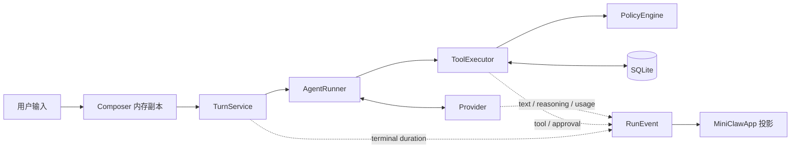
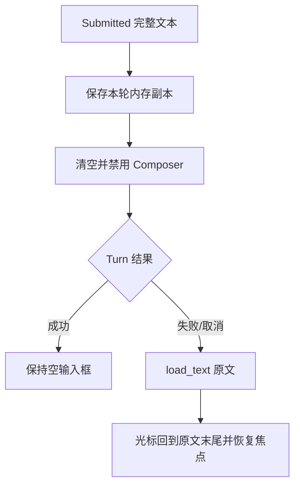
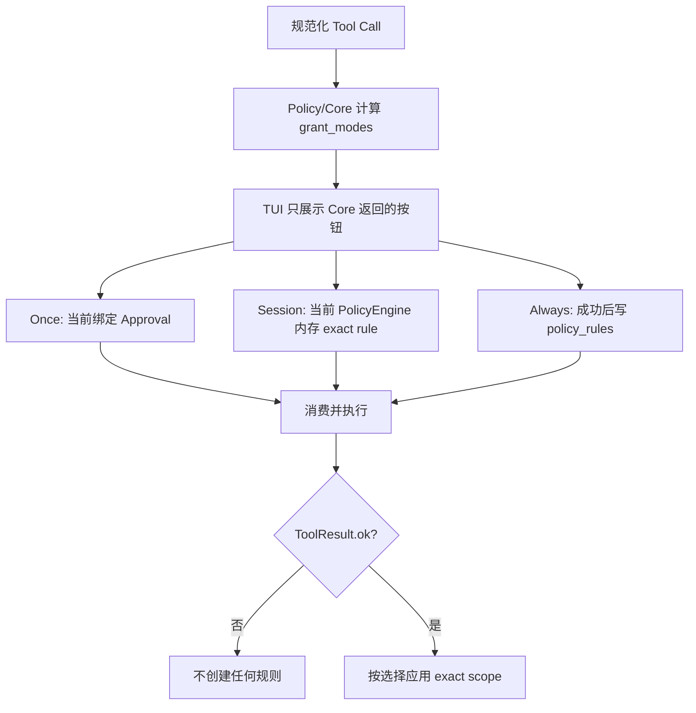

# Phase 2 加固：TUI 可观测、长文本与分级审批

> 状态：已实现并验证  
> 当前门禁：273/273 tests、21/21 offline Agent cases、Ruff PASS
> 范围：唯一 Textual TUI；不代表 `lark-cli` 或飞书 Channel 已完成

## 1. 大白话结论

这轮不是再造一套 TUI，而是把现有单入口补成适合长期调试的个人 Agent 界面：

- 用户消息和 MiniClaw 回答不再挤成一团；
- Provider 返回的 reasoning 仍可看，但默认折叠、弱色、低视觉权重；
- 长文本发送失败或取消时，原文完整回到输入框；
- 底部直接显示真实上下文、Token、Tool 次数、模型迭代和耗时；
- UI 默认中文，可用 `/lang en` 切英文；
- 审批从“拒绝/仅一次”扩展为安全受限的 Session/Always；
- 文件写入、inline AppleScript 和硬拒绝命令不会因为新按钮变成永久放行。

终端没有网页那样的局部字号。所谓 reasoning “小字”，实际用默认折叠、无厚边框、弱色和更少空白实现。

## 2. 完整数据流



TUI 不查询 Provider、Policy 或数据库内部瞬时对象，也不自己计算权限。它只投影 Core 已确认的事件。

## 3. 对话层级与 reasoning

每条对话都包含文字角色标签，不能只靠颜色：

```text
┌─ 你 ───────────────────────────────────────┐
│ 帮我看看电脑配置                           │
└────────────────────────────────────────────┘

  ▸ 思考（模型）· 第 1 轮       默认折叠、弱色

┌─ MiniClaw ─────────────────────────────────┐
│ 你的系统是……                               │
└────────────────────────────────────────────┘
```

Assistant 正文继续使用同一个 Markdown Widget 流式更新；角色容器不会为每个 delta 重建。Reasoning 只展示
Provider 明确返回的 `reasoning_content`，最多 8,000 字符，不伪造隐藏思维链。

System Prompt 要求可见回答和 provider-visible reasoning 跟随 Owner 最新消息的主要语言。TUI 不二次翻译；
Provider 不遵循时保留原文，避免再发一次模型请求或改变语义。

## 4. 长文本为什么会“丢失”，现在怎样恢复

已验证 Textual 的 bracketed paste、`TextArea`、`Composer.Submitted` 和 `TurnService` 能完整传递 250,003 个字符。
真实根因是提交后先清空 Composer，而失败/取消路径没有回填。



只保存当前 Worker 的一份内存副本，不新增草稿表、后台 autosave 或剪贴板依赖。Composer 执行期间被禁用，
因此恢复不会覆盖用户在同一输入框中新写的内容。Slash Command 成功后仍正常清空。

## 5. 真实遥测契约

`AgentRunner` 每次收到 Provider 响应后发一个 `model_usage`：

| 字段 | 准确定义 |
| --- | --- |
| `iteration` | 当前 Turn 的 Provider 调用序号 |
| `context_tokens` | 最后一次 Provider 响应上报的 prompt/input token |
| `input_tokens` | 当前 Turn 各 Provider 响应上报 input token 累计 |
| `output_tokens` | 当前 Turn各 Provider 响应上报 output token 累计 |
| `tool_calls` | 当前 Turn 已接受且 call ID 合法的 Tool Call 数 |
| `provider_request_id` | Provider 最近返回的诊断 ID |

`TurnService` 在终态事件补 `duration_ms`，使用单调时钟。TUI 审计栏示例：

```text
上下文 1.2k/128k · 输入 1.5k · 输出 64 · 工具 2 · 迭代 2 · 耗时 432 ms
```

安全与准确性规则：

- 只展示 Provider usage，不用字符数或 tokenizer 猜测；
- 任一需要的 usage 未上报时显示 `N/A`，不写成 0；
- `context_budget_tokens` 是配置预算，分母不等于 Provider 已实际消费；
- `/status` 额外显示 `provider_request_id`；
- 不显示 Prompt、API Key、完整 Tool 参数或结果。

## 6. UI 语言

启动默认值来自：

```toml
[ui]
language = "zh-CN"
```

只接受 `zh-CN` 和 `en`，未知值令配置加载失败。运行中：

```text
/lang en
/lang zh
```

会原地更新状态栏、审计栏、快捷键和后续消息/审批文案，不创建第二个 App 或 Runtime。Tool 名、错误码、
Provider Request ID 保持英文，方便搜索；模型输出语言仍由用户消息决定。

## 7. 分级审批的真实含义



| Tool/调用 | Once | Session | Always |
| --- | :---: | :---: | :---: |
| `write_file` / `edit_file` | ✓ | — | — |
| 安全 `run_command` exact argv | ✓ | ✓ | ✓ |
| `/usr/bin/osascript -e ...` | ✓ | ✓ | — |
| `http_get` exact hostname + port | ✓ | ✓ | ✓ |
| Shell、删除、提权、上传等硬拒绝 | — | — | — |

重要边界：

1. TUI 不根据摘要猜权限，只读 `approval_required.grant_modes`；
2. TurnService 在批准、consume 和副作用前验证所选 scope；
3. Session/Always 只在 Tool 成功后生效；失败动作不产生规则；
4. Session 只加入当前 `PolicyEngine`，进程重启立即失效；
5. Always 复用 SQLite `policy_rules`，只保存 exact argv 或 exact hostname + port；
6. `command_rule_is_persistable()` 与 Repository 双层拒绝 inline AppleScript 持久化；
7. Policy 硬拒绝始终优先，已有规则不能覆盖。

## 8. 关键文件

| 文件 | 责任 |
| --- | --- |
| `src/miniclaw/tui/app.py` | 双语消息、reasoning、草稿恢复、审计栏、审批按钮 |
| `src/miniclaw/agent/context.py` | 回答/reasoning 跟随用户消息语言 |
| `src/miniclaw/agent/runner.py` | 每次 Provider 响应的真实 usage 与 Tool 计数 |
| `src/miniclaw/agent/turn.py` | 终态耗时、Approval decision 预检与续跑 |
| `src/miniclaw/policy/approvals.py` | `ApprovalDecision` 与可用授权范围 |
| `src/miniclaw/policy/engine.py` | Session exact rule |
| `src/miniclaw/storage/tooling.py` | 参数 hash 预检与 Always 规则持久化 |
| `src/miniclaw/tools/executor.py` | 成功后应用 Session/Always |
| `tests/test_tui.py` | 角色、长文本、双语、N/A、审批按钮、键盘交互 |

## 9. 回归证据

新能力的确定性检查包括：

- 65 KiB 以上中文输入失败后逐字恢复；
- Esc 取消后原草稿恢复且焦点回到 Composer；
- 用户和 MiniClaw 都有可见角色标签与不同结构；
- reasoning 默认折叠、可用 `Ctrl+O` 展开；
- 中文默认与 `/lang zh|en` 原地切换；
- usage 缺失持续显示 `N/A`；
- `/status` 显示 Provider Request ID；
- Modal 只显示 Core 给出的 Once/Session/Always；
- Session 重启失效、Always 重启仍有效；
- 失败命令和 inline AppleScript 不产生持久规则；
- write 的 Always 在任何副作用前返回 `scope_forbidden`。

新鲜验证命令：

```bash
.venv/bin/python -m unittest discover -s tests -v
.venv/bin/ruff check --no-cache .
.venv/bin/python -m miniclaw eval validate --root evals/scenarios
.venv/bin/python -m miniclaw eval run --suite offline --root evals/scenarios
git diff --check
```

结果：273/273 tests、21/21 offline Agent cases、Ruff PASS。

## 10. 仍未完成

- NVM/Node 下真实 `lark-cli` help/auth/runtime 闭环；
- 飞书消息 Channel 与交互卡片；
- 当前 TUI 版本的 DeepSeek live release smoke；
- 持久规则的图形化查看/撤销；
- 草稿跨进程持久化和长历史虚拟化。

这些能力继续放在 P2.3B、Phase 4 或后续 UX 阶段，不因为本轮按钮和 UI 已完成而提前声明。
