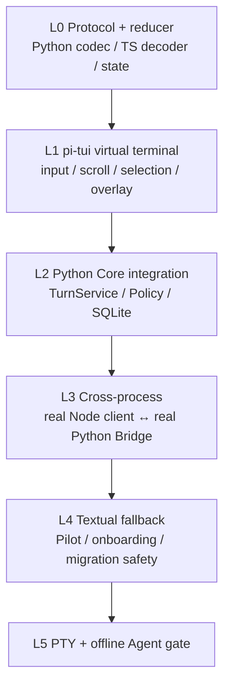
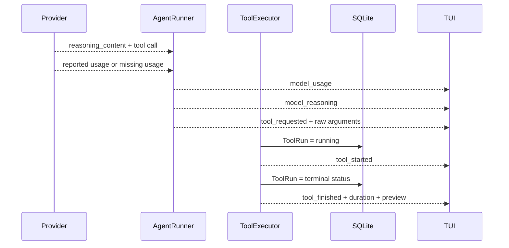
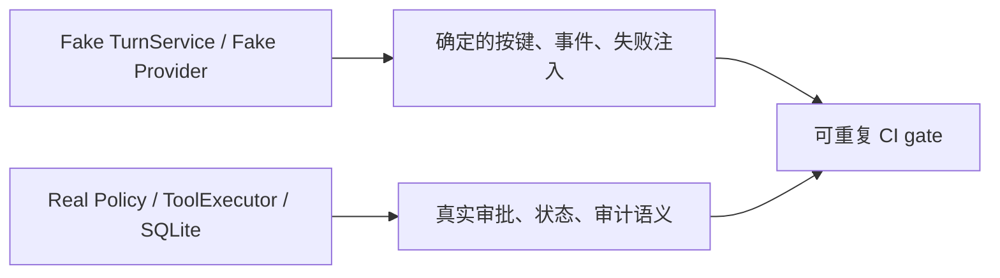

# MiniClaw TUI 回归测试规范

> 状态：已落地。本规范与 `tests/test_tui.py`、`tests/test_cli.py`、`tests/test_turn.py`、
> `tests/test_agent_runner.py` 和 `tui/test/*.test.ts` 共同构成版本门禁。当前全仓基线：
> 387/387 Python tests、25/25 TypeScript tests、24/24 offline
> Agent cases、12/12 Channel cases、Ruff PASS。

## 1. 为什么 TUI 必须单独回归

TUI 不是“好看的 `print()`”。它同时承载五类约束：

1. 用户输入不能被误提交或丢失；
2. 模型、Tool 和审批不能卡住界面事件循环；
3. Tool 参数、执行状态和结果必须可见；
4. 默认 Deny、Esc 取消、Owner 绑定等安全语义不能被 UI 绕过；
5. ANSI、控制字符、超长输出和动态 call ID 不能破坏终端。
6. Provider usage 缺失不能被 UI 猜成 0；长粘贴失败不能丢草稿。
7. Session/Always 按钮不能扩大 Core 给出的审批 scope。

因此，“单元测试通过”不等于“TUI 可以发布”。每个版本要同时验证事件契约、无头交互、
真实终端启动和 Agent 场景回归。

## 2. 测试分层



| 层 | 用什么跑 | 主要防什么 | 是否访问真实模型 |
| --- | --- | --- | --- |
| L0 协议/状态 | Python unittest + Node test runner | 拆包、版本、超限、重复消息、未知值 | 否 |
| L1 虚拟终端 | 真实 `TuiAltScreen` + 注入式 MemoryTerminal | 长粘贴、滚动、鼠标选择、OSC52、Overlay、窄终端 | 否 |
| L2 真实 Core 集成 | Fake Provider + 真实 SQLite/Policy/Tool | UI 看到未落库状态、审批绕过 | 否 |
| L3 跨进程 | 真实 Node BridgeClient + 真实 Python Bridge | stdout 污染、环境、协议漂移、退出回收 | 否 |
| L4 fallback | Textual `run_test()` + Pilot | 首次 onboarding、Node 不可用、迁移回退 | 否 |
| L5 PTY/Agent | 真实 TTY + `miniclaw eval run --suite offline` | 终端生命周期和 Claw-like 行为漂移 | 否 |

Live DeepSeek 是发布抽样，不作为每次提交的硬门禁：它有费用、网络和模型随机性。

## 3. 可观测 Trace 的验收契约

界面展示的不是一堆临时日志，而是从 Core 事件投影出的稳定状态：



必须始终成立的断言：

- 每个 call ID 只有一张 Tool 卡；
- Tool 标题始终可见，并显示当前状态；展开后保留 `requested -> running -> 终态` 完整路径；
- 展开后能看到模型请求参数、执行耗时和结果预览；
- Provider 返回非空 `reasoning_content` 时，生成紧凑、弱色、默认展开的 reasoning 卡；
- Provider 没返回 reasoning 时，不伪造卡片；
- 单卡可用键盘 Enter 或鼠标展开；
- `Ctrl+O` 只展开/收起全部详情，不隐藏概要；
- ANSI/C0/C1 在进入 Widget 前被移除；
- Tool 预览不超过 2,000 字符，折叠详情不超过 8,000 字符；
- 审批弹窗显示的是 Policy 归一化后参数，不是 Tool 卡中的原始模型参数。
- 审计栏只显示 Provider 真实 usage；缺失显示 `N/A`；
- 用户/Agent 始终有文字角色标签和不同结构；
- 失败或取消后 Composer 逐字恢复本轮提交文本；
- TUI 只显示 Core `grant_modes` 给出的 Once/Session/Always。

## 4. 稳定用例集

ID 固定，行为变更时更新原 ID；只有新增独立能力时才新增 ID。

| ID | 场景 | 必须断言 | 当前位置 |
| --- | --- | --- | --- |
| `TUI-001` | 80x24 启动 | 状态、transcript、composer 均可见，composer 获焦 | `test_tui` |
| `TUI-002` | Enter 提交 | 只调用一次 Turn，输入清空，焦点恢复 | `test_tui` |
| `TUI-003` | Shift+Enter | 只换行，不调用 Agent | `test_tui` |
| `TUI-004` | Esc 取消 | Worker 收到 `CancelledError`，composer 恢复 | `test_tui` |
| `TUI-005` | 流式文本 | 同 Turn 只有一张临时 Assistant，完成后固化 | `test_tui` |
| `TUI-006` | Tool 状态链 | 同 call ID 从 requested 更新至 running/终态 | `test_tui` |
| `TUI-007` | Tool 单卡展开 | 概要不消失，Enter 显示参数/耗时/预览 | `test_tui` |
| `TUI-008` | Provider reasoning | 只展示真实返回字段，详情有界且安全 | `test_tui` |
| `TUI-009` | Ctrl+O | Tool/Reasoning 详情全展开后全收起，卡片不隐藏 | `test_tui` |
| `TUI-010` | 控制字符 | ANSI、OSC、C0/C1 不能改写终端 | `test_tui` |
| `TUI-011` | 危险动作审批 | 完整归一化参数、Deny 默认焦点、文件只 Allow once | `test_tui` |
| `TUI-012` | Esc 关闭审批 | 等价 Deny，不执行动作 | `test_tui` |
| `TUI-013` | Slash command | 不访问模型，在同一 transcript 显示 | `test_tui` |
| `TUI-014` | `/new` | 清空投影、更换 session ID、不创建第二 Runtime | `test_tui` |
| `TUI-015` | 缺少状态 | 在同一 App onboarding，初始化后原地进入 composer | `test_tui` |
| `TUI-016` | 裸命令 TTY guard | 非 TTY 和 `TERM=dumb` 明确失败 | `test_cli` |
| `TUI-017` | 持久化事件顺序 | Tool/Turn 事件发送前数据库已进入对应状态 | `test_turn` |
| `TUI-018` | 裸命令 PTY smoke | 真实启动、可提交、可正常退出 | 发布前 smoke |
| `TUI-019` | 对话角色层级 | “你”/“MiniClaw”文字标签、不同容器、Assistant 仍单 Widget 流式更新 | `test_tui` |
| `TUI-020` | 长文本失败恢复 | 250,000 字符中文原文逐字回填，焦点恢复 | `test_tui` |
| `TUI-021` | 真实遥测 | context/input/output/tool/iteration/duration 正确投影；缺失为 N/A | `test_tui` / `test_agent_runner` |
| `TUI-022` | UI 双语 | 默认中文，`/lang zh|en` 原地切换且不调用 Agent | `test_tui` / `test_config` |
| `TUI-023` | 分级审批 | 只显示 Core grant_modes；Session/Always 精确 scope 且失败不产生规则 | `test_tui` / `test_tool_executor` |
| `TUI-024` | 安全失败提示 | 显示 Core 错误码和双语摘要，不泄露底层异常正文，原输入恢复 | `test_tui` |
| `TUI-025` | NDJSON 拆包/粘包 | UTF-8 边界、多个帧、畸形/2 MiB 超限均为稳定结果 | `tui/test/protocol.test.ts` |
| `TUI-026` | 鼠标长选区 | SGR drag 后发出完整 OSC52，流式更新不替换 Timeline | `tui/test/input.test.ts` |
| `TUI-027` | 人工上滚 | 100 delta 不改变 scrollTop；回到底部恢复 follow | `tui/test/input.test.ts` |
| `TUI-028` | Core 异常退出 | 解锁 Editor、恢复草稿，只显示稳定 code | `tui/test/input.test.ts` |
| `TUI-029` | pi-tui 审批 Overlay | 只渲染 grant_modes，按键决定准确回传 Core | `tui/test/approval.test.ts` / `input.test.ts` |
| `TUI-030` | 跨语言 Bridge | Node Client 与真实 Python Core 完成 hello/shutdown | `python-bridge.test.ts` / `test_pi_tui_integration.py` |
| `TUI-031` | 首次启动与回退 | 未初始化走 Textual onboarding；显式 pi 给出 init 提示 | `test_tui_launcher.py` |

## 5. 为什么只做有语义的虚拟终端快照

整屏 golden 文本对终端尺寸、Unicode 宽度和主题非常敏感，很容易出现“行为没变，快照全红”。MiniClaw 使用真实
pi-tui renderer 与内存 Terminal，但断言有语义的布局事实：

- 64/80/120 列下任何行不越界；
- Header 与 Telemetry 保持单行；
- 角色、Reasoning、Tool 和最终正文顺序正确；
- 组件 identity、scrollTop、isFollowingEnd 与 Overlay 状态稳定；
- 鼠标事件真的产生 OSC52，而不是只测复制 helper；
- 用户按键产生的 Core 请求和不可绕过的安全终态。

只有出现需要长期固定的复杂视觉布局时，再增加少量指定尺寸快照，不替代行为断言。

## 6. Fake 和真实边界



Fake 只用在外部不确定边界：模型输出和用于聚焦 UI 的 TurnService。Policy、ToolExecutor、SQLite、
Approval Repository 和 Workspace Guard 在集成测试中使用真实实现。这样既不依赖网络，也不会把
最重要的安全边界 mock 掉。

## 7. 版本必跑门禁

本地与 CI 执行同一组命令：

```bash
.venv/bin/python -m unittest discover -s tests -v
.venv/bin/ruff check --no-cache .
pnpm --dir tui build
pnpm --dir tui test
uv run miniclaw eval validate --root evals/scenarios
uv run miniclaw eval run --suite offline --root evals/scenarios
git diff --check
```

发布或修改 CLI/pi-tui/Textual fallback 时，再加一次真实 PTY smoke：

```text
1. 在伪终端启动裸 miniclaw。
2. 验证屏幕出现状态栏、transcript 和唯一 composer。
3. 提交一条可预测输入或 `/help`。
4. 验证界面仍可交互。
5. 拖选一段多行内容，确认系统剪贴板得到完整文本。
6. 使用 `/quit` 或 Ctrl+Q 退出，进程返回 0。
```

## 8. 新增 TUI 能力的测试模板

每个新能力至少要先写一条会失败的行为测试：

1. 协议/投影先写纯 decoder/reducer RED；
2. 用注入的 MemoryTerminal 创建真实 `TuiAltScreen`；
3. 通过原始键盘、bracketed paste 或 SGR mouse 序列操作，不只调用业务 helper；
4. 断言用户可见文字、焦点和业务副作用；
5. 安全相关能力再加一条真实 Policy/SQLite 集成断言；
6. 保持对应 Textual fallback 用例，直到迁移期结束；
7. 确认新测试在实现前为 RED，实现后为 GREEN；
8. 更新本文的用例表和全仓基线数字。

## 9. 当前不做的事

- 不用真实 DeepSeek 输出做每次提交的硬断言；
- 不因为主题或 Unicode 宽度的细微变化让整张全屏快照失败；
- 不展示或测试未由 Provider 返回的隐藏思维链；
- 不为了测试 TUI 再造第二套 Agent Runtime；
- 不在 TUI 测试中放宽 Workspace、命令、HTTP 或 Approval 安全边界。

如果未来增加多面板、主题或复杂响应式布局，再增加少量视觉快照和尺寸矩阵；当前行为契约已覆盖
唯一入口、交互、Trace、审批和安全渲染。

本轮实现细节与 scope 表见
[Python Core + pi-tui Bridge 工程文档](python-core-pi-tui-bridge.md)与
[TUI 可观测、长文本与分级审批](tui-observability-and-scoped-approvals.md)。
