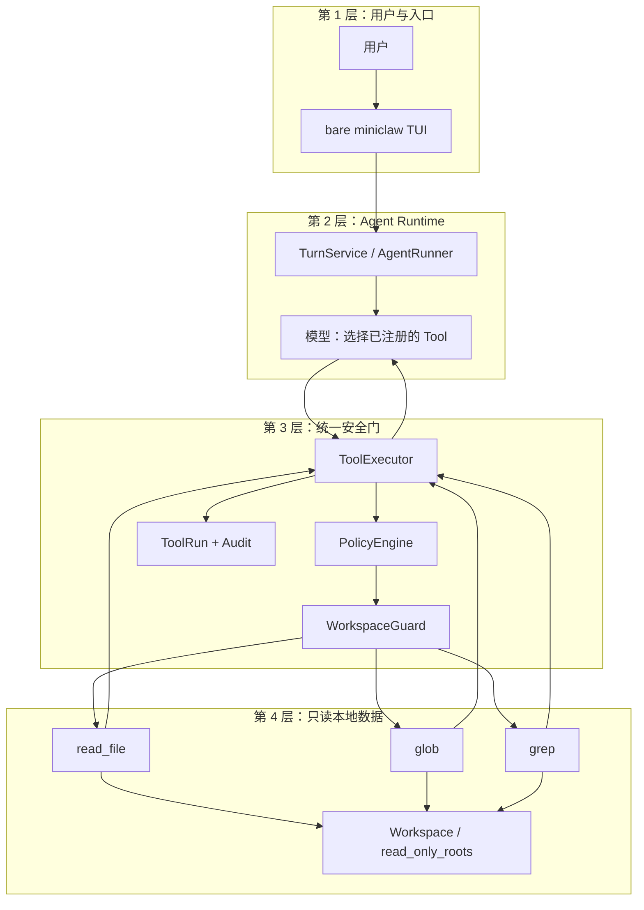
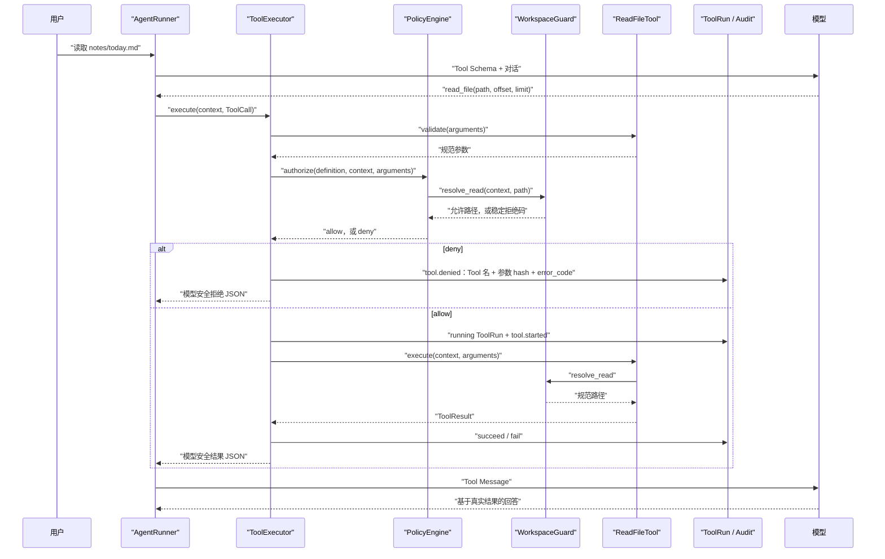
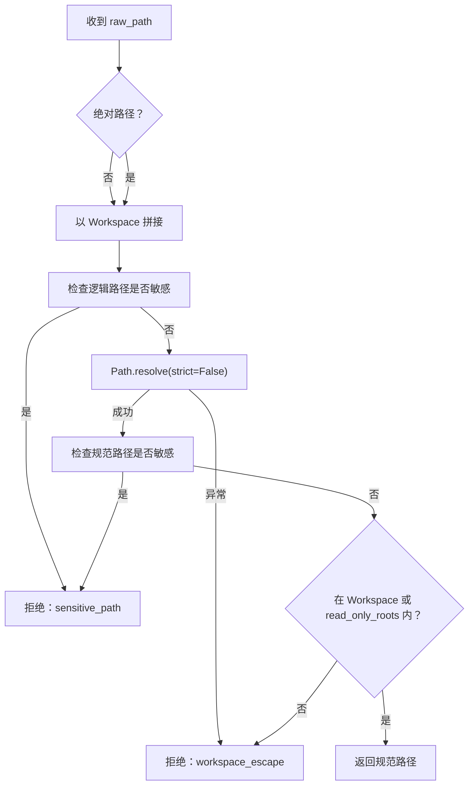

# Phase 2.1B 工程文档：Workspace 只读文件与搜索 Tool

> 状态：已验证（离线测试与本地质量门禁）
>
> 范围：`read_file`、`glob`、`grep`、统一 Workspace 读取边界，以及它们在 CLI Agent Runtime 中的装配。
>
> 不代表：真实模型文件调用冒烟、任何文件写入、Shell、审批或飞书已完成。

## 1. 这次到底多了什么

上一小步 P2.1A 让模型能通过 `system_info` 看脱敏的电脑配置。P2.1B 则让它在**已配置的
Workspace** 里做三件只读小事：打开一段 UTF-8 文本、按文件名找东西、按正则在文本里找行。

它们不是给模型一把终端；模型不能借此读任意路径，也不能调用 `cat`、`find`、`grep`。每次调用仍走已有的
Tool Schema、参数校验、`PolicyEngine`、`ToolExecutor`、ToolRun/Audit 和 Tool Message 持久化链路。



四层的分工很直接：入口接收请求；Agent 决定是否需要工具；安全层决定参数和路径能否通过；最后一层才碰磁盘。
因此，Tool 本身不需要知道调用来自 CLI 还是未来的飞书，也没有绕过门卫的第二条捷径。

## 2. 本阶段范围与非范围

### 已实现并有离线测试的内容

- `read_file`：读取单个普通 UTF-8 文本文件的有限行窗口；
- `glob`：在安全 root 下匹配文件与目录相对路径；
- `grep`：在有限数量、有限字节的 UTF-8 普通文件中逐行执行 Python 正则；
- `WorkspaceGuard`：相对路径、绝对路径、符号链接和敏感路径统一判定；
- CLI Runtime 注册四个 Tool：`system_info`、`read_file`、`glob`、`grep`；
- 低风险、可读的合法路径可通过已有 `PolicyEngine` 自动放行，结果进入既有审计与对话历史。

### 明确还没有的内容

- 没有 `write_file`、`edit_file`、删除、移动或目录创建；
- 没有 Shell Tool，不能运行 `cat`、`find`、`grep` 或任意命令；
- 没有审批对象、审批 CLI、批准后的续执行；
- 没有飞书或其他 IM 接入；
- 没有真实 DeepSeek 文件 Tool 冒烟记录。本阶段的 Agent 集成验证使用离线 fake Provider/HTTP-SSE 测试；
- `read_only_roots` 是配置支持的附加读取根，不是对任意系统目录的放行。

## 3. 一次 `read_file` 调用如何走完

模型只提交 Tool 参数；用户、会话、Turn、Workspace 和状态目录来自运行时 `ToolContext`，不能由模型伪造。



这里有两次 Guard 检查：Policy 在创建 ToolRun 前预检，Tool 在真正读取前再次解析。拒绝不会创建 ToolRun 或
`tool.started`，但会先原子写一条 `tool.denied`；其 metadata 只含 Tool 名、规范参数 SHA-256 的 12 位前缀和稳定错误码，
不保存原始路径或文件内容。若拒绝审计写入失败，Executor 失败关闭，不会返回一个伪装正常的拒绝结果。

## 4. Workspace Guard：先问“能不能读”，再问“怎么读”

`WorkspaceGuard.resolve_read()` 是本阶段所有路径的公共门卫。相对路径默认相对于
`[workspace].path`；绝对路径只有位于 Workspace 或配置的 `read_only_roots` 内才可能通过。



Guard 会拒绝 `.env*`、`.ssh`、`.aws`、`.gnupg`、`.kube`、`.git-credentials`、`.pypirc`、
`.docker/config.json`、GCP 默认凭据、常见私钥/密钥库后缀、MiniClaw 自己的配置/数据库/日志、
状态根下精确的 `miniclaw.db-wal/-shm/-journal`、`/etc/shadow` 等系统敏感文件，以及容器 socket。检查同时在
逻辑路径和符号链接解析后的路径做一次；`miniclaw.db-notes.md` 这类普通文件不会被无限通配误伤。

对模型可见的成功路径始终相对于实际允许根展示。例如 `shared` 只读根里的绝对文件返回 `guide.md`，而不是泄露本机
Home 或临时目录绝对路径。

## 5. 三个 Tool 的公开契约

所有 Tool 均拒绝未知参数；整数也显式排除 JSON 布尔值。下面的“错误”是经 Executor 交给模型的稳定码；参数校验
失败会统一包装为 `invalid_arguments`。

### 5.0 所有 Tool 共用的 Tool Message 外壳

下面三个表中的“成功返回”只描述 `data` 内部字段，不是完整的模型 Tool Message。`ToolExecutor` 最后交给模型的
结果始终有统一外壳：

| 情况 | 完整模型结果形状 | 说明 |
| --- | --- | --- |
| 成功 | `{"ok": true, "tool": "read_file", "data": {…}}` | `tool` 是实际 Tool 名；三个 Tool 表列出的成功字段都位于 `data`。 |
| 失败 | `{"ok": false, "tool": "read_file", "error": {"code": "…", "message": "…", "retryable": false}}` | 三个 Tool 表列出各自可能产生的错误码；模型不接收 traceback。 |
| Executor 公共失败 | 同上失败外壳，`error.code` 为 `tool_failed` 或 `tool_result_too_large` | Tool 抛出未预期异常时是 `tool_failed`；紧凑 JSON 结果超过配置上限时是 `tool_result_too_large`。 |

`ToolExecutor` 默认 `tool_result_max_chars=20_000`。`read_file` 单次 `content` 最多 512 KiB，因此结果仍可能超过
20,000 字符的模型上限；此时 Executor 返回 `tool_result_too_large`。正常多行文件可缩小 `limit` 或按
`next_offset` 分页；一条完整行若大于 512 KiB，则直接返回 `line_too_large`，不发布会跳过内容的 cursor。

### 5.1 `read_file`

| 项目 | 已实现行为 |
| --- | --- |
| 参数 | `path` 必填、非空字符串；`offset` 可选，正整数，默认 `1`；`limit` 可选，`1..1000`，默认 `200`。 |
| `data` 成功字段 | `path`（允许根相对路径）、`content`、`offset`、`lines`、`truncated`；当还有可继续的行窗口时附加 `next_offset`。 |
| 读取上限 | 流式跳过 `offset` 前的完整行，再返回最多 `512 KiB`、最多 `limit` 条完整行；内存使用有界。 |
| 错误 | `workspace_escape`、`sensitive_path`、`not_found`、`not_a_file`、`file_read_failed`、`binary_file`、`line_too_large`、`invalid_arguments`。 |
| 文本规则 | 只接受严格 UTF-8；NUL 字节或非法 UTF-8 按 `binary_file` 拒绝；只读取普通文件。 |

`offset` 是从 1 开始的行号，不是字节偏移。页尾放不下的普通行不会被切断：当前页停在它之前，`next_offset` 指回该行，
下一次会完整返回它；因此跨过文件开头 512 KiB 后仍能继续读真实行，无末尾换行的最后一行也不会丢失。单行自身超过
512 KiB 时无法用行号无损分页，稳定失败为 `line_too_large`。窗口外才开始的 UTF-8 字符不会被误判为二进制。

### 5.2 `glob`

| 项目 | 已实现行为 |
| --- | --- |
| 参数 | `pattern` 必填、非空相对 glob；`root` 可选、非空字符串，默认 `.`；`limit` 可选，`1..200`，默认 `200`。 |
| `data` 成功字段 | `matches`（按相对路径全局排序）和 `truncated`。安全目录本身与其普通文件都可能匹配返回。 |
| 遍历规则 | `os.walk(..., followlinks=False)`；目录和文件符号链接都在解析目标前跳过；每个其余候选再经 Guard 和 `stat`。 |
| 错误 | `workspace_escape`、`sensitive_path`、`invalid_arguments`。不可读、消失、权限失败或不安全候选会跳过，不把宿主机细节交给模型。 |
| 结果上限 | 多取第 `limit + 1` 项后按全局字典序截断，保证较晚遍历到的字典序更小路径不会被漏掉。 |

`**/*` 和 `**/*.py` 也会匹配 root 顶层文件；这是 Tool 的路径匹配兼容规则，不要求模型退回 Shell `find`。

### 5.3 `grep`

| 项目 | 已实现行为 |
| --- | --- |
| 参数 | `pattern` 必填、非空 Python 正则；`glob` 可选、非空相对 glob，默认 `**/*`；`root` 可选，默认 `.`；`limit` 可选，`1..100`，默认 `100`。 |
| `data` 成功字段 | `matches`（每项有 `path`、1 开始的 `line`、最多 500 字符的 `text`）和 `truncated`。每行最多返回一次。 |
| 文件规则 | 只扫描普通 UTF-8 文件；NUL、非法 UTF-8、读取失败和大于 `1 MiB` 的单文件都跳过。 |
| 错误 | `invalid_pattern`、`workspace_escape`、`sensitive_path`、`invalid_arguments`。 |
| 总上限 | 最多尝试 200 个匹配、Guard 允许的普通文件，累计实际读取 `20 MiB`；达到文件/字节预算或结果超过上限时返回 `truncated=true`。 |

文件候选在尝试打开前就消耗 200 文件配额，所以超大、权限失败、消失、二进制和非法 UTF-8 候选都计数；第 201 个
匹配项不再 `stat/open`。20 MiB 只累计实际读取字节。`grep` 在每个已打开文件上比较同一 fd 的读取前后 metadata；
发现读取期间长度或关键 metadata 改变时跳过结果，已读字节仍计入总预算。

## 6. 为什么不做 Shell `cat` / `find` / `grep`

Shell 看起来是最短路径，但对模型来说它会把“读取一个文件”扩大成“可启动一个程序并组合参数”。哪怕只允许
`cat`、`find`、`grep`，也还要逐项定义可执行文件、argv、cwd、通配符、重定向、管道、环境变量、超时、输出大小和
跨平台差异。那是 P2.3 的受限命令问题，不是本阶段的只读文件问题。

本阶段三个原生 Tool 把能力缩到实际需要的最小面：`path`/`root` 先过 Guard，`glob` 是相对路径模式，`grep` 只接收
文本正则；输入、输出和资源上限都可被测试。它们还天然沿用 ToolRun/Audit 和模型安全错误格式。简而言之：用户要的是
“看文件、找文件、找文本”，不是给模型一个藏在读取功能里的终端。

## 7. 源文件职责与装配点

| 文件 | 本阶段职责 |
| --- | --- |
| `src/miniclaw/policy/workspace.py` | `WorkspaceGuard`、稳定 `WorkspaceAccessError`、敏感路径黑名单和安全相对展示路径。 |
| `src/miniclaw/tools/filesystem.py` | `ReadFileTool` 的 Schema、参数规范化、512 KiB 有界 UTF-8 行窗口、文件错误映射。 |
| `src/miniclaw/tools/search.py` | `GlobTool`/`GrepTool` 的 Schema、稳定遍历、普通文件筛选、排序、结果与读取预算。 |
| `src/miniclaw/storage/tooling.py` | allowed ToolRun 状态迁移，以及不创建 ToolRun 的脱敏 `tool.denied` 审计。 |
| `src/miniclaw/runtime.py` | 生产 Runtime 组装；把文件/search Tool 与 `SystemInfoTool` 注册进唯一 `ToolExecutor`。 |
| `src/miniclaw/policy/engine.py` | 对三个读取 Tool 的路径参数在开始 ToolRun 前做 Guard 预检；合法 low-risk 读取才允许执行。 |
| `src/miniclaw/tools/executor.py` | 保持唯一顺序：`get → validate → policy → (deny audit 或 start → execute → finish)`；负责失败关闭、异常脱敏和结果上限。 |

相关测试分别在 `tests/test_workspace_policy.py`、`tests/test_file_tools.py`、`tests/test_search_tools.py`，并由
`tests/test_tool_executor.py`、`tests/test_turn.py`、`tests/test_runtime.py` 与 `tests/test_tui.py` 覆盖 Policy、消息
轨迹、生产装配和唯一人类入口。

## 8. 本地调试与验证命令

先在仓库根目录安装开发依赖；所有单元测试离线运行，不需要模型 Key。

```bash
uv sync --extra dev
uv run python -m unittest tests.test_workspace_policy tests.test_file_tools tests.test_search_tools -v
uv run python -m unittest tests.test_turn tests.test_runtime tests.test_tui -v
uv run python -m unittest discover -s tests -v
uv run ruff check .
```

若要让已配置的模型**尝试**读取 Workspace，先初始化，并把演示文件放入默认的
`~/.miniclaw/workspace/`（或在 `config.toml` 设置绝对 `[workspace].path`）。以下命令只提供模型可调用的
工具与提示；模型是否选择调用，取决于真实 Provider。它不是本阶段已完成的真实 DeepSeek smoke。

```bash
uv run miniclaw init
printf 'hello from MiniClaw workspace\n' > ~/.miniclaw/workspace/demo.txt
uv run miniclaw
```

然后在同一个 TUI 中依次输入“请使用 read_file 读取 demo.txt 的内容”“请使用 glob 查找当前 Workspace 的
`*.txt` 文件”“请使用 grep 在当前 Workspace 的 `*.txt` 中搜索 MiniClaw”。

也可通过绝对 `MINICLAW_WORKSPACE` 环境变量或 `config.toml` 的 `[workspace].path` 切换到另一个 Workspace。
不要把 `.env`、凭据、MiniClaw 状态目录或任意 Home 目录当作演示目标：Guard 的目标正是拒绝它们。

## 9. 测试矩阵

| 层次 | 测试文件 | 覆盖的可观察结果 |
| --- | --- | --- |
| Workspace 边界 | `test_workspace_policy.py` | 相对/只读根允许，父目录与绝对逃逸拒绝，符号链接、循环、凭据、状态、系统敏感文件和 socket 拒绝，错误不泄露绝对路径。 |
| 文件读取 | `test_file_tools.py` | 1 开始 offset、跨 512 KiB 完整行分页、无末尾换行、超长单行、UTF-8/NUL、目录/不存在路径。 |
| 文件名搜索 | `test_search_tools.py` 的 `GlobToolTest` | 排序、顶层递归匹配、目录结果、全局 limit、敏感路径，以及目录/文件 symlink 跳过。 |
| 文本搜索 | `test_search_tools.py` 的 `GrepToolTest` | 正则、摘要、排序、1 MiB/200 候选/20 MiB 上限、失败候选计数、fd race 与 symlink 去重。 |
| 统一入口 | `test_tool_executor.py` | Guard 拒绝只写脱敏 `tool.denied`、无 ToolRun；合法读取才创建 running/terminal ToolRun。 |
| Runtime 装配 | `test_turn.py`、`test_cli_chat.py` | `read_file` 与全部四个 Schema 进入 Agent Runtime，Tool Message、ToolRun 和 Audit 完整保存。 |
| Agent 场景 | `test_eval_cases.py`、`test_eval_runner.py`、`test_cli_eval.py` | 版本化 query 经真实 Agent/Policy/Tool/SQLite，21/21 active cases PASS。 |
| 全仓回归 | `unittest discover` 与 Ruff | P2.1B exit gate 为 153 tests；当前 P2.1C 基线为 **177 tests**，另运行 `uv run ruff check .`。 |

## 10. 常见报错怎么理解

| 现象或错误码 | 大白话解释 | 下一步 |
| --- | --- | --- |
| `invalid_arguments` | 参数缺失、类型不对、超范围，或带了未声明字段。 | 对照上面的 Schema；不要传命令、绝对 glob 或布尔值冒充整数。 |
| `workspace_escape` | 路径解析后不在 Workspace/只读根内，或解析本身不安全。 | 把文件放进配置的 Workspace，使用相对路径。 |
| `sensitive_path` | 虽在允许根附近，但名字或解析目标属于凭据、状态、系统敏感路径或 socket。 | 不要尝试读取它；用专门的受控配置流程处理凭据。 |
| `not_found` / `not_a_file` | `read_file` 找不到目标，或目标不是普通文件。 | 先用 `glob` 查看安全路径，再读取具体文件。 |
| `binary_file` | 文件有 NUL 或不是 UTF-8 文本。 | 该 Tool 不处理二进制；不要改用 Shell 绕过。 |
| `line_too_large` | 流式读取或跳过时遇到单条超过 512 KiB 的行，无法用行号无损分页。 | 拆分该行或文件；不会收到会跳过内容的 `next_offset`。 |
| `invalid_pattern` | `grep.pattern` 不是有效 Python 正则。 | 先简化模式，检查括号、方括号和反斜杠。 |
| `truncated: true` | 命中/路径/文件内容或预算还没全部返回。 | 缩小 `root`、`glob`、`limit` 或用 `next_offset` 继续读。 |

## 11. 已知安全与性能边界

### TOCTOU 仍是边界，不是假装已经完全解决

`resolve_read()`、`stat()` 与 `open()` 不是一个不可分割的文件系统事务。本阶段会解析符号链接、拒绝不安全目录，
并且 `grep` 对已打开 fd 比较读取前后 metadata，能发现一部分“检查后文件变了”的情况；但本机有能力同时修改
允许 Workspace 的攻击者仍可能在检查与使用之间替换路径或内容。`read_file` 也没有把整个读取做成原子快照。

所以这套 Guard 是**Workspace 边界和意外泄露的防线**，不是对恶意并发本地写入者的完整抗 TOCTOU 承诺。若将来需要
面对该威胁模型，应另行设计目录 fd、`openat` 风格的无跟随打开、文件描述符绑定和平台差异测试；不能把它悄悄塞进
本阶段说明里当成已实现。

### Python 标准库 `re` 没有硬超时

`grep` 限制文件数、单文件字节、累计字节、结果数和单条文本长度，这会限制读取量与返回量；但 `re.compile()` /
`regex.search()` 仍使用 Python 标准库，**没有每个模式或每行的硬 CPU 超时**。病态正则配上合适输入可能发生灾难性
回溯，令一次 Tool 调用占用较久。

因此当前 Tool 适合受控、可信 Workspace 的日常查找，不应把模型提供的复杂正则当成可无限信任的多租户输入。需要
硬时限时，应在后续阶段专门引入可超时的匹配策略或进程隔离，并为超时语义、取消和审计补测试。

### `grep` 的极端保守截断标记

`grep` 扫描满 200 个合格普通文件后，如果排序中的下一个候选只是一条会被跳过的 symlink，当前实现仍可能保守返回
`truncated=true`。它不会读取、泄露或重复返回 symlink 目标，只是可能把“已完整扫描”误报成“还有普通文件未扫描”。
该边界不影响搜索结果安全性；若后续需要严格区分，可把 symlink 过滤提前到预算 sentinel 之前并补定点回归。

## 12. 给 P2.2 的接口衔接

P2.2 规划的是 `write_file`、`edit_file`、参数绑定审批与 CLI 审批/续执行；它们在当前版本**尚不存在**。本阶段留下的
可复用接口是：

- 新 Tool 仍实现 `ToolDefinition`、`validate()`、`execute()`，由 Registry 暴露 Schema；
- 运行期身份和边界继续只从 `ToolContext` 取得，模型参数不能伪造它们；
- 必须继续通过 `ToolExecutor` 的唯一顺序，不可直接调用文件系统绕开 Policy、ToolRun 和 Audit；
- `ToolResult` 的稳定 JSON 与既有 Tool Message 持久化可承载将来的成功/拒绝结果；
- 当前 `PolicyEngine` 对 medium/high 只返回 `approval_required`，并**不会**创建审批或续执行；P2.2 必须补齐真实状态机；
- `WorkspaceGuard.resolve_read()` 只表示读取许可。写入必须有单独的写入解析、覆盖风险、原子写入和审批绑定设计，不能把
  “能读”误当成“能写”。

这让 P2.2 可以复用运行通道，却不能误借 P2.1B 的只读授权扩大权限。

## 13. 本阶段实现提交与事实来源

读取边界与 Tool 的实现提交依次为：`76b0999`、`359e5fc`、`311c02f`、`c8e7d80`、`3a27688`、`73bdec3`、
`f599087`、`c3f8409`、`b94bd45`、`3aa6e13`、`942acd2`。其中 `942acd2` 保证 Python 3.13 也会拒绝
symlink loop；P2.1B exit gate 的 153 项测试已分别在 Python 3.12 与 3.13 通过，当前 P2.1C 全仓基线为
177 项。本页事实来自这些提交中的 `workspace.py`、
`filesystem.py`、`search.py`、`cli.py`，以及对应单元测试和现有 Tool Runtime 契约；本页不把设计文档中的
P2.2/P2.3 规划写成当前功能。Agent 版本回归的最新验证方式见
[P2.1C 工程文档](agent-regression-evals.md)。
