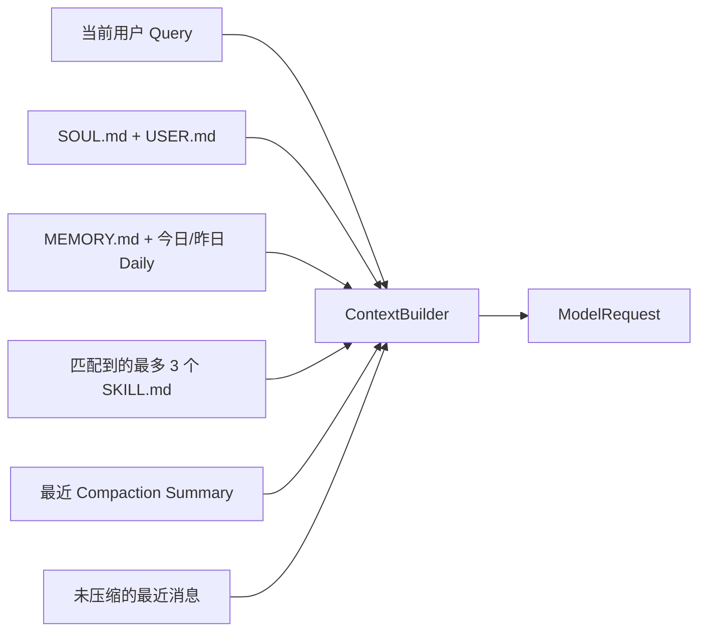
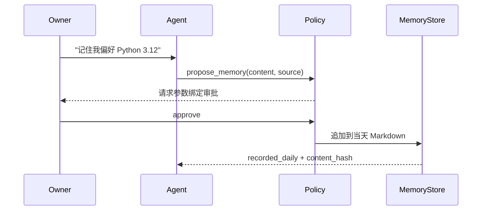
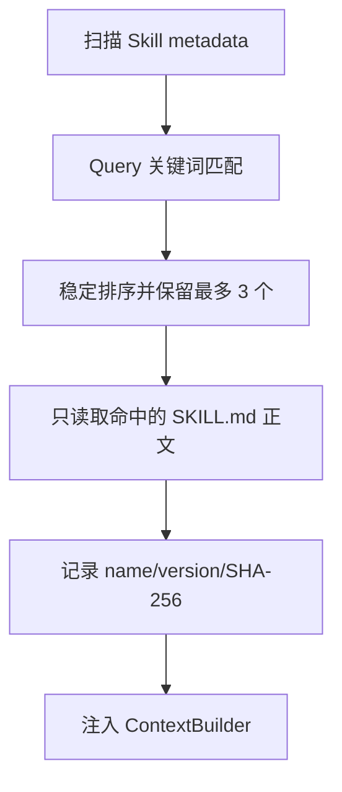
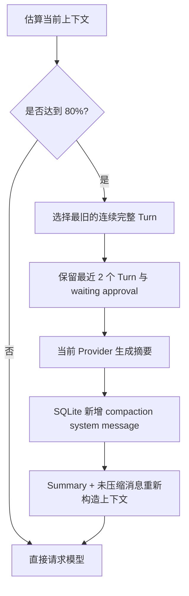
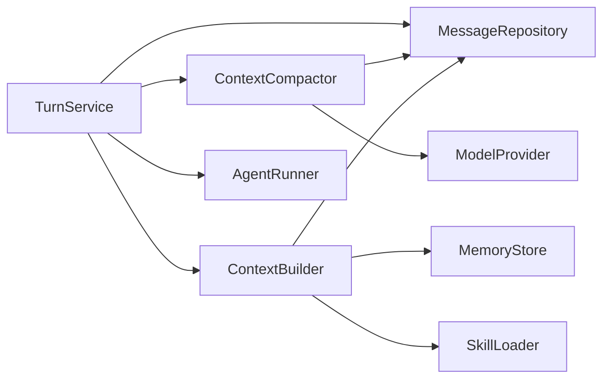

# Phase 3：Memory、Skills 与上下文压缩工程文档

> 状态：已实现并通过阶段门禁。Phase 3 首次证据为 296/296 tests；当前合并基线为
> 376/376 Python tests、25/25 TypeScript tests、24/24 offline Agent cases、Ruff PASS；
> 当前版本没有把历史 v0.2 DeepSeek live smoke 冒充 Phase 3 新结果。

## 1. 这阶段解决什么

Phase 2 让 MiniClaw 能安全地使用本机 Tool。Phase 3 让它在对话变长或进程重启后，仍能记住稳定信息、
按需加载做事方法，并且不会因为历史越来越长而撞上模型上下文上限。

用大白话说：

- `MEMORY.md` 是整理过的长期记忆；
- `memory/YYYY-MM-DD.md` 是当天的工作便签；
- `skills/<name>/SKILL.md` 是“遇到某类任务时该怎么做”的说明书；
- SQLite 里的 compaction summary 是长对话的压缩包，原聊天记录仍完整保留。



## 2. 从 Claw-like 项目借鉴什么

MiniClaw 不照搬大系统的全部复杂度，只复用已经被验证的核心原则：

| 项目 | 借鉴点 | MiniClaw Phase 3 的取舍 |
| --- | --- | --- |
| [OpenClaw Memory](https://github.com/openclaw/openclaw/blob/main/docs/concepts/memory.md) | Markdown 是可审阅的记忆真相源；长期记忆与 daily notes 分层 | 使用 `MEMORY.md`、今日和昨日文件；暂不上向量库 |
| [OpenClaw Compaction](https://github.com/openclaw/openclaw/blob/main/docs/concepts/compaction.md) | 摘要替代旧消息进入下一次上下文，最近消息保留，完整历史仍在磁盘 | 摘要写回 SQLite；不删除 `messages` 原记录 |
| [OpenClaw Skills](https://github.com/openclaw/openclaw/blob/main/docs/tools/skills.md) | 启动时只读取 Skill metadata，控制 Skill 对 token 的占用 | 当前 Query 确定性匹配，最多读取 3 个正文 |
| [nanobot](https://github.com/HKUDS/nanobot) | Memory、Skills 作为小 Agent Loop 的上下文能力，不做重型编排层 | 复用现有 `ContextBuilder` 和 Tool Loop，不增加框架依赖 |

## 3. Memory 设计

### 3.1 三层数据

| 层 | 路径/存储 | 保存内容 | 谁能写 |
| --- | --- | --- | --- |
| 原始会话 | SQLite `messages` | 用户、助手和 Tool 的完整轨迹 | TurnService |
| 长期记忆 | `~/.miniclaw/MEMORY.md` | 稳定偏好、事实、长期目标 | Owner 手工整理；后续 Evolution 合并 |
| 每日记忆 | `~/.miniclaw/memory/YYYY-MM-DD.md` | 当天明确要求记住的事实和来源 | `propose_memory` 经审批后追加 |

`ContextBuilder` 自动注入长期记忆、今天和昨天的 daily memory。更老的 daily 文件不自动塞进每个请求，
需要时由 `read_memory` 读取，避免记忆越多 prompt 越大。

### 3.2 Tool 行为



- `read_memory(scope)` 是 low-risk，只读 `long_term`、`today` 或 `recent`。
- `propose_memory(content, source)` 是 medium-risk，必须审批；执行后只追加 daily memory，不静默改长期记忆。
- 每条记录包含日期、事实、`source_session`、`source`、`confidence` 和 SHA-256。
- 完全相同的事实不会重复追加。
- 文件、目录或符号链接不符合预期时 fail closed。

### 3.3 凭据过滤

进入 Memory 前拒绝常见 API Key、Bearer Token、Password、Secret、验证码和私钥片段。过滤发生在 Tool
校验和真正写盘两个边界，不能靠 Prompt 提醒代替。被拒绝的内容不出现在 Tool 结果、日志或审批摘要里。

## 4. Skills 惰性加载

Skill 目录格式：

```text
~/.miniclaw/skills/
└── summarize/
    └── SKILL.md
```

```markdown
---
name: summarize
description: 总结长文本，提取决定、风险和下一步行动。
version: 1
---

# Instructions

先给结论，再列决定、风险和 action items。
```

加载规则：

1. 只扫描 `skills/<name>/SKILL.md`，不递归执行代码。
2. 文件最大 64 KiB；目录名必须等于 `name`；名称只允许小写字母、数字和连字符。
3. 启动/每个 Turn 先读取 metadata，不读取全部正文。
4. 用当前用户 Query 与 `name + description` 做确定性关键词匹配。
5. 按匹配分数和名称稳定排序，只读取前 3 个正文。
6. 名称、版本和内容 SHA-256 写入 Turn runtime snapshot，便于回放。
7. Skill 内容不能绕过 Tool Policy；Phase 3 不执行 Skill 中的 Python 或 Shell。



## 5. Context budget 与 Compaction

默认 `context_budget_tokens = 32000`。MiniClaw 用确定性的字符估算做本地预判，达到预算的 80% 时才调用
当前 Provider 生成摘要。摘要固定要求保留：目标、完成动作、重要结果、失败、未完成事项和安全决定。



安全与恢复规则：

- 按完整 Turn 切分，Assistant Tool Call 与 Tool Result 不拆开。
- 最近两个 Turn、当前用户消息和等待审批关联 Turn 不压缩。
- 摘要记录覆盖消息 ID、模型、生成时间与内容哈希。
- 原 `messages` 行永不删除；回放仍可查看完整历史。
- Provider 摘要失败或返回空文本时不写半成品，退化为裁剪模型可见旧历史，本次正常对话继续。
- 当前用户消息、安全规则和审批状态永不因预算不足被截断。

## 6. 稳定上下文顺序

1. MiniClaw 安全 System Prompt。
2. `SOUL.md` 与 `USER.md`。
3. `MEMORY.md`、今日和昨日 daily memory。
4. 当前 Query 命中的 Skills。
5. 最新有效 compaction summary。
6. 摘要覆盖范围之后的原始消息。
7. 当前用户消息始终位于最后。

预算不够时的降级顺序：旧 Tool Result 预览 → 最旧历史 → 低分 Skill。身份、安全规则和当前用户输入不裁剪。

## 7. 数据流和代码边界



- `memory/store.py`：Memory 文件格式、大小、凭据过滤和安全追加。
- `tools/memory.py`：两个模型可见 Tool，不自行绕过 Executor/Policy。
- `skills/loader.py`：严格解析、metadata 匹配、正文按需读取与哈希。
- `agent/compaction.py`：阈值、完整 Turn 选择、Provider 摘要和持久化。
- `agent/context.py`：稳定顺序、预算和 runtime snapshot。
- `storage/conversations.py`：复用现有 `messages` 表保存摘要，不新增数据库表。

## 8. 回归测试集

每个版本除全量单元测试外，必须覆盖：

| 场景 | 断言 |
| --- | --- |
| 重启后长期记忆 | 新 ContextBuilder 仍能读取同一 `MEMORY.md` |
| 今日/昨日 daily | 两份进入上下文，更老文件不自动注入 |
| 凭据写入 | `propose_memory` fail closed，磁盘无敏感内容 |
| 参数审批 | 未批准不写，批准后只写绑定内容 |
| Skill 上限 | 4 个都匹配时只注入稳定的前 3 个 |
| Skill 逃逸/超限 | symlink、目录名不符、超过 64 KiB 被拒绝 |
| 首次压缩 | 超过 80% 后生成摘要，最近两 Turn 保留 |
| 压缩恢复 | 进程重启后读取已持久化 summary |
| 原文保留 | 压缩前后的原消息数量与内容不变 |
| 摘要失败 | 不产生 summary，当前 Turn 仍可继续 |
| runtime snapshot | 保存 Memory/Skill/Compaction 的版本和哈希 |

## 9. Phase 3 完成定义

- [x] 全量 296 个确定性测试、Ruff 与 24 条 offline Agent eval 通过。
- [x] `MEMORY-READ-001` 通过生产 `ContextBuilder`/Tool 路径读取 Memory。
- [x] `MEMORY-PROPOSE-001` 通过真实 Policy、Approval、child Turn 和文件追加链路。
- [x] `SKILL-ACTIVATE-001` 证明匹配 Skill 进入模型请求，未命中 Skill 不进入上下文。
- [x] 小预算测试触发 Provider compaction，重启后读取摘要且 SQLite 原消息完整保留。
- [x] README、架构文档、工程索引、release record、repo progress 和外部 progress HTML 同步。
- [ ] 当前版本的真实 DeepSeek Phase 3 smoke；它属于 release-only R3，不作为每次提交的确定性门禁。

机器可读 gate、复现命令和未覆盖范围见
[v0.3.0 release record](../../evals/releases/v0.3.0.md)。

## 10. 明确不做

- 不上向量数据库、Embedding、RAG、知识图谱或 Memory 市场。
- 不自动把 daily memory 合并进长期记忆；这属于后续 Evolution 的评测与人工批准链。
- 不执行 Skill 自带 Python，不允许 Skill 绕过 Policy。
- 不在后台定时改 Prompt、源码、Git 或部署。

## 11. 已落地代码与回放证据

| 边界 | 生产代码 | 主要测试/场景 |
| --- | --- | --- |
| Markdown Memory | `src/miniclaw/memory/store.py` | `tests/test_memory_store.py`、`MEMORY-READ-001` |
| Memory Tool + Approval | `src/miniclaw/tools/memory.py` | `tests/test_memory_tools.py`、`MEMORY-PROPOSE-001` |
| Skills 惰性加载 | `src/miniclaw/skills/loader.py` | `tests/test_skills.py`、`SKILL-ACTIVATE-001` |
| Context 注入与 snapshot | `src/miniclaw/agent/context.py` | `tests/test_context.py`、`tests/test_turn.py` |
| Persistent compaction | `src/miniclaw/agent/compaction.py` | `tests/test_compaction.py`、`tests/test_turn.py` |
| 唯一生产装配 | `src/miniclaw/runtime.py` | `tests/test_runtime.py`、全量 offline eval |

Phase 3 没有新增第三方运行时依赖，也没有新增数据库表。Compaction summary 复用 `messages` 表中的 system
message，并用 metadata 保存覆盖范围、模型和哈希；这让旧数据库可以直接升级，同时保留完整回放能力。
