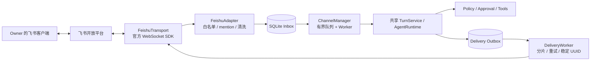
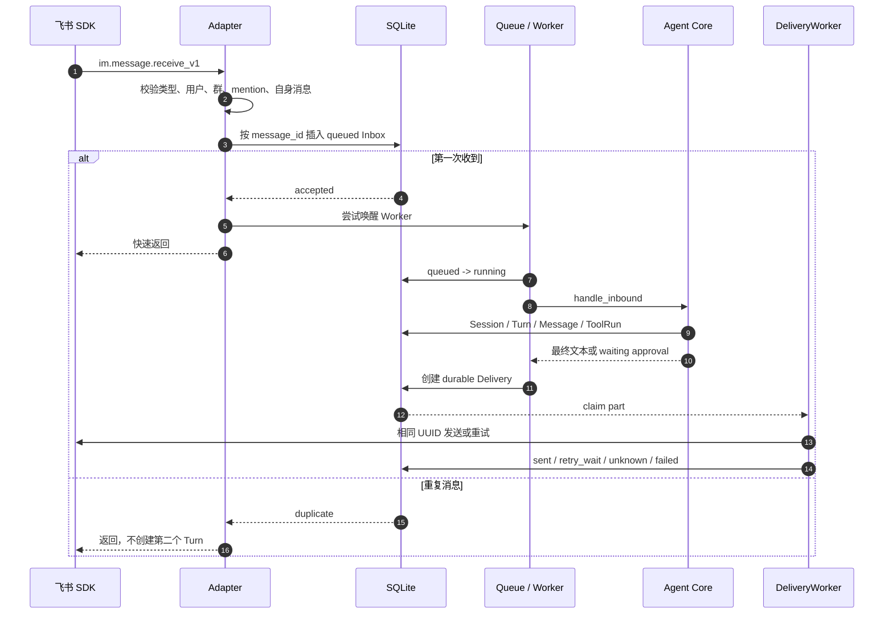
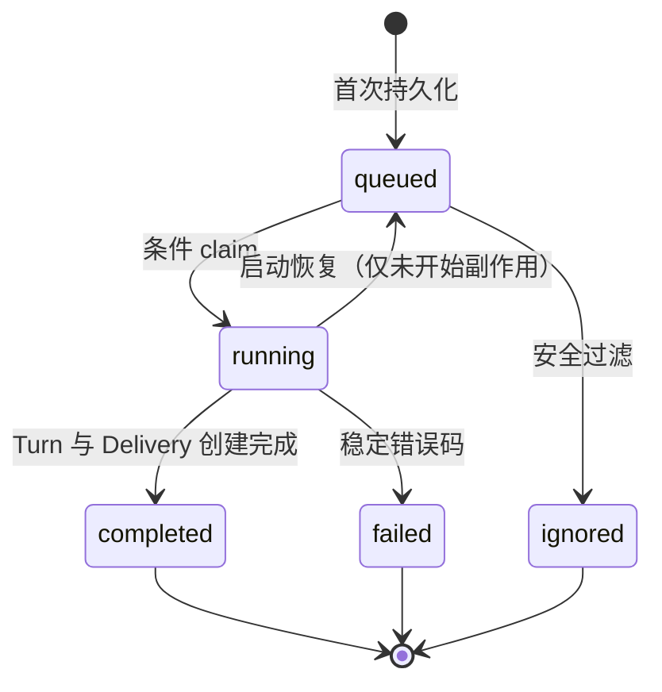
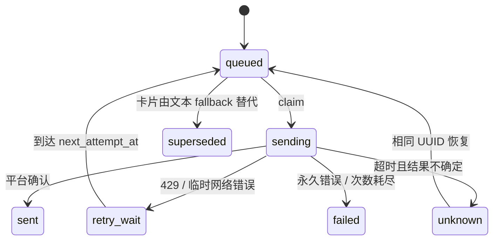
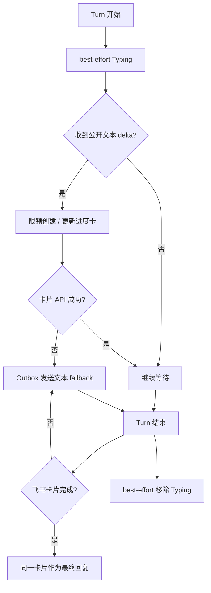
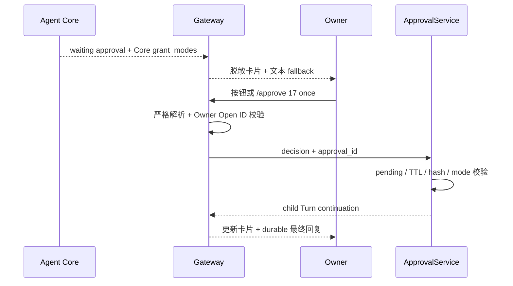
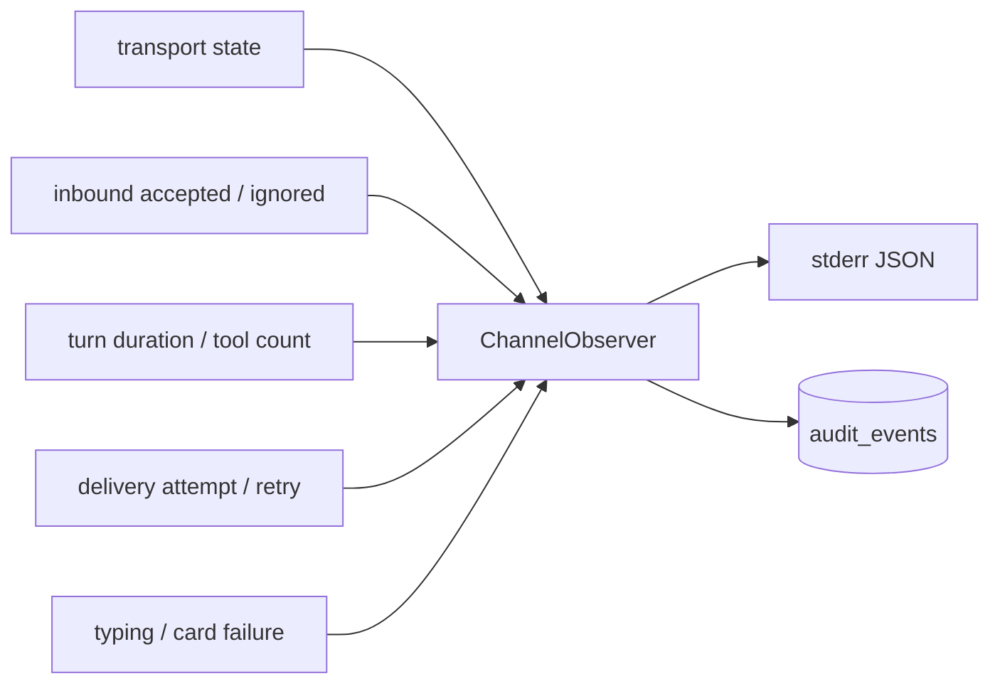

# Phase 4：飞书生产 Channel 工程落地

> 状态：`IMPLEMENTATION PASS / TARGETED CALLBACK LIVE VERIFIED / 15-CASE LIVE PENDING`
> 基线：SQLite schema v2，Agent 回归 29/29，Channel 回归 12/12
> 入口：`lobster0 gateway`

## 1. 大白话说明

Phase 4 做的不是“收到飞书消息就临时请求一次模型”的 Demo，而是给 Lobster0 增加一条可以重启、重试、
去重和审批的长期在线消息通道。飞书负责把消息送到本机；SQLite 先把消息记下来；后台 Worker 再调用与
TUI 相同的 Agent Core；最后回复先写 Outbox，再发回飞书。

这意味着：飞书重复推送同一条消息不会让 Tool 执行两次；进程在入队后崩溃，重启还能找回消息；发送遇到
限流可以延迟重试；危险动作仍必须由 Owner 审批，Channel 不能绕开 Core Policy。



## 2. 已落地范围

| 能力 | 实现位置 | 已验证行为 |
| --- | --- | --- |
| 强类型配置 | `config.py` | 未知字段拒绝、Owner/白名单关系、队列与消息上限 |
| schema v2 | `storage/migrations.py`、`0002_feishu_channel.sql` | 新库、v1 升级、幂等迁移、失败回滚 |
| Channel 契约 | `channels/base.py` | 不可变入站/出站对象，`repr` 不泄露正文和 ID |
| 飞书归一化 | `channels/feishu.py` | 私聊、群 mention、自身消息、类型和白名单过滤 |
| durable Inbox | `storage/channels.py` | `message_id` 幂等、claim、状态迁移、重启恢复 |
| durable Outbox | `storage/channels.py` | 分片、attempt、retry/unknown/superseded、稳定 UUID |
| Worker | `channels/manager.py` | 数据库先行、有界 Queue、同会话串行、跨会话并发 |
| 正式发送 | `channels/delivery.py` | Unicode 安全分片、限流重试、未知发送恢复 |
| 官方 SDK | `channels/feishu.py` | 延迟导入、WebSocket 生命周期、错误码映射、卡片回调 |
| 能力层 | `channels/capabilities.py` | Typing、公开文本进度卡、失败不阻断正式回复 |
| 审批闭环 | `channels/approvals.py` | Owner gate、卡片按钮、严格文本命令、Core continuation |
| 可观测性 | `channels/observability.py` | correlation、外部 ID 短哈希、JSON 日志、SQLite Audit |
| 生产装配 | `gateway.py` | 单 Runtime、启动/反向清理、两段式信号停止 |
| 离线诊断 | `doctor.py` | 配置、SDK、schema v2、凭据变量共 4 项飞书检查 |
| 回归门禁 | `evals/channel.py` | 12 个飞书故障与恢复场景，不需要网络 |

本阶段不包含 Telegram、Discord、多用户、文件/语音消息、公开群机器人、Web 后台和自动修改源码。

## 3. 一条消息的真实生命周期



关键点是先落库再返回。`asyncio.Queue` 只是“叫醒 Worker”的铃铛，不是事实来源；即使铃铛没响，feeder 也会
从 SQLite 找回 `queued` 消息。

## 4. 身份、会话与顺序

- 当前只有一个本地 Owner；`owner_open_id` 必须同时出现在 `allowed_open_ids`。
- 私聊按 Chat ID 映射为 Channel Session；群聊还必须同时命中 `allowed_chat_ids` 并明确 mention 机器人。
- 同一 `(channel, account, conversation)` 使用异步锁串行执行，避免第二句话超过第一句话。
- 不同会话最多由 `worker_count` 个 Worker 并发。
- 飞书和 TUI 各自保留会话历史，但共享同一个 Agent Core、Memory、Skills、Policy 和 Tool Registry。

## 5. Inbox 状态机



重复 `message_id` 只返回原记录。已经开始的未知 Tool 不会因重启被盲目重放；`waiting_approval` 会恢复提醒，
但不会自行执行 Tool。

## 6. Outbox 与发送语义

最终回答始终持久化为 Assistant Message。飞书启用 streaming card 时，成功完成的卡片就是平台上的唯一最终回复；
卡片创建或最终更新失败才创建普通 Markdown Delivery。Telegram/Discord 仍使用 durable final text。这避免飞书同时
出现内容相同的卡片和文本，同时保留失败 fallback。飞书公开 delta 会等到 Turn 终态分类后再用于创建卡片；这样
tool-call 响应即使先返回可见 content，waiting approval 也不会遗留额外的 preview card。



- 长回复优先按段落和换行切分，再按 Unicode 字符边界切分。
- 分片前缀也计入 `message_max_chars`，不会切坏 emoji 或多字节字符。
- 同一 part 的所有重试复用相同 idempotency key。
- 中间 part 永久失败后不继续发送后续 part。
- 429、暂时断线和可重试 5xx 进入有界退避；权限/参数错误直接失败。

## 7. Typing 与进度卡

`ChannelCapabilities` 只读取公开的 `model_text_delta`。Provider reasoning、Tool 参数、Secret、内部 Trace 和原始
异常都不会进入飞书卡片。



若 Provider 在输出一部分后失败，已有卡片会标记为未完成；最终错误通过普通消息发送。Approval card 是独立的
durable delivery，不会被单卡片策略跳过。

## 8. Approval 闭环

飞书不会拥有第二套审批状态机。卡片按钮和 `/approve`、`/deny` 都直接进入现有 `ApprovalRepository` 与
`TurnService.continue_approval()`。



文本降级命令：

```text
/approve <编号> once
/approve <编号> session
/approve <编号> always
/deny <编号>
```

文件写入仍只允许 `once`；不存在的 mode、非 Owner、过期、参数 hash 不一致和重复消费全部 fail closed。

## 9. 启停与恢复

Gateway 启动顺序：加载私密 `.env` → 读取 TOML → 校验三个凭据与 SDK → 创建唯一 Runtime → 连接 Transport →
启动 Delivery → 启动 Manager → 输出 ready。

第一个 `SIGINT/SIGTERM` 停止接收、有限 drain 并反向清理；第二个信号取消当前阻塞清理，但仍继续释放后续组件。
正常运维不要使用 `kill -9`。

| 中断点 | 重启结果 |
| --- | --- |
| Inbox 已写、尚未入内存队列 | feeder 找回 queued |
| 已入队、尚未 claim | 条件 claim 保证单执行者 |
| Turn 已开始 | 不重放未知副作用，给出恢复提示 |
| Assistant 已保存、Delivery 未发 | Outbox 继续发送 |
| Delivery 正在发送 | 进入 unknown，以相同 UUID 恢复 |
| waiting approval | 恢复审批通知，不自动执行 |

## 10. 安全边界

- App Secret 和 access token 不进入 TOML、SQLite、日志、repr、回归 fixture 或 Git。
- 只保存处理所需的标准化字段，不保存完整 SDK 原始事件 JSON。
- 外部 Open ID、Chat ID、Message ID 在日志中只允许短哈希。
- 非白名单请求默认不回复，减少公开探测面。
- 模型不能直接获得 SDK；所有动作仍经过 Registry → Policy → Executor。
- Channel UI 只能展示 Core 返回的 `grant_modes`，不能自行扩大授权。
- `lark-channel-sdk` 是可选依赖；未安装时 TUI 仍可使用，Gateway 明确失败。

## 10.1 脱敏日志与 Audit

Gateway 为每条消息生成跨重启稳定的本地 `correlation_id`，将 WebSocket 状态、admission、Inbox 去重、Turn、
Delivery 与 Typing/Card 失败串成同一条链。相同事件同时进入一行 canonical JSON 运维日志和已有 SQLite
`audit_events`，不引入第二套状态事实。



允许记录内部 row/session/turn/message/delivery ID、短哈希、毫秒耗时、计数、枚举状态和稳定错误码。完整 Open ID、
Chat ID、Message ID、正文、Secret、token、Tool 参数、SDK raw event、异常原文和隐藏 reasoning 一律不进入该链路。
完整逐项证据见 [Phase 4 完成性审计](20260808_completion-audit.md)。

## 11. 已知边界

1. 当前是单进程 SQLite 模式，不支持两个 Gateway 同时消费同一状态目录。
2. 真实飞书权限、事件订阅和 20 轮对话必须在企业自建应用中人工验收，离线 fake SDK 不能证明它们。
3. SQLite Assistant Message 是内容事实；飞书 completed card 是正常回答的唯一平台终态，失败时由 durable text fallback 接管。
4. SDK 无法确认的发送超时进入 `unknown`；系统选择“不重复轰炸”而非假装已送达。
5. Telegram/Discord 等下一 Channel 必须复用 `channels/base.py`，不能复制 Agent Core。

## 12. 相关文档

- [运行、测试与故障排查](20260808_testing-and-operations.md)
- [完成性审计与证据矩阵](20260808_completion-audit.md)
- [Phase 4 设计规格](../../superpowers/specs/2026-08-08-phase-4-feishu-channel-design.md)
- [Phase 4 实施计划](../../superpowers/plans/2026-08-08-phase-4-feishu-channel.md)
- [系统架构](../../architecture/20260807_系统架构.md)
- [Agent 回归规范](../phase-2/20260808_agent-regression-evals.md)
