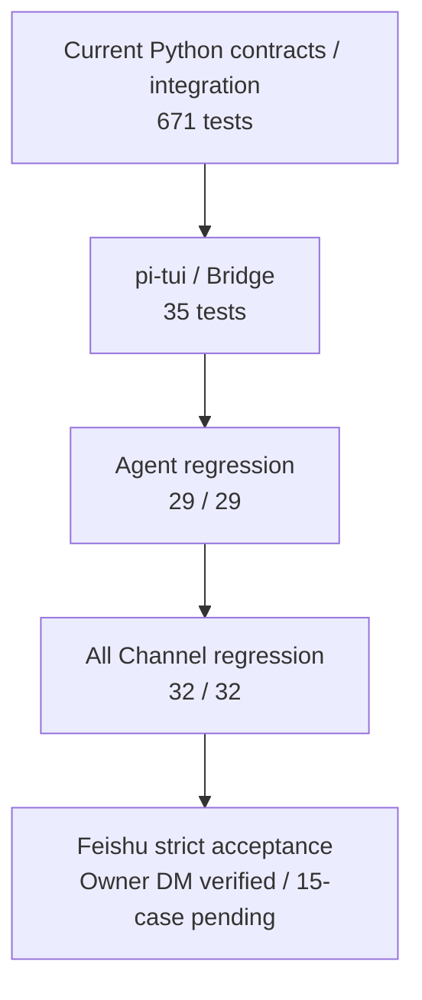
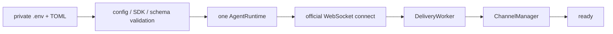

# Phase 4：飞书运行、测试与故障排查

> 当前结论：implementation gate 已通过；真实 Bot、WebSocket 和 Owner DM Delivery 已验证；完整 15-case、
> 部署与 soak 仍待独立 Live Evidence。
> 当前全仓门禁：671/671 Python、35/35 TypeScript、Agent 39/39、Channel 32/32、20 轮 local soak 640/640、Ruff PASS。
> v0.5.1 Stabilization 已实现 Feishu Live Runner；当前状态是 **TARGETED CALLBACK LIVE VERIFIED / 15-CASE LIVE PENDING**。

## 1. 先理解四层证据



前四层可以在 CI 和任意开发机重复，证明本地 Core、Channel 状态机和 UI Bridge 没有回归。真实 Owner DM 已证明
基础租户权限、WebSocket 与消息 Delivery；完整 15-case 才能继续证明群聊、审批、重启、重连等严格边界。
fake SDK 通过不能写成“生产验证完成”。

## 2. 准备飞书企业应用

1. 在飞书开放平台创建企业自建应用；
2. 启用机器人；
3. 使用 WebSocket 事件订阅并订阅消息事件；
4. 配置回复消息、reaction 和卡片所需权限；
5. 取得 App ID、App Secret、Owner Open ID；
6. 先只开放 Owner 私聊，确认稳定后再开群 mention。

平台权限名称可能变化，以飞书后台当时显示为准。MiniClaw 不会自动修改飞书后台或邀请机器人入群。

## 3. 安装与凭据

```bash
cd /Users/nedonion/PycharmProjects/miniclaw
uv sync --extra dev --extra feishu
corepack enable
pnpm --dir tui install --frozen-lockfile
pnpm --dir tui build
uv run miniclaw init
```

仓库根目录 `.env`：

```dotenv
MINICLAW_MODEL_API_KEY=your-model-key
MINICLAW_FEISHU_APP_ID=cli_xxx
MINICLAW_FEISHU_APP_SECRET=
```

```bash
chmod 600 .env
```

真实值只放 `.env` 或进程环境。不要放进 `config.toml`、issue、日志、截图、测试 fixture 或 Git。

## 4. 开启 Channel

在 `~/.miniclaw/config.toml` 增加：

```toml
[channels.feishu]
enabled = true
account_id = "default"
app_id_env = "MINICLAW_FEISHU_APP_ID"
app_secret_env = "MINICLAW_FEISHU_APP_SECRET"
domain = "feishu"
owner_open_id = "ou_replace_with_owner"
allowed_open_ids = ["ou_replace_with_owner"]
allowed_chat_ids = []
allow_group_mentions = false
queue_size = 64
worker_count = 2
message_max_chars = 30000
streaming_card = true
```

`owner_open_id` 必须同时在 `allowed_open_ids` 中。群聊必须同时配置 `allowed_chat_ids`、开启
`allow_group_mentions`，且用户明确 @机器人；只满足其中一项不会进入 Agent。

## 5. Doctor：只查本地，不冒充联网

```bash
uv run miniclaw doctor
```

`doctor` 会读取当前目录权限为 `0600` 的 `.env`，但不会连接飞书或模型。当前总计 13 项，飞书相关 4 项：

| 检查 | 证明 | 不证明 |
| --- | --- | --- |
| `feishu_config` | 开关、Owner、白名单关系有效 | Open ID 属于当前租户 |
| `feishu_sdk` | official SDK 可导入 | 真实接口权限正确 |
| `feishu_database` | schema v2 和队列表存在 | Outbox 已送达平台 |
| `feishu_runtime` | App ID/Secret 变量非空 | 凭据真实有效 |

其余检查覆盖状态目录、配置、Workspace、Tool、SQLite、Approval、权限、Node 和 pi-tui。Doctor 只显示变量名，
不会打印 Secret 值；`.env` 权限过宽时直接失败。

## 6. 启动与停止

```bash
uv run miniclaw gateway
```

本地预检和 WebSocket 就绪后会输出：

```text
MiniClaw gateway ready: feishu/default
```

这只表示进程 ready，仍要从 Owner 飞书发消息完成 E2E。第一次 `Ctrl+C` 会停止接收、有限 drain 并反向清理；
第二次信号只用于清理卡住的情况。不要把 `kill -9` 当正常关闭方式。



## 7. 日志、Audit 与每次提交门禁

Gateway 的 stderr 每行都是独立 JSON。可以按 `correlation_id` 串起连接、入站、Turn 和 Delivery，但完整 Open ID、
Chat ID、Message ID、正文和原始异常不会出现。durable 副本保存在 SQLite `audit_events`：

```bash
uv run miniclaw gateway 2> .local/miniclaw-channel.jsonl
sqlite3 ~/.miniclaw/miniclaw.db \
  "SELECT event_type, metadata_json FROM audit_events WHERE event_type LIKE 'channel.%' ORDER BY id DESC LIMIT 20;"
```

日志里的 `audit_persisted=false` 表示本次结构化日志已输出，但 SQLite Audit 写入失败，应按高优先级排查数据库，
不能把它当作普通网络重试。

```bash
MINICLAW_NODE=/absolute/path/to/node-22-or-newer \
  uv run python -m unittest discover -s tests -v
pnpm --dir tui test
uv run ruff check .
uv run miniclaw eval validate --root evals/scenarios
uv run miniclaw eval run --suite all --root evals/scenarios
uv build
git diff --check
```

当前必须得到 Python 671/671、TypeScript 35/35、Agent 39/39、Channel 32/32。以后新增测试时数字应上调，不能为了
保持文档旧数字删除测试。

## 8. 12 条飞书回归场景

场景文件是 `evals/scenarios/feishu-channel.v1.jsonl`。Runner 不联网，但会调用真实 Adapter、SQLite
Repository、ChannelManager、Approval Controller、DeliveryWorker 和 Transport 错误映射。

| ID | 场景 | 关键断言 |
| --- | --- | --- |
| `FEISHU-DM-001` | Owner 私聊 | 正确归一化和入 Inbox |
| `FEISHU-GROUP-001` | 允许群 mention | 清理 mention 后进入 Agent |
| `FEISHU-GROUP-002` | 无 mention / 未授权群 | 不创建 Turn |
| `FEISHU-DEDUPE-001` | 重复 message ID | 只执行一次 |
| `FEISHU-TOOL-001` | Channel 读文件 | 仍走 Policy / Tool |
| `FEISHU-APPROVAL-001` | Owner 批准 | child Turn 正确续执行 |
| `FEISHU-APPROVAL-002` | 非 Owner / 拒绝 | 不执行危险动作 |
| `FEISHU-RESTART-001` | queued 重启 | feeder 找回 |
| `FEISHU-RESTART-002` | running / waiting 重启 | 不盲目重放副作用 |
| `FEISHU-DELIVERY-001` | 暂时发送失败 | 同 UUID 重试 |
| `FEISHU-CARD-001` | 进度/审批卡失败 | durable Markdown fallback |
| `FEISHU-RECONNECT-001` | Transport 断线 | 稳定分类并恢复 |

单独运行：

```bash
uv run miniclaw eval run --suite channel --root evals/scenarios
```

本地 endurance gate 可重复跑同一套真实纵切；`--repeat` 只接受 `1..1000`，遇到首轮失败即停止，避免无界任务：

```bash
uv run miniclaw eval run --suite channel --repeat 20 --root evals/scenarios
```

当前证据是 `Channel local soak: 240/240 checks passed across 20/20 runs`。它反复覆盖 Adapter、SQLite
Inbox/Outbox、Worker、审批、重启、Delivery 恢复和 Transport 重连状态机，但不连接飞书，不能替代下一节的真实
WebSocket、平台权限、卡片 API、断网恢复与长时间 Gateway soak。

## 9. 真实飞书验收

凭据和后台权限准备好后显式运行：

```bash
uv run python scripts/feishu_live_smoke.py --confirm-live
```

脚本不会自动向任何人发消息；它运行本地预检，然后要求人工记录 pass/fail/skip。脱敏结果写入 Git 忽略的
`.local/eval-results/feishu/`，只保留 commit 与计数。

必须验证：

1. WebSocket ready；
2. Owner 私聊连续 20 轮；
3. 群聊 mention 响应、无 mention 不响应；
4. 至少一个只读 Tool；
5. 需审批 Tool 的 approve 和 deny；
6. 非 Owner 不能批准；
7. 同一 message ID 不产生第二次回复；
8. 长 Markdown 分片顺序与 emoji 完整；
9. Gateway 重启后 queued 恢复，未知 Tool 不重放；
10. 断网恢复后 WebSocket 和 Delivery 继续工作；
11. 卡片 API 失败时普通 Markdown 仍到达；
12. 日志和结果 Secret scan 为零。

## 10. 常见故障

### `Feishu channel is disabled in config.toml`

只配置 `.env` 不够；按第 4 节显式开启 `[channels.feishu]`。

### `MINICLAW_FEISHU_APP_ID is not configured`

确认从包含 `.env` 的目录启动、变量名和 TOML 一致、文件权限为 `0600`。进程环境拥有更高优先级。

### `official Feishu SDK is not installed`

```bash
uv sync --extra feishu
```

### Gateway ready，但消息没反应

依次核对机器人能力、WebSocket 事件订阅、消息权限、Owner allowlist、文本类型、群 Chat ID 和明确 mention。
看稳定错误码，不粘贴完整 SDK 事件或 Secret 到 issue。

### 收到重复回复

这是高优先级故障。正常重投应按 `message_id` 命中唯一记录。保留数据库副本和脱敏日志，不要先清库掩盖证据。

### Approval 卡片无效

使用文本 fallback：

```text
/approve <编号> once
/approve <编号> session
/approve <编号> always
/deny <编号>
```

文件写入仍只允许 `once`。非 Owner、过期、参数 hash 不一致、非法 mode 和重复消费都应 fail closed。

### 卡片失败但普通回复成功

这是设计内降级。飞书卡片成功完成时本身就是唯一平台终态；卡片创建或最终更新失败时，Outbox 中的普通文本
fallback 才接管回复。Assistant Message 始终保存在 SQLite。

### Delivery 是 `unknown`

表示本地超时后无法确认平台是否接收。恢复会复用相同 UUID，不会无脑创建第二条；不要手工改成 `sent`。

## 11. 当前完成度

截至 2026-08-09，Phase 4 Core、Gateway、脱敏结构化日志/Audit、671 Python tests、35 TypeScript tests、39 条
Agent 回归、12 条 Feishu Channel 回归、15 条 Feishu Live 场景和 20 轮 local soak 已完成。专用飞书 App/Bot、
同应用 Owner、WebSocket ready 和两条 Owner 私聊 Delivery 已完成真实验证；完整 15-case、常驻部署与真实 Gateway
soak 仍明确待办。
准确说法是：**IMPLEMENTATION PASS / TARGETED CALLBACK LIVE VERIFIED / 15-CASE LIVE PENDING**。

完整模块说明见 [飞书 Channel 与 Gateway](20260808_feishu-channel-core.md)，逐项状态见
[完成性审计与证据矩阵](20260808_completion-audit.md)，设计决策见
[Phase 4 设计规格](../../superpowers/specs/2026-08-08-phase-4-feishu-channel-design.md)。真实 Bot 创建、Scope、
同应用身份发现和 15 条验收见 [Phase 5.1 Feishu Live E2E](../phase-5/20260808_feishu-live-e2e.md)。
SDK 启动顺序、Typing 与 macOS 常驻见
[飞书 Gateway 运行时与 macOS 常驻](../phase-5/20260808_feishu-gateway-runtime-and-macos-service.md)。
