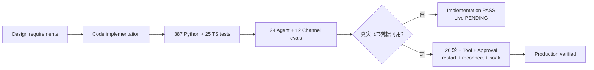
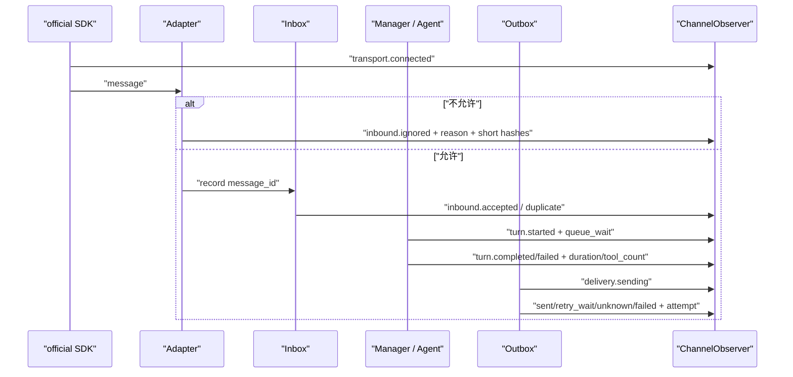

# Phase 4 完成性审计与验收证据矩阵

> 审计日期：2026-08-08
>
> 本地实现结论：**PASS**
>
> 真实飞书租户结论：**PENDING（缺 App ID / App Secret 与已配置企业应用）**
>
> 当前门禁：387/387 Python、25/25 TypeScript、24/24 Agent、12/12 Channel、Ruff 与 build PASS

## 1. 先说结论

Phase 4 的代码、离线回归、恢复语义、安全边界、Gateway CLI、Doctor、结构化日志和 SQLite Audit 已经落地。
当前不能写成“生产验收完成”，原因不是还有一段本地代码没写，而是本机没有真实飞书企业应用凭据，也没有可供
测试的事件订阅、Owner Open ID 和群 Chat ID。没有这些外部条件，WebSocket 真实连接、20 轮对话、真实卡片权限和
断网重连只能保持 `LIVE PENDING`。



## 2. 状态怎么读

| 状态 | 含义 |
| --- | --- |
| `LOCAL PASS` | 有真实代码路径和自动化测试，可在无网络环境重复验证 |
| `LIVE PENDING` | 本地实现存在，但必须由真实飞书租户、权限或网络证明 |
| `OUT OF SCOPE` | 设计明确不属于 Phase 4，不应拿来阻塞本阶段 |

“测试全绿”本身不是功能证据。下面每一项都同时指向具体实现和对应测试；没有直接测试的项不会写成 PASS。

## 3. Phase 4 功能需求矩阵

| # | 需求 | 实现证据 | 测试 / 回归证据 | 结论 |
| --- | --- | --- | --- | --- |
| 1 | official Feishu WebSocket，不开放入站端口 | `channels/feishu.py` 的 `FeishuChannel` + `TransportConfig(kind="ws")` | `test_feishu_transport.py` strict constructor contract | LOCAL PASS；真实握手 LIVE PENDING |
| 2 | App ID / Secret 只从环境读取 | `config.py`、`gateway.validate_gateway_environment()`、private `.env` loader | `test_gateway.py`、`test_env.py`、`test_doctor.py` | LOCAL PASS |
| 3 | Owner 私聊文本 | `FeishuAdapter.normalize()` | `test_feishu_adapter.py`、`FEISHU-DM-001` | LOCAL PASS；真实消息 LIVE PENDING |
| 4 | 允许群聊必须白名单且明确 mention | `FeishuAdapter._validate_group()` + SDK `PolicyConfig` | group adapter tests、`FEISHU-GROUP-001/002` | LOCAL PASS；真实群 LIVE PENDING |
| 5 | Open ID / Chat ID allowlist | 强类型 `FeishuConfig` + SDK / local 双层 admission | config、adapter、transport tests | LOCAL PASS |
| 6 | bot / self 消息过滤 | SDK `drop_self_sent` + Adapter fail closed | adapter / transport tests | LOCAL PASS |
| 7 | 统一 `InboundMessage` | `channels/base.py` immutable contract | `test_channel_contracts.py`、transport mapping test | LOCAL PASS |
| 8 | `message_id` 持久幂等 | `InboundEventRepository.record()` 的唯一键与冲突检测 | storage、manager、`FEISHU-DEDUPE-001` | LOCAL PASS |
| 9 | callback 先写 DB、再唤醒有限 Queue | `ChannelManager.receive()` | `test_receive_persists_before_enqueue...` | LOCAL PASS |
| 10 | Queue 满不能丢消息 | SQLite queued truth + feeder recovery | `test_full_memory_queue_recovers_second_message...` | LOCAL PASS |
| 11 | 同会话串行、跨会话有界并发 | conversation lock + `worker_count` | 两条并发 / 串行 manager tests | LOCAL PASS |
| 12 | CLI / TUI / Feishu 共享 Agent Core | `runtime.create_runtime()` + `create_channel_manager()` | runtime、turn、manager integration tests | LOCAL PASS |
| 13 | Typing best effort | `ChannelCapabilities.start()/finish()` | capability success/failure tests | LOCAL PASS；平台 reaction 权限 LIVE PENDING |
| 14 | streaming card + Markdown fallback | progress card 只读公开 delta，最终回复进 durable Outbox | capability、delivery、`FEISHU-CARD-001` | LOCAL PASS；真实卡片 API LIVE PENDING |
| 15 | 最终 Markdown durable truth | Manager 先创建 Delivery、Worker 后发送 | manager success/failure + delivery tests | LOCAL PASS |
| 16 | 长回复 Unicode 安全分片 | `split_message()` | 中文、emoji、前缀预算测试 | LOCAL PASS；真实平台顺序 LIVE PENDING |
| 17 | Outbox 稳定 UUID、retry、unknown | `DeliveryRepository` + `DeliveryWorker` | retry / timeout / max-attempt tests、`FEISHU-DELIVERY-001` | LOCAL PASS |
| 18 | WebSocket 自动重连与状态可观测 | SDK `auto_reconnect` + reconnecting/reconnected callbacks + `connection_state` | transport reconnect observer test、`FEISHU-RECONNECT-001` | LOCAL PASS；真实断网 LIVE PENDING |
| 19 | Approval 卡片与文本 fallback | `ChannelApprovalController` + Approval Delivery | approval controller / manager / delivery tests | LOCAL PASS；真实按钮 LIVE PENDING |
| 20 | Owner gate 与 Core continuation | Open ID gate，直接调用 `TurnService.continue_approval()` | `test_channel_approvals.py`、`FEISHU-APPROVAL-001/002` | LOCAL PASS |
| 21 | `miniclaw gateway` | CLI 子命令 + `run_gateway()` | CLI / gateway tests、help smoke | LOCAL PASS |
| 22 | SIGINT / SIGTERM 优雅停止 | stop receiving → manager drain → delivery → transport → runtime | gateway lifecycle / second-signal test | LOCAL PASS；真实长连接 LIVE PENDING |
| 23 | Doctor 区分 disabled / misconfigured / locally ready | 4 个 Feishu check | doctor tests | LOCAL PASS；Doctor 不冒充联网验证 |
| 24 | 脱敏结构化日志 | `ChannelObserver` canonical JSON + Gateway stderr handler | `test_channel_observability.py` | LOCAL PASS |
| 25 | durable Channel Audit | 复用 `audit_events`，记录 correlation、内部 ID、耗时、Tool、审批、attempt | Observer、Manager、Delivery、Capability tests | LOCAL PASS |
| 26 | 忽略、失败、重试只保存稳定码 | Adapter reason、Transport error mapping、Observer enum/code gate | transport / delivery / observer tests | LOCAL PASS |
| 27 | fake SDK 契约与恢复测试 | injectable official SDK facade | transport、storage、manager、delivery suites | LOCAL PASS |
| 28 | 真实飞书验收记录 | `scripts/feishu_live_smoke.py` + `v0.4.0.md` 模板 | harness confirmation test | LIVE PENDING |

## 4. 一条消息现在如何被观测



所有事件共用由 channel、account 和外部 message ID 派生的本地 `correlation_id`。数据库和日志可以用它串起一条
消息，但看不到完整 Open ID、Chat ID、Message ID。允许的字段只有内部 row/session/turn/message/delivery ID、
短哈希、毫秒耗时、计数、枚举状态和稳定错误码。

明确禁止进入 Observer：消息正文、App Secret、Access Token、Authorization、SDK raw event、Tool 原始参数、
Provider 隐藏 reasoning 和异常原文。

## 5. Phase 4 exit gate 审计

| Gate | 当前证据 | 结论 |
| --- | --- | --- |
| 设计、PRD、架构、工程文档一致 | Phase 4 文档组 + 本矩阵 | LOCAL PASS |
| 全量 Python | `387/387` | PASS |
| pi-tui / Bridge | `25/25` | PASS |
| Agent 回归 | `24/24` | PASS |
| Feishu Channel 回归 | `12/12` | PASS |
| Ruff | `All checks passed` | PASS |
| wheel / sdist | `uv build` 两个 artifact 成功 | PASS |
| Doctor | 13 项；当前 Feishu disabled，准确报告未启动 | PASS |
| 文档链接 / Mermaid / HTML | 发布前 validator 必跑 | 待最终提交前复验 |
| Secret scan | 发布前对 staged diff、`.env` 边界和日志 fixture 检查 | 待最终提交前复验 |
| 真实 20 轮 / Tool / Approval | 需要企业应用凭据 | LIVE PENDING |
| restart / reconnect / card fallback live | 需要真实 Bot 和网络控制 | LIVE PENDING |
| soak | 需要可长期运行的真实 Gateway | LIVE PENDING |
| mixed CN/EN commit、main、push | 发布步骤执行 | 待最终提交 |

## 6. 为什么不自动填假凭据

App Secret 是外部授权，不是代码默认值。把随机字符串填进 `.env` 只能让“变量非空”检查变绿，却不能证明应用、
权限、事件订阅、机器人身份和租户都正确，反而会制造错误的 production-ready 结论。因此本次做到：

1. 所有本地可实现能力与离线证据全绿；
2. live harness、操作手册和脱敏 release record 已准备好；
3. 等用户提供自己的飞书企业应用后，再执行唯一剩余的 live gate；
4. live gate 通过前，README 和进度页统一写 `implementation PASS / live PENDING`。

## 7. 真实凭据到位后的最后一公里

```bash
cd /Users/nedonion/PycharmProjects/miniclaw
uv sync --extra dev --extra feishu
uv run miniclaw doctor
uv run miniclaw gateway
uv run python scripts/feishu_live_smoke.py --confirm-live
```

人工依次完成 Owner 私聊 20 轮、群 mention / non-mention、只读 Tool、approve / deny、非 Owner 拒绝、重复消息、
长回复、重启、断网重连和卡片 fallback。只把 pass/fail/skip、commit、计数和时间写入 release record，不记录任何
真实 ID、正文或 token。

相关文档：

- [飞书生产 Channel 工程落地](feishu-channel.md)
- [运行、测试与故障排查](testing-and-operations.md)
- [Phase 4 设计规格](../../superpowers/specs/2026-08-08-phase-4-feishu-channel-design.md)
- [v0.4.0 发布证据](../../evals/releases/v0.4.0.md)
